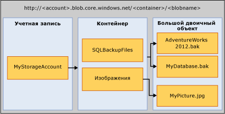

# <a name="sql-server-backup-to-url"></a>Резервное копирование в SQL Server по URL-адресу
[!INCLUDE[tsql-appliesto-ss2016-xxxx-xxxx-xxx_md](../../includes/tsql-appliesto-ss2016-xxxx-xxxx-xxx-md.md)]

  В данном разделе представлены основные понятия, требования и компоненты, необходимые для использования службы хранилища больших двоичных объектов Microsoft Azure в качестве места назначения резервного копирования. Функции резервного копирования и восстановления аналогичны при использовании DISK и TAPE, но имеют некоторые отличия. В данном разделе описываются эти различия, а также приведено несколько примеров кода.  
  
## <a name="requirements-components-and-concepts"></a>Требования, компоненты и основные понятия  
 **В этом разделе:**  
  
-   [Безопасность](#security)  
  
-   [Введение в основные компоненты и понятия](#intorkeyconcepts)  
  
-   [Служба хранилища больших двоичных объектов Microsoft Azure](#Blob)  
  
-   [Компоненты SQL Server](#sqlserver)  
  
-   [Ограничения](#limitations)  
  
-   [Поддержка инструкций резервного копирования и восстановления](#Support)  
  
-   [Использование задачи резервного копирования в среде SQL Server Management Studio](../../relational-databases/backup-restore/sql-server-backup-to-url.md#BackupTaskSSMS)  
  
-   [Резервное копирование SQL Server на URL-адрес с помощью мастера планов обслуживания](../../relational-databases/backup-restore/sql-server-backup-to-url.md#MaintenanceWiz)  
  
-   [Восстановление из хранилища SQL Windows Azure с помощью среды SQL Server Management Studio](../../relational-databases/backup-restore/sql-server-backup-to-url.md#RestoreSSMS)  
  
###  <a name="security"></a> Безопасность  
 Далее описаны вопросы безопасности и требования к резервному копированию и восстановлению с помощью службы хранилища больших двоичных объектов Microsoft Azure.  
  
-   При создании контейнера для службы хранилища больших двоичных объектов Microsoft Azure рекомендуется установить для него **закрытые**права доступа. Установка закрытых прав доступа означает, что доступ предоставляется только тем пользователям и учетным записям, которые могут предоставить необходимую информацию для проверки подлинности в учетной записи Windows Azure.  
  
    > [!IMPORTANT]  
    >  [!INCLUDE[ssNoVersion](../../includes/ssnoversion-md.md)] требует, чтобы имя учетной записи Windows Azure и проверка подлинности с ключом доступа или подписанный URL-адрес и маркер доступа хранились в учетных данных [!INCLUDE[ssNoVersion](../../includes/ssnoversion-md.md)] . Эти сведения используются для проверки подлинности учетной записи Windows Azure при выполнении операций резервного копирования или восстановления.  
  
-   Учетная запись пользователя, применяемая для выдачи команды BACKUP или RESTORE, должна находиться в роли базы данных **db_backup operator** с разрешениями **Alter any credential** .  
  
###  <a name="intorkeyconcepts"></a> Введение в основные компоненты и понятия  
 В следующих двух разделах приводятся общие сведения о службе хранилища больших двоичных объектов Microsoft Azure, а также о компонентах [!INCLUDE[ssNoVersion](../../includes/ssnoversion-md.md)] , которые используются при резервном копировании в службу хранилища больших двоичных объектов Microsoft Azure или при восстановлении из нее. Чтобы выполнять резервное копирование или восстановление с помощью службы хранилища больших двоичных объектов Microsoft Azure, важно понимать компоненты и то, как они взаимосвязаны.  
  
 Первым шагом этого процесса является создание учетной записи хранения Microsoft Azure в подписке Azure. Эта учетная запись хранения является административной учетной записью, имеющей полные административные разрешения на все контейнеры и объекты, созданные с помощью этой учетной записи хранения. [!INCLUDE[ssNoVersion](../../includes/ssnoversion-md.md)] может использовать имя учетной записи хранения Microsoft Azure и значение ее ключа доступа для проверки подлинности, а также записи и чтения больших двоичных объектов в службе хранения больших двоичных объектов Microsoft Azure или использовать токен подписанного URL-адреса (токен SAS), созданный в конкретных контейнерах, предоставляющих права на чтение и запись. Дополнительные сведения об учетных записях хранения Azure см. в статье [Учетные записи хранения Azure](https://azure.microsoft.com/documentation/articles/storage-create-storage-account/), а дополнительные сведения о подписанных URL-адресах (SAS) — в статье [Подписанные URL-адреса. Часть 1. Общие сведения о модели SAS](https://azure.microsoft.com/documentation/articles/storage-dotnet-shared-access-signature-part-1/). Учетные данные службы [!INCLUDE[ssNoVersion](../../includes/ssnoversion-md.md)] хранят эту информацию для проверки подлинности и используются при выполнении операций резервного копирования или восстановления.  
  
###  <a name="blockbloborpageblob"></a> Резервное копирование в блочный и страничный BLOB-объекты 
 Существует два типа больших двоичных объектов, которые можно хранить в службе хранилища больших двоичных объектов Microsoft Azure: блочные и страничные большие двоичные объекты. Для резервного копирования SQL Server может использоваться любой тип больших двоичных объектов в зависимости от применяемого синтаксиса Transact-SQL. Если в учетных данных указан ключ к хранилищу данных, будет использоваться страничный BLOB-объект, а если подписанный URL-адрес — блочный BLOB-объект.
 
 Резервное копирование в блочный BLOB-объект доступно только в SQL Server 2016 или более поздней версии. Рекомендуется выполнять резервное копирование в блочный BLOB-объект вместо страничного в случае, если у вас запущен SQL Server 2016 или более поздней версии. Основные причины:
- по сравнению с ключом к хранилищу, подписанный URL-адрес — это более безопасный способ для авторизации доступа к большому двоичному объекту;
- вы можете выполнять резервное копирование в несколько блочных BLOB-объектов, чтобы получить лучший уровень производительности резервного копирования и восстановления, а также поддержку резервного копирования базы данных больших размеров;
- [блочный BLOB-объект](https://azure.microsoft.com/pricing/details/storage/blobs/) дешевле, чем [страничный BLOB-объект](https://azure.microsoft.com/pricing/details/storage/page-blobs/). 

При резервном копировании в блочный BLOB-объект максимальный размер блока, который можно указать, — это 4 МБ. Максимальный размер одного файла блочного BLOB-объекта составляет 4 МБ * 50000 = 195 ГБ. Если размер базы данных превышает 195 ГБ, мы рекомендуем:
- использовать сжатие резервной копии;
- выполнять резервное копирование в несколько блочных BLOB-объектов.

###  <a name="Blob"></a> Служба хранилища больших двоичных объектов Microsoft Azure  
 **Учетная запись хранения**. Учетная запись хранилища является отправной точкой для всех служб хранилища. Для доступа к службе хранилища больших двоичных объектов Microsoft Azure необходимо сначала создать учетную запись хранения Microsoft Azure. Дополнительные сведения см. в разделе [Создание учетной записи хранения](https://azure.microsoft.com/documentation/articles/storage-create-storage-account/).  
  
 **Контейнер**. Контейнер обеспечивает группирование набора больших двоичных объектов и может хранить их неограниченное количество. Для создания резервных копий [!INCLUDE[ssNoVersion](../../includes/ssnoversion-md.md)] в службе хранилища больших двоичных объектов Microsoft Azure необходимо как минимум создать корневой контейнер. Вы можете создать токен SAS в контейнере и предоставить доступ к объектам только в определенном контейнере.  
  
 **Большой двоичный объект**. Файл любого типа и размера. Существует два типа больших двоичных объектов, которые можно хранить в службе хранилища больших двоичных объектов Microsoft Azure: блочные и страничные большие двоичные объекты. [!INCLUDE[ssNoVersion](../../includes/ssnoversion-md.md)] Резервное копирование может использовать любой тип больших двоичных объектов в зависимости от применяемого синтаксиса Transact-SQL. Обращаться к большим двоичным объектам можно с помощью URL-адреса следующего вида: https://\<учетная запись хранения>.blob.core.windows.net/\<контейнер>/\<blob>. Дополнительные сведения о службе хранилища больших двоичных объектов Microsoft Azure см. в разделе [Как использовать хранилище больших двоичных объектов из .NET](https://www.windowsazure.com/develop/net/how-to-guides/blob-storage/). Дополнительные сведения о больших двоичных объектах см. в разделе [Основные сведения о блочных и страничных больших двоичных объектах](https://msdn.microsoft.com/library/windowsazure/ee691964.aspx).  
  
   
  
 **Моментальный снимок Azure**. Снимок большого двоичного объекта Azure, сделанный в определенный момент времени. Дополнительные сведения см. в разделе [Создание моментального снимка большого двоичного объекта](https://msdn.microsoft.com/library/azure/hh488361.aspx). [!INCLUDE[ssNoVersion](../../includes/ssnoversion-md.md)] теперь поддерживает резервные копии моментальных снимков Azure файлов базы данных, хранящиеся в службе хранилища больших двоичных объектов Microsoft Azure. Дополнительные сведения см. в разделе [Резервные копии моментальных снимков файлов для файлов базы данных в Azure](../../relational-databases/backup-restore/file-snapshot-backups-for-database-files-in-azure.md).  
  
###  <a name="sqlserver"></a> [!INCLUDE[ssNoVersion](../../includes/ssnoversion-md.md)] Components  
 **URL-адрес**. URL-адрес указывает универсальный идентификатор ресурса (URI) для уникального файла резервной копии. URL-адрес используется для предоставления местоположения и имени файла резервной копии [!INCLUDE[ssNoVersion](../../includes/ssnoversion-md.md)] . URL-адрес должен указывать на фактический большой двоичный объект, а не просто на контейнер. Если большой двоичный объект не существует, он создается. Если указан существующий большой двоичный объект, то команда BACKUP завершится ошибкой, если только не указан параметр WITH FORMAT для перезаписи существующего файла резервной копии в этом большом двоичном объекте.  
  
 Пример URL-адреса: http[s]://УЧЕТНАЯ_ЗАПИСЬ.blob.core.windows.net/\<КОНТЕЙНЕР>/\<ИМЯ_ФАЙЛА.bak>. Указывать HTTPS необязательно, но рекомендуется.  
  
 **Учетные данные**. Учетные данные [!INCLUDE[ssNoVersion](../../includes/ssnoversion-md.md)] являются объектом, который используется для хранения информации о проверке подлинности, которая необходима для подключения к источнику за пределами SQL Server. В данном случае процессы резервного копирования и восстановления [!INCLUDE[ssNoVersion](../../includes/ssnoversion-md.md)] используют учетные данные для проверки подлинности в службе хранилища больших двоичных объектов Microsoft Azure и ее контейнерах и больших двоичных объектах. Учетные данные хранят имя учетной записи хранения и значения **ключа доступа** этой учетной записи хранения или URL-адрес контейнера и его токен SAS. После создания учетных данных синтаксис инструкций BACKUP/RESTORE определяет тип большого двоичного объекта и необходимые учетные данные.  
  
 Порядок создания подписанного URL-адреса см. в примерах [Создание подписанного URL-адреса](../../relational-databases/backup-restore/sql-server-backup-to-url.md#SAS) далее в этом разделе, и порядок создания учетных данных [!INCLUDE[ssNoVersion](../../includes/ssnoversion-md.md)] см. в примерах [Создание учетных данных](../../relational-databases/backup-restore/sql-server-backup-to-url.md#credential) далее в этом разделе.  
  
 Общие сведения об учетных данных см. в разделе [Учетные данные](../security/authentication-access/credentials-database-engine.md).  
  
 Сведения о других примерах использования учетных данных см. в разделе [Создание прокси-агента SQL Server](../../ssms/agent/create-a-sql-server-agent-proxy.md).  
  
###  <a name="limitations"></a> Ограничения  
  
-   Резервное копирование в хранилище класса Premium не поддерживается.  
  
-   Максимальный поддерживаемый размер резервной копии с использованием страничного BLOB-объекта в SQL Server составляет 1 ТБ. Максимальный поддерживаемый размер резервной копии с использованием блочных BLOB-объектов составляет примерно 200 ГБ (50 000 блоков * 4 МБ MAXTRANSFERSIZE). Блочные BLOB-объекты поддерживают чередование дисков для обслуживания значительно больших размеров резервных копий.  
  
-   Инструкции резервного копирования и восстановления можно выполнить с помощью TSQL, SMO, командлетов PowerShell, мастера архивации и восстановления SQL Server Management Studio.   
  
-   Функция создания логического имени устройства не поддерживается. Таким образом, не поддерживается функция добавления URL-адреса в качестве устройства резервного копирования с помощью sp_dumpdevice или SQL Server Management Studio.  
  
-   Функция присоединения к существующим резервным большим двоичным объектам не поддерживается. Резервное копирование в существующий большой двоичный объект можно осуществлять только путем перезаписи с помощью параметра **WITH FORMAT** . Однако при использовании резервных копий моментальных снимков файлов (с помощью аргумента **WITH FILE_SNAPSHOT** ) аргумент **WITH FORMAT** не разрешен, чтобы избежать появления потерянных моментальных снимков файлов, которые были созданы во время первоначального резервного копирования снимков файлов.  
  
-   Резервное копирование в несколько больших двоичных объектов в одной операции резервного копирования поддерживается только при использовании блочных больших двоичных объектов и с помощью токена SAS, а не ключа учетной записи хранения для учетных данных SQL.  
  
-   Параметр **BLOCKSIZE** для страничных BLOB-объектов не поддерживается. 
  
-   Параметр **MAXTRANSFERSIZE** для страничных BLOB-объектов не поддерживается. 
  
-   Указание параметров резервного набора данных **RETAINDAYS** и **EXPIREDATE** не поддерживается.  
  
-   [!INCLUDE[ssNoVersion](../../includes/ssnoversion-md.md)] — 259 символов. Функция BACKUP TO URL использует 36 символов для необходимых элементов, которые нужны для указания URL (https://.blob.core.windows.net//.bak), оставляя 223 символа для имен учетной записи, контейнера и большого двоичного объекта.  
  
###  <a name="Support"></a> Поддержка инструкций резервного копирования и восстановления  
  
|Инструкции BACKUP и RESTORE|Поддерживается|Исключения|Комментарии|
|-|-|-|-|
|BACKUP|Да|BLOCKSIZE и MAXTRANSFERSIZE поддерживаются для блочных BLOB-объектов. Они не поддерживаются для страничных BLOB-объектов. | Для резервного копирования в блочный BLOB-объект требуется сохранить подписанный URL-адрес в учетных данных SQL Server. Для резервного копирования в страничный BLOB-объект требуется сохранить ключ учетной записи хранения в учетных данных [!INCLUDE[ssNoVersion](../../includes/ssnoversion-md.md)] и указать аргумент WITH CREDENTIAL.|  
|RESTORE|Да||Необходимо определять учетные данные [!INCLUDE[ssNoVersion](../../includes/ssnoversion-md.md)] и указывать аргумент WITH CREDENTIAL, если учетные данные [!INCLUDE[ssNoVersion](../../includes/ssnoversion-md.md)] определяются с помощью ключа учетной записи хранения в качестве секрета.|  
|RESTORE FILELISTONLY|Да||Необходимо определять учетные данные [!INCLUDE[ssNoVersion](../../includes/ssnoversion-md.md)] и указывать аргумент WITH CREDENTIAL, если учетные данные [!INCLUDE[ssNoVersion](../../includes/ssnoversion-md.md)] определяются с помощью ключа учетной записи хранения в качестве секрета.|  
|инструкция RESTORE HEADERONLY|Да||Необходимо определять учетные данные [!INCLUDE[ssNoVersion](../../includes/ssnoversion-md.md)] и указывать аргумент WITH CREDENTIAL, если учетные данные [!INCLUDE[ssNoVersion](../../includes/ssnoversion-md.md)] определяются с помощью ключа учетной записи хранения в качестве секрета.|  
|RESTORE LABELONLY|Да||Необходимо определять учетные данные [!INCLUDE[ssNoVersion](../../includes/ssnoversion-md.md)] и указывать аргумент WITH CREDENTIAL, если учетные данные [!INCLUDE[ssNoVersion](../../includes/ssnoversion-md.md)] определяются с помощью ключа учетной записи хранения в качестве секрета.|  
|RESTORE VERIFYONLY|Да||Необходимо определять учетные данные [!INCLUDE[ssNoVersion](../../includes/ssnoversion-md.md)] и указывать аргумент WITH CREDENTIAL, если учетные данные [!INCLUDE[ssNoVersion](../../includes/ssnoversion-md.md)] определяются с помощью ключа учетной записи хранения в качестве секрета.|  
|RESTORE REWINDONLY|−|||  
  
 Общую информацию и синтаксис инструкций резервного копирования см. в разделе [BACKUP (Transact-SQL)](../../t-sql/statements/backup-transact-sql.md).  
  
 Общую информацию и синтаксис инструкций восстановления см. в разделе [RESTORE (Transact-SQL)](../../t-sql/statements/restore-statements-transact-sql.md).  
  
### <a name="support-for-backup-arguments"></a>Поддержка аргументов резервного копирования  

|Аргумент|Поддерживается|Исключение|Комментарии|  
|-|-|-|-|  
|DATABASE|Да|||  
|LOG|Да|||  
||  
|TO (URL)|Да|В отличие от DISK и TAPE URL-адрес не поддерживает функцию указания или создания логического имени.|Этот аргумент используется, чтобы указать URL-адрес для файла резервной копии.|  
|MIRROR TO|Да|||  
|**WITH OPTIONS:**||||  
|CREDENTIAL|Да||WITH CREDENTIAL поддерживается только при использовании параметра BACKUP TO URL для резервного копирования в службу хранилища больших двоичных объектов Microsoft Azure и только если учетные данные [!INCLUDE[ssNoVersion](../../includes/ssnoversion-md.md)] определяются с использованием ключа учетной записи хранения в качестве секрета.|  
|FILE_SNAPSHOT|Да|||  
|ENCRYPTION|Да||Если аргумент **WITH ENCRYPTION** указан, резервное копирование моментальных снимков файлов [!INCLUDE[ssNoVersion](../../includes/ssnoversion-md.md)] перед созданием резервной копии проверяет, была ли вся база данных зашифрована с помощью прозрачного шифрования данных, и если да, то шифрует ли файл резервной копии моментальных снимков файлов с помощью алгоритма, указанного для прозрачного шифрования данных в базе данных. Если все данные во всей базе данных не зашифрованы, произойдет сбой резервного копирования (например, когда процесс шифрования еще не завершен).|  
|DIFFERENTIAL (разностная)|Да|||  
|COPY_ONLY|Да|||  
|COMPRESSION&#124;NO_COMPRESSION|Да|Не поддерживается для резервного копирования моментальных снимков файлов.||  
|DESCRIPTION|Да|||  
|NAME|Да|||  
|EXPIREDATE &#124; RETAINDAYS|−|||  
|NOINIT &#124; INIT|−||Добавление к большим двоичным объектам невозможно. Для перезаписи резервной копии используйте аргумент **WITH FORMAT** . Однако при использовании резервных копий моментальных снимков файлов (с помощью аргумента **WITH FILE_SNAPSHOT** ) аргумент **WITH FORMAT** не разрешен, чтобы избежать появления потерянных моментальных снимков файлов, которые были созданы во время первоначального резервного копирования.|  
|NOSKIP &#124; SKIP|−|||  
|NOFORMAT &#124; FORMAT|Да||Создание резервных копий в существующем большом двоичном объекте завершается ошибкой, если не указан аргумент **WITH FORMAT** . Если аргумент **WITH FORMAT** указан, существующий большой двоичный объект будет перезаписан. Однако при использовании резервных копий моментальных снимков файлов (с помощью аргумента **WITH FILE_SNAPSHOT** ) аргумент FORMAT не разрешен, чтобы избежать появления потерянных моментальных снимков файлов, которые были созданы во время первоначального резервного копирования снимков файлов. Однако при использовании резервных копий моментальных снимков файлов (с помощью аргумента **WITH FILE_SNAPSHOT** ) аргумент **WITH FORMAT** не разрешен, чтобы избежать появления потерянных моментальных снимков файлов, которые были созданы во время первоначального резервного копирования.|  
|MEDIADESCRIPTION|Да|||  
|MEDIANAME|Да|||  
|BLOCKSIZE|Да|Не поддерживается для страничных BLOB-объектов. Поддерживается для блочных BLOB-объектов.| Для оптимизации использования 50 000 блоков, допустимых в блочном BLOB-объекте, рекомендуемый размер блока BLOCKSIZE составляет 65 536 байт. |  
|BUFFERCOUNT|Да|||  
|MAXTRANSFERSIZE|Да|Не поддерживается для страничных BLOB-объектов. Поддерживается для блочных BLOB-объектов.| Значение по умолчанию составляет 1 048 576 байт. Значение может изменяться в диапазоне до 4 МБ с шагом в 65 536 байт.</br> Для оптимизации использования 50 000 блоков, допустимых в блочном BLOB-объекте, рекомендуемый размер функции MAXTRANSFERSIZE составляет 4 194 304 байт. |  
|NO_CHECKSUM &#124; CHECKSUM|Да|||  
|STOP_ON_ERROR | CONTINUE_AFTER_ERROR|Да|||  
|STATS|Да|||  
|REWIND &#124; NOREWIND|−|||  
|UNLOAD &#124; NOUNLOAD|−|||  
|NORECOVERY &#124; STANDBY|Да|||  
|NO_TRUNCATE|Да|||  
  
 Дополнительные сведения об аргументах резервного копирования см. в разделе [BACKUP (Transact-SQL)](../../t-sql/statements/backup-transact-sql.md).  
  
### <a name="support-for-restore-arguments"></a>Поддержка аргументов восстановления  
  
|Аргумент|Поддерживается|Исключения|Комментарии|  
|-|-|-|-|  
|DATABASE|Да|||  
|LOG|Да|||  
|FROM (URL)|Да||Аргумент FROM URL используется, чтобы указать URL-адрес для файла резервной копии.|  
|**WITH Options:**||||  
|CREDENTIAL|Да||WITH CREDENTIAL поддерживается только при использовании параметра RESTORE FROM URL для восстановления из службы хранилища больших двоичных объектов Microsoft Azure.|  
|PARTIAL|Да|||  
|RECOVERY &#124; NORECOVERY &#124; STANDBY|Да|||  
|LOADHISTORY|Да|||  
|MOVE|Да|||  
|REPLACE|Да|||  
|RESTART|Да|||  
|RESTRICTED_USER|Да|||  
|FILE|−|||  
|PASSWORD|Да|||  
|MEDIANAME|Да|||  
|MEDIAPASSWORD|Да|||  
|BLOCKSIZE|Да|||  
|BUFFERCOUNT|−|||  
|MAXTRANSFERSIZE|−|||  
|CHECKSUM &#124; NO_CHECKSUM|Да|||  
|STOP_ON_ERROR | CONTINUE_AFTER_ERROR|Да|||  
|FILESTREAM|Да|Не поддерживается для резервного копирования моментальных снимков.||  
|STATS|Да|||  
|REWIND &#124; NOREWIND|−|||  
|UNLOAD &#124; NOUNLOAD|−|||  
|KEEP_REPLICATION|Да|||  
|KEEP_CDC|Да|||  
|ENABLE_BROKER &#124; ERROR_BROKER_CONVERSATIONS &#124; NEW_BROKER|Да|||  
|STOPAT &#124; STOPATMARK &#124; STOPBEFOREMARK|Да|||  
  
 Дополнительные сведения об аргументах восстановления см. в разделе [Аргументы инструкции RESTORE (Transact-SQL)](../../t-sql/statements/restore-statements-arguments-transact-sql.md).  
  
##  <a name="BackupTaskSSMS"></a> Использование задачи резервного копирования в среде SQL Server Management Studio  
С помощью этой задачи можно выполнять резервное копирование на URL-адрес с использованием учетных данных SQL Server.  
  
> [!NOTE]  
>  Для создания резервных копий моментальных снимков файлов [!INCLUDE[ssNoVersion](../../includes/ssnoversion-md.md)] или перезаписи существующего набора носителей необходимо использовать Transact-SQL, Powershell или C#, а не задачу резервного копирования в SQL Server Management Studio.  
  
 Следующие шаги описывают изменения, внесенные в задачу "Резервное копирование базы данных" в среде SQL Server Management Studio для создания резервной копии в хранилище Microsoft Azure.  
  
1.  В **обозревателе объектов**подключитесь к экземпляру компонента SQL Server Database Engine и разверните его.

2.  Разверните узел **Базы данных**, щелкните правой кнопкой мыши нужную базу данных, укажите пункт **Задачи**и выберите **Копировать базу данных**.
  
3.  На странице **Общие** в разделе **Назначение** в раскрывающемся списке **Создать резервную копию на:** доступен вариант **URL-адрес** .  Параметр **URL-адрес** используется для создания резервной копии в хранилище Windows Azure. Нажмите кнопку **Добавить** , чтобы открыть диалоговое окно **Выбор места расположения резервной копии** .
   
    1.  **Контейнер хранилища Azure**. Имя контейнера хранилища Microsoft Azure для хранения файлов резервной копии.  Выберите существующий контейнер в раскрывающемся списке или введите контейнер вручную. 
  
    2.  **Политика подписанных URL-адресов:** введите подписанный URL-адрес для контейнера, указанного вручную.  Это поле недоступно, если был выбран существующий контейнер. 
  
    3.  **Файл резервной копии:** Имя файла резервной копии.
    
    4.  **Создать контейнер:** используется для регистрации существующего контейнера, который не имеет подписанного URL-адреса.  См. раздел [Соединение с подпиской Microsoft Azure](../../relational-databases/backup-restore/connect-to-a-microsoft-azure-subscription.md).
  
> [!NOTE] 
>  **Добавить** поддерживает несколько файлов резервных копий и контейнеров хранилища для одного набора носителей.
  
 При выборе **URL-адреса** в качестве назначения некоторые параметры на странице **Параметры носителя** отключаются.  Следующие разделы содержат дополнительные сведения о диалоговом окне «Резервное копирование базы данных»:  
  
 [Резервное копирование базы данных (страница "Общие")](../../relational-databases/backup-restore/back-up-database-general-page.md)  
  
 [Резервное копирование базы данных (страница "Параметры носителя")](../../relational-databases/backup-restore/back-up-database-media-options-page.md)  
  
 [Резервное копирование базы данных (страница "Параметры резервного копирования")](../../relational-databases/backup-restore/back-up-database-backup-options-page.md)  
  
 [Создание учетных данных — проверка подлинности в хранилище Azure](../../relational-databases/backup-restore/create-credential-authenticate-to-azure-storage.md)  
  
##  <a name="MaintenanceWiz"></a> Резервное копирование SQL Server на URL-адрес с помощью мастера планов обслуживания  
 Аналогично задаче резервного копирования, описанной выше, мастер планов обслуживания в SQL Server Management Studio включает **URL** как один из вариантов места назначения, а также другие вспомогательные объекты, необходимые для резервного копирования в хранилище Microsoft Azure, такие как учетные данные SQL. Дополнительные сведения см. в разделе **Определение задач резервного копирования** статьи [Using Maintenance Plan Wizard](../../relational-databases/maintenance-plans/use-the-maintenance-plan-wizard.md#SSMSProcedure).  
  
> [!NOTE]  
>  Для создания чередующегося набора архивации, резервных копий моментальных снимков файлов [!INCLUDE[ssNoVersion](../../includes/ssnoversion-md.md)] или учетных данных SQL с использованием маркера общего доступа необходимо использовать Transact-SQL, Powershell или C#, а не задачу резервного копирования в мастере планов обслуживания.  
  
##  <a name="RestoreSSMS"></a> Восстановление из хранилища SQL Windows Azure с помощью среды SQL Server Management Studio  
При восстановлении базы данных **URL-адрес** включается в качестве устройства, с которого следует выполнить восстановление.  Следующие шаги описывают использование задачи восстановления для восстановления из службы хранилища больших двоичных объектов Microsoft Azure. 
  
1.  Щелкните правой кнопкой мыши узел **Базы данных** и выберите команду **Восстановить базу данных**. 
  
2.  На странице **Общие** выберите пункт **Устройство** в разделе **Источник** .
  
3.  Нажмите кнопку обзора (...), после чего откроется диалоговое окно **Выбор устройств резервного копирования** . 

4.  Выберите **URL-адрес** в раскрывающемся списке **Тип носителя резервной копии:** .  Нажмите кнопку **Добавить** , чтобы открыть диалоговое окно **Выберите расположение файла архивной копии** .

    1.  **Контейнер хранилища Azure**. Полное имя контейнера хранилища Microsoft Azure для хранения файлов резервной копии.  Выберите существующий контейнер в раскрывающемся списке или введите полное имя контейнера вручную.
      
    2.  **Подписанный URL-адрес**.  Используется для ввода подписанного URL-адреса для назначенного контейнера.
      
    3.  **Добавить**:  используется для регистрации существующего контейнера, который не имеет подписанного URL-адреса.  См. раздел [Соединение с подпиской Microsoft Azure](../../relational-databases/backup-restore/connect-to-a-microsoft-azure-subscription.md).
      
    4.  **ОК**: SQL Server подключается к хранилищу Microsoft Azure с помощью предоставленных учетных данных SQL, и открывается диалоговое окно **Поиск файла резервной копии в Microsoft Azure**. На этой странице отобразятся файлы резервной копии, находящиеся в контейнере хранилища. Выберите файл, который требуется использовать для восстановления, и нажмите кнопку **ОК**. Вы вернетесь к диалоговому окну **Выберите устройства резервного копирования** , а нажав кнопку **ОК** в этом диалоговом окне — к главному диалоговому окну **Восстановление** , в котором можно будет завершить восстановление. 
  
     [Восстановление базы данных (страница "Общие")](../../relational-databases/backup-restore/restore-database-general-page.md)  
  
     [Восстановление базы данных (страница "Файлы")](../../relational-databases/backup-restore/restore-database-files-page.md)  
  
     [Восстановление базы данных (страница "Параметры")](../../relational-databases/backup-restore/restore-database-options-page.md)  
  
##  <a name="Examples"></a> Примеры кода  
 В этом разделе содержатся следующие примеры.  
  
-   [Создание учетных данных](#credential)  
  
-   [Создание резервной копии всей базы данных](#complete)  
    
-   [Восстановление состояния на определенный момент времени с помощью STOPAT](#PITR)  
  
> [!NOTE]  
>  Учебник по использованию SQL Server 2016 со службой хранилища больших двоичных объектов Microsoft Azure см. в разделе [Учебник. Использование службы хранилища больших двоичных объектов Microsoft Azure с базами данных SQL Server 2016](../tutorial-use-azure-blob-storage-service-with-sql-server-2016.md)  
  
###  <a name="SAS"></a> Создание подписанного URL-адреса  
 В следующих примерах создаются подписанные URL-адреса, которые можно использовать для создания учетных данных [!INCLUDE[ssNoVersion](../../includes/ssnoversion-md.md)] в только что созданном контейнере. Этот скрипт создает подписанный URL-адрес, связанный с хранимой политикой доступа. Дополнительные сведения см. в статье [Подписанные URL-адреса. Часть 1. Общие сведения о модели SAS](https://azure.microsoft.com/documentation/articles/storage-dotnet-shared-access-signature-part-1/). Кроме того, скрипт записывает команду T-SQL, необходимую для создания учетных данных в SQL Server. 

> [!NOTE] 
> Для этого примера требуется Microsoft Azure PowerShell. Сведения об установке и использовании Azure PowerShell см. в разделе [Установка и настройка Azure PowerShell](https://azure.microsoft.com/documentation/articles/powershell-install-configure/).  
> Эти скрипты были проверены с помощью Azure PowerShell 5.1.15063. 


**Подписанный URL-адрес, связанный с хранимой политикой доступа**  
  
```Powershell  
# Define global variables for the script  
$prefixName = '<a prefix name>'  # used as the prefix for the name for various objects  
$subscriptionName='<your subscription name>'   # the name of subscription name you will use  
$locationName = '<a data center location>'  # the data center region you will use  
$storageAccountName= $prefixName + 'storage' # the storage account name you will create or use  
$containerName= $prefixName + 'container'  # the storage container name to which you will attach the SAS policy with its SAS token  
$policyName = $prefixName + 'policy' # the name of the SAS policy  


# Set a variable for the name of the resource group you will create or use  
$resourceGroupName=$prefixName + 'rg'   

# adds an authenticated Azure account for use in the session   
Connect-AzAccount

# set the tenant, subscription and environment for use in the rest of   
Set-AzContext -SubscriptionName $subscriptionName   

# create a new resource group - comment out this line to use an existing resource group  
New-AzResourceGroup -Name $resourceGroupName -Location $locationName   

# Create a new ARM storage account - comment out this line to use an existing ARM storage account  
New-AzStorageAccount -Name $storageAccountName -ResourceGroupName $resourceGroupName -Type Standard_RAGRS -Location $locationName   

# Get the access keys for the ARM storage account  
$accountKeys = Get-AzStorageAccountKey -ResourceGroupName $resourceGroupName -Name $storageAccountName  

# Create a new storage account context using an ARM storage account  
$storageContext = New-AzureStorageContext -StorageAccountName $storageAccountName -StorageAccountKey $accountKeys[0].value 

# Creates a new container in blob storage  
$container = New-AzureStorageContainer -Context $storageContext -Name $containerName  
$cbc = $container.CloudBlobContainer  

# Sets up a Stored Access Policy and a Shared Access Signature for the new container  
$policy = New-AzureStorageContainerStoredAccessPolicy -Container $containerName -Policy $policyName -Context $storageContext -ExpiryTime $(Get-Date).ToUniversalTime().AddYears(10) -Permission "rwld"
$sas = New-AzureStorageContainerSASToken -Policy $policyName -Context $storageContext -Container $containerName


# Gets the Shared Access Signature for the policy  
$policy = new-object 'Microsoft.WindowsAzure.Storage.Blob.SharedAccessBlobPolicy'  
$sas = $cbc.GetSharedAccessSignature($policy, $policyName)  
Write-Host 'Shared Access Signature= '$($sas.Substring(1))''  

# Outputs the Transact SQL to the clipboard and to the screen to create the credential using the Shared Access Signature  
Write-Host 'Credential T-SQL'  
$tSql = "CREATE CREDENTIAL [{0}] WITH IDENTITY='Shared Access Signature', SECRET='{1}'" -f $cbc.Uri,$sas.Substring(1)   
$tSql | clip  
Write-Host $tSql  
```  

После успешного выполнения скрипта скопируйте команду `CREATE CREDENTIAL` в средство запросов, подключитесь к экземпляру SQL Server и выполните команду, чтобы создать учетные данные с подписанным URL-адресом. 

###  <a name="credential"></a> Создание учетных данных  
 В следующих примерах создаются учетные данные [!INCLUDE[ssNoVersion](../../includes/ssnoversion-md.md)] для проверки подлинности в службе хранилища больших двоичных объектов Microsoft Azure. Выполните одно из следующих действий. 
  
1.  **Использование подписанного URL-адреса**  

   Если вы выполнили скрипт для создания подписанного URL-адреса, как описано выше, скопируйте `CREATE CREDENTIAL` в редактор запросов, подключенный к вашему экземпляру SQL Server, и выполните команду. 

   Ниже приведен пример кода T-SQL для создания учетных данных, использующих подписанный URL-адрес. 

   ```sql  
   IF NOT EXISTS  
   (SELECT * FROM sys.credentials   
   WHERE name = 'https://<mystorageaccountname>.blob.core.windows.net/<mystorageaccountcontainername>')  
   CREATE CREDENTIAL [https://<mystorageaccountname>.blob.core.windows.net/<mystorageaccountcontainername>] 
      WITH IDENTITY = 'SHARED ACCESS SIGNATURE',  
      SECRET = '<SAS_TOKEN>';  
   ```  
  
2.  **Использование удостоверения учетной записи хранения и ключа доступа**  
  
   ```sql 
   IF NOT EXISTS  
   (SELECT * FROM sys.credentials   
   WHERE name = '<mycredentialname>')  
   CREATE CREDENTIAL [<mycredentialname>] WITH IDENTITY = '<mystorageaccountname>'  
   ,SECRET = '<mystorageaccountaccesskey>';  
   ```  
  
###  <a name="complete"></a> Выполнение полного резервного копирования базы данных  
 В следующих примерах выполняется полное резервное копирование базы данных AdventureWorks2016 в службу хранилища больших двоичных объектов Microsoft Azure. Выполните одно из следующих действий.   
  
  
2.  **На URL-адрес с использованием подписанного URL-адреса**  
  
   ```sql  
   BACKUP DATABASE AdventureWorks2016   
   TO URL = 'https://<mystorageaccountname>.blob.core.windows.net/<mycontainername>/AdventureWorks2016.bak';  
   GO   
   ```  

1.  **На URL-адрес с использованием удостоверения учетной записи хранения и ключа доступа**  
  
   ```sql
   BACKUP DATABASE AdventureWorks2016  
   TO URL = 'https://<mystorageaccountname>.blob.core.windows.net/<mycontainername>/AdventureWorks2016.bak'   
         WITH CREDENTIAL = '<mycredentialname>'   
        ,COMPRESSION  
        ,STATS = 5;  
   GO   
   ```  
  

  
  
###  <a name="PITR"></a> Восстановление состояния на определенный момент времени с помощью STOPAT  
 В следующем примере восстанавливается база данных AdventureWorks2016 до ее состояния на определенный момент времени и демонстрируется операция восстановления.  
  
1.  **С URL-адреса с использованием подписанного URL-адреса**  
  
   ```sql
   RESTORE DATABASE AdventureWorks2016 FROM URL = 'https://<mystorageaccountname>.blob.core.windows.net/<mycontainername>/AdventureWorks2016_2015_05_18_16_00_00.bak'   
   WITH MOVE 'AdventureWorks2016_data' to 'C:\Program Files\Microsoft SQL Server\<myinstancename>\MSSQL\DATA\AdventureWorks2016.mdf'  
   ,MOVE 'AdventureWorks2016_log' to 'C:\Program Files\Microsoft SQL Server\<myinstancename>\MSSQL\DATA\AdventureWorks2016.ldf'  
   ,NORECOVERY  
   ,REPLACE  
   ,STATS = 5;  
   GO   
  
   RESTORE LOG AdventureWorks2016 FROM URL = 'https://<mystorageaccountname>.blob.core.windows.net/<mycontainername>/AdventureWorks2016_2015_05_18_18_00_00.trn'   
   WITH   
   RECOVERY   
   ,STOPAT = 'May 18, 2015 5:35 PM'   
   GO  
   ```  
  
## <a name="see-also"></a>См. также:  
 [Резервное копирование SQL Server на URL-адрес — рекомендации и устранение неполадок](../../relational-databases/backup-restore/sql-server-backup-to-url-best-practices-and-troubleshooting.md)   
 [Резервное копирование и восстановление системных баз данных (SQL Server)](../../relational-databases/backup-restore/back-up-and-restore-of-system-databases-sql-server.md)   
 [Учебник. Использование службы хранилища больших двоичных объектов Microsoft Azure с базами данных SQL Server 2016](../tutorial-use-azure-blob-storage-service-with-sql-server-2016.md)  
  
  
