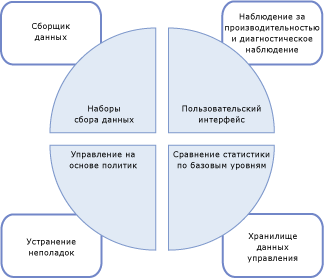
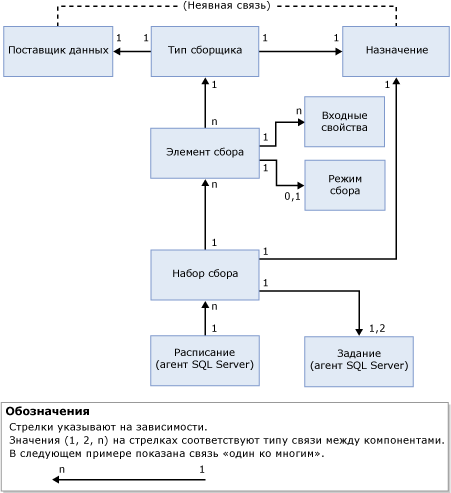

# Сбор данных
  Сборщик данных является компонентом [!INCLUDE[ssCurrent](../../includes/sscurrent-md.md)] , который собирает различные наборы данных. Сбор данных выполняется постоянно или по расписанию, назначенному пользователем. Собранные данные сборщик данных сохраняет в реляционной базе данных, называемой хранилищем данных управления.  
  
## Что такое сборщик данных 
 Сборщик данных является базовым компонентом платформы сбора данных [!INCLUDE[ssCurrent](../../includes/sscurrent-md.md)] и средств, предоставляемых [!INCLUDE[ssNoVersion](../../includes/ssnoversion-md.md)]. Он предоставляет единую централизованную точку сбора данных со всех серверов баз данных и приложений. Эта точка сбора может получать данные из множества источников и не ограничена сбором данных о производительности, в отличие от трассировки SQL.  
  
 Сборщик данных позволяет задавать область сбора данных в соответствии с требованиями тестовой и рабочей сред. Сборщик данных также использует хранилище данных, реляционную базу данных, которая предоставляет возможность управлять собираемыми данными, задавая различные сроки их хранения.  
  
 Сборщик данных поддерживает динамическую настройку сбора данных и его возможности можно расширить посредством API-интерфейса сборщика данных. Дополнительные сведения см. в статье [Data Collector Programming](http://msdn.microsoft.com/library/53b4752b-055d-4716-b2bc-75b4cce84101).  
  
 Роль сборщика данных в общей стратегии сбора и управления данными в [!INCLUDE[ssCurrent](../../includes/sscurrent-md.md)]показана на следующем рисунке.  
  
   
  
## Основные понятия  
 Сборщик данных интегрирован с агентом [!INCLUDE[ssNoVersion](../../includes/ssnoversion-md.md)] и службами [!INCLUDE[ssISnoversion](../../includes/ssisnoversion-md.md)]и широко их использует. Поэтому перед началом работы со сборщиком данных необходимо изучить основные понятия, связанные с этими компонентами [!INCLUDE[ssNoVersion](../../includes/ssnoversion-md.md)] .  
  
 Агент [!INCLUDE[ssNoVersion](../../includes/ssnoversion-md.md)] используется для планирования и запуска заданий сбора. Обратите внимание на следующие основные понятия:  
  
-   Задание  
  
-   Шаг задания  
  
-   расписание заданий;  
  
-   Подсистема  
  
-   учетные записи-посредники.  
  
 Дополнительные сведения см. в разделе [Задачи автоматизированного администрирования (SQL Server Agent)](http://msdn.microsoft.com/library/541ee5ac-2c9f-4b74-b4f0-13b7bd5920b0).  
  
 [!INCLUDE[ssISnoversion](../../includes/ssisnoversion-md.md)] ([!INCLUDE[ssIS](../../includes/ssis-md.md)]) используется для выполнения пакетов, которые собирают данные от отдельных поставщиков данных. Следует ознакомиться со следующими инструментами и понятиями служб [!INCLUDE[ssIS](../../includes/ssis-md.md)] :  
  
-   Пакет [!INCLUDE[ssIS](../../includes/ssis-md.md)]  
  
-   конфигурация пакета служб [!INCLUDE[ssIS](../../includes/ssis-md.md)]  
  
 Дополнительные сведения см. в разделе [Пакеты служб Integration Services (SSIS)](../../integration-services/integration-services-ssis-packages.md).  
  
## Терминология  
 **Цель**  
 Экземпляр компонента [!INCLUDE[ssDE](../../includes/ssde-md.md)] в выпуске [!INCLUDE[ssNoVersion](../../includes/ssnoversion-md.md)] , поддерживающем сбор данных. Дополнительные сведения о поддерживаемых выпусках см. в подразделе "Управляемость" раздела [Возможности, поддерживаемые различными выпусками SQL Server 2016](~/sql-server/editions-and-supported-features-for-sql-server-2016.md).  
  
 *Целевой корневой элемент* определяет поддерево в иерархии целей. *Набор целей* — это группа целей, получаемая в результате применения фильтра к поддереву, определенному целевым корневым элементом. Целевой корневой элемент может быть базой данных, экземпляром [!INCLUDE[ssNoVersion](../../includes/ssnoversion-md.md)]или экземпляром компьютера.  
  
**целевой тип**  
 Тип цели, имеющий определенные характеристики и поведение. Например, цель — экземпляр [!INCLUDE[ssNoVersion](../../includes/ssnoversion-md.md)] имеет характеристики, отличные от характеристик цели — базы данных [!INCLUDE[ssNoVersion](../../includes/ssnoversion-md.md)] .  
  
 **поставщик данных**  
 Известный источник данных, предназначенный для типа целевого объекта, который поставляет данные типу сборщика.  
  
**тип сборщика**  
 Логическая оболочка для пакетов служб [!INCLUDE[ssIS](../../includes/ssis-md.md)] , которая обеспечивает реальные механизмы для сбора данных и передачи их в хранилище управляющих данных.  
  
 **элемент сбора**  
 Экземпляр типа сборщика. Элемент сбора создается с определенным набором входных свойств и частотой сбора.  
  
 **набор элементов сбора**  
 Группа элементов сбора. Набор сбора — это единица сбора данных, с которой пользователь может взаимодействовать через пользовательский интерфейс.  
  
 **режим сбора**  
 Способ, с помощью которого собираются и хранятся данные. В режиме сбора может применяться или не применяться кэширование. Режим с кэшированием обеспечивает непрерывный сбор, а режим без кэширования предназначен для нерегламентированного сбора или сбора моментального снимка.  
  
 **Хранилище данных управления**  
 Реляционная база данных, используемая для хранения собранных данных.  
  
 На следующем рисунке показываются зависимости и связи между компонентами сборщика данных.  
  
   
  
 Как показано на рисунке, поставщик данных расположен вне сборщика данных и по определению имеет явную связь с целью. Поставщик данных зависит от конкретной цели (например, служба [!INCLUDE[ssNoVersion](../../includes/ssnoversion-md.md)] , такая как реляционный механизм) и предоставляет данные, такие как системные представления в [!INCLUDE[ssNoVersion](../../includes/ssnoversion-md.md)], счетчики системного монитора или поставщики инструментария WMI, которые могут быть использованы сборщиком данных.  
  
 Тип сборщика индивидуален для целевого типа и зависит от логической связи поставщика данных с целевым типом. Тип сборщика определяет, как данные будут собираться из конкретного поставщика данных (с помощью схематизированных параметров) и задает схему хранилища данных. Для хранения собранных данных необходимо наличие схемы поставщика данных и схемы хранилища. Тип сборщика также поставляет сведения о расположении хранилища управляющих данных, которое может располагаться на компьютере, выполняющем сбор данных, или на другом компьютере.  
  
 Показанный на рисунке элемент сбора — это экземпляр конкретного типа сборщика, параметризованный входными параметрами, например схемой XML типа сборщика. Все элементы сбора должны работать в одном и том же целевом корневом элементе либо в пустом целевом корневом элементе. Это дает сборщику данных возможность комбинировать типы сборщиков из операционной системы или из конкретного целевого корневого элемента, но не из разных целевых корневых элементов.  
  
 Элемент сбора имеет определенную частоту сбора, которая определяет, как часто будут собираться значения моментальных снимков. Хотя элемент сбора является строительным блоком набора сбора, самостоятельно он существовать не может.  
  
 Наборы сбора определяются и развертываются на экземпляре сервера и могут выполняться независимо друг от друга. Каждый набор сбора может быть применен к цели, которая подходит для целевых типов всех типов сборщика, являющихся частью этого набора сбора. Набор сбора выполняется заданием или заданиями агента [!INCLUDE[ssNoVersion](../../includes/ssnoversion-md.md)] . Данные передаются в хранилище управляющих данных в соответствии с заранее установленным расписанием.  
  
 Все данные, собранные разными экземплярами внутри набора сбора, передаются в хранилище управляющих данных в соответствии с одним и тем же расписанием. Это расписание определяется, как общее расписание агента [!INCLUDE[ssNoVersion](../../includes/ssnoversion-md.md)] и может быть использовано несколькими наборами сбора. Набор сбора включается и выключается как единая сущность; элементы сбора не могут включаться и выключаться индивидуально.  
  
 При создании или обновлении набора сбора можно настроить режим сбора, использующийся для сбора и передачи данных в хранилище управляющих данных. Тип расписания определяется типом режима сбора: с кэшированием или без кэширования. Если установлен режим сбора с кэшированием, то сбор и передача данных будут выполняться разными заданиями. Сбор выполняется по расписанию, которое запускается при запуске агента [!INCLUDE[ssNoVersion](../../includes/ssnoversion-md.md)] , и работает с частотой, определенной в элементе сбора. Передача выполняется в соответствии с расписанием, заданным пользователем.  
  
 Если установлен режим сбора без кэширования, то сбор и передача данных будут выполняться одним заданием, но в два шага. Первый шаг — сбор, второй шаг — передача. Для сбора данных в нерегламентированном режиме расписание не требуется.  
  
 После включения набора сбора сбор данных может начаться либо в соответствии с расписанием, либо по запросу. После запуска сбора данных агент [!INCLUDE[ssNoVersion](../../includes/ssnoversion-md.md)] создает процесс для сборщика данных, который, в свою очередь, загружает пакеты служб [!INCLUDE[ssISnoversion](../../includes/ssisnoversion-md.md)] для набора сбора. Элементы сбора, представляющие типы сбора, собирают данные у соответствующих поставщиков данных указанных целей. После завершения цикла сбора эти данные загружаются в хранилище данных управления.  
  
## Возможные действия  
  
|Описание|Раздел|  
|----------------------|-----------|  
|Управление разными аспектами сбора данных, например включением или отключением сбора данных, изменением конфигурации набора элементов сбора или просмотром данных в хранилище данных управления.|[Управление сбором данных](../../relational-databases/data-collection/manage-data-collection.md)|  
|Использование отчетов для получения сведений о наблюдаемой системе и устранения неполадок ее производительности.|[Отчеты о наборе элементов сбора системных данных](../../relational-databases/data-collection/system-data-collection-set-reports.md)|  
|Использование хранилища данных управления для сбора данных с сервера, который при сборе данных является целевым.|[Хранилище данных управления](../../relational-databases/data-collection/management-data-warehouse.md)| 
|Использование возможностей серверной трассировки приложения SQL Server Profiler для экспорта определения трассировки с целью создания набора элементов сбора, использующего общий тип сборщика трассировки SQL.| [Использование приложения SQL Server Profiler для создания набора элементов сбора трассировки SQL (среда SQL Server Management Studio)](https://msdn.microsoft.com/library/cc645955(v=sql.130).aspx)
  
  

