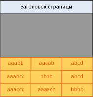
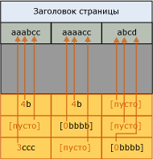
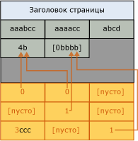

# Реализация сжатия страниц
[!INCLUDE [SQL Server Azure SQL Database](../../includes/applies-to-version/sql-asdb.md)]

  Этот раздел содержит описание того, как компонент [!INCLUDE[ssDE](../../includes/ssde-md.md)] реализует сжатие страниц. В этой сводке представлены основные сведения, которые помогут при планировании объема хранения.  
  
 Сжатие страницы похоже на сжатие таблиц, табличных секций, индексов и индексных секций. Последующее описание сжатия страницы для таблицы одинаково применимо для сжатия страницы для объектов всех типов. В следующих примерах сжимаются символьные строки, но при сжатии префикса и словаря применяются те же принципы, что и для других типов данных.  
  
 Сжатие конечного уровня таблиц и индексов вместе со сжатием страницы состоит из трех операций в следующем порядке:  
  
1.  сжатие строк;  
  
2.  сжатие префикса;  
  
3.  сжатие словаря.  

 При сжатии страницы неконечные страницы индексов сжимаются с использованием только сжатия строк. Дополнительные сведения о сжатии строк см. в разделе [Row Compression Implementation](../../relational-databases/data-compression/row-compression-implementation.md).  
  
## сжатие префикса;  
 Для каждой сжимаемой страницы сжатие префикса состоит из следующих шагов.  
  
1.  Для каждого столбца определяется значение, которое может использоваться для уменьшения места хранения значений в каждом столбце.  
  
2.  Строка, представляющая префиксные значения для каждого столбца, создается и хранится в структуре сжатой информации (CI), следующей за заголовком страницы.  
  
3.  Повторяющиеся префиксные значения в данном столбце заменяются ссылкой на соответствующий префикс. Если значение строки совпадает с выбранным префиксным значением не полностью, то частичные совпадения все еще могут быть отражены.  
  
 Следующая иллюстрация показывает образец страницы таблицы перед сжатием префикса.  
  
   
  
 Следующая иллюстрация содержит эту же страницу после сжатия префикса. Префикс перемещается к заголовку, а значения столбца изменяются ссылками на данный префикс.  
  
   
  
 В первом столбце первой строки значение 4b указывает, что первые четыре символа префикса (aaab) присутствуют для этой строки вместе с символом b. Это делает результирующим значение aaabb, которое представляет собой исходное значение.  
  
## сжатие словаря.  
 После завершения сжатия префикса применяется сжатие словаря. При сжатии словаря выполняется поиск на странице повторяющихся значений и сохранение их в области CI. В отличие от сжатия префикса, сжатие словаря не ограничено одним столбцом. При сжатии словаря можно заменить повторяющиеся значения, встречающиеся в любом месте страницы. Следующая иллюстрация содержит эту же страницу после сжатия словаря.  
  
   
  
 Обратите внимание, что ссылки на значение 4b существуют в различных столбцах страницы.  
  
## Когда происходит сжатие страницы  
 При создании новой таблицы, имеющей сжатие страницы, сжатия не происходит. Однако табличные метаданные указывают на то, что сжатие страницы должно быть использовано. Так как данные добавляются на первую страницу данных, они имеют сжатие строк. Поскольку страница не является полной, преимуществ сжатие страницы не дает. После того как страница заполнена, добавление следующей строки вызывает операцию ее сжатия. Вся страница просматривается; каждый столбец оценивается для сжатия префикса, а затем оцениваются все столбцы для сжатия словаря. Если при сжатии на странице освободилось достаточно места для дополнительной строки, то добавляется строка и в обоих случаях данные являются сжатыми по строкам и по страницам. Если пространство на странице сжатия минус пространство, указанное для структуры CI, увеличилось незначительно, сжатие страницы не используется для данной страницы. Любые будущие строки помещаются на другой странице, или, если они там не помещаются, в таблицу включается новая страница. Аналогично первой странице новая страница не является сразу сжатой постранично.  
  
 Если существующая таблица, содержащая данные, преобразуется для сжатия страниц, каждая страница перестраивается и оценивается. Перестроение всех страниц приводит к перестроению таблицы, индекса или секции.  
  
## См. также:  
 [Сжатие данных](../../relational-databases/data-compression/data-compression.md)   
 [Row Compression Implementation](../../relational-databases/data-compression/row-compression-implementation.md)  
  
  
