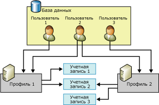

# Объекты конфигурации компонента Database Mail
[!INCLUDE[appliesto-ss-xxxx-xxxx-xxx-md](../../includes/appliesto-ss-xxxx-xxxx-xxx-md.md)]
  Компонент Database Mail имеет два объекта конфигурации: объекты конфигурации баз данных позволяют настраивать параметры компонента Database Mail, используемые при отправке писем приложением базы данных или агентом [!INCLUDE[ssNoVersion](../../includes/ssnoversion-md.md)] .  
  
-   Учетные записи компонента Database Mail  
  
-   Профили компонента Database Mail  
  
  
##   Связи объектов конфигурации компонента Database Mail  
 На рисунке показаны два профиля, три учетные записи и три пользователя. Пользователь 1 имеет доступ к профилю 1, в котором используются учетная запись 1 и учетная запись 2. Пользователь 3 имеет доступ к профилю 2, в котором используются учетная запись 2 и учетная запись 3. Пользователь 2 имеет доступ одновременно к профилю 1 и профилю 2.  
  
   
  
  
##   Учетная запись компонента Database Mail  
 Учетная запись компонента Database Mail содержит сведения, которые Microsoft [!INCLUDE[ssNoVersion](../../includes/ssnoversion-md.md)] использует для отправки сообщений электронной почты на SMTP-сервер. Каждая учетная запись содержит сведения для одного сервера электронной почты.  
  
 Компонент Database Mail поддерживает три метода проверки подлинности для связи с SMTP-сервером:  
  
-   Проверка подлинности Windows: компонент Database Mail использует для проверки подлинности на SMTP-сервере учетные данные учетной записи службы [!INCLUDE[ssDEnoversion](../../includes/ssdenoversion-md.md)] Windows.  
  
-   Обычная проверка подлинности: компонент Database Mail использует указанные имя пользователя и пароль, чтобы проверить подлинность на SMTP-сервере.  
  
-   Анонимный доступ: SMTP-серверу не требуется проверка подлинности.  Компонент Database Mail не будет использовать никаких учетных данных для проверки подлинности на SMTP-сервере.  
  
 Сведения об учетных записях хранятся в базе данных **msdb** . Каждая учетная запись содержит следующие сведения:  
  
-   Имя учетной записи.  
  
-   Описание учетной записи.  
  
-   Адрес электронной почты учетной записи.  
  
-   Отображаемое имя учетной записи.  
  
-   Адрес электронной почты, который будет использоваться в качестве обратного адреса для учетной записи.  
  
-   Имя сервера электронной почты.  
  
-   Тип сервера электронной почты. Для [!INCLUDE[msCoName](../../includes/msconame-md.md)] [!INCLUDE[ssNoVersion](../../includes/ssnoversion-md.md)]это всегда протокол SMTP.  
  
-   Номер порта сервера электронной почты.  
  
-   Битовый столбец, который указывает, используется ли протокол Secure Sockets Layer (SSL) в соединении с почтовым сервером SMTP.  
  
-   Битовый столбец, который указывает, используются ли при установке соединения с SMTP-сервером учетные данные, определенные для компонента [!INCLUDE[ssDEnoversion](../../includes/ssdenoversion-md.md)].  
  
-   Имя пользователя для проверки подлинности на сервере электронной почты, если сервер электронной почты требует проверки подлинности.  
  
-   Пароль для проверки подлинности на сервере электронной почты, если сервер электронной почты требует проверки подлинности.  
  
 Мастер настройки компонента Database Mail обеспечивает удобный способ создания и управления учетными записями. Можно также использовать хранимые процедуры конфигурации в базе данных **msdb** для создания учетных записей и управления ими.  
  
  
##   Профиль компонента Database Mail  
 Профиль Database Mail является упорядоченной коллекцией связанных учетных записей компонента Database Mail. Приложения, отправляющие электронную почту при помощи компонента Database Mail, чаще используют профили, чем применяют учетные записи напрямую. Отделение сведений об индивидуальных серверах электронной почты от используемых приложениями объектов позволяет увеличить гибкость и надежность системы: профили обеспечивают автоматическую отработку отказа, поэтому если один из серверов электронной почты недоступен, то компонент Database Mail может автоматически отправить почту при помощи другого сервера электронной почты. Администраторы базы данных могут добавлять, удалять и перенастраивать учетные записи без внесения изменений в программный код приложений или в шаги задания.  
  
 Профили также помогают администраторам управлять доступом к электронной почте. Для отправки сообщений с помощью компонента Database Mail требуется членство в роли **DatabaseMailUserRole** . Профили позволяют администраторам более гибко управлять доступом к функции отправки сообщений электронной почты и определять, какие учетные записи для этого используются.  
  
 Профиль может быть как открытым, так и закрытым.  
  
 **Открытые профили** доступны всем членам роли базы данных **DatabaseMailUserRole** в базе данных **msdb** . Это позволяет всем членам роли **DatabaseMailUserRole** отправлять электронную почту с помощью данных профилей.  
  
 **Личные профили** задаются для субъектов безопасности базы данных **msdb** . Они позволяют отправлять электронную почту только определенным пользователям базы данных, ролям и членам предопределенной роли сервера **sysadmin** . По умолчанию профиль является закрытым и предоставляет доступ только членам предопределенной роли сервера **sysadmin** . Пользователи должны получить разрешение от **sysadmin** для использования закрытого профиля. Кроме того, разрешение на выполнение хранимой процедуры **sp_send_dbmail** выдается только членам роли **DatabaseMailUserRole**. Чтобы пользователь мог отправлять электронную почту, системный администратор должен добавить его к роли базы данных **DatabaseMailUserRole** .  
  
 Профили повышают надежность в тех случаях, когда сервер электронной почты становится недоступным или не может обрабатывать сообщения. Каждая учетная запись в профиле имеет свой порядковый номер. Порядковый номер определяет порядок, в соответствии с которым компонент Database Mail использует учетные записи в профиле. Для новых сообщений электронной почты компонент Database Mail использует последнюю учетную запись, с которой было успешно отправлено сообщение, либо учетную запись с наименьшим порядковым номером, если сообщения еще не отправлялись. Если использование этой учетной записи завершилось с ошибкой, компонент Database Mail использует учетную запись со следующим порядковым номером, и так до тех пор, пока сообщение не будет успешно отослано, либо пока не окажется безуспешным использование учетной записи с наибольшим порядковым номером. Если отправка сообщения от имени учетной записи с наибольшим порядковым номером также завершилась ошибкой, то компонент Database Mail приостанавливает попытки отправки сообщения на время, заданное параметром **AccountRetryDelay** хранимой процедуры **sysmail_configure_sp**. Затем он возобновляет их отправку, начиная с учетной записи с наименьшим порядковым номером. Параметр **AccountRetryAttempts** хранимой процедуры **sysmail_configure_sp**используется для указания количества попыток отправки сообщений электронной почты, перебирающих все учетные записи указанного профиля.  
  
 Если существует больше одной учетной записи с одним и тем же порядковым номером, компонент Database Mail использует только одну из них для данного почтового сообщения. В этом случае компонент Database Mail не указывает, какая учетная запись используется для этого порядкового номера, и не гарантирует того, что от сообщения к сообщению используется одна и та же учетная запись.  
  
  
##   Задачи конфигурации компонента Database Mail  
 Следующая таблица описывает задачи конфигурации компонента Database Mail.  
  
|Задача конфигурации|Ссылка на раздел|  
|------------------------|----------------|  
|Содержит инструкции по созданию учетных записей компонента Database Mail.|[Создание учетной записи компонента Database Mail](../../relational-databases/database-mail/create-a-database-mail-account.md)|  
|Содержит инструкции по созданию профилей компонента Database Mail.|[Создание профиля компонента Database Mail](../../relational-databases/database-mail/create-a-database-mail-profile.md)|  
|Содержит инструкции по настройке компонента Database Mail.|[Настройка компонента Database Mail](../../relational-databases/database-mail/configure-database-mail.md)|  
|Содержит инструкции по созданию скрипта настройки компонента Database Mail с помощью шаблонов||  
  
  
##   Дополнительные задачи конфигурации компонента Database Mail (системные хранимые процедуры)  
 Хранимые процедуры конфигурации компонента Database Mail находятся в базе данных **msdb** .  
  
 Следующие таблицы перечисляют хранимые процедуры, используемые для настройки компонента Database Mail и управления им.  
  
### Параметры компонента Database Mail  
  
|Имя|Описание|  
|----------|-----------------|  
|[sysmail_configure_sp (Transact-SQL)](../../relational-databases/system-stored-procedures/sysmail-configure-sp-transact-sql.md)|Изменяет настройки конфигурации компонента Database Mail.|  
|[sysmail_help_configure_sp (Transact-SQL)](../../relational-databases/system-stored-procedures/sysmail-help-configure-sp-transact-sql.md)|Отображает настройки конфигурации компонента Database Mail.|  
  
### Учетные записи и профили  
  
|Имя|Описание|  
|----------|-----------------|  
|[sysmail_add_profileaccount_sp (Transact-SQL)](../../relational-databases/system-stored-procedures/sysmail-add-profileaccount-sp-transact-sql.md)|Добавляет учетную запись почты к профилю компонента Database Mail.|  
|[sysmail_delete_account_sp (Transact-SQL)](../../relational-databases/system-stored-procedures/sysmail-delete-account-sp-transact-sql.md)|Удаляет учетную запись компонента Database Mail.|  
|[sysmail_delete_profile_sp (Transact-SQL)](../../relational-databases/system-stored-procedures/sysmail-delete-profile-sp-transact-sql.md)|Удаляет профиль компонента Database Mail.|  
|[sysmail_delete_profileaccount_sp (Transact-SQL)](../../relational-databases/system-stored-procedures/sysmail-delete-profileaccount-sp-transact-sql.md)|Удаляет учетную запись из профиля компонента Database Mail.|  
|[sysmail_help_account_sp (Transact-SQL)](../../relational-databases/system-stored-procedures/sysmail-help-account-sp-transact-sql.md)|Выводит сведения об учетных записях компонента Database Mail.|  
|[sysmail_help_profile_sp (Transact-SQL)](../../relational-databases/system-stored-procedures/sysmail-help-profile-sp-transact-sql.md)|Выводит сведения об одном или более профилях компонента Database Mail.|  
|[sysmail_help_profileaccount_sp (Transact-SQL)](../../relational-databases/system-stored-procedures/sysmail-help-profileaccount-sp-transact-sql.md)|Перечисляет учетные записи, связанные с одним или несколькими профилями компонента Database Mail.|  
|[sysmail_update_account_sp (Transact-SQL)](../../relational-databases/system-stored-procedures/sysmail-update-account-sp-transact-sql.md)|Обновляет данные существующей учетной записи компонента Database Mail.|  
|[sysmail_update_profile_sp (Transact-SQL)](../../relational-databases/system-stored-procedures/sysmail-update-profile-sp-transact-sql.md)|Изменяет описание или имя профиля компонента Database Mail.|  
|[sysmail_update_profileaccount_sp (Transact-SQL)](../../relational-databases/system-stored-procedures/sysmail-update-profileaccount-sp-transact-sql.md)|Обновляет порядковый номер учетной записи в профиле компонента Database Mail.|  
  
### безопасность  
  
|Имя|Описание|  
|----------|-----------------|  
|[sysmail_add_principalprofile_sp (Transact-SQL)](../../relational-databases/system-stored-procedures/sysmail-add-principalprofile-sp-transact-sql.md)|Предоставляет разрешение участнику базы данных для использования профиля компонента Database Mail.|  
|[sysmail_delete_principalprofile_sp (Transact-SQL)](../../relational-databases/system-stored-procedures/sysmail-delete-principalprofile-sp-transact-sql.md)|Удаляет разрешение для пользователя базы данных на использование открытого или закрытого профиля компонента Database Mail.|  
|[sysmail_help_principalprofile_sp (Transact-SQL)](../../relational-databases/system-stored-procedures/sysmail-help-principalprofile-sp-transact-sql.md)|Выводит сведения профиля компонента Database Mail для заданного пользователя базы данных.|  
|[sysmail_update_principalprofile_sp (Transact-SQL)](../../relational-databases/system-stored-procedures/sysmail-update-principalprofile-sp-transact-sql.md)|Обновляет сведения о разрешениях для заданного пользователя базы данных.|  
  
### Состояние системы  
  
|Имя|Описание|  
|----------|-----------------|  
|[sysmail_start_sp (Transact-SQL)](../../relational-databases/system-stored-procedures/sysmail-start-sp-transact-sql.md)|Запускает внешнюю программу компонента Database Mail и связанную с ней очередь компонента SQL Service Broker.|  
|[sysmail_stop_sp (Transact-SQL)](../../relational-databases/system-stored-procedures/sysmail-stop-sp-transact-sql.md)|Останавливает внешнюю программу компонента Database Mail и связанную с ней очередь компонента SQL Service Broker.|  
|[sysmail_help_status_sp (Transact-SQL)](../../relational-databases/system-stored-procedures/sysmail-help-status-sp-transact-sql.md)|Показывает, запущен ли компонент Database Mail.|  
  
##   Дополнительные ссылки  
  
-   [Ведение журнала и аудит компонента Database Mail](../../relational-databases/database-mail/database-mail-log-and-audits.md)  
  
  
  
