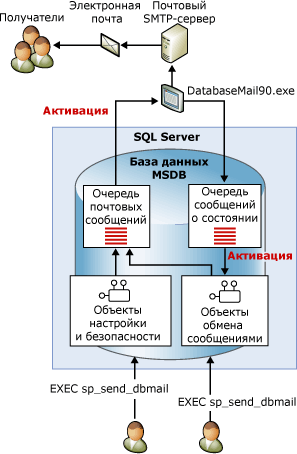

# Database Mail
[!INCLUDE [SQL Server SQL MI](../../includes/applies-to-version/sql-asdbmi.md)]
  Компонент Database Mail — это решение уровня предприятия для отправки сообщений электронной почты из компонента [!INCLUDE[ssDEnoversion](../../includes/ssdenoversion-md.md)] или [Управляемого экземпляра SQL Azure](https://docs.microsoft.com/azure/sql-database/sql-database-managed-instance-index). Используя компонент Database Mail, приложения базы данных могут отправлять почтовые сообщения пользователям. Сообщения могут содержать результаты запроса, а также могут включать файлы из любого сетевого ресурса.  
  
> [!NOTE] 
> Компонент Database Mail доступен в [!INCLUDE[ssDEnoversion](../../includes/ssdenoversion-md.md)] и [Управляемом экземпляре SQL Azure](https://docs.microsoft.com/azure/sql-database/sql-database-managed-instance-index), но не в отдельной базе данных SQL Azure и не в эластичных пулах. 

##   Преимущества использования компонента Database Mail  
 Компонент Database Mail спроектирован для надежности, масштабируемости, безопасности и простой поддержки.  
  
### Надежность  
  
-   Для отправки почты компонент Database Mail использует простой протокол доставки сообщений (SMTP). Можно использовать компонент Database Mail, не устанавливая клиент Extended MAPI на компьютер, на котором работает [!INCLUDE[ssNoVersion](../../includes/ssnoversion-md.md)].  
  
-   Изоляция процесса. Чтобы свести к минимуму влияние на [!INCLUDE[ssNoVersion](../../includes/ssnoversion-md.md)], компонент, доставляющий электронную почту, запускается в процессе, отдельном от [!INCLUDE[ssNoVersion](../../includes/ssnoversion-md.md)]. [!INCLUDE[ssNoVersion](../../includes/ssnoversion-md.md)] продолжает помещать в очередь сообщения электронной почты, даже если внешний процесс остановится или в нем произойдет сбой. Поставленные в очередь сообщения будут отосланы, как только внешний процесс или SMTP-сервер перейдет в состояние «в сети».  
  
-   Учетные записи отработки отказа. Профиль компонента Database Mail позволяет указать более одного SMTP-сервера. Если SMTP-сервер будет недоступен, почта может быть доставлена другому SMTP-серверу.  
  
-   Поддержка кластера. Компонент Database Mail является ориентированным на кластеры и полностью поддерживается кластером.  
  
### Масштабируемость  
  
-   Фоновая доставка. Компонент Database Mail обеспечивает фоновую или асинхронную доставку. При вызове процедуры **sp_send_dbmail** для отправки сообщения компонент Database Mail добавляет запрос в очередь компонента [!INCLUDE[ssSB](../../includes/sssb-md.md)] . Хранимая процедура возвращается немедленно. Внешний компонент электронной почты получает запрос и доставляет электронную почту.  
  
-   Множество профилей. Компонент Database Mail позволяет создавать множество профилей в экземпляре [!INCLUDE[ssNoVersion](../../includes/ssnoversion-md.md)] . Дополнительно можно выбрать профиль, который будет использовать компонент Database Mail при отправке сообщения.  
  
-   Множество учетных записей. Каждый профиль может содержать множество учетных записей отработок отказов. Можно настроить различные профили с различными учетными записями для распределения электронной почты через несколько почтовых серверов.  
  
-   64-разрядная совместимость. Компонент Database Mail полностью поддерживается на 64-разрядных установках [!INCLUDE[ssNoVersion](../../includes/ssnoversion-md.md)].  
  
### безопасность  
  
-   По умолчанию отключена. Для уменьшения контактной зоны [!INCLUDE[ssNoVersion](../../includes/ssnoversion-md.md)]хранимые процедуры компонента Database Mail по умолчанию отключены.  
  
-   Безопасность почты. Для отправки почты с помощью компонента Database Mail необходимо быть членом роли **DatabaseMailUserRole** в базе данных **msdb** .  
  
-   Безопасность профиля. Компонент Database Mail определяет безопасность для профилей почты. Выбираются пользователи или группы базы данных **msdb** , которые имеют доступ к профилю компонента Database Mail. Можно предоставить доступ или определенным пользователям, или всем пользователям в базе данных **msdb**. Закрытый профиль ограничивает доступ к указанному списку пользователей. Открытый профиль доступен для всех пользователей в базе данных.  
  
-   Регулятор размера вложения. Компонент Database Mail определяет настраиваемое ограничение на размер файла вложения. Это ограничение можно изменить с помощью хранимой процедуры [sysmail_configure_sp](../../relational-databases/system-stored-procedures/sysmail-configure-sp-transact-sql.md) .  
  
-   Запрещенные расширения файлов. Компонент Database Mail поддерживает список запрещенных расширений файлов. Пользователи не могут прикреплять файлы с расширением, указанным в списке. Этот список можно изменить с помощью хранимой процедуры sysmail_configure_sp.  
  
-   Компонент Database Mail запускается под управлением учетной записи, от имени которой выполняется служба компонента [!INCLUDE[ssNoVersion](../../includes/ssnoversion-md.md)] Engine. Для присоединения к письму файла из папки учетная запись компонента [!INCLUDE[ssNoVersion](../../includes/ssnoversion-md.md)] Engine должна иметь разрешения на доступ к папке, в которой содержится этот файл.  
  
### Возможности поддержки  
  
-   Интегрированная конфигурация. Компонент Database Mail позволяет использовать сведения учетных записей электронной почты в компоненте [!INCLUDE[ssDEnoversion](../../includes/ssdenoversion-md.md)]. Нет необходимости управлять профилем почты во внешнем приложении-клиенте. Мастер настройки компонента Database Mail обеспечивает удобный интерфейс для настройки компонента Database Mail. Также можно создавать и поддерживать конфигурации компонента Database Mail с помощью языка [!INCLUDE[tsql](../../includes/tsql-md.md)].  
  
-   Ведение журнала. Компонент Database Mail регистрирует активность электронной почты в [!INCLUDE[ssNoVersion](../../includes/ssnoversion-md.md)], в журнале событий приложений Microsoft Windows и в таблице базы данных **msdb** .  
  
-   Аудит. Компонент Database Mail сохраняет копии отправленных сообщений и вложений в базе данных **msdb** . Можно легко проводить аудит использования компонента Database Mail и просматривать сохраненные сообщения.  
  
-   Поддержка HTML. Компонент Database Mail позволяет посылать электронную почту в формате HTML.  
  
  
##   Архитектура Database Mail  
 Компонент Database Mail спроектирован по принципу очереди на основе технологий компонента Service Broker. Когда пользователь выполняет хранимую процедуру **sp_send_dbmail**, в почтовую очередь вставляется новый элемент и создается запись, содержащая сообщение электронной почты. При вставке новой записи в почтовую очередь запускается внешний процесс компонента Database Mail (DatabaseMail.exe). Внешний процесс считывает данные электронной почты и отправляет сообщение электронной почты соответствующему серверу или серверам электронной почты. Внешний процесс вставляет элемент в очередь состояния в соответствии с результатами операции отправки. При вставке новой записи в очередь состояний запускается внутренняя хранимая процедура, которая выполняет обновление состояния электронного сообщения. Кроме сохранения отправленного (или неотправленного) сообщения электронной почты, компонент Database Mail также записывает в системные таблицы все вложения. Представления компонента Database Mail содержат сведения о состоянии сообщений для диагностики и устранения неполадок в работе, а хранимые процедуры позволяют администрировать очередь компонента Database Mail.  
  
   
  
  
##   Общие сведения о компонентах Database Mail  
 Компонент Database Mail состоит из следующих основных компонентов.  
  
-   Компоненты настройки и безопасности  
  
     Компонент Database Mail хранит сведения о конфигурации и безопасности в базе данных **msdb** . Объекты настройки и безопасности создают профили и учетные записи, используемые компонентом Database Mail.  
  
-   Компоненты обмена сообщениями  
  
     База данных **msdb** выступает в качестве базы данных обслуживания почты и содержит объекты обмена сообщениями, которыми компонент Database Mail пользуется для отправки сообщений электронной почты. К ним относится хранимая процедура **sp_send_dbmail** и структуры данных, содержащие сведения о сообщениях.  
  
-   Исполняемый файл компонента Database Mail  
  
     Исполняемый файл компонента Database Mail является внешней программой, которая считывает из очереди в базе данных **msdb** и отправляет сообщения на серверы электронной почты.  
  
-   Компоненты протоколирования и контроля  
  
     Компонент Database Mail записывает данные протоколирования в базу данных **msdb** и в журнал событий приложений [!INCLUDE[msCoName](../../includes/msconame-md.md)] Windows.  
  
 **Настройка агента на использование компонента Database Mail.**  
  
 Агент SQL Server можно настроить использование компонента Database Mail. Это необходимо для рассылки уведомлений о предупреждениях и автоматических уведомлений о завершении заданий.  
  
> [!WARNING]  
>  На отдельных шагах заданий также могут пересылаться электронные сообщения, при этом настройка агента [!INCLUDE[ssNoVersion](../../includes/ssnoversion-md.md)] на использование компонента Database Mail не требуется. Например, на шаге задания на языке [!INCLUDE[tsql](../../includes/tsql-md.md)] компонент Database Mail может использоваться для пересылки результатов запроса списку получателей.  
  
 Агент [!INCLUDE[ssNoVersion](../../includes/ssnoversion-md.md)] может быть настроен на пересылку сообщений электронной почты заранее заданным операторам, если  
  
-   Создается предупреждение. Предупреждения могут быть настроены таким образом, чтобы при возникновении определенных событий по электронной почте посылались уведомления. Например, предупреждения могут быть настроены на уведомление оператора о возникновении в базе данных определенного события или о формировании в операционной системе условий, которые требуют немедленных действий. Дополнительные сведения о настройке предупреждений см. в разделе [Предупреждения](../../ssms/agent/alerts.md).  
  
-   Запланированная задача, например резервное копирование базы данных или репликация, выполнена удачно или с ошибкой. Например, почта агента [!INCLUDE[ssNoVersion](../../includes/ssnoversion-md.md)] может использоваться для уведомления операторов о возникновении ошибки во время обработки в конце месяца.  
  
  
##   См. также  
  
-   [Объекты конфигурации компонента Database Mail](../../relational-databases/database-mail/database-mail-configuration-objects.md)  
  
-   [Объекты обмена сообщениями компонента Database Mail](../../relational-databases/database-mail/database-mail-messaging-objects.md)  
  
-   [Внешняя программа компонента Database Mail](../../relational-databases/database-mail/database-mail-external-program.md)  
  
-   [Ведение журнала и аудит компонента Database Mail](../../relational-databases/database-mail/database-mail-log-and-audits.md)  
  
-   [Настройка почты агента SQL Server на использование компонента Database Mail](../../relational-databases/database-mail/configure-sql-server-agent-mail-to-use-database-mail.md)  
  
  
  
