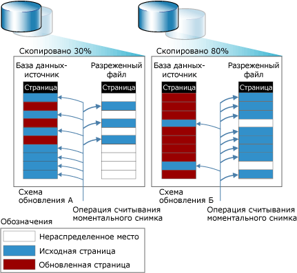

# Моментальные снимки базы данных (SQL Server)

[!INCLUDE[appliesto-ss-xxxx-xxxx-xxx-md](../../includes/appliesto-ss-xxxx-xxxx-xxx-md.md)]

Моментальный снимок базы данных является статичным, доступным только для чтения представлением базы данных [!INCLUDE[ssNoVersion](../../includes/ssnoversion-md.md)] (*базы данных-источника*). Моментальный снимок базы данных согласуется на уровне транзакций с базой данных-источником в момент создания моментального снимка. Моментальный снимок базы данных всегда находится на том же экземпляре сервера, что и база данных-источник. Моментальный снимок базы данных предоставляет представление данных только для чтения в состоянии на момент создания моментального снимка. Размер файла моментального снимка увеличивается по мере внесения изменений в базу данных-источник. Подробные сведения см. в разделе [Общие сведения о функциях](#FeatureOverview) ниже.
  
 Может существовать несколько моментальных снимков одной и той же базы данных-источника. Каждый моментальный снимок базы данных существует до тех пор, пока он не будет явно удален владельцем базы данных.  
  
> [!NOTE]  
>  Моментальные снимки базы данных не связаны с резервным копированием путем создания моментальных снимков, с изоляцией моментальных снимков транзакций и с репликацией моментальных снимков.  
  
 **В этом разделе.**  
  
-   [Общие сведения о функциях](#FeatureOverview)  
  
-   [Преимущества моментальных снимков баз данных](#Benefits)  
  
-   [Термины и определения](#TermsAndDefinitions)  
  
-   [Обязательные условия и ограничения для моментальных снимков базы данных](#LimitationsRequirements)  
  
-   [Связанные задачи](#RelatedTasks)  
  
##   Общие сведения о функциях  
 Моментальные снимки базы данных работают на уровне страниц данных. Перед первым изменением базы данных-источника исходная страница копируется из нее в моментальный снимок. Моментальный снимок хранит исходную страницу, оставляя записи данных в том виде, в котором они существовали на момент создания моментального снимка. Процесс повторяется для каждой страницы, изменяемой впервые. Для пользователя моментальный снимок никогда не меняется, поскольку операции считывания в моментальном снимке базы данных всегда обращаются к исходным страницам данных, независимо от того, сохранились они или нет.  
  
 Для хранения исходных страниц моментальный снимок использует один или более *разреженных файлов*. Изначально разреженный файл представляет собой пустой файл, который не содержит никаких пользовательских данных, и ему еще не выделено место на диске для пользовательских данных. По мере обновления страниц в базе данных-источнике размер файла увеличивается. На этом рисунке показано действие двух различных конфигураций обновления на размер моментального снимка. Конфигурация обновления А отражает условия, при которых в течение жизни моментального снимка обновляется только 30% всех исходных страниц. Конфигурация обновления Б отражает условия, при которых в течение жизни моментального снимка обновляется только 80% всех исходных страниц.  
  
   
  
##   Преимущества моментальных снимков баз данных  
  
-   Моментальные снимки можно использовать для составления отчетов.  
  
     Клиент может запрашивать моментальный снимок базы данных, что может потребоваться для создания отчетов на основе данных, относящихся к моменту создания моментального снимка.  
  
-   Поддержка хронологических данных для создания отчетов.  
  
     Моментальный снимок позволяет пользователю получить доступ к данным по состоянию на определенный момент времени. Например, моментальный снимок базы данных можно создать в конце определенного периода времени (например, финансового квартала) для последующего создания отчетов. Отчеты о каждом таком периоде будут создаваться на основе данных из моментального снимка. Если на диске достаточно свободного места, можно создавать такие моментальные снимки для каждого отчетного периода и разрешить запросы результатов по отчетным периодам, что может понадобиться, например для исследования эффективности деятельности организации.  
  
-   Экономия ресурсов за счет доступности данных, необходимых для создания отчетов, в зеркальных базах данных.  
  
     Применение моментальных снимков с зеркальным отображением баз данных позволяет сделать данные на зеркальном сервере доступными для отчетов. Кроме того, выполнение запросов в зеркальной базе данных может освободить ресурсы основной базы данных. Дополнительные сведения см. в статье [Зеркальное отображение и моментальные снимки баз данных (SQL Server)](../../database-engine/database-mirroring/database-mirroring-and-database-snapshots-sql-server.md).  
  
-   Защита данных от административных ошибок.  
  
-   При возникновении пользовательской ошибки в базе данных-источнике эту базу данных можно вернуть к состоянию, в котором она находилась на момент создания определенного моментального снимка базы данных. Потеря данных затронет только изменения в базе данных, произведенные после создания моментального снимка.  
  
     Перед серьезными обновлениями, такими как массовое обновление или изменение схемы, следует создать моментальный снимок базы данных для защиты данных. В случае ошибки можно будет восстановить базу данных путем возврата ее в предыдущее состояние с помощью моментального снимка. Потенциально процедура возврата занимает гораздо меньше времени, чем восстановление из резервной копии, но при этом она не поддерживает накат.  
  
    > [!IMPORTANT]  
    >  Восстановление неприменимо к поврежденной базе данных и к базе данных, находящейся в режиме вне сети. Таким образом, создание регулярных резервных копий и тестирование плана восстановления необходимы для защиты базы данных.  
  
    > [!NOTE]  
    >  Моментальные снимки базы данных зависят от базы данных-источника. Следовательно, стратегию резервного копирования и восстановления не следует заменять восстановлением данных с помощью моментальных снимков базы данных. Плановое создание резервных копий остается основным действием. Если необходимо восстановить базу данных-источник на момент времени, в который был создан моментальный снимок базы данных, реализуйте политику резервного копирования, позволяющую это делать.  
  
-   Защита данных от пользовательских ошибок.  
  
     Регулярное создание моментальных снимков базы данных может уменьшить ущерб от серьезных ошибок пользователей, например от удаления той или иной таблицы. Чтобы обеспечить высокий уровень защиты можно создать несколько моментальных снимков баз данных, охватывающих период времени, достаточный, чтобы распознать большинство пользовательских ошибок и устранить их последствия. Например, если достаточно свободного места на диске, то можно поддерживать от 6 до 12 моментальных снимков, охватывающих 24-часовой интервал. При создании следующего моментального снимка самый ранний будет удаляться.  
  
    -   Для устранения ошибки пользователя можно с помощью моментального снимка вернуть базу данных в состояние непосредственно перед этой ошибкой. Потенциально процедура возврата занимает гораздо меньше времени, чем восстановление из резервной копии, но при этом она не поддерживает накат.  
  
    -   Кроме того, удаленную таблицу или другие потерянные данные можно восстановить вручную по данным в моментальном снимке. Например, можно выполнить массовое копирование данных из моментального снимка в базу данных и вручную выполнить слияние данных в базе.  
  
    > [!NOTE]  
    >  От причины использования моментальных снимков зависит число параллельных снимков для одной базы данных, частота создания новых снимков и срок их хранения.  
  
-   Управление тестовой базой данных.  
  
     При повторяющемся выполнении тестового протокола в базе данных тестовой среды полезно, чтобы база данных содержала одинаковые данные в начале каждого цикла тестирования. Перед выполнением первого цикла разработчик приложения или тестировщик может создать моментальный снимок тестовой базы данных. После каждого запуска тестирования базу данных можно быстро вернуть в предыдущее состояние путем возврата моментального снимка базы данных.  
  
##   Термины и определения  
 database snapshot  
 Согласованное на уровне транзакций, доступное только для чтения статическое представление базы данных (базы данных-источника).  
  
 базы данных-источника  
 Для моментального снимка базы данных — база данных, в которой создан моментальный снимок. Моментальные снимки базы данных зависят от базы данных-источника. Они должны находиться на одном экземпляре сервера вместе с базой данных. Более того, если по какой-либо причине база данных становится недоступной, все ее моментальные снимки также становятся недоступными.  
  
 разреженный файл  
 Файл, предоставленный файловой системой NTFS, в результате чего он занимает значительно меньше места на диске, чем обычные файлы. Разреженный файл используется для хранения страниц, помещенных в моментальный снимок базы данных. После создания разреженный файл занимает немного места на диске. По мере занесения данных в моментальный снимок базы данных файловая система NTFS постепенно выделяет место на диске для соответствующего разреженного файла.  
  
##   Обязательные условия и ограничения для моментальных снимков базы данных  
 **В этом разделе.**  
  
-   [Предварительные требования](#Prerequisites)  
  
-   [Ограничения по базе данных-источнику](#LimitsOnSourceDb)  
  
-   [Ограничения по моментальным снимкам баз данных](#LimitsOnDbSS)  
  
-   [Требования к месту на диске](#DiskSpace)  
  
-   [Моментальные снимки базы данных с файловыми группами вне сети](#OfflineFGs)  
  
###   Предварительные требования  
 База данных-источник, в которой может применяться любая модель восстановления, должна соответствовать следующим предварительным требованиям.  
  
-   Экземпляр сервера должен работать на выпуске [!INCLUDE[ssNoVersion](../../includes/ssnoversion-md.md)] , который поддерживает моментальные снимки баз данных. Дополнительные сведения см. в разделе [Функции, поддерживаемые различными выпусками SQL Server 2016](~/sql-server/editions-and-supported-features-for-sql-server-2016.md).  
  
-   База данных-источник должна быть в режиме в сети, если база данных не является зеркальной в сеансе зеркального отображения базы данных.  
  
-   Моментальный снимок базы данных можно создать в любой базе данных-источнике или базе данных-получателе в группе доступности. Ролью реплики должна быть PRIMARY или SECONDARY, она не может находиться в состоянии RESOLVING.  
  
     Для создания моментального снимка рекомендуется, чтобы состояние синхронизации базы данных было SYNCHRONIZING или SYNCHRONIZED. Однако моментальные снимки базы данных могут создаваться и в состоянии синхронизации базы данных NOT SYNCHRONIZING.  
  
     Дополнительные сведения см. в статье [Моментальные снимки баз данных для групп доступности AlwaysOn (SQL Server)](../../database-engine/availability-groups/windows/database-snapshots-with-always-on-availability-groups-sql-server.md).  
  
-   Для создания моментального снимка в зеркальной базе данных эта база данных должна быть в состоянии зеркального отображения SYNCHRONIZED.  
  
-   База данных-источник не может быть настроена в качестве масштабируемой общей базы данных.  

-   База данных-источник не должна содержать файловую группу MEMORY_OPTIMIZED_DATA.  Дополнительные сведения см. в разделе [Неподдерживаемые функции SQL Server для выполняющейся в памяти OLTP](../../relational-databases/in-memory-oltp/unsupported-sql-server-features-for-in-memory-oltp.md).
  
> [!NOTE]  
>  Все модели восстановления поддерживают моментальные снимки базы данных.  
  
###   Ограничения по базе данных-источнику  
 В течение всего периода существования моментального снимка базы данных имеются следующие ограничения по базе данных-источнику моментального снимка.  
  
-   База данных не может быть сброшена, отсоединена или восстановлена.  
  
    > [!NOTE]  
    >  Резервное копирование базы данных-источника работает как обычно; на него не оказывают влияния моментальные снимки базы данных.  
  
-   Производительность снижается по причине увеличения количества операций ввода-вывода в базе данных-источнике из-за выполнения операции копирования при записи в моментальный снимок всякий раз при обновлении страницы.  
  
-   Файлы не могут быть сброшены из базы данных-источника или из любых моментальных снимков.  
  
###   Ограничения по моментальным снимкам баз данных  
 Следующие ограничения применяются к моментальным снимкам базы данных.  
  
-   Моментальный снимок базы данных должен создаваться и оставаться на том же экземпляре сервера, что и база данных-источник.  
  
-   Моментальные снимки базы данных всегда применяются на всей базе данных.  
  
-   Моментальные снимки базы данных связаны с базой данных-источником и не являются избыточным хранилищем данных. Они не защищают от ошибок диска или других видов повреждений. Следовательно, стратегию резервного копирования и восстановления не следует заменять восстановлением данных с помощью моментальных снимков базы данных. Плановое создание резервных копий остается основным действием. Если необходимо восстановить базу данных-источник на момент времени, в который был создан моментальный снимок базы данных, реализуйте политику резервного копирования, позволяющую это делать.  
  
-   Если при обновлении страницы в базе данных-источнике и при записи этого обновления в моментальный снимок не хватает места на диске или возникает какая-либо иная ошибка, моментальный снимок становится подозрительным и должен быть удален.  
  
-   Моментальные снимки доступны только для чтения. Так как они доступны только для чтения, они не могут быть обновлены. Таким образом, моментальные снимки базы данных не будут работоспособны после обновления.  
  
-   Создание моментальных снимков баз данных **model**, **master**и **tempdb** запрещено.  
  
-   Нельзя изменять любые из характеристик файлов моментального снимка базы данных.  
  
-   Нельзя удалять файлы из моментального снимка базы данных.  
  
-   Нельзя выполнять резервное копирование или восстановление моментальных снимков базы данных.  
  
-   Нельзя присоединять или отсоединять моментальные снимки базы данных.  
  
-   Нельзя создавать моментальные снимки базы данных в файловой системе FAT32 или в необработанных секциях. Разреженные файлы, используемые моментальными снимками базы данных, предоставляются файловой системой NTFS.  
  
-   Полнотекстовое индексирование не поддерживается на моментальных снимках базы данных. Полнотекстовые каталоги не распространяются из базы данных-источника.  
  
-   Моментальный снимок базы данных наследует ограничения безопасности своей базы данных-источника на момент создания моментального снимка. Поскольку моментальные снимки обладают свойством «только для чтения», наследуемые разрешения не могут быть изменены, и изменения, совершенные в отношении источника, не будут отражены в существующих моментальных снимках.  
  
-   Моментальный снимок всегда отражает состояние файловых групп на момент создания снимка: если файловая группа была в сети, она остается в сети, если же она была отключена, она остается вне сети. Дополнительные сведения см. в подразделе «Моментальные снимки базы данных с файловыми группами вне сети» далее в этом разделе.  
  
-   Если база данных-источник становится RECOVERY_PENDING, ее моментальные снимки могут стать недоступными. Однако после решения проблемы в базе данных-источнике ее моментальные снимки должны вновь стать доступными.  
  
-   Отмена изменений не поддерживается для файлов NTFS со свойством "только для чтения" и сжатых файлов NTFS.  Попытки отмены изменений базы данных, содержащей один из этих типов файловых групп, завершатся неудачно.  
  
-   В конфигурации доставки журналов моментальные снимки базы данных могут быть только созданы в базе данных-источнике, а не в базе данных-получателе. Если роли переключаются между экземплярами сервера-источника и сервера-получателя, необходимо удалить все моментальные снимки базы данных, перед тем как станет возможным настроить основную базы данных в качестве базы данных-получателя.  
  
-   Моментальный снимок базы данных не может быть настроен в качестве масштабируемой общей базы данных.  
  
-   В моментальных снимках базы данных не поддерживаются файловые группы FILESTREAM. Если в базе данных-источнике существуют файловые группы FILESTREAM, они помечаются как вне сети в ее моментальных снимках и их нельзя использовать для восстановления базы в исходное состояние.  
  
    > [!NOTE]  
    >  В инструкции SELECT, применяемой к моментальному снимку базы данных, нельзя указывать столбцы FILESTREAM; в противном случае будет возвращено следующее сообщение об ошибке: `Could not continue scan with NOLOCK due to data movement.`  
  
-   Если статистика для доступного только для чтения моментального снимка отсутствует или устарела, компонент [!INCLUDE[ssDE](../../includes/ssde-md.md)] создаст и будет поддерживать временную статистику в базе данных tempdb. Дополнительные сведения см. в разделе [Statistics](../../relational-databases/statistics/statistics.md).  
  
###   Требования к месту на диске  
 Моментальные снимки базы данных занимают место на диске. Если для моментального снимка базы данных не хватает места на диске, он помечается как подозрительный и должен быть сброшен. (Однако на базу данных-источник влияния не оказывается; действия в ней продолжаются, как обычно.) В сравнении с полной копией базы данных моментальные снимки намного более эффективны в вопросе использования места на диске. Моментальный снимок требует лишь столько места, сколько необходимо для хранения страниц, изменяющихся в период его существования. В целом, моментальные снимки хранятся ограниченное время, поэтому их размер не является предметом первостепенной важности.  
  
 Однако чем дольше хранится моментальный снимок, тем больше вероятность того, что он израсходует все доступное место на диске. Максимальным размером, до которого может вырасти разреженный файл, является размер соответствующего файла базы данных-источника на момент создания моментального снимка. Если для моментального снимка базы данных не хватает места на диске, он должен быть удален (сброшен).  
  
> [!NOTE]  
>  За исключением места для файла, моментальный снимок базы данных использует примерно столько же ресурсов, что и база данных.  
  
###   Моментальные снимки базы данных с файловыми группами вне сети  
 Файловые группы вне сети в базе данных-источнике оказывают влияние на моментальные снимки базы данных при попытке выполнить любое из следующих действий.  
  
-   Создание моментального снимка  
  
     Когда в базе данных-источнике имеется одна или несколько файловых групп вне сети, создание моментального снимка завершается успешно с файловыми группами вне сети. Разреженные файлы не создаются для файловых групп вне сети.  
  
-   Перевод файловой группы в режим вне сети  
  
     Можно перевести файл в режим вне сети в базе данных-источнике. Однако файловая группа останется в режиме в сети в моментальных снимках базы данных, если она находилась в режиме в сети на момент создания моментального снимка. Если запрашиваемые данные были изменены с момента создания моментального снимка, оригинальная страница данных будет доступна в моментальном снимке. Однако выполнение запросов, использующих моментальный снимок для доступа к неизмененным данным в файловой группе, скорее всего, завершится неудачно с ошибками ввода-вывода.  
  
-   Перевод файловой группы в режим в сети  
  
     Нельзя перевести файловую группу в режим в сети в базе данных, в которой имеются моментальные снимки базы данных. Если файловая группа находится в режиме вне  сети во время создания моментального снимка или отключена во время существования моментального снимка базы данных, файловая группа остается в режиме вне  сети. Это происходит потому, что перевод файла обратно в режим в сети запускает его восстановление, что невозможно при существовании моментального снимка в базе данных.  
  
-   Возврат базы данных-источника в состояние по моментальному снимку  
  
     Восстановление базы данных-источника к состоянию на момент создания моментального снимка базы данных требует, чтобы все файловые группы находились в режиме «в сети», за исключением файловых групп, которые были «вне сети» при создании моментального снимка.  
  
##   Связанные задачи  
  
-   [Создание моментального снимка базы данных (Transact-SQL)](../../relational-databases/databases/create-a-database-snapshot-transact-sql.md)  
  
-   [Просмотр моментального снимка базы данных (SQL Server)](../../relational-databases/databases/view-a-database-snapshot-sql-server.md)  
  
-   [Просмотр размера разреженного файла снимка базы данных (Transact-SQL)](../../relational-databases/databases/view-the-size-of-the-sparse-file-of-a-database-snapshot-transact-sql.md)  
  
-   [Восстановление базы данных до состояния, сохраненного в моментальном снимке](../../relational-databases/databases/revert-a-database-to-a-database-snapshot.md)  
  
-   [Удаление моментального снимка базы данных (Transact-SQL)](../../relational-databases/databases/drop-a-database-snapshot-transact-sql.md)  
  
## См. также:  
 [Зеркальное отображение и моментальные снимки баз данных (SQL Server)](../../database-engine/database-mirroring/database-mirroring-and-database-snapshots-sql-server.md)  
  
  

