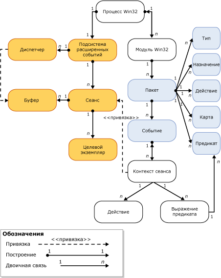

# Подсистема расширенных событий SQL Server

[!INCLUDE[appliesto-ss-asdb-xxxx-xxx-md](../../includes/appliesto-ss-asdb-xxxx-xxx-md.md)]

  Подсистема расширенных событий [!INCLUDE[ssNoVersion](../../includes/ssnoversion-md.md)] представляет собой набор служб и объектов, которые выполняют следующие действия.  
  
-   Включает определения событий.  
  
-   Включает обработку данных событий.  
  
-   Управляет службами и объектами расширенных событий в системе.  
  
-   Поддерживает список сеансов расширенных событий и управляет доступом к этому списку.  
  
 Сама подсистема расширенных событий не предоставляет никаких событий или действий при запуске события. Взаимодействие с подсистемой расширенных событий определяют процессы, использующие ее. Процессы добавляют точки событий и предоставляют действия, которые необходимо предпринять при возникновении события.  
  
 На следующем рисунке показан упрощенный вид сеанса расширенных событий. Дополнительные сведения см. в разделе [SQL Server Extended Events Sessions](../../relational-databases/extended-events/sql-server-extended-events-sessions.md).  
  
   
  
 Следует отметить следующее.  
  
-   Каждому процессу Windows соответствует один или несколько модулей (**процесс Win32**, **модуль Win32**). Они называются *двоичными* или *исполняемыми модулями*.  
  
-   Каждый модуль процесса Windows содержит один или несколько пакетов расширенных событий (**пакет**), который содержит один или несколько объектов расширенных событий (**тип**, **цель**, **действие**, **сопоставление**, **предикат**и **событие**).  
  
-   Процесс может содержать только один экземпляр подсистемы расширенных событий (**подсистема расширенных событий**), который выполняет указанные ниже действия.  
  
    -   Управляет некоторыми аспектами сеанса (например перечислением сеансов).  
  
    -   Обрабатывает доставку (**диспетчер**). (подобно пулу потоков).  
  
    -   Управляет буферами памяти (**буфер**) событий. Когда буфер заполняется, он отправляется цели.  
  
-   После создания сеанса к нему можно привязать события (**контекст сеанса**):  
  
    -   Экземпляры целей (**целевой экземпляр**) также можно создавать и добавлять к сеансу.  
  
    -   Когда буферы заполняются, они отправляются целям.  
  
## См. также:  
 [Расширенные события](../../relational-databases/extended-events/extended-events.md)  
  
  
