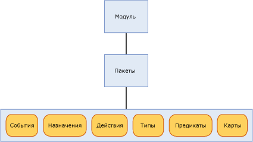

# <a name="sql-server-extended-events-packages"></a>Пакеты обработки расширенных событий SQL Server

[!INCLUDE[appliesto-ss-asdb-xxxx-xxx-md](../../includes/appliesto-ss-asdb-xxxx-xxx-md.md)]

  Пакет представляет собой контейнер для объектов средства обработки расширенных событий [!INCLUDE[ssNoVersion](../../includes/ssnoversion-md.md)] . Существуют три типа пакетов расширенных событий.  
  
-   package0 — системные объекты расширенных событий. Это пакет по умолчанию.  
  
-   sqlserver — объекты, связанные с [!INCLUDE[ssNoVersion](../../includes/ssnoversion-md.md)] .  
  
-   sqlos — объекты, связанные с операционной системой [!INCLUDE[ssNoVersion](../../includes/ssnoversion-md.md)] (SQLOS).  
  
> [!NOTE]  
>  Пакет SecAudit используется аудитом [!INCLUDE[ssNoVersion](../../includes/ssnoversion-md.md)] . Объекты в пакете недоступны для языка описания данных DDL расширенных событий.  
  
 Пакеты определяются по имени, идентификатору GUID и двоичному модулю, содержащему этот пакет. Дополнительные сведения см. в статье [sys.dm_xe_packages (Transact-SQL)](../../relational-databases/system-dynamic-management-views/sys-dm-xe-packages-transact-sql.md).  
  
 Пакет может содержать любой из следующих объектов или все эти объекты, которые подробно рассматриваются ниже в данном разделе.  
  
-   События  
  
-   Цели  
  
-   Действия  
  
-   Типы  
  
-   Предикаты  
  
-   Карты  
  
 В сеансе событий могут содержаться объекты из разных пакетов. Дополнительные сведения см. в разделе [SQL Server Extended Events Sessions](../../relational-databases/extended-events/sql-server-extended-events-sessions.md).  
  
## <a name="package-contents"></a>Содержимое пакета  
 На следующем рисунке показаны объекты, которые имеются в пакете, содержащемся в модуле. Модуль может быть исполняемым файлом или динамической библиотекой.  
  
   
  
### <a name="events"></a>События  
 События представляют собой точки наблюдения в пути выполнения программы, например [!INCLUDE[ssNoVersion](../../includes/ssnoversion-md.md)]. Возникновение события означает тот факт, что была достигнута точка наблюдения и был запущен сбор сведений о состоянии.  
  
 События можно использовать только в целях отслеживания или для запуска действий. Эти действия могут быть синхронными или асинхронными.  
  
> [!NOTE]  
>  Событие не осведомлено о действиях, которые могут быть предприняты в ответ на запуск события.  
  
 Набор событий в пакете нельзя изменить после регистрации пакета расширенных событий.  
  
 Все события имеют вариант схемы, определяющей их содержимое. Эта схема состоит из столбцов событий с явно определенными типами. Событие конкретного типа должно всегда предоставлять свои данные точно в том порядке, который задан в схеме. Тем не менее цель события не должна использовать все предоставляемые ей данные.  
  
#### <a name="event-categorization"></a>Категоризация событий  
 При обработке расширенных событий используется модель категоризации событий, подобная отслеживанию событий для Windows (ETW). Для категоризации событий используются два свойства, канал и ключевое слово. Тем самым поддерживается интеграция обработки расширенных событий с ETW и его средствами.  
  
 **Channel**  
  
 Канал определяет аудиторию события. Объяснения каналов приводятся в следующей таблице.  
  
|Термин|Определение|  
|----------|----------------|  
|Административный|События административного канала предназначены, прежде всего, для конечных пользователей, администраторов и службы поддержки. События в канале «Административный» указывают на неполадку с явно определенным решением, которую может устранить администратор. Примером события административного канала может служить отказ приложения подключиться к принтеру. Такие события хорошо документированы или имеют связанное с ними сообщение, объясняющее пользователю, что нужно сделать для решения проблемы.|  
|Операционный|События операционного канала используются для анализа и диагностики проблемы или наступления события. Они могут использоваться для запуска инструментальных средств или задач, исходя из проблемы или наступления события. Примером оперативного события может служить добавление или удаление принтера из системы.|  
|Аналитический|События аналитического канала публикуются в больших объемах. Они описывают функционирование программы и обычно используются для изучения производительности.|  
|Отладка|Отладочные события используются только разработчиками для диагностики проблемы при отладке.<br /><br /> События в канале отладки возвращают внутренние данные о состоянии, зависящие от реализации. Схемы и данные, возвращаемые событиями, могут измениться или стать недопустимыми в следующих выпусках SQL Server. Поэтому события в канале отладки в следующих выпусках SQL Server могут быть изменены или удалены без уведомления.|  
  
 **Ключевое слово**  
  
 Канал «Ключевое слово» зависит от приложения, оно позволяет выполнять высокодетализированное группирование связанных событий, облегчающее определение и получение событий, которые нужно использовать в сеансе. Для получения сведений о ключевых словах можно выполнить следующий запрос.  
  
```  
select map_value Keyword from sys.dm_xe_map_values  
where name = 'keyword_map'  
```  
  
> [!NOTE]  
>  Ключевые слова наиболее точно соответствуют текущему группированию событий трассировки SQL.  
  
### <a name="targets"></a>Цели  
 Цели являются объектами-получателями событий. Цели обрабатывают события или синхронно в потоке, запускающем событие, или асинхронно в потоке, предоставленном системой. Расширенные события предоставляют несколько целей, которые можно использовать по собственному усмотрению для направления выхода событий. Дополнительные сведения см. в статье [SQL Server Extended Events Targets](https://msdn.microsoft.com/library/e281684c-40d1-4cf9-a0d4-7ea1ecffa384).  
  
### <a name="actions"></a>Действия  
 Действие — это программный ответ или серия ответов на событие. Действия привязаны к событию, и каждое событие может иметь уникальный набор действий.  
  
> [!NOTE]  
>  Действия, предназначенные для конкретного набора событий, не могут быть привязаны к неизвестным событиям.  
  
 Действие, связанное с событием, вызывается синхронно в потоке, запустившем это событие. Существует много типов действий, имеющих широкий диапазон возможностей. Действия могут выполнять следующие функции.  
  
-   Собирать дампы стека и просматривать данные.  
  
-   Сохранять сведения о состоянии хранения в локальном контексте, используя различные хранилища.  
  
-   Собирать статистические данные о событиях.  
  
-   Присоединять данные к данным события.  
  
 Ниже проводятся несколько типичных, хорошо известных примеров.  
  
-   Сборщик данных стека  
  
-   Определение плана выполнения (только для[!INCLUDE[ssNoVersion](../../includes/ssnoversion-md.md)] )  
  
-   [!INCLUDE[tsql](../../includes/tsql-md.md)] Сбор данных стека (только для[!INCLUDE[ssNoVersion](../../includes/ssnoversion-md.md)] )  
  
-   Вычисление статистики времени выполнения  
  
-   Сбор пользовательского ввода для обработки исключений  
  
### <a name="predicates"></a>Предикаты  
 Предикаты представляют собой набор логических правил, которые используются для оценки событий при их обработке. Благодаря этому пользователь подсистемы расширенных событий получает возможность избирательно получать данные события на основе заданных критериев.  
  
 Предикаты могут сохранять данные в локальном контексте, который можно использовать для создания предикатов, возвращающих значение TRUE каждые *n* минут или каждые *n* раз при запуске события. С помощью такого хранилища в локальном контексте можно динамически обновлять предикаты, тем самым подавляя последующий запуск событий, содержащих подобные данные.  
  
 Предикаты имеют способность получать сведения о контексте, например идентификатор потока, а также определенные данные события. Предикаты оцениваются как полноценные логические выражения и поддерживают сокращенное вычисление в первой точке, в которой все выражение оказывается ложным.  
  
> [!NOTE]  
>  Предикаты с побочными эффектами могут не оцениваться, если проверка предыдущего предиката завершится ошибкой.  
  
### <a name="types"></a>Типы  
 Поскольку данные являются набором связанных байтов, для интерпретации данных необходимы длина и характеристики набора байтов. Следующие сведения содержатся в объекте Type. Для объектов пакета представлены следующие типы:  
  
-   event  
  
-   действие  
  
-   target;  
  
-   pred_source;  
  
-   pred_compare;  
  
-   type  
  
 Дополнительные сведения см. в разделе [sys.dm_xe_objects (Transact-SQL)](../../relational-databases/system-dynamic-management-views/sys-dm-xe-objects-transact-sql.md).  
  
### <a name="maps"></a>Карты  
 Таблица соответствий устанавливает соответствие внутреннего значения строке, что дает пользователю возможность узнать, что именно представляет это значение. В результате пользователь может получить значимое описание внутреннего значения, а не числовое значение. В следующем запросе показан способ установки соответствий.  
  
```  
select map_key, map_value from sys.dm_xe_map_values  
where name = 'lock_mode'  
```  
  
 Предыдущий запрос представил следующий вывод.  
  
 `map_key     map_value`  
  
 `---------------------`  
  
 `0           NL`  
  
 `1           SCH_S`  
  
 `2           SCH_M`  
  
 `3           S`  
  
 `4           U`  
  
 `5           X`  
  
 `6           IS`  
  
 `7           IU`  
  
 `8           IX`  
  
 `9           SIU`  
  
 `10          SIX`  
  
 `11          UIX`  
  
 `12          BU`  
  
 `13          RS_S`  
  
 `14          RS_U`  
  
 `15          RI_NL`  
  
 `16          RI_S`  
  
 `17          RI_U`  
  
 `18          RI_X`  
  
 `19          RX_S`  
  
 `20          RX_U`  
  
 `21          RX_X`  
  
 `21          RX_X`  
  
 Используя эту таблицу в качестве примера, предположим, что имеется столбец с именем mode и значением 5. В таблице указано, что значение 5 соответствует X, а это означает тип блокировки «Монопольная».  
  
## <a name="see-also"></a>См. также:  
 [SQL Server Extended Events Sessions](../../relational-databases/extended-events/sql-server-extended-events-sessions.md)   
 [Подсистема расширенных событий SQL Server](../../relational-databases/extended-events/sql-server-extended-events-engine.md)   
 [SQL Server Extended Events Targets](https://msdn.microsoft.com/library/e281684c-40d1-4cf9-a0d4-7ea1ecffa384)  
  
  
