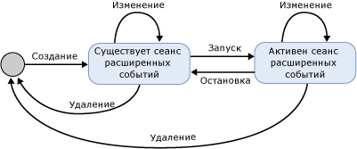

# SQL Server Extended Events Sessions
[!INCLUDE[appliesto-ss-asdb-xxxx-xxx-md](../../includes/appliesto-ss-asdb-xxxx-xxx-md.md)]

  Сеанс расширенных событий [!INCLUDE[ssNoVersion](../../includes/ssnoversion-md.md)] создается в процессе [!INCLUDE[ssNoVersion](../../includes/ssnoversion-md.md)] , в котором выполняется подсистема расширенных событий. Следующие аспекты сеанса расширенных событий предоставляют контекст, необходимый для понимания инфраструктуры и принципов работы расширенных событий.  
  
-   Состояния сеанса. Различные состояния сеанса расширенных событий при выполнении инструкций CREATE EVENT SESSION и ALTER EVENT SESSION.  
  
-   Содержимое и характеристики сеанса. Содержимое сеанса расширенных событий, например цели и события, и связь этих объектов в сеансе и между сеансами.  
  
## Состояния сеанса  
 На следующем рисунке показаны различные состояния сеанса расширенных событий.  
  
   
  
 Обратите внимание, что на предыдущем рисунке состояние сеанса меняется по мере того, как выполняются разные команды DDL. В следующей таблице описаны эти изменения состояния.  
  
|Метка рисунка|Инструкция DDL|Description|  
|------------------------|-------------------|-----------------|  
|Создание|CREATE EVENT SESSION|Процесс создает объект сеанса, содержащий метаданные, предоставленные инструкцией CREATE EVENT SESSION. Процесс проверяет определение сеанса, уровень разрешений пользователя и сохраняет метаданные в базе данных master. В этот момент сеанс неактивен.|  
|Alter|ALTER EVENT SESSION, STATE=START|Процесс запускает сеанс. Процесс считывает сохраненные метаданные, проверяет определение сеанса, уровень разрешений пользователя и создает сеанс. Загружаются такие объекты сеанса, как события и цели, и сеанс становится активным.|  
|Alter|ALTER EVENT SESSION, STATE=STOP|Процесс останавливает активный сеанс, но сохраняет метаданные.|  
|Drop|DROP EVENT SESSION|Если сеанс активен, инструкция удаляет метаданные и закрывает активный сеанс, в противном случае удаляет метаданные сеанса.|  
  
> [!NOTE]  
>  Инструкции ALTER EVENT SESSION и DROP EVENT SESSION могут применяться к метаданным или к активному сеансу и метаданным.  
  
## Содержимое и характеристики сеанса  
 Сеансы расширенных событий имеют неявные границы, выражающиеся в том, что конфигурация одного сеанса не изменяет конфигурацию другого сеанса. Однако эти границы не мешают использованию одного события или одной цели в нескольких сеансах.  
  
 На следующем рисунке показано содержимое сеанса и связь между пакетами и сеансами.  
  
 ![Совместное существование и совместное использование объектов в сеансах.] (../../relational-databases/extended-events/media/xesessions.gif "Совместное существование и совместное использование объектов в сеансах.")  
  
 Обратите внимание, что на предыдущем рисунке:  
  
-   Между пакетами и сеансом существует связь типа «многие ко многим», которая означает, что объект может появляться в нескольких сеансах, а сеанс может содержать несколько объектов.  
  
-   Одно и то же событие (событие 1) или одну и ту же цель (цель 1) можно включить в нескольких сеансах.  
  
 Сеансы имеют следующие характеристики.  
  
-   Действия и предикаты привязаны к событиям по сеансам. Если в сеансе A имеется событие 1 с действием 1 и предикатом Z, это никаким образом не затронет событие 1 в сеансе B с действиями 2 и 3 без предиката.  
  
-   Политики прикрепляются к сеансам для обработки буферизации и диспетчеризации, а также для отслеживания причинно-следственных связей.  
  
 **Буферизация и диспетчеризация**  
  
 Под буферизацией понимается способ хранения данных события при выполнении сеанса событий.  Политики буферизации задают объем памяти для данных события и метод обработки потерь для событий. Диспетчеризация определяет время хранения событий в буферах, прежде чем события будут передаваться целям для обработки.  
  
 **Отслеживание причинно-следственных связей**  
  
 Отслеживание причинно-следственных связей помогает отслеживать действия в нескольких задачах. Если включено отслеживание причинно-следственных связей, каждое запущенное событие получает уникальный в системе идентификатор активности. Идентификатор активности является сочетанием значения идентификатора GUID, который остается неизменным для всех операций в задаче, и порядкового номера, возрастающего при каждом запуске события. Если одна задача вызывает действия в другой задаче, родительский идентификатор активности сообщается дочерней задаче. Дочерняя задача регистрирует родительский идентификатор активности при первом запуске события.  
  
 Архитектура расширенных событий представляет собой гибкую систему, позволяющую совместно использовать разнообразные объекты для решения конкретных проблем.  
  
## См. также:  
 [Расширенные события](../../relational-databases/extended-events/extended-events.md)  
  
  
