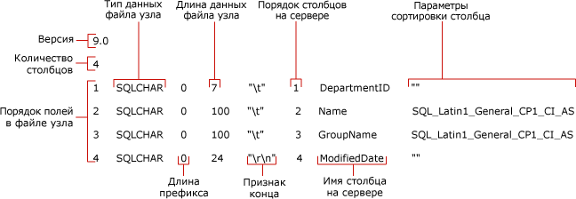

# <a name="non-xml-format-files-sql-server"></a>Файлы формата, отличные от XML (SQL Server)
  В [!INCLUDE[ssCurrent](../../includes/sscurrent-md.md)]поддерживаются два типа файлов форматирования для массового экспорта и импорта: *файлы формата, отличного от XML* , и *XML-файлы форматирования*.  
  
 **В этом разделе.**  
  
-   [Преимущества](#Benefits)  
  
-   [Структура файлов форматирования в формате, отличном от XML](#Structure)  
  
-   [Пример файла формата, отличного от XML](#Examples)  
  
-   [Связанные задачи](#RelatedTasks)  
  
##  <a name="Benefits"></a> Преимущества использования файлов формата, отличных от XML.  
  
-   Можно автоматически создать файл формата, отличного от XML, указав параметр **format** в команде **bcp** .  
  
-   Если в команде **bcp** задан существующий файл формата, то в команде используются значения, содержащиеся в файле, поэтому пользователь не получает приглашений указать тип хранения файла, длину префикса, длину поля или признак конца поля.  
  
-   Можно создать файл формата для определенного типа данных, например символьных данных или собственных данных.  
  
-   Можно создать файл форматирования в формате, отличном от XML, который будет содержать определяемые в интерактивном режиме атрибуты для каждого поля данных. Дополнительные сведения см. в разделе [Указание форматов данных для совместимости с помощью программы bcp (SQL Server)](../../relational-databases/import-export/specify-data-formats-for-compatibility-when-using-bcp-sql-server.md).  
  
> [!NOTE]  
>  XML-файлы формата имеют несколько преимуществ над файлами формата, отличными от XML. Дополнительные сведения см. в разделе [XML-файлы форматирования (SQL Server)](../../relational-databases/import-export/xml-format-files-sql-server.md).  
  
##  <a name="Structure"></a> Структура файлов форматирования в формате, отличном от XML  
 Файл форматирования в формате, отличном от XML — это текстовый файл, имеющий специальную структуру. Он содержит сведения о типе хранения, длине префикса, длине и признаке конца поля для каждого из столбцов таблицы.  
  
 На следующей схеме показаны поля учебного файла форматирования в формате, отличном от XML.  
  
 
  
 Поля **Version** и **Number of columns** встречаются только один раз. Описание этих параметров приводится в следующей таблице.  
  
|Поле файла форматирования|Описание|  
|------------------------|-----------------|  
|Version|Номер версии программы **bcp** :<br /><br /> 9.0 = [!INCLUDE[ssVersion2005](../../includes/ssversion2005-md.md)]<br /><br /> 10.0 = [!INCLUDE[ssKatmai](../../includes/sskatmai-md.md)]<br /><br /> 11.0 = [!INCLUDE[ssSQL11](../../includes/sssql11-md.md)]<br /><br /> 12.0 = [!INCLUDE[ssSQL14](../../includes/sssql14-md.md)]<br /><br /> Номер версии распознается по программе **bcp[!INCLUDE[tsql](../../includes/tsql-md.md)], а не по** .<br /><br /> <br /><br /> Примечание. Версия служебной программы **bcp** (Bcp.exe), используемая для считывания файла форматирования, должна быть той же или более поздней по сравнению с программой, с помощью которой создавался файл форматирования. Например, служебная программа [!INCLUDE[ssSQL11](../../includes/sssql11-md.md)]**bcp** может считать файл форматирования версии 10.0, созданный служебной программой [!INCLUDE[ssKatmai](../../includes/sskatmai-md.md)]**bcp**, но служебная программа [!INCLUDE[ssKatmai](../../includes/sskatmai-md.md)]**bcp** не может считать файл форматирования версии 12.0, созданный служебной программой [!INCLUDE[ssSQL14](../../includes/sssql14-md.md)]**bcp**.|  
|Number of columns|Число полей в файле данных. Это значение должно быть одинаковым во всех строках.|  
  
 Другие поля файла форматирования описывают поля данных, массовый импорт и экспорт которых должен быть произведен. Для каждого поля данных необходима отдельная строка файла форматирования. Каждая строка файла форматирования содержит значения полей файла форматирования, описание которых находится в следующей таблице.  
  
|Поле файла форматирования|Описание|  
|------------------------|-----------------|  
|**Порядковый номер поля в файле данных**|Число, указывающее на расположение поля в файле данных. Первое поле в строке имеет номер 1 и т. д.|  
|**Тип данных файла**|Указывает тип данных, хранящихся в этом поле файла данных. Для ASCII-файлов используйте SQLCHAR; для файлов данных в собственном формате используйте типы данных по умолчанию. Дополнительные сведения см. в разделе [Указание типа файлового хранилища с помощью программы bcp (SQL Server)](../../relational-databases/import-export/specify-file-storage-type-by-using-bcp-sql-server.md).|  
|**Длина префикса**|Количество символов префикса для поля. Допустимыми значениями длины префикса являются 0, 1, 2, 4 и 8. Чтобы не указывать длину префикса, установите это значение равным 0. Если поле содержит значения данных NULL, указание длины префикса обязательно. Дополнительные сведения см. в разделе [Определение длины префикса в файлах данных с помощью программы bcp (SQL Server)](../../relational-databases/import-export/specify-prefix-length-in-data-files-by-using-bcp-sql-server.md).|  
|**Длина данных в файле**|Максимальная длина (в байтах) для типа данных, содержащегося в соответствующем поле файла данных.<br /><br /> Если для текстового файла с разделителями создается файл форматирования в формате, отличном от XML, то для длины данных в файле каждого поля данных можно определить значение 0. Когда текстовой файл с разделителями обладает длиной префикса, равной 0, и происходит импорт признака конца поля, значение длины поля не обрабатывается, так как используемое для поля место хранилища равно сумме длины данных и признака конца поля.<br /><br /> Дополнительные сведения см. в разделе [Указание длины поля с помощью программы bcp (SQL Server)](../../relational-databases/import-export/specify-field-length-by-using-bcp-sql-server.md).|  
|**Признак конца**|Разделитель полей в файле данных. Обычно признаком конца строки является запятая (,) или символ табуляции (\t), а строки — символы перевода строки и возврата каретки (\r\n). Дополнительные сведения см. в разделе [Определение признаков конца поля и строки (SQL Server)](../../relational-databases/import-export/specify-field-and-row-terminators-sql-server.md).|  
|**Порядковый номер столбца на сервере**|Порядковый номер, под которым столбец находится в таблице [!INCLUDE[ssNoVersion](../../includes/ssnoversion-md.md)] . Например, если четвертое поле в файле данных соответствует шестому столбцу в таблице [!INCLUDE[ssNoVersion](../../includes/ssnoversion-md.md)] , порядковый номер столбца на сервере для четвертого поля равен 6.<br /><br /> Чтобы не загружать в таблицу данные из файла, установите значение порядкового номера столбца на сервере в значение 0.|  
|**Имя столбца на сервере**|Имя столбца, копируемого из таблицы [!INCLUDE[ssNoVersion](../../includes/ssnoversion-md.md)] . Использовать фактическое имя поля необязательно, но это поле в файле форматирования не должно быть пустым.|  
|**Параметры сортировки столбца**|Параметры сортировки, используемые для хранения в файле символьных данных и данных в Юникоде.|  
  
> [!NOTE]  
>  Можно изменить файл форматирования так, чтобы обеспечить возможность массового импорта данных из файла, в котором количество или порядок полей отличаются от количества или порядка столбцов в таблице. Дополнительные сведения см. в списке [Связанные задачи](#RelatedTasks) далее в этом разделе.  
  
##  <a name="Examples"></a> Пример файла формата, отличного от XML  
 В следующем примере показан ранее созданный файл форматирования (`myDepartmentIdentical-f-c.fmt`) в формате, отличном от XML. В этом файле описываются поля символьных данных для каждого столбца таблицы `HumanResources.Department` в образце таблицы `AdventureWorks2012` .  
  
 Созданный файл форматирования `myDepartmentIdentical-f-c.fmt`содержит следующие данные:  
  
```  
12.0  
4  
1       SQLCHAR       0       7       "\t"     1     DepartmentID     ""  
2       SQLCHAR       0       100     "\t"     2     Name             SQL_Latin1_General_CP1_CI_AS  
3       SQLCHAR       0       100     "\t"     3     GroupName        SQL_Latin1_General_CP1_CI_AS  
4       SQLCHAR       0       24      "\r\n"   4     ModifiedDate     ""  
```  
  
> [!NOTE]  
>  Схему, отображающую поля файла форматирования в этом образце файла форматирования, имеющем формат, отличный от XML, см. выше в разделе [Структура файлов форматирования в формате, отличном от XML](#Structure).  
  
##  <a name="RelatedTasks"></a> Связанные задачи  
  
-   [Создание файла форматирования (SQL Server)](../../relational-databases/import-export/create-a-format-file-sql-server.md)  
  
-   [Использование файла форматирования для массового импорта данных (SQL Server)](../../relational-databases/import-export/use-a-format-file-to-bulk-import-data-sql-server.md)  
  
-   [Пропуск столбца таблицы с помощью файла форматирования (SQL Server)](../../relational-databases/import-export/use-a-format-file-to-skip-a-table-column-sql-server.md)  
  
-   [Использование файла форматирования для пропуска поля данных (SQL Server)](../../relational-databases/import-export/use-a-format-file-to-skip-a-data-field-sql-server.md)  
  
-   [Использование файла форматирования для сопоставления столбцов таблицы с полями файла данных (SQL Server)](../../relational-databases/import-export/use-a-format-file-to-map-table-columns-to-data-file-fields-sql-server.md)  
  
## <a name="see-also"></a>См. также:  
 [Программа bcp](../../tools/bcp-utility.md)   
 [Создание файла форматирования (SQL Server)](../../relational-databases/import-export/create-a-format-file-sql-server.md)   
 [XML-файлы форматирования (SQL Server)](../../relational-databases/import-export/xml-format-files-sql-server.md)   
 [Файлы форматирования для импорта или экспорта данных (SQL Server)](../../relational-databases/import-export/format-files-for-importing-or-exporting-data-sql-server.md)  
  
  
