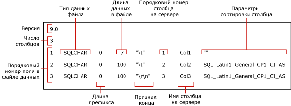

# <a name="use-a-format-file-to-skip-a-table-column-sql-server"></a>Пропуск столбца таблицы с помощью файла форматирования (SQL Server)
[!INCLUDE[appliesto-ss-asdb-asdw-pdw-md](../../includes/appliesto-ss-asdb-asdw-pdw-md.md)]

Из этой статьи вы узнаете, как при импорте пропустить столбец таблицы с помощью файла форматирования, если в исходном файле для этого столбца нет данных. Количество полей в файле данных может быть меньше количества столбцов в целевой таблице. То есть столбец пропускается, если верно хотя бы одно из следующих двух условий для целевой таблицы:
-   пропускаемый столбец допускает значение NULL;
-   пропускаемый столбец имеет значение по умолчанию.  
  
## <a name="sample-table-and-data-file"></a>Пример таблицы и файла данных  
 Примеры в этой статье предполагают, что существует таблица с именем `myTestSkipCol`, соответствующая схеме **dbo**. Вы можете создать эту таблицу в примере базы данных, например *WideWorldImporters* или *AdventureWorks*, или в любой другой базе. Создайте таблицу следующим образом:  
  
```sql
USE WideWorldImporters;  
GO  
CREATE TABLE myTestSkipCol   
   (  
   Col1 smallint,  
   Col2 nvarchar(50) NULL,  
   Col3 nvarchar(50) not NULL  
   );  
GO  
```  
  
В примерах в этой статье также используется образец файла данных `myTestSkipCol2.dat`. Этот файл содержит только два поля, хотя целевая таблица содержит три столбца.

```  
1,DataForColumn3  
1,DataForColumn3  
1,DataForColumn3  
```  
  
## <a name="basic-steps"></a>Основные этапы

Чтобы пропустить столбец таблицы, вы можете использовать файл форматирования как в формате XML, так и в формате, отличном от XML. В обоих случаях есть два этапа:

1.   Используйте служебную программу командной строки **bcp**, чтобы создать файл форматирования по умолчанию.

2.   Измените формат файла форматирования по умолчанию в текстовом редакторе.

[!INCLUDE[freshInclude](../../includes/paragraph-content/fresh-note-steps-feedback.md)]

Измененный файл форматирования должен сопоставлять каждое существующее поле с соответствующим ему столбцом в целевой таблице. Он также должен указывать, какие столбцы таблицы следует пропускать. 

Например, чтобы выполнить массовый импорт данных из `myTestSkipCol2.dat` в таблицу `myTestSkipCol`, в файле форматирования первое поле данных сопоставляется с `Col1`, пропускается `Col2`, и второе поле сопоставляется с `Col3`.  
 
## <a name="option-1---use-a-non-xml-format-file"></a>Вариант 1. Использование файла форматирования не в формате XML  
  
### <a name="step-1---create-a-default-non-xml-format-file"></a>Шаг 1. Создание файла форматирования по умолчанию в формате, отличном от XML  
Создайте файл форматирования по умолчанию в формате, отличном от XML, для примера таблицы `myTestSkipCol`. Для этого выполните следующую команду **bcp** в командной строке:  
  
```cmd
bcp WideWorldImporters..myTestSkipCol format nul -f myTestSkipCol_Default.fmt -c -T  
```  

> [!IMPORTANT]  
>  Возможно, потребуется указать имя экземпляра сервера, к которому вы подключаетесь, с помощью аргумента `-S`. Кроме того, может потребоваться указать имя пользователя и пароль с помощью аргументов `-U` и `-P`. Дополнительные сведения см. в разделе [bcp Utility](../../tools/bcp-utility.md).  

Предыдущая команда создает файл форматирования в формате, отличном от XML, `myTestSkipCol_Default.fmt`. Этот файл называется *файлом форматирования по умолчанию* , так как представляет собой форму, созданную командой **bcp**. Файл форматирования по умолчанию задает однозначное соответствие между полями файла данных и столбцами таблицы.  
  
 На следующем снимке экрана показаны значения в образцах файлов форматирования по умолчанию. 
  
   
  
> [!NOTE]  
>  Дополнительные сведения о файлах форматирования в формате, отличном от XML, см. в разделе [Файлы формата, отличные от XML (SQL Server)](../../relational-databases/import-export/non-xml-format-files-sql-server.md).  
  
### <a name="step-2---modify-a-non-xml-format-file"></a>Шаг 2. Изменение файла форматирования в формате, отличном от XML  
Есть два способа изменить файл форматирования по умолчанию в формате, отличном от XML. В обоих случаях указывается, что поле данных не существует в файле данных и в соответствующий столбец таблицы не должно ничего записываться.

Чтобы пропустить столбец таблицы, отредактируйте файл форматирования в формате, отличном от XML, и измените файл с помощью одного из следующих вариантов.  

#### <a name="option-1---remove-the-row"></a>Вариант 1. Удаление строки
Рекомендуемый метод для пропуска столбца включает три следующих этапа:

1.   Сначала удалите из файла форматирования все строки, которые описывают поля, отсутствующие в исходном файле данных.
2.   Затем уменьшите значение «порядкового номера поля в файле данных» каждой строки файла форматирования, которая следует за удаленной строкой. Целью являются последовательные значения "порядкового номера поля в файле данных", от 1 до *n*, которые отражают действительную позицию каждого поля данных в файле данных.
3.   Наконец, уменьшите значение в поле «Число столбцов» до действительного числа полей в файле данных.  
  
Приведенный ниже пример основан на файле форматирования по умолчанию для таблицы `myTestSkipCol`. Этот измененный файл форматирования сопоставляет первое поле данных полю `Col1`, пропускает поле `Col2`и сопоставляет второе поле данных `Col3`. Строка для поля `Col2` была удалена. Разделитель после первого поля также изменен с `\t` на `,`.
  
```  
14.0  
2  
1       SQLCHAR       0       7       ","      1     Col1         ""  
2       SQLCHAR       0       100     "\r\n"   3     Col3         SQL_Latin1_General_CP1_CI_AS  
```  
  
#### <a name="option-2---modify-the-row-definition"></a>Вариант 2. Изменение определения строки

В качестве альтернативы, чтобы пропустить столбец таблицы, можно изменить определение строки файла форматирования, которая соответствует этому столбцу таблицы. В этой строке файла форматирования значения «длина префикса», «длина данных файла узла» и «порядковый номер столбца на сервере» должны быть равны 0. Для признака конца и параметров сортировки столбца нужно установить значение "" (то есть пустое или NULL). Для значения "имя столбца на сервере" необходима непустая строка, хотя действительное имя столбца не требуется. Для оставшихся полей форматирования требуются значения по умолчанию.  
  
Следующий пример основан на файле форматирования по умолчанию для таблицы `myTestSkipCol` .  
  
```  
14.0  
3  
1       SQLCHAR       0       7       ","      1     Col1         ""  
2       SQLCHAR       0       0       ""       0     Col2         ""  
3       SQLCHAR       0       100     "\r\n"   3     Col3         SQL_Latin1_General_CP1_CI_AS  
```  
  
### <a name="examples-with-a-non-xml-format-file"></a>Примеры с файлом форматирования не в формате XML 
Приведенные ниже примеры основаны на образце таблицы `myTestSkipCol` и образце файла данных `myTestSkipCol2.dat`, описанных ранее в этой статье.  
  
#### <a name="using-bulk-insert"></a>Использование предложения BULK INSERT  
Этот пример может использовать любой из измененных файлов форматирования не в формате XML, создание которых описано в предыдущем разделе. В этом примере измененный файл форматирования называется `myTestSkipCol2.fmt`. Чтобы использовать `BULK INSERT` для массового импорта из файла данных `myTestSkipCol2.dat`, выполните в SSMS следующий код. Обновите пути файловой системы к файлам образцов на вашем компьютере.
  
```sql  
USE WideWorldImporters;  
GO  
BULK INSERT myTestSkipCol   
   FROM 'C:\myTestSkipCol2.dat'   
   WITH (FORMATFILE = 'C:\myTestSkipCol2.fmt');  
GO  
SELECT * FROM myTestSkipCol;  
GO  
```  
  
## <a name="option-2---use-an-xml-format-file"></a>Вариант 2. Использование файла форматирования в формате XML  
  
### <a name="step-1---create-a-default-xml-format-file"></a>Шаг 1. Создание XML-файла форматирования по умолчанию   

Создайте XML-файл форматирования по умолчанию для примера таблицы `myTestSkipCol`. Для этого выполните следующую команду **bcp** в командной строке:  
  
```cmd
bcp WideWorldImporters..myTestSkipCol format nul -f myTestSkipCol_Default.xml -c -x -T  
```  
  
> [!IMPORTANT]  
>  Возможно, потребуется указать имя экземпляра сервера, к которому вы подключаетесь, с помощью аргумента `-S`. Кроме того, может потребоваться указать имя пользователя и пароль с помощью аргументов `-U` и `-P`. Дополнительные сведения см. в разделе [bcp Utility](../../tools/bcp-utility.md).  
 
При помощи предыдущей команды создается XML-файл форматирования `myTestSkipCol_Default.xml`. Этот файл называется *файлом форматирования по умолчанию* , так как представляет собой форму, созданную командой **bcp**. Файл форматирования по умолчанию задает однозначное соответствие между полями файла данных и столбцами таблицы.  
  
```xml
<?xml version="1.0"?>  
<BCPFORMAT xmlns="https://schemas.microsoft.com/sqlserver/2004/bulkload/format" xmlns:xsi="http://www.w3.org/2001/XMLSchema-instance">  
 <RECORD>  
  <FIELD ID="1" xsi:type="CharTerm" TERMINATOR="\t" MAX_LENGTH="7"/>  
  <FIELD ID="2" xsi:type="CharTerm" TERMINATOR="\t" MAX_LENGTH="100" COLLATION="SQL_Latin1_General_CP1_CI_AS"/>  
  <FIELD ID="3" xsi:type="CharTerm" TERMINATOR="\r\n" MAX_LENGTH="100" COLLATION="SQL_Latin1_General_CP1_CI_AS"/>  
 </RECORD>  
 <ROW>  
  <COLUMN SOURCE="1" NAME="Col1" xsi:type="SQLSMALLINT"/>  
  <COLUMN SOURCE="2" NAME="Col2" xsi:type="SQLNVARCHAR"/>  
  <COLUMN SOURCE="3" NAME="Col3" xsi:type="SQLNVARCHAR"/>  
 </ROW>  
</BCPFORMAT>  
```  
  
> [!NOTE]  
>  Сведения о структуре файлов форматирования XML см. в разделе [Файлы формата XML (SQL Server)](../../relational-databases/import-export/xml-format-files-sql-server.md).  

### <a name="step-2---modify-an-xml-format-file"></a>Шаг 2. Изменение XML-файла форматирования

Ниже приведен измененный XML-файл форматирования `myTestSkipCol2.xml`, который пропускает `Col2`. Записи `FIELD` и `ROW` для `Col2` были удалены, и записи были перенумерованы. Разделитель после первого поля также изменен с `\t` на `,`.

```xml
<?xml version="1.0"?>  
<BCPFORMAT xmlns="https://schemas.microsoft.com/sqlserver/2004/bulkload/format" xmlns:xsi="http://www.w3.org/2001/XMLSchema-instance">  
 <RECORD>  
  <FIELD ID="1" xsi:type="CharTerm" TERMINATOR="," MAX_LENGTH="7"/>  
  <FIELD ID="2" xsi:type="CharTerm" TERMINATOR="\r\n" MAX_LENGTH="100" COLLATION="SQL_Latin1_General_CP1_CI_AS"/>  
 </RECORD>  
 <ROW>  
  <COLUMN SOURCE="1" NAME="Col1" xsi:type="SQLSMALLINT"/>  
  <COLUMN SOURCE="2" NAME="Col3" xsi:type="SQLNVARCHAR"/>  
 </ROW>  
</BCPFORMAT>  
```  
 
### <a name="examples-with-an-xml-format-file"></a>Примеры с XML-файлом форматирования   
Приведенные ниже примеры основаны на образце таблицы `myTestSkipCol` и образце файла данных `myTestSkipCol2.dat`, описанных ранее в этой статье.

Для импорта данных из файла `myTestSkipCol2.dat` в таблицу `myTestSkipCol` в примерах используется измененный XML-файл форматирования `myTestSkipCol2.xml`.   
  
#### <a name="using-bulk-insert-with-a-view"></a>Использование BULK INSERT c представлением  

Если применяется файл форматирование в формате XML, импорт непосредственно в таблицу с использованием команды **bcp** или инструкции `BULK INSERT` не позволяет пропускать столбцы. Однако можно выполнить импорт всех столбцов таблицы, кроме последнего. Если нужно пропустить любой столбец, кроме последнего, создайте представление целевой таблицы, которое содержит только столбцы из файла данных. После этого можно выполнить массовый импорт данных из этого файла в представление.  
  
Следующий пример создает представление `v_myTestSkipCol` для таблицы `myTestSkipCol`. В этом представлении пропущен второй столбец таблицы `Col2`. Затем применяется инструкция `BULK INSERT` для импорта файла данных `myTestSkipCol2.dat` в это представление.  
  
Выполните в SSMS следующий код. Обновите пути файловой системы к файлам образцов на вашем компьютере. 
  
```sql  
USE WideWorldImporters;  
GO  

CREATE VIEW v_myTestSkipCol AS  
    SELECT Col1,Col3  
    FROM myTestSkipCol;  
GO  
  
BULK INSERT v_myTestSkipCol  
FROM 'C:\myTestSkipCol2.dat'  
WITH (FORMATFILE='C:\myTestSkipCol2.xml');  
GO  
```  

#### <a name="using-openrowsetbulk"></a>Применение инструкции OPENROWSET(BULK...)  

Чтобы использовать XML-файл форматирования для пропуска столбца таблицы с помощью `OPENROWSET(BULK...)`, предоставьте в явном виде следующий список столбцов в списке выбора и в целевой таблице, как показано ниже:  
  
    ```sql
    INSERT ...<column_list> SELECT <column_list> FROM OPENROWSET(BULK...) 
    ```

В следующем примере используется поставщик массового набора строк `OPENROWSET` и файл форматирования `myTestSkipCol2.xml` . В примере выполняется массовый импорт файла данных `myTestSkipCol2.dat` в таблицу `myTestSkipCol` . Инструкция, в соответствии с требованиями, содержит явный список столбцов в списке выбора, а также в целевой таблице.  
  
Выполните в SSMS следующий код. Обновите пути файловой системы к файлам образцов на вашем компьютере.
  
```sql  
USE WideWorldImporters;  
GO  
INSERT INTO myTestSkipCol  
  (Col1,Col3)  
    SELECT Col1,Col3  
      FROM  OPENROWSET(BULK  'C:\myTestSkipCol2.Dat',  
      FORMATFILE='C:\myTestSkipCol2.Xml'    
       ) as t1 ;  
GO  
```

## <a name="see-also"></a>См. также:  
 [bcp Utility](../../tools/bcp-utility.md)   
 [BULK INSERT (Transact-SQL)](../../t-sql/statements/bulk-insert-transact-sql.md)   
 [OPENROWSET (Transact-SQL)](../../t-sql/functions/openrowset-transact-sql.md)   
 [Использование файла форматирования для пропуска поля данных (SQL Server)](../../relational-databases/import-export/use-a-format-file-to-skip-a-data-field-sql-server.md)   
 [Использование файла форматирования для сопоставления столбцов таблицы полям файла данных (SQL Server)](../../relational-databases/import-export/use-a-format-file-to-map-table-columns-to-data-file-fields-sql-server.md)   
 [Использование файла форматирования для массового импорта данных (SQL Server)](../../relational-databases/import-export/use-a-format-file-to-bulk-import-data-sql-server.md)  
  
  
