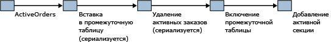

# <a name="application-pattern-for-partitioning-memory-optimized-tables"></a>Модель приложения для секционирования таблиц, оптимизированных для памяти
[!INCLUDE[tsql-appliesto-ss2016-asdb-xxxx-xxx_md](../../includes/tsql-appliesto-ss2016-asdb-xxxx-xxx-md.md)]

  [!INCLUDE[hek_2](../../includes/hek-2-md.md)] поддерживает шаблон, в соответствии с которым ограниченный объем активных данных сохраняется в таблице, оптимизированной для памяти, в то время как менее популярные данные обрабатываются на диске. Как правило, в этом случае данные сохраняются с ключом **datetime** .  
  
 Можно эмулировать секционированные таблицы с оптимизированными для памяти таблицами, сохраняя секционированную таблицу и оптимизированную для памяти таблицу с общей схемой. Текущие данные вставляются и обновляются в таблице, оптимизированной для памяти, а редко запрашиваемые данные переносятся в обычную секционированную таблицу.  
  
 Приложение, которое имеет информацию о том, что активные данные находятся в оптимизированной для памяти таблице, может использовать скомпилированные в собственном коде хранимые процедуры для доступа к данным. Если нужен доступ ко всем данным или если неизвестно, в какой таблице находятся данные, приложение может использовать интерпретируемые инструкции [!INCLUDE[tsql](../../includes/tsql-md.md)] для соединения таблицы, оптимизированной для памяти с секционированной таблицей.  
  
 Такой обмен секциями выглядит следующим образом.  
  
-   Вставка данных из таблицы OLTP в памяти в промежуточную таблицу с возможным использованием контрольной даты.  
  
-   Удаление тех же данных из оптимизированной для памяти таблицы.  
  
-   Подключение с заменой промежуточной таблицы.  
  
-   Добавление активной секции.  
  
   
Обслуживание активных данных  
  
 Действия, начиная с операции Deleting Active Orders, необходимо выполнять в течение окна обслуживания, чтобы не создавать запросы к отсутствующим данным в период между удалением данных и подключением с заменой промежуточной таблицы.  
  
 Подходящий пример см. в разделе [Секционирование уровня приложения](../../relational-databases/in-memory-oltp/application-level-partitioning.md).  
  
## <a name="code-sample"></a>Образец кода  
 В следующем примере показано, как использовать таблицу, оптимизированную для памяти, с секционированной таблицей на диске. Часто используемые данные сохраняются в памяти. Чтобы сохранить данные на диск, создайте новую секцию и скопируйте данные в секционированную таблицу.  
  
 В первой части данного примера создается база данных и необходимые объекты. Во второй части примера показано перемещение данных из таблицы, оптимизированной для памяти, в секционированную таблицу.  
  
```tsql  
CREATE DATABASE partitionsample;  
GO  
  
-- enable for In-Memory OLTP - change file path as needed  
ALTER DATABASE partitionsample ADD FILEGROUP partitionsample_mod CONTAINS MEMORY_OPTIMIZED_DATA  
ALTER DATABASE partitionsample ADD FILE( NAME = 'partitionsample_mod' , FILENAME = 'c:\data\partitionsample_mod') TO FILEGROUP partitionsample_mod;  
GO  
  
USE partitionsample;  
GO  
  
-- frequently used portion of the SalesOrders - memory-optimized  
  
CREATE TABLE dbo.SalesOrders_hot (  
   so_id INT IDENTITY PRIMARY KEY NONCLUSTERED,  
   cust_id INT NOT NULL,  
   so_date DATETIME2 NOT NULL INDEX ix_date NONCLUSTERED,  
   so_total MONEY NOT NULL,  
   INDEX ix_date_total NONCLUSTERED (so_date desc, so_total desc)  
) WITH (MEMORY_OPTIMIZED=ON)  
GO  
  
-- cold portion of the SalesOrders - partitioned disk-based table  
CREATE PARTITION FUNCTION [ByDatePF](datetime2) AS RANGE RIGHT   
   FOR VALUES();  
GO  
  
CREATE PARTITION SCHEME [ByDateRange]   
   AS PARTITION [ByDatePF]   
   ALL TO ([PRIMARY]);  
GO  
  
CREATE TABLE dbo.SalesOrders_cold (  
   so_id INT NOT NULL,  
   cust_id INT NOT NULL,  
   so_date DATETIME2 NOT NULL,  
   so_total MONEY NOT NULL,  
   CONSTRAINT PK_SalesOrders_cold PRIMARY KEY (so_id, so_date),  
   INDEX ix_date_total NONCLUSTERED (so_date desc, so_total desc)  
) ON [ByDateRange](so_date)  
GO  
  
-- table for temporary partitions  
CREATE TABLE dbo.SalesOrders_cold_staging (  
   so_id INT NOT NULL,  
   cust_id INT NOT NULL,  
   so_date datetime2 NOT NULL,  
   so_total MONEY NOT NULL,  
   CONSTRAINT PK_SalesOrders_cold_staging PRIMARY KEY (so_id, so_date),  
   INDEX ix_date_total NONCLUSTERED (so_date desc, so_total desc),  
   CONSTRAINT CHK_SalesOrders_cold_staging CHECK (so_date >= '1900-01-01')  
)  
GO  
  
-- aggregate view of the hot and cold data  
CREATE VIEW dbo.SalesOrders  
AS SELECT so_id,  
   cust_id,  
   so_date,  
   so_total,  
   1 AS 'is_hot'  
   FROM dbo.SalesOrders_hot  
   UNION ALL  
   SELECT so_id,  
          cust_id,  
          so_date,  
          so_total,  
          0 AS 'is_hot'  
          FROM dbo.SalesOrders_cold;  
GO  
  
-- move all sales orders up to the split date to cold storage  
CREATE PROCEDURE dbo.usp_SalesOrdersOffloadToCold @splitdate datetime2  
   AS  
   BEGIN  
      BEGIN TRANSACTION;  
      -- create new heap based on the hot data to be moved to cold storage  
      INSERT INTO dbo.SalesOrders_cold_staging WITH( TABLOCKX)  
      SELECT so_id , cust_id , so_date , so_total  
         FROM dbo.SalesOrders_hot WITH ( serializable)  
         WHERE so_date <= @splitdate;  
  
      -- remove moved data  
      DELETE FROM dbo.SalesOrders_hot WITH( SERIALIZABLE)  
         WHERE so_date <= @splitdate;  
  
      -- update partition function, and switch in new partition  
      ALTER PARTITION SCHEME [ByDateRange] NEXT USED [PRIMARY];  
  
      DECLARE @p INT = ( SELECT MAX( partition_number) FROM sys.partitions WHERE object_id = OBJECT_ID( 'dbo.SalesOrders_cold'));  
      EXEC sp_executesql N'alter table dbo.SalesOrders_cold_staging  
         SWITCH TO dbo.SalesOrders_cold partition @i' , N'@i int' , @i = @p;  
  
      ALTER PARTITION FUNCTION [ByDatePF]()  
      SPLIT RANGE( @splitdate);  
  
      -- modify constraint on staging table to align with new partition  
      ALTER TABLE dbo.SalesOrders_cold_staging DROP CONSTRAINT CHK_SalesOrders_cold_staging;  
  
      DECLARE @s nvarchar( 100) = CONVERT( nvarchar( 100) , @splitdate , 121);  
      DECLARE @sql nvarchar( 1000) = N'alter table dbo.SalesOrders_cold_staging   
         add constraint CHK_SalesOrders_cold_staging check (so_date > ''' + @s + ''')';  
      PRINT @sql;  
      EXEC sp_executesql @sql;  
  
      COMMIT;  
END;  
GO  
  
-- insert sample values in the hot table  
INSERT INTO dbo.SalesOrders_hot VALUES(1,SYSDATETIME(), 1);   
GO  
  
INSERT INTO dbo.SalesOrders_hot VALUES(1, SYSDATETIME(), 1);  
GO  
  
INSERT INTO dbo.SalesOrders_hot VALUES(1, SYSDATETIME(), 1);  
GO  
  
-- verify contents of the table  
SELECT *  FROM dbo.SalesOrders;  
GO  
  
-- offload all sales orders to date to cold storage  
DECLARE  @t datetime2 = SYSDATETIME();  
EXEC dbo.usp_SalesOrdersOffloadToCold @t;  
  
-- verify contents of the tables  
SELECT * FROM dbo.SalesOrders;  
GO  
  
-- verify partitions  
SELECT OBJECT_NAME( object_id) , * FROM sys.dm_db_partition_stats ps  
   WHERE object_id = OBJECT_ID( 'dbo.SalesOrders_cold');  
  
-- insert more rows in the hot table  
INSERT INTO dbo.SalesOrders_hot VALUES(2, SYSDATETIME(), 1);  
GO  
  
INSERT INTO dbo.SalesOrders_hot VALUES(2, SYSDATETIME(), 1);  
GO  
  
INSERT INTO dbo.SalesOrders_hot VALUES(2, SYSDATETIME(), 1);  
GO  
  
-- verify contents of the tables  
SELECT * FROM dbo.SalesOrders;  
GO  
  
-- offload all sales orders to date to cold storage  
DECLARE @t datetime2 = SYSDATETIME();  
EXEC dbo.usp_SalesOrdersOffloadToCold @t;  
  
-- verify contents of the tables  
SELECT * FROM dbo.SalesOrders;  
GO  
  
-- verify partitions  
SELECT OBJECT_NAME( object_id) , partition_number , row_count  FROM sys.dm_db_partition_stats ps  
  WHERE object_id = OBJECT_ID( 'dbo.SalesOrders_cold') AND index_id = 1;  
```  
  
## <a name="see-also"></a>См. также:  
 [Таблицы, оптимизированные для памяти](../../relational-databases/in-memory-oltp/memory-optimized-tables.md)  
  
  
