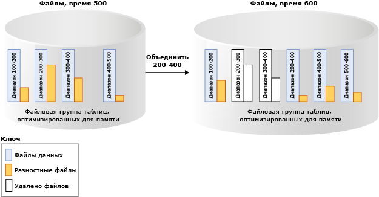

# Устойчивость таблиц, оптимизированных для памяти
[!INCLUDE[appliesto-ss-xxxx-xxxx-xxx-md](../../includes/appliesto-ss-xxxx-xxxx-xxx-md.md)]

  [!INCLUDE[hek_2](../../includes/hek-2-md.md)] обеспечивает полную устойчивость хранения для таблиц, оптимизированных для памяти. При фиксации транзакции, которая изменила таблицу, оптимизированную для памяти, [!INCLUDE[ssNoVersion](../../includes/ssnoversion-md.md)] (как и для дисковых таблиц) гарантирует, что изменения будут необратимы (выдержат перезапуск базы данных) при доступности используемого хранилища. Есть два ключевых компонента устойчивости таблицы: ведение журнала транзакций и сохранение изменений данных в хранилище на диске.  
  
 Подробные сведения об ограничениях на размер устойчивых таблиц см. в разделе [Оценка требований к объему памяти для таблиц, оптимизированных для памяти](../../relational-databases/in-memory-oltp/estimate-memory-requirements-for-memory-optimized-tables.md). 
  
## Журнал транзакций  
 Все изменения, внесенные в таблицы на диске или устойчивые таблицы, оптимизированные для памяти, заносятся в одну или несколько записей журнала транзакций. При фиксации транзакции службы [!INCLUDE[ssNoVersion](../../includes/ssnoversion-md.md)] сохраняют записи журнала, связанные с этой транзакцией, на диск до отправки приложению или сеансу пользователя сообщению о завершении фиксации транзакции. Это гарантирует, что изменения, внесенные транзакцией, будут устойчивы. Журнал транзакций для оптимизированных для памяти таблиц полностью интегрирован с тем же потоком журнала, который используется дисковыми таблицами. Такая интеграция обеспечивает продолжение работы существующих операций резервного копирования, восстановления и воссоздания журнала транзакций без каких-либо дополнительных шагов. Однако, поскольку [!INCLUDE[hek_2](../../includes/hek-2-md.md)] может существенно повысить пропускную способность транзакций рабочей нагрузки, ввод-вывод для журнала может стать узким местом в плане производительности. Чтобы обеспечить повышение пропускной способности, подсистема ввода-вывода для журнала должна поддерживать увеличенную нагрузку.  
  
## Файлы данных и разностные файлы  
 Данные в таблицах, оптимизированных для памяти, хранятся в строках данных свободной формы в структуре данных кучи в памяти и связаны с помощью одного или нескольких индексов в памяти. Для строк данных нет структур страниц, которые, в частности, используются для дисковых таблиц. Для обеспечения долгосрочного сохранения и усечения журнала транзакций операции с оптимизированными для памяти таблицами сохраняются в наборе файлов данных и разностных файлов. Эти файлы создаются на основе журнала транзакций с помощью асинхронного фонового процесса. Файлы данных и разностные файлы содержатся в одном или нескольких контейнерах (при этом используется тот же механизм, что и для данных FILESTREAM). Эти контейнеры являются частью оптимизированной для памяти файловой группы.  
  
 Данные в эти файлы записываются строго последовательно, что минимизирует задержку вращающихся дисков. Можно использовать несколько контейнеров на разных дисках для распределения операций ввода-вывода. Файлы данных и разностные файлы в нескольких контейнерах на разных дисках позволяют повысить производительность восстановления базы данных при считывании данных из файлов данных и разностных файлов на диске в память.  
  
 Пользовательские транзакции напрямую не обращаются к файлам данных и разностным файлам. Все операции чтения и записи используют структуры данных в памяти.  
  
### Файл данных  
 Файл данных содержит строки из одной или нескольких оптимизированных для памяти таблиц, которые были вставлены несколькими транзакциями как часть операций INSERT или UPDATE. Например, одна строка может быть из оптимизированной для памяти таблицы T1, а следующая строка — из таблицы T2. Строки добавляются в файл данных в порядке транзакций в журнале транзакций и обеспечивают последовательный доступ к данным. Это на порядок увеличивает пропускную способность ввода-вывода по сравнению с операциями ввода-вывода с произвольным доступом.  
  
 После заполнения файла данных строки, вставляемые новыми транзакциями, сохраняются в другом файле данных. Со временем строки из устойчивых, оптимизированных для памяти таблиц сохраняются в одном из нескольких файлов данных и каждый файл данных содержит строки из разного, но сопряженного набора транзакций. Например, файл данных с диапазоном метки времени фиксации (100, 200) содержит все строки, вставленные транзакциями с меткой времени фиксации, большей 100 и меньшей или равной 200. Метка времени фиксации — монотонно возрастающее число, назначаемое транзакции в тот момент, когда она готова для фиксации. Каждая транзакция имеет уникальную метку времени фиксации.  
  
 После удаления или обновления строки эта строка не удаляется и не изменяется на месте в файле данных, а удаленные строки отслеживаются в другом файле, например в разностном файле. Операции обновления обрабатываются как набор операций вставки и удаления для каждой строки. Это позволяет исключить произвольные операции ввода-вывода для файла данных.  
 
   Размер: каждый файл данных имеет размер примерно в 128 МБ для компьютеров с памятью больше 16 ГБ и 16 МБ для компьютеров с памятью, меньшей или равной 16 ГБ. В [!INCLUDE[ssSQL15](../../includes/sssql15-md.md)] SQL Server может использоваться режим больших контрольных точек, если определено, что подсистема хранения обладает достаточным быстродействием. В режиме больших контрольных точек файлы данных имеют размер 1 ГБ. Это позволяет повысить эффективность подсистемы хранения для рабочих нагрузок с высокой пропускной способностью.  
   
### Разностный файл  
 Каждый файл данных сопряжен с разностным файлом с таким же диапазоном транзакций и отслеживает удаленные строки, вставленные транзакциями в этом диапазоне. Эти данные и разностный файл называются парой файлов контрольных точек и являются единицей выделения и перераспределения, а также единицей операций слияния. Например, разностный файл, соответствующий диапазону транзакций (100, 200), будет хранить удаленные строки, вставленные транзакциями в диапазоне (100, 200). Как и файлы данных, доступ к разностному файлу осуществляется последовательно.  
  
 При удалении строки эта строка не удаляется. Вместо этого добавляется ссылка к строке в разностный файл данных, связанный с диапазоном транзакций, в который вставлена эта строка данных. Поскольку удаляемая строка уже существует в файле данных, разностный файл только сохраняет информацию о ссылке `{inserting_tx_id, row_id, deleting_tx_id }` , следуя порядку в журнале транзакций с исходными операциями удаления или обновления.  
  

 Размер: каждый разностный файл имеет размер примерно в 16 МБ для компьютеров с памятью больше 16 ГБ и 1 МБ для компьютеров с памятью, меньшей или равной 16 ГБ. Начиная с версии [!INCLUDE[ssSQL15](../../includes/sssql15-md.md)] SQL Server может использоваться режим больших контрольных точек, если определено, что подсистема хранения обладает достаточным быстродействием. В режиме больших контрольных точек разностные файлы имеют размер 128 МБ.  
 
## Отобразить файлы данных и разностные файлы  
 Файлы данных и разностные файлы заполняются на основе записей журнала транзакций, которые выполнялись с оптимизированными для памяти таблицами. Сведения о вставленных и удаленных строках добавляются в соответствующий файл данных и разностный файл. В отличие от дисковых таблиц, для которых страницы данных и индексов заполняются случайным вводом и выводом при достижении контрольной точки, сохранение оптимизированной для памяти таблицы — это непрерывная фоновая операция. Выполняется обращение к нескольким разностным файлам, поскольку транзакция может удалить или обновить любую строку, вставленную предыдущей транзакцией. Сведения об удалении всегда добавляются в конец разностного файла. Например, транзакция с меткой времени фиксации 600 вставляет одну новую строку и удаляет строки, вставленные транзакциями с меткой времени фиксации 150, 250 и 450, как показано на рисунке ниже. Все операции ввода-вывода с четырьмя файлами (три для удаленных строк и один для вставленных строк) — это операции, дополняющие соответствующие файлы данных и разностные файлы.  
  
 ![Чтение записей журнала для оптимизированных для памяти таблиц.] (../../relational-databases/in-memory-oltp/media/read-logs-hekaton.gif "Чтение записей журнала для оптимизированных для памяти таблиц.")  
  
## Доступ к файлам данных и разностным файлам  
 Доступ к парам файлов данных и разностных файлов осуществляется в следующих случаях.  
  
 Рабочий поток автономной контрольной точки  
 Этот поток добавляет вставленные и удаленные данные в строки данных, оптимизированные для памяти, и в соответствующие пары файлов данных и разностных файлов. В [!INCLUDE[ssSQL14](../../includes/sssql14-md.md)] имеется один рабочий поток автономной контрольной точки; начиная с версии [!INCLUDE[ssSQL15](../../includes/sssql15-md.md)] таких потоков несколько.  
  
 Операция слияния  
 Эта операция объединяет один или несколько файлов данных и разностных файлов и создает новую пару файлов.  
  
 В процессе восстановления после сбоя  
 При перезапуске [!INCLUDE[ssNoVersion](../../includes/ssnoversion-md.md)] или переводе базы данных в режим в сети оптимизированные для памяти данные заполняются с использованием пар файлов данных и разностных файлов. Разностный файл выступает в качестве фильтра для удаленных строк при чтении строк из соответствующего файла данных. Поскольку каждая пара файлов данных и разностных файлов не зависит друг от друга, эти файлы загружаются одновременно для уменьшения времени, затраченного для добавления данных в память. После загрузки данных в память подсистема OLTP в памяти применяет записи активного журнала транзакций, которые еще не были включены в файлы контрольных точек, чтобы полностью восстановить последнее состояние оптимизированных для памяти данных.  
  
 Во время операции восстановления  
 Файлы контрольных точек In-Memory OLTP создаются из резервной копии базы данных, а затем применяется одна или несколько резервных копий журналов транзакций. Как и при восстановлении после сбоя, подсистема In-Memory OLTP загружает данные в память параллельно, чтобы свести к минимуму влияние на время восстановления.  
  
## Объединение файлов данных и разностных файлов  
 Данные для оптимизированных для памяти таблиц хранятся в одной паре файла данных и разностного файла или в нескольких парах (которые также называют парой файлов контрольных точек или CFP). Файлы данных хранят вставленные строки, а разностные файлы содержат ссылки на удаленные строки. Во время выполнения рабочей нагрузки OLTP, пока операции DML обновляют, вставляют и удаляют строки, формируются новые пары файлов для сохранения новых строк, а ссылки на удаленные строки вводятся в разностные файлы.  
  
 Со временем в результате операций DML количество файлов данных и разностных файлов растет, что приводит к увеличению объема используемого пространства на диске и замедлению восстановления.  
  
 Чтобы избавиться от неэффективности, старые закрытые файлы данных и разностные файлы объединяются на основе рассмотренной ниже политики слияния, так что массив хранения сжимается и представляет тот же набор данных при меньшем числе файлов.  
  
 Операция слияния принимает в качестве входа одну или более смежных закрытых пар файлов контрольных точек (то есть пар файлов данных и разностных файлов, называемых источником слияния), исходя из внутренней политики слияния, и создает одну результирующую пару файлов (цель слияния). Записи в каждом разностном файле исходных пар файлов используются для фильтрации строк из соответствующего файла данных для удаления строк данных, которые больше не нужны. Оставшиеся строки в исходных файлах объединяются в одну целевую пару файлов. После слияния результирующая пара файлов заменяет исходную. Объединяемые исходные пары файлов проходят промежуточный этап, прежде чем будут удалены из хранилища.  
  
 В приведенном ниже примере у оптимизированной для памяти файловой группы таблицы четыре пары файлов данных и разностных файлов с меткой времени 500. Файлы содержат данные предыдущих транзакций. Например, строки в первом файле данных соответствуют транзакциям с меткой времени больше 100 и меньше или равной 200. Это также можно записать в виде (100, 200]. Как видим, второй и третий файлы данных заполнены меньше чем на 50 % после учета более 50 % строк, отмеченных как удаленные. Операция слияния объединяет эти две пары файлов и создает новую пару, содержащую транзакции с меткой времени больше 200 и меньше или равной 400, т. е. объединенный диапазон двух пар файлов. Очевидно, что другая пара файлов с диапазоном (500, 600] и непустой разностный файл для диапазона транзакций (200, 400] показывают, что слияние может быть выполнено параллельно с транзакциями, включая удаление других строк из исходных пар файлов.  
  
   
  
 Фоновый поток оценивает все закрытые пары файлов с помощью политики слияния и затем запускает один или несколько запросов слияния для выбранных пар файлов. Эти запросы слияния обрабатываются отдельным потоком контрольной точки вне сети. Оценка политики слияния выполняется периодически, а также когда закрывается контрольная точка.  
  
### [!INCLUDE[ssNoVersion](../../includes/ssnoversion-md.md)] Политика слияния  
 [!INCLUDE[ssNoVersion](../../includes/ssnoversion-md.md)] реализует описанную ниже политику слияния.  
  
-   Слияние добавляется в план, если две или более последовательные пары файлов могут быть объединены после учета удаленных строк, при этом результирующие строки должны войти в одну пару файлов целевого размера. Целевой размер файлов данных и разностных файлов соответствует исходному размеру, как описано ниже.  
  
-   Может производиться слияние одной пары файлов с самой собой, если размер файла данных в два раза превышает целевой размер и при этом удаляется более половины строк. Размер файла данных может превысить целевой размер, если, например, одна транзакция или несколько параллельных транзакций вставляют или обновляют большой объем данных, из-за чего размер файла данных превышает целевое значение, так как транзакция не может охватывать несколько пар файлов контрольных точек.  
  
 Ниже приведены некоторые примеры, которые показывают пары файлов, которые будут выбраны политикой слияния.  
  
|Смежные исходные пары файлов (% заполнения)|Выборка при слиянии|  
|-------------------------------------------|---------------------|  
|CFP0 (30 %), CFP1 (50 %), CFP2 (50 %), CFP3 (90 %)|(CFP0, CFP1)   Пара файлов CFP2 не выбрана, так как результирующий файл данных будет более 100 % от идеального размера.|  
|CFP0 (30 %), CFP1 (20 %), CFP2 (50 %), CFP3 (10 %)|(CFP0, CFP1, CFP2). Файлы выбираются, начиная слева.   Пара файлов CTP3 не выбрана, так как результирующий файл данных будет более 100 % от идеального размера.|  
|CFP0 (80 %), CFP1 (30 %), CFP2 (10 %), CFP3 (40 %)|(CFP1, CFP2, CFP3). Файлы выбираются, начиная слева.   Пара файлов CFP0 пропущена, так как после объединения с CFP1 результирующий файл данных будет больше 100 % от идеального размера.|  
  
 Не все пары файлов со свободным пространством подходят для слияния. Например, если две смежные пары заполнены на 60 %, они не подходят для слияния, при этом у каждой пары остается 40 % неиспользованного пространства. В худшем случае все пары файлов будут заполнены на 50 %, т. е. использование хранилища будет равно 50 %. В то время как удаленные строки могут существовать в хранилище, поскольку пары файлов не подходят для слияния, они могли уже быть удалены из памяти в процессе внутренней сборки мусора. Управление хранением и памятью происходит независимо от сборки мусора. Хранение, принятое активными парами файлов (не все пары файлов обновляются), может быть в 2 раза больше размера устойчивых таблиц в памяти.  
  
### Жизненный цикл пары файлов контрольной точки CFP  
 Пары файлов проходят несколько этапов, прежде чем они могут быть удалены из памяти. Для контрольных точек базы данных и резервных копий журналов файлы должны проходить через эти этапы, а ненужные файлы в конечном итоге должны удаляться. Описание этих этапов см. в разделе [sys.dm_db_xtp_checkpoint_files (Transact-SQL)](../../relational-databases/system-dynamic-management-views/sys-dm-db-xtp-checkpoint-files-transact-sql.md).  
  
 Чтобы ускорить сбор мусора, можно вручную установить контрольную точку перед резервной копией журнала. В рабочих сценариях автоматические контрольные точки и резервные копии журналов в рамках стратегии резервного копирования будут безупречно проводить пары файлов по этим этапам без участия пользователя. Влияние процесса сборки мусора заключается в том, что базы данных с оптимизированными для памяти таблицами могут иметь больший размер хранения по сравнению с размером в памяти. Если контрольная точка и резервные копии отсутствуют, объем пространства, занимаемого файлами контрольных точек на диске, будет и далее расти.  
  
## См. также:  
 [Создание и управление хранилищем для оптимизированных для памяти объектов](../../relational-databases/in-memory-oltp/creating-and-managing-storage-for-memory-optimized-objects.md)  
  
  
