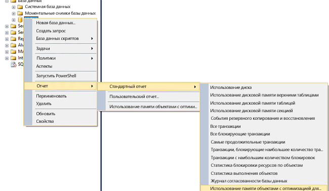
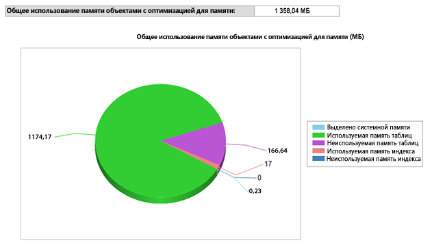

# <a name="monitor-and-troubleshoot-memory-usage"></a>Мониторинг и устранение неполадок с использованием памяти
[!INCLUDE[appliesto-ss-asdb-xxxx-xxx-md](../../includes/appliesto-ss-asdb-xxxx-xxx-md.md)]
  [!INCLUDE[hek_1](../../includes/hek-1-md.md)] использует память в шаблонах, отличных от дисковых таблиц. Можно контролировать объем выделенной памяти, используемый оптимизированными для памяти таблицами и индексами в базе данных, с помощью динамических административных представлений (DMV) и счетчиков производительности, предназначенных для подсистемы памяти и сборки мусора.  Это обеспечивает видимость на уровне системы и базы данных и позволяет предотвращать проблемы нехватки памяти.  
  
 В этом разделе описывается процесс мониторинга использования памяти в [!INCLUDE[hek_2](../../includes/hek-2-md.md)] .  
  
## <a name="sections-in-this-topic"></a>Подразделы этого раздела  
  
-   [Создание образца базы данных с таблицами, оптимизированными для памяти](../../relational-databases/in-memory-oltp/monitor-and-troubleshoot-memory-usage.md#bkmk_CreateDB)  
  
-   [Наблюдение за использованием памяти](../../relational-databases/in-memory-oltp/monitor-and-troubleshoot-memory-usage.md#bkmk_Monitoring)  
  
    -   [Использование среды SQL Server Management Studio](../../relational-databases/in-memory-oltp/monitor-and-troubleshoot-memory-usage.md#bkmk_UsingSSMS)  
  
    -   [Использование представлений DMV](../../relational-databases/in-memory-oltp/monitor-and-troubleshoot-memory-usage.md#bkmk_UsingDMVs)  
  
-   [Управление памятью, занятой объектами, оптимизированными для памяти.](../../relational-databases/in-memory-oltp/monitor-and-troubleshoot-memory-usage.md#bkmk_MemOptObjects)  
  
-   [Устранение неполадок с памятью](../../relational-databases/in-memory-oltp/monitor-and-troubleshoot-memory-usage.md#bkmk_Troubleshooting)  
  
##  <a name="bkmk_CreateDB"></a> Создание образца базы данных с таблицами, оптимизированными для памяти  
 Этот подраздел можно пропустить, если у вас уже есть база данных с таблицами, оптимизированными для памяти.  
  
 Следующие действия создадут базу данных с тремя оптимизированными для памяти таблицами, которые можно использовать в оставшейся части этого раздела. В примере мы сопоставили базы данных с пулом ресурсов, что позволит управлять объемом памяти, который может быть занят таблицами, оптимизированными для памяти.  
  
1.  Запустите среду [!INCLUDE[ssManStudioFull](../../includes/ssmanstudiofull-md.md)].  
  
2.  Нажмите кнопку **Создать запрос**.  
  
3.  Вставьте этот код в окно нового запроса и выполните каждый раздел.  
  
    ```  
    -- create a database to be used  
    CREATE DATABASE IMOLTP_DB  
    GO  
  
    ALTER DATABASE IMOLTP_DB ADD FILEGROUP IMOLTP_DB_xtp_fg CONTAINS MEMORY_OPTIMIZED_DATA  
    ALTER DATABASE IMOLTP_DB ADD FILE( NAME = 'IMOLTP_DB_xtp' , FILENAME = 'C:\Data\IMOLTP_DB_xtp') TO FILEGROUP IMOLTP_DB_xtp_fg;  
    GO  
  
    USE IMOLTP_DB  
    GO  
  
    -- create the resoure pool  
    CREATE RESOURCE POOL PoolIMOLTP WITH (MAX_MEMORY_PERCENT = 60);  
    ALTER RESOURCE GOVERNOR RECONFIGURE;  
    GO  
  
    -- bind the database to a resource pool  
    EXEC sp_xtp_bind_db_resource_pool 'IMOLTP_DB', 'PoolIMOLTP'  
  
    -- you can query the binding using the catalog view as described here  
    SELECT d.database_id  
         , d.name  
         , d.resource_pool_id  
    FROM sys.databases d  
    GO  
  
    -- take database offline/online to finalize the binding to the resource pool  
    USE master  
    GO  
  
    ALTER DATABASE IMOLTP_DB SET OFFLINE  
    GO  
    ALTER DATABASE IMOLTP_DB SET ONLINE  
    GO  
  
    -- create some tables  
    USE IMOLTP_DB  
    GO  
  
    -- create table t1  
    CREATE TABLE dbo.t1 (  
           c1 int NOT NULL CONSTRAINT [pk_t1_c1] PRIMARY KEY NONCLUSTERED  
         , c2 char(40) NOT NULL  
         , c3 char(8000) NOT NULL  
         ) WITH (MEMORY_OPTIMIZED = ON, DURABILITY = SCHEMA_AND_DATA)  
    GO  
  
    -- load t1 150K rows  
    DECLARE @i int = 0  
    BEGIN TRAN  
    WHILE (@i <= 150000)  
       BEGIN  
          INSERT t1 VALUES (@i, 'a', replicate ('b', 8000))  
          SET @i += 1;  
       END  
    Commit  
    GO  
  
    -- Create another table, t2  
    CREATE TABLE dbo.t2 (  
           c1 int NOT NULL CONSTRAINT [pk_t2_c1] PRIMARY KEY NONCLUSTERED  
         , c2 char(40) NOT NULL  
         , c3 char(8000) NOT NULL  
         ) WITH (MEMORY_OPTIMIZED = ON, DURABILITY = SCHEMA_AND_DATA)  
    GO  
  
    -- Create another table, t3   
    CREATE TABLE dbo.t3 (  
           c1 int NOT NULL CONSTRAINT [pk_t3_c1] PRIMARY KEY NONCLUSTERED HASH (c1) WITH (BUCKET_COUNT = 1000000)  
         , c2 char(40) NOT NULL  
         , c3 char(8000) NOT NULL  
         ) WITH (MEMORY_OPTIMIZED = ON, DURABILITY = SCHEMA_AND_DATA)  
    GO  
    ```  
  
##  <a name="bkmk_Monitoring"></a> Наблюдение за использованием памяти  
  
###  <a name="bkmk_UsingSSMS"></a> Использование [!INCLUDE[ssManStudioFull](../../includes/ssmanstudiofull-md.md)]  
 [!INCLUDE[ssSQL14](../../includes/sssql14-md.md)] поставляется вместе со встроенными стандартными отчетами для наблюдения за объемом памяти, используемым таблицами, хранимыми в памяти. Доступ к этим отчетам можно получить с помощью обозревателя объектов, как описано [здесь](http://blogs.msdn.com/b/managingsql/archive/2006/05/16/ssms-reports-1.aspx). Обозреватель объектов также можно использовать для контроля памяти, занятой отдельными таблицами, оптимизированными для памяти.  
  
#### <a name="consumption-at-the-database-level"></a>Использование на уровне базы данных  
 Можно отслеживать использование памяти на уровне базы данных следующим образом.  
  
1.  Запустите среду [!INCLUDE[ssManStudioFull](../../includes/ssmanstudiofull-md.md)] и подключитесь к серверу.  
  
2.  В обозревателе объектов щелкните правой кнопкой мыши базу данных, по которой нужно получить отчеты.  
  
3.  В контекстном меню выберите **Отчеты** -> **Стандартные отчеты** -> **Использование памяти таблицами, оптимизированными для памяти**  
  
   
  
 Данный отчет показывает потребление памяти базой данных, созданной ранее.  
  
   
  
###  <a name="bkmk_UsingDMVs"></a> Использование представлений DMV  
 Существует несколько динамических административных представлений для контроля объема памяти, используемого оптимизированными для памяти таблицами, индексами, системными объектами и структурами времени выполнения.  
  
#### <a name="memory-consumption-by-memory-optimized-tables-and-indexes"></a>Использование памяти оптимизированными для памяти таблицами и индексами  
 Можно узнать использование памяти для всех пользовательских таблиц, индексов и системных объектов с помощью запроса `sys.dm_db_xtp_table_memory_stats` , как показано ниже.  
  
```sql  
SELECT object_name(object_id) AS Name  
     , *  
   FROM sys.dm_db_xtp_table_memory_stats  
```  
  
 **Образец вывода**  
  
```  
Name       object_id   memory_allocated_for_table_kb memory_used_by_table_kb memory_allocated_for_indexes_kb memory_used_by_indexes_kb  
---------- ----------- ----------------------------- ----------------------- ------------------------------- -------------------------  
t3         629577281   0                             0                       128                             0  
t1         565577053   1372928                       1200008                 7872                            1942  
t2         597577167   0                             0                       128                             0  
NULL       -6          0                             0                       2                               2  
NULL       -5          0                             0                       24                              24  
NULL       -4          0                             0                       2                               2  
NULL       -3          0                             0                       2                               2  
NULL       -2          192                           25                      16                              16  
```  
  
 Дополнительные сведения см. в статье [sys.dm_db_xtp_table_memory_stats](../../relational-databases/system-dynamic-management-views/sys-dm-db-xtp-table-memory-stats-transact-sql.md).  
  
#### <a name="memory-consumption-by-internal-system-structures"></a>Использование памяти внутренними системными структурами  
 Память также используется системными объектами, например транзакционными структурами, буферами для разностных файлов и данных, структурами для сборки мусора и другими объектами. Можно узнать объем памяти, используемый для этих системных объектов с помощью запроса `sys.dm_xtp_system_memory_consumers` , как показано ниже.  
  
```sql  
SELECT memory_consumer_desc  
     , allocated_bytes/1024 AS allocated_bytes_kb  
     , used_bytes/1024 AS used_bytes_kb  
     , allocation_count  
   FROM sys.dm_xtp_system_memory_consumers  
```  
  
 **Образец вывода**  
  
```  
memory_consumer_ desc allocated_bytes_kb   used_bytes_kb        allocation_count  
------------------------- -------------------- -------------------- ----------------  
VARHEAP                   0                    0                    0  
VARHEAP                   384                  0                    0  
DBG_GC_OUTSTANDING_T      64                   64                   910  
ACTIVE_TX_MAP_LOOKAS      0                    0                    0  
RECOVERY_TABLE_CACHE      0                    0                    0  
RECENTLY_USED_ROWS_L      192                  192                  261  
RANGE_CURSOR_LOOKSID      0                    0                    0  
HASH_CURSOR_LOOKASID      128                  128                  455  
SAVEPOINT_LOOKASIDE       0                    0                    0  
PARTIAL_INSERT_SET_L      192                  192                  351  
CONSTRAINT_SET_LOOKA      192                  192                  646  
SAVEPOINT_SET_LOOKAS      0                    0                    0  
WRITE_SET_LOOKASIDE       192                  192                  183  
SCAN_SET_LOOKASIDE        64                   64                   31  
READ_SET_LOOKASIDE        0                    0                    0  
TRANSACTION_LOOKASID      448                  448                  156  
PGPOOL:256K               768                  768                  3  
PGPOOL: 64K               0                    0                    0  
PGPOOL:  4K               0                    0                    0  
```  
  
 Дополнительные сведения см. в статье [sys.dm_xtp_system_memory_consumers (Transact-SQL)](../../relational-databases/system-dynamic-management-views/sys-dm-xtp-system-memory-consumers-transact-sql.md).  
  
#### <a name="memory-consumption-at-run-time-when-accessing-memory-optimized-tables"></a>Использование памяти во время выполнения при обращении к оптимизированным для памяти таблицам  
 Следующим запросом можно определить объем памяти, занятый структурами времени выполнения, например для кэша процедур. Выполните этот запрос, чтобы получить объем памяти, используемый структурами времени выполнения, например для кэша процедур. Все структуры времени помечены как XTP.  
  
```sql  
SELECT memory_object_address  
     , pages_in_bytes  
     , bytes_used  
     , type  
   FROM sys.dm_os_memory_objects WHERE type LIKE '%xtp%'  
```  
  
 **Образец вывода**  
  
```  
memory_object_address pages_ in_bytes bytes_used type  
--------------------- ------------------- ---------- ----  
0x00000001F1EA8040    507904              NULL       MEMOBJ_XTPDB  
0x00000001F1EAA040    68337664            NULL       MEMOBJ_XTPDB  
0x00000001FD67A040    16384               NULL       MEMOBJ_XTPPROCCACHE  
0x00000001FD68C040    16384               NULL       MEMOBJ_XTPPROCPARTITIONEDHEAP  
0x00000001FD284040    16384               NULL       MEMOBJ_XTPPROCPARTITIONEDHEAP  
0x00000001FD302040    16384               NULL       MEMOBJ_XTPPROCPARTITIONEDHEAP  
0x00000001FD382040    16384               NULL       MEMOBJ_XTPPROCPARTITIONEDHEAP  
0x00000001FD402040    16384               NULL       MEMOBJ_XTPPROCPARTITIONEDHEAP  
0x00000001FD482040    16384               NULL       MEMOBJ_XTPPROCPARTITIONEDHEAP  
0x00000001FD502040    16384               NULL       MEMOBJ_XTPPROCPARTITIONEDHEAP  
0x00000001FD67E040    16384               NULL       MEMOBJ_XTPPROCPARTITIONEDHEAP  
0x00000001F813C040    8192                NULL       MEMOBJ_XTPBLOCKALLOC  
0x00000001F813E040    16842752            NULL       MEMOBJ_XTPBLOCKALLOC  
```  
  
 Дополнительные сведения см. в статье [sys.dm_os_memory_objects (Transact-SQL)](../../relational-databases/system-dynamic-management-views/sys-dm-os-memory-objects-transact-sql.md).  
  
#### <a name="memory-consumed-by-includehek2includeshek-2-mdmd-engine-across-the-instance"></a>Память, используемая модулем [!INCLUDE[hek_2](../../includes/hek-2-md.md)] в памяти в пределах экземпляра  
 В экземпляре SQL Server память, выделенная для модуля [!INCLUDE[hek_2](../../includes/hek-2-md.md)] в памяти и оптимизированных для памяти объектов, управляется таким же образом, как и любой другой потребитель памяти в экземпляре [!INCLUDE[ssNoVersion](../../includes/ssnoversion-md.md)] . Клерки типа учетных записей MEMORYCLERK_XTP для всей памяти, выделенной для модуля [!INCLUDE[hek_2](../../includes/hek-2-md.md)] . Следующий запрос применяется для вычисления объема всей памяти, используемого модулем [!INCLUDE[hek_2](../../includes/hek-2-md.md)] .  
  
```sql  
-- this DMV accounts for all memory used by the hek_2 engine  
SELECT type  
     , name  
     , memory_node_id  
     , pages_kb/1024 AS pages_MB   
   FROM sys.dm_os_memory_clerks WHERE type LIKE '%xtp%'  
```  
  
 Следующий образец вывода показывает, что общий объем выделенной памяти из потребления памяти на уровне системы равен 18 МБ, а 1358 МБ выделено базе данных с идентификатором 5. Поскольку эта база данных сопоставлена с выделенным пулом ресурсов, то эта память учитывается в данном пуле ресурсов.  
  
 **Образец вывода**  
  
```  
type                 name       memory_node_id pages_MB  
-------------------- ---------- -------------- --------------------  
MEMORYCLERK_XTP      Default    0              18  
MEMORYCLERK_XTP      DB_ID_5    0              1358  
MEMORYCLERK_XTP      Default    64             0  
```  
  
 Дополнительные сведения см. в статье [sys.dm_os_memory_clerks (Transact-SQL)](../../relational-databases/system-dynamic-management-views/sys-dm-os-memory-clerks-transact-sql.md).  
  
##  <a name="bkmk_MemOptObjects"></a> Управление памятью, занятой объектами, оптимизированными для памяти.  
 Можно управлять общим объемом памяти, используемым оптимизированными для памяти таблицами, привязав его к указанным пулом ресурсам, как описано в статье [Привязка базы данных с таблицами, оптимизированными для памяти, к пулу ресурсов](../../relational-databases/in-memory-oltp/bind-a-database-with-memory-optimized-tables-to-a-resource-pool.md).  
  
##  <a name="bkmk_Troubleshooting"></a> Устранение неполадок с памятью  
 Диагностика проблем памяти в процессе из трех действий.  
  
1.  Определите, сколько памяти используется объектами в вашей базе данных или экземпляре. Можно использовать широкий набор средств наблюдения, доступных для таблиц, оптимизированных для памяти, как описано выше.  Например, представление DMV `sys.dm_db_xtp_table_memory_stats` или `sys.dm_os_memory_clerks`.  
  
2.  Определите, как растет потребление памяти и сколько места для маневра вам останется. Периодически наблюдая за использованием памяти, вы узнаете, как растет использование памяти. Например, если база данных сопоставлена с именованным пулом ресурсов, можно понаблюдать за счетчиком использованной памяти (в КБ), чтобы оценить, как растет потребление памяти.  
  
3.  Примите меры, чтобы избежать потенциальных проблем с памятью. Дополнительные сведения см. в статье [Устранение проблем нехватки памяти](../../relational-databases/in-memory-oltp/resolve-out-of-memory-issues.md).  
  
## <a name="see-also"></a>См. также:  
 [Привязка базы данных с таблицами, оптимизированными для памяти, к пулу ресурсов](../../relational-databases/in-memory-oltp/bind-a-database-with-memory-optimized-tables-to-a-resource-pool.md)   
 [Измените параметры MIN_MEMORY_PERCENT и MAX_MEMORY_PERCENT для существующего пула](../../relational-databases/in-memory-oltp/bind-a-database-with-memory-optimized-tables-to-a-resource-pool.md#bkmk_ChangeAllocation)  
  
  
