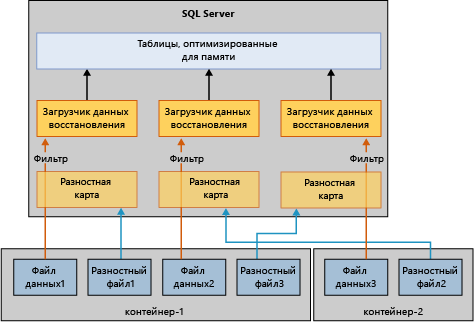

# Восстановление оптимизированных для памяти таблиц
 [!INCLUDE [SQL Server](../../includes/applies-to-version/sqlserver.md)]

Базовый механизм восстановления баз данных с оптимизированными для памяти таблицами в основном такой же, как механизм восстановления баз, использующих только таблицы на диске. Но в отличие от дисковых таблиц, оптимизированные для памяти таблицы необходимо загрузить в память, прежде чем они станут доступны пользователям. В связи с этим требованием возникает новый этап при восстановлении баз данных.  
  
Если доступной памяти на сервере недостаточно, восстановление базы данных завершится сбоем и эта база будет помечена как подозрительная. Решение этой проблемы см. в статье [Устранение проблем нехватки памяти](resolve-out-of-memory-issues.md). 
  
## Факторы, влияющие на время загрузки
Во время операций восстановления подсистема OLTP в памяти считывает файлы данных и разностные файлы для загрузки в физическую память. Время загрузки определяется следующими факторами:  
  
-   объем данных для загрузки;  
  
-   пропускная способность операций последовательного ввода-вывода;  
  
-   степень параллелизма, определяемая числом файловых контейнеров и процессорных ядер;  
  
-   количество записей в активной части журнала, которые необходимо перезаписать.  

## Этапы восстановления
При перезапуске [!INCLUDE[ssNoVersion](../../includes/ssnoversion-md.md)] для каждой базы данных выполняется процесс восстановления, включающий три этапа.  
  
1.  **Анализ**. На этом этапе в активных журналах транзакций выполняется поиск зафиксированных и незафиксированных транзакций. Модуль In-Memory OLTP определяет контрольную точку для загрузки и выполняет предварительную загрузку соответствующих записей журналов системных таблиц. Этот модуль также обрабатывает некоторые записи журнала распределения файлов.  
  
2.  **Повтор**. Эта фаза выполняется одновременно с таблицами на диске и с таблицами, оптимизированными для памяти.  
  
    - Для дисковых таблиц база данных перемещается в текущий момент времени и в ней настраиваются блокировки для незафиксированных транзакций.  
  
    - Для таблиц, оптимизированных для памяти, данные из пар разностных файлов и данных загружаются в память. Затем данные обновляются с помощью активного журнала транзакций на основе последней устойчивой контрольной точки.  
  
    Когда вышеописанные операции с дисковыми и оптимизированными для памяти таблицами будут выполнены, база данных станет доступна для использования.  
  
3.  **Откат**. В этой фазе выполняется откат незафиксированных транзакций.  

## Сокращение времени загрузки
Загрузка в память таблиц, оптимизированных для памяти, может повлиять на производительность целевого времени восстановления (RTO). Чтобы сократить время загрузки оптимизированных для памяти данных из файлов данных и разностных файлов, модуль In-Memory OLTP загружает данные и разностные параллельно следующим образом.  
  
-   **Создание фильтра сопоставления разностных файлов**. Хранилище разностных файлов ссылается на удаленные строки. Один поток на контейнер считывает разностные файлы и создает фильтр сопоставления данных. (Группа файлов данных, оптимизированная для памяти, может содержать контейнер или множество контейнеров.)  
  
-   **Потоковая передача файлов данных**. После создания фильтра сопоставления разностных файлов выполняется считывание файлов данных, причем число потоков соответствует числу логических процессоров. Каждый поток считывает строки данных, проверяет связанное сопоставление разностных файлов и вставляет строку в таблицу только в том случае, если эта строка не была помечена как удаленная. В некоторых случаях эта часть процесса восстановления может быть ограничена ресурсами ЦП, как показано на следующей схеме.  
  
      
  
## Конкретные случаи медленной загрузки
Таблицы, оптимизированные для памяти, обычно можно загрузить в память со скоростью операций ввода-вывода, но иногда скорость загрузки строк данных в память снижается. Особые случаи:  
  
-   Малое число контейнеров для хэш-индекса может привести к конфликту наложения, что снижает скорость операций вставки строк данных. Обычно это приводит к большой нагрузке на ЦП в течение всего процесса восстановления и особенно на последних этапах. Если хэш-индекс настроен правильно, он не должен влиять на время восстановления.  
  
-   Большие оптимизированные для памяти таблицы с одним некластеризованным индексам или несколькими могут вызвать высокую загрузку ЦП. В отличие от хэш-индексов, в которых число контейнеров определяется во время создания, некластеризованные индексы увеличиваются динамически.  
  
## См. также раздел  
 [Резервное копирование и восстановление оптимизированных для памяти таблиц](https://msdn.microsoft.com/library/3f083347-0fbb-4b19-a6fb-1818d545e281)  
  
  
