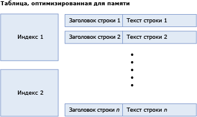
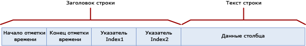
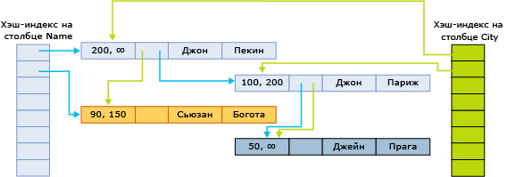

# <a name="table-and-row-size-in-memory-optimized-tables"></a>Размер строк и таблицы для таблиц, оптимизированных для памяти
[!INCLUDE[tsql-appliesto-ss2016-asdb-xxxx-xxx_md](../../includes/tsql-appliesto-ss2016-asdb-xxxx-xxx-md.md)]

  Таблица, оптимизированная для памяти, представляет собой набор строк, а также индексов, которые содержат указатели на строки. В таблице с оптимизацией для памяти данные в строках не могут быть длиннее 8060 байт. Однако, начиная с версии [!INCLUDE[ssSQL15](../../includes/sssql15-md.md)] , появилась возможность создавать таблицы с несколькими большими столбцами (например, несколькими столбцами varbinary(8000)) и столбцами LOB (т. е. varbinary(max), varchar(max) и nvarchar(max)). Столбцы, превышающие максимальный размер данных в строке, размещаются вне строки в специальных внутренних таблицах. Дополнительные сведения об этих внутренних таблицах см. в статьях [sys.memory_optimized_tables_internal_attributes (Transact-SQL)](../../relational-databases/system-catalog-views/sys-memory-optimized-tables-internal-attributes-transact-sql.md).
  
 Существуют две причины для вычисления размера таблиц и строк.  
  
-   Какой объем памяти используется таблицей?  
  
    -   Объем используемой таблицей памяти невозможно подсчитать точно. На объем используемой памяти влияет множество факторов. Это такие факторы, как постраничное выделение места в памяти, размещение, кэширование и заполнение. Кроме того, несколько версий строк, которые имеют активные связанные транзакции либо ожидают сборку мусора.  
  
    -   Минимальный размер, необходимый для данных и индексов в таблице, определяется вычислением для [размера таблицы], о котором рассказывается ниже.  
  
    -   Вычисление используемой памяти в самом лучшем случае может быть выполнено лишь приближенно, поэтому рекомендуется включить планирование вместимости в планы разработки.  
  
-   Каков размер строки данных, и укладывается ли он в ограничение размера строки 8060 байт? Чтобы получить ответ на эти вопросы, используйте вычисление для [размера текста строки], о котором рассказывается ниже.  

Столбцы, превышающие максимальный размер строки в 8060 байт, размещаются вне строки в специальной внутренней таблице. У каждого такого столбца имеется соответствующая внутренняя таблица, которая, в свою очередь, имеет один некластеризованный индекс. Дополнительные сведения о внутренних таблицах см. в статье [sys.memory_optimized_tables_internal_attributes (Transact-SQL)](../../relational-databases/system-catalog-views/sys-memory-optimized-tables-internal-attributes-transact-sql.md). 
  
 На следующей схеме показана таблица с индексами и строками, которые в свою очередь содержат заголовки и текст:  
  
   
Таблица, оптимизированная для памяти, состоящая из индексов и строк.  
  
 Размер, занимаемый таблицей в памяти (в байтах) вычисляется следующим образом.  
  
```  
[table size] = [size of index 1] + … + [size of index n] + ([row size] * [row count])  
```  
  
 Размер хэш-индекса фиксируется на момент создания таблицы и зависит от фактического числа контейнеров. Значение bucket_count, указанное спецификацией индекса, округляется в сторону увеличения до ближайшей степени числа 2 для получения [фактического числа контейнеров]. Например, если заданное число bucket_count равно 100000, то [фактическое число контейнеров] для индекса составляет 131072.  
  
```  
[hash index size] = 8 * [actual bucket count]  
```  

 Размер некластеризованного индекса определяется в `[row count] * [index key size]`.
  
 Размер строки вычисляется путем сложения значений для заголовка и текста:  
  
```  
[row size] = [row header size] + [actual row body size]  
[row header size] = 24 + 8 * [number of indices]  
```  
  
 **Размер текста строки**  
  
 Вычисление [размера текста строки] демонстрируется в следующей таблице.  
  
 Размер текста строки вычисляется двумя способами: вычисляемый размер и фактический размер.  
  
-   Вычисляемый размер, далее [вычисляемый размер строки текста], используется для того, чтобы определить, не превышает ли размер строки ограничение в 8060 байт.  
  
-   Фактический размер, далее [фактический размер строки текста], представляет собой фактический размер хранилища текста строки в памяти и в файле контрольных точек.  
  
 Оба показателя [вычисляемый размер строки текста] и [фактический размер строки текста] вычисляются аналогичным образом. Отличается только вычисление размера столбцов (n)varchar(I) и столбцов varbinary (I), как показано в нижней части таблицы. Вычисляемый размер строки использует в качестве размера столбца декларируемый размер *i* , тогда как фактический размер строки использует фактический размер данных.  
  
 В следующей таблице описано вычисление размера текста строки как [фактический размер текста строки] = SUM([размер мелких типов]) + 2 + 2 * [число столбцов глубокого типа].  
  
|Раздел|Размер|Комментарии|  
|-------------|----------|--------------|  
|Столбцы поверхностных типов|SUM [размер поверхностных типов] Размер отдельных типов в байтах:<br /><br /> **Bit**: 1<br /><br /> **Tinyint**: 1<br /><br /> **Smallint**: 2<br /><br /> **Int**: 4<br /><br /> **Real**: 4<br /><br /> **Smalldatetime**: 4<br /><br /> **Smallmoney**: 4<br /><br /> **Bigint**: 8<br /><br /> **Datetime**: 8<br /><br /> **Datetime2**: 8<br /><br /> **Float**: 8<br /><br /> **Money**: 8<br /><br /> **Numeric** (точность <=18): 8<br /><br /> **Time**: 8<br /><br /> **Numeric**(точность>18): 16<br /><br /> **Uniqueidentifier**: 16||  
|Заполнение столбца поверхностного типа|Возможны следующие значения:<br /><br /> 1, если в таблице присутствуют столбцы глубоких типов, а общий размер данных в столбцах поверхностного типа является нечетным числом.<br /><br /> 0 в остальных случаях|Глубокие типы — это типы (var)binary и (n)(var)char.|  
|Массив смещений для столбцов глубоких типов|Возможны следующие значения:<br /><br /> 0, если в таблице нет столбцов глубоких типов<br /><br /> 2 + 2 * [количество столбцов глубоких типов] во всех остальных случаях|Глубокие типы — это типы (var)binary и (n)(var)char.|  
|Массив значений NULL|[количество столбцов, в которых допустимы значения NULL] / 8, с округлением в сторону увеличения до целого числа байт.|Массив содержит один бит для каждого столбца, допускающего значения NULL. Эта величина округляется в сторону увеличения до целого числа байт.|  
|Заполнение массива значений NULL|Возможны следующие значения:<br /><br /> 1, если в таблице имеются столбцы глубоких типов данных и размер массива значений NULL равен нечетному числу байтов.<br /><br /> 0 в остальных случаях|Глубокие типы — это типы (var)binary и (n)(var)char.|  
|Заполнение|Если в таблице нет столбцов глубоких типов: 0<br /><br /> Если есть столбцы глубоких типов данных, добавляется 0–7 байт заполнения, исходя из наибольшего выравнивания, требующегося для столбцов поверхностных данных. Каждый столбец поверхностных типов требует выравнивания, равного его размеру (как показано в документе выше), за исключением столбцов GUID, которые требуют выравнивания на 1 байт (а не на 16), и числовых столбцов, которые всегда требуют выравнивания 8 байт (ни в коем случае не 16). Используется наибольшее требование выравнивания среди всех столбцов поверхностных типов, и заполнение 0–7 байт добавляется таким образом, чтобы общий размер на этот момент (без столбцов глубоких типов) был кратным числу необходимых выравниваний.|Глубокие типы — это типы (var)binary и (n)(var)char.|  
|Столбцы глубоких типов фиксированной длины|SUM ([размер столбцов глубоких типов фиксированной длины])<br /><br /> Размер каждого столбца составляет:<br /><br /> i для типов char(i) и binary(i).<br /><br /> 2 * i для типа nchar(i)|Столбцы глубоких типов данных фиксированной длины — это столбцы типов char(i), nchar(i) или binary(i).|  
|Столбцы глубоких типов данных переменной длины [вычисляемый размер]|SUM([вычисляемый размер столбцов глубоких типов данных переменной длины])<br /><br /> вычисляемый размер каждого столбца составляет:<br /><br /> i для типов varchar(i) и varbinary(i)<br /><br /> 2 * i для типа nvarchar(i)|Эта строка применяется только к [вычисляемому размеру текста строки]<br /><br /> Столбцы глубоких типов переменной длины — это столбцы типов varchar(i), nvarchar(i) или varbinary(i). вычисляемый размер определяется максимальной длиной (i) столбца.|  
|Столбцы глубоких типов данных переменной длины [фактический размер]|SUM([фактический размер столбцов глубоких типов данных переменной длины])<br /><br /> Фактический размер каждого столбца составляет:<br /><br /> n, где n — количество символов, хранящихся в столбце, для типа varchar(i).<br /><br /> 2 * n, где n — количество символов, хранящихся в столбце, для типа nvarchar(i).<br /><br /> n, где n — число байтов, хранящихся в столбце, для типа varbinary(i).|Эта строка применяется только к [фактическому размеру текста строки].<br /><br /> Фактический размер определяется данными, которые хранятся в столбцах в данной строке.|  
  
##  <a name="bkmk_RowStructure"></a> Структура строки  
 Строки в таблице, оптимизированной для памяти, включают следующие компоненты.  
  
-   Заголовок строки содержит метку времени, необходимую для управления версиями строки. Заголовок строки также содержит указатель индекса, который позволяет реализовать цепочку строк в хэш-контейнере (описано выше).  
  
-   Текст строки содержит фактические данные столбцов, которые включают некоторые вспомогательные сведения, такие как массив значений NULL для столбцов, допускающих значение NULL, и массив смещений для типов данных с переменной длиной.  
  
 На следующем рисунке показана структура строк для таблицы с двумя индексами.  
  
   
  
 Метки времени начала и конца показывают период, в котором определенная версия строки является допустимой. Транзакции, запускаемые в данном интервале, могут видеть эту версию строки. Дополнительные сведения см. в разделе [Транзакции с таблицами, оптимизированными для памяти](../../relational-databases/in-memory-oltp/transactions-with-memory-optimized-tables.md).  
  
 Указатели индекса указывают на следующую строку в цепочке, принадлежащей хэш-контейнеру. На следующем рисунке показана структура таблицы с двумя столбцами (имя, город) и двумя индексами, один для столбца name и второй для столбца city.  
  
   
  
 На этом рисунке имена Джон и Джейн хэшированы на первый контейнер. Сьюзан хэширована на втором контейнере. Города Пекин и Богота хэшированы на первом контейнере. Париж и Прага хэшированы на втором контейнере.  
  
 Таким образом, цепочки для хэш-индекса по именам выглядят следующим образом.  
  
-   Первый контейнер: (Джон, Пекин); (Джон, Париж); (Джейн, Прага)  
  
-   Второй контейнер: (Сьюзан, Богота)  
  
 Цепочки для индекса по городам выглядят следующим образом:  
  
-   Первый контейнер: (Джон Пекин), (Сьюзан, Богота)  
  
-   Второй контейнер: (Джон, Пекин); (Джон, Париж); (Джейн, Прага)  
  
 Конечная метка времени ∞ (бесконечность) указывает, что это действительная на данный момент версия строки. Строка была обновлена или удалена с того момента, как была записана эта версия.  
  
 Для времени больше 200 таблица содержит следующие строки.  
  
|Название|Город|  
|----------|----------|  
|Джон|Пекин|  
|Джейн|Прага|  
  
 Однако любая активная транзакция с начальным временем 100 увидит следующую версию таблицы.  
  
|Название|Город|  
|----------|----------|  
|Джон|Париж|  
|Джейн|Прага|  
|Сьюзан|Богота|  
  
##  <a name="bkmk_ExampleComputation"></a> Пример: вычисление размера строки и таблицы  
 Для хэш-индекса фактическое число контейнеров округляется в сторону увеличения до ближайшей степени числа 2. Например, если заданное число bucket_count равно 100000, то фактическое число контейнеров для индекса составляет 131072.  
  
 Рассмотрим таблицу Orders со следующим определением:  
  
```tsql  
CREATE TABLE dbo.Orders (  
     OrderID int NOT NULL   
           PRIMARY KEY NONCLUSTERED,  
     CustomerID int NOT NULL   
           INDEX IX_CustomerID HASH WITH (BUCKET_COUNT=10000),  
     OrderDate datetime NOT NULL,  
     OrderDescription nvarchar(1000)  
) WITH (MEMORY_OPTIMIZED=ON)  
GO  
```  
  
 Обратите внимание, что эта таблица содержит один хэш-индекс и некластеризованный индекс (первичный ключ). Кроме того, она содержит три столбца фиксированной длины и один столбец переменной длины, при этом один из столбцов допускает значения NULL (OrderDescription). Допустим, таблица Orders содержит 8379 строк, а средняя длина значений в столбце OrderDescription составляет 78 символов.  
  
 Чтобы определить размер таблицы, сначала необходимо определить размер индексов. Для обоих индексов указан показатель bucket_count, равный 10 000. Эта величина округляется в сторону увеличения до ближайшей степени числа 2: 16 384. Поэтому общий размер индексов для таблицы Orders составляет:  
  
```  
8 * 16384 = 131072 bytes  
```  
  
 Остается найти размер данных таблицы, который равен  
  
```  
[row size] * [row count] = [row size] * 8379  
```  
  
 (Пример таблицы содержит 8379 строк.) Теперь у нас есть:  
  
```  
[row size] = [row header size] + [actual row body size]  
[row header size] = 24 + 8 * [number of indices] = 24 + 8 * 1 = 32 bytes  
```  
  
 Теперь давайте рассчитаем [фактический размер текста строки].  
  
-   Столбцы поверхностных типов:  
  
    ```  
    SUM([size of shallow types]) = 4 [int] + 4 [int] + 8 [datetime] = 16  
    ```  
  
-   Заполнение для столбцов поверхностных типов равно 0, поскольку общий размер столбцов поверхностного типа является четным числом.  
  
-   Массив смещений для столбцов глубоких типов:  
  
    ```  
    2 + 2 * [number of deep type columns] = 2 + 2 * 1 = 4  
    ```  
  
-   Массив значений NULL = 1  
  
-   Заполнение массива значений NULL = 1, так как размер массива значений NULL является нечетным числом, а в таблице есть столбцы глубоких типов.  
  
-   Заполнение  
  
    -   8 — наибольшее требования выравнивания.  
  
    -   Размер на данный момент равен 16 + 0 + 4 + 1 + 1 = 22.  
  
    -   Ближайшее число, кратное 8, — это 24.  
  
    -   В итоге заполнение составляет 24 – 22 = 2 байта.  
  
-   В таблице нет столбцов глубоких типов переменной длины (столбцов глубоких типов фиксированной длины: 0).  
  
-   Фактический размер столбца глубокого типа составляет 2 * 78 = 156. Единственный столбец глубокого типа OrderDescription имеет тип nvarchar.  
  
```  
[actual row body size] = 24 + 156 = 180 bytes  
```  
  
 Для завершения вычисления:  
  
```  
[row size] = 32 + 180 = 212 bytes  
[table size] = 8 * 16384 + 212 * 8379 = 131072 + 1776348 = 1907420  
```  
  
 Таким образом, общий размер, занимаемый таблицей в памяти, составляет около 2 мегабайт. Это значение не учитывает потенциальные издержки при выделении памяти, а также управление версиями строк, необходимое для доступа транзакций к этой таблице.  
  
 Фактический размер памяти, выделяемый для данной таблицы и используемый ею и ее индексами, можно получить при помощи следующего запроса:  
  
```tsql  
select * from sys.dm_db_xtp_table_memory_stats  
where object_id = object_id('dbo.Orders')  
```  
  
## <a name="see-also"></a>См. также:  
 [Таблицы, оптимизированные для памяти](../../relational-databases/in-memory-oltp/memory-optimized-tables.md)  
  
  
