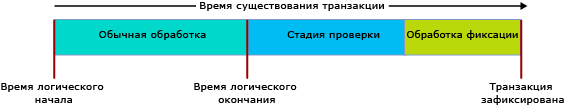

# <a name="transactions-with-memory-optimized-tables"></a>Транзакции с таблицами, оптимизированными для памяти
[!INCLUDE [SQL Server Azure SQL Database](../../includes/applies-to-version/sql-asdb.md)]

В этой статье описаны все аспекты транзакций с таблицами, оптимизированными для памяти, и хранимыми процедурами, скомпилированными в коде.  
  
Уровни изоляции транзакций в SQL Server применяются к таблицам, оптимизированным для памяти, и к таблицам на жестком диске по-разному, с использованием разных базовых механизмов. Понимание различий помогает программисту проектировать систему с высокой пропускной способностью. В любом случае необходимо обеспечить целостность транзакций.  

Описание условий ошибок, относящихся к транзакциям в таблицах, оптимизированных для памяти, см. в разделе [Обнаружение конфликтов и логика повторных попыток](#conflict-detection-and-retry-logic).
  
Общие сведения см. в разделе [SET TRANSACTION ISOLATION LEVEL (Transact-SQL)](../../t-sql/statements/set-transaction-isolation-level-transact-sql.md).  
  
## <a name="pessimistic-versus-optimistic"></a>Различия между пессимистичным и оптимистичным подходами  
  
Функциональные различия зависят от пессимистичного или оптимистичного подхода к целостности транзакций. В таблицах, оптимизированных для памяти, используется оптимистичный подход:  
  
- При пессимистичном подходе возможные конфликты блокируются прежде, чем они возникнут. Система блокируется при выполнении инструкции и разблокируется, как только транзакция зафиксирована.  
  
- В оптимистичном сценарии система обнаруживает конфликты сразу и проводит проверки во время фиксации.  
  - В таблицах, оптимизированных для памяти, может возникать ошибка 1205, взаимоблокировка.  
  
Оптимистичный подход требует меньше ресурсов и обычно более эффективен. Отчасти это связано с тем, что в большинстве приложений конфликты транзакций встречаются редко. Основное функциональное различие между пессимистическим и оптимистическим сценариями заключается в том, что если происходит конфликт, в пессимистическом сценарии нужно ждать, а в оптимистическом сценарии клиент должен повторить попытку выполнить транзакцию, которая завершается сбоем. Функциональные различия увеличиваются, если действует уровень изоляции REPEATABLE READ, и достигают максимума на уровне SERIALIZABLE.  
  
## <a name="transaction-initiation-modes"></a>Режимы инициации транзакций  
  
SQL Server имеет следующие режимы запуска транзакций.  
  
- **Автоматическая фиксация** . Начало простого запроса или инструкция DML неявно открывает транзакцию, а окончание инструкции неявно фиксирует эту транзакцию. **Автофиксация** используется по умолчанию.  
  - В режиме автоматической фиксации обычно не требуется добавлять в условие FROM код табличного указания об уровне изоляции транзакции для таблицы, оптимизированной для памяти.  
  
- **Явный** . Transact-SQL содержит код BEGIN TRANSACTION и может содержать код COMMIT TRANSACTION. В одной и той же транзакции могут одновременно выполняться сразу несколько инструкций.  
  - В явном режиме необходимо использовать параметр базы данных MEMORY_OPTIMIZED_ELEVATE_TO_SNAPSHOT или создать код табличного указания об уровне изоляции транзакции для таблицы, оптимизированной для памяти, в предложении FROM.  
  
- **Неявный** . Активен, пока действует код SET IMPLICIT_TRANSACTION ON. Возможно, лучше подошло бы имя IMPLICIT_BEGIN_TRANSACTION, поскольку единственная задача этого параметра — неявное выполнение действий, аналогичных явной процедуре BEGIN TRANSACTION, перед каждой инструкцией UPDATE, если 0 = @@trancount. Таким образом, в конечном итоге именно ваш код T-SQL выдает явный код COMMIT TRANSACTION.   
  
- **Блок ATOMIC** — все инструкции в блоках ATOMIC (атомарных блоках) всегда выполняются в рамках одной транзакции. При успешном выполнении фиксируются все действия атомарного блока, а при сбое все его действия откатываются. Использовать блок ATOMIC обязательно для всех хранимых процедур, скомпилированных в собственном коде.  
  
### <a name="code-example-with-explicit-mode"></a>Пример кода в режиме Explicit  
  
В следующем интерпретированном сценарии Transact-SQL используется следующее:  
  
- Явная транзакция.
- Таблица, оптимизированная для памяти, с именем dbo.Order_mo.
- Контекст для уровня изоляции транзакции READ COMMITTED.  
  
В связи с этим в таблице, оптимизированной для памяти, должно присутствовать табличное указание. Оно должно вводить уровень изоляции SNAPSHOT или более высокий. В примера кода используется указание WITH (SNAPSHOT). Если оно удаляется, сценарий выдает ошибку 41368, при которой автоматическая повторная попытка недопустима:  

#### <a name="error-41368"></a>Ошибка 41368

Доступ к оптимизированным для памяти таблицам с уровнем изоляции READ COMMITTED поддерживается только для транзакций с автоматической фиксацией. Он не поддерживается для явных или неявных транзакций. Обеспечьте поддерживаемый уровень изоляции для оптимизированной для памяти таблицы с помощью табличного указания, например WITH (SNAPSHOT).

```sql
SET TRANSACTION ISOLATION LEVEL READ COMMITTED;  
GO  

BEGIN TRANSACTION;  -- Explicit transaction.  

-- Order_mo  is a memory-optimized table.  
SELECT * FROM  
           dbo.Order_mo  as o  WITH (SNAPSHOT)  -- Table hint.  
      JOIN dbo.Customer  as c  on c.CustomerId = o.CustomerId;  
COMMIT TRANSACTION;
```

Вы можете обойтись без указания `WITH (SNAPSHOT)`. Для этого используйте параметр базы данных `MEMORY_OPTIMIZED_ELEVATE_TO_SNAPSHOT`. Если этот параметр имеет значение `ON`, уровень изоляции доступа к таблице, оптимизированной для памяти, автоматически повышается до уровня изоляции SNAPSHOT.  

```sql
ALTER DATABASE CURRENT
    SET MEMORY_OPTIMIZED_ELEVATE_TO_SNAPSHOT = ON;
```

## <a name="row-versioning"></a>Управление версиями строк  
  
В таблицах, оптимизированных для памяти, используется сложная система управления версиями, которая обеспечивает эффективность оптимистичного подхода даже на самом строгом уровне изоляции SERIALIZABLE. Дополнительные сведения см. в разделе [Введение в таблицы, оптимизированные для памяти](../../relational-databases/in-memory-oltp/introduction-to-memory-optimized-tables.md).  
  
Таблицы на жестком диске косвенно используют систему управления версиями строк, если применяется уровень изоляции READ_COMMITTED_SNAPSHOT или SNAPSHOT. Эта система основана на применении tempdb. А в структурах данных, оптимизированных для памяти, для большей эффективности используются встроенные механизмы.  
  
## <a name="isolation-levels"></a>Уровни изоляции 
  
В следующей таблице перечислены возможные уровни изоляции транзакций в порядке увеличения степени изоляции. Сведения о возможных конфликтах и логике повторных попыток, позволяющей разрешить эти конфликты, см. в разделе [Обнаружение конфликтов и логика повторных попыток](#conflict-detection-and-retry-logic). 
  
| Уровень изоляции | Описание |   
| :-- | :-- |   
| READ UNCOMMITTED | Недоступно: таблицы, оптимизированные для памяти, недоступны при использовании изоляции Read Uncommitted. Доступ к таблицам, оптимизированным для памяти, можно получить при использовании изоляции SNAPSHOT, если уровень изоляции TRANSACTION ISOLATION LEVEL сеанса имеет значение READ UNCOMMITTED. Для этого нужно воспользоваться табличным указанием WITH (SNAPSHOT) или задать для параметра MEMORY_OPTIMIZED_ELEVATE_TO_SNAPSHOT базы данных значение ON. | 
| READ COMMITTED | Поддерживается для таблиц, оптимизированных для памяти, только если действует режим автоматической фиксации. Доступ к таблицам, оптимизированным для памяти, можно получить при использовании изоляции SNAPSHOT, если уровень изоляции TRANSACTION ISOLATION LEVEL сеанса имеет значение READ COMMITTED. Для этого нужно воспользоваться табличным указанием WITH (SNAPSHOT) или задать для параметра MEMORY_OPTIMIZED_ELEVATE_TO_SNAPSHOT базы данных значение ON.<br/><br/>Если параметр базы данных READ_COMMITTED_SNAPSHOT имеет значение ON, при использовании уровня изоляции READ COMMITTED вы не сможете в одной инструкции одновременно получать доступ и к дисковой таблице, и к таблице, оптимизированной для памяти. |  
| SNAPSHOT | Поддерживается для таблиц, оптимизированных для памяти. <br/><br/> Внутри системы SNAPSHOT — это наименее требовательный уровень изоляции транзакций для таблиц, оптимизированных для памяти. <br/><br/> На уровне SNAPSHOT используется меньше системных ресурсов, чем на уровне REPEATABLE READ или SERIALIZABLE. |  
| REPEATABLE READ | Поддерживается для таблиц, оптимизированных для памяти. Гарантии, предоставляемые изоляцией REPEATABLE READ, заключаются в том, что во время фиксации ни одна из параллельных транзакций не может обновить никакие строки, считываемые этой транзакцией. <br/><br/> Из-за наличия оптимистичной модели параллельным транзакциям не запрещается обновлять строки, считываемые этой транзакцией. Во время фиксации эта транзакция проверила, что изоляция REPEATABLE READ не нарушена. В противном случае выполняется откат транзакции, ее необходимо повторить. | 
| SERIALIZABLE | Поддерживается для таблиц, оптимизированных для памяти. <br/><br/> Уровень называется *SERIALIZABLE* , поскольку создает такую строгую изоляцию, что транзакции выполняются скорее по очереди, чем одновременно. | 

## <a name="transaction-phases-and-lifetime"></a>Фазы и время существования транзакций  
  
При работе с таблицей, оптимизированной для памяти, время существования транзакции можно разделить на несколько этапов, как показано на следующей схеме.
  
  
  
Описания фаз приводятся ниже.  
  
#### <a name="regular-processing-phase-1-of-3"></a>Обычная обработка: этап 1 (из 3)  
  
- Этот этап включает выполнение всех запросов и инструкций DML в запросе.  
- На этом этапе инструкции воспринимают версию таблиц, оптимизированных для памяти, в качестве логического времени начала транзакции.  
  
#### <a name="validation-phase-2-of-3"></a>Проверка: этап 2 (из 3)  
  
- Фаза проверки начинается с назначения времени окончания (тем самым транзакция помечается как логически завершенная). При таком завершении все изменения транзакции становятся видимы другим транзакциям, которые от нее зависят. Пока транзакция не зафиксирована, фиксация зависимых транзакций невозможна. Кроме того, транзакции с такими зависимостями не могут возвращать результирующие наборы клиенту. Клиент будет видеть только данные, успешно зафиксированные в базе.  
- Этот этап включает уровни проверку параметров repeatable read и serializable. С уровнем изоляции repeatable read система проверяет наличие изменений в прочитанных транзакцией строках с момента прочтения. При проверке параметра serializable система проверяет, были ли какие-либо строки вставлены в диапазон данных, сканированный этой транзакцией. Согласно таблице в разделе [уровней изоляции и конфликтов](#isolation-levels), проверки repeatable read и serializable могут происходить при использовании изоляции snapshot, чтобы подтвердить соответствие ограничений для уникальных и внешних ключей.  
  
#### <a name="commit-processing-phase-3-of-3"></a>Обработка фиксации: этап 3 (из 3)  
  
- Во время фиксации изменения в надежных таблицах заносятся в журнал, а журнал записывается на диск. Затем управление возвращается клиенту.  
- По окончании фиксации все зависимые транзакции уведомляются о том, что их можно фиксировать.  
  
Как всегда, единицы работы в транзакции должны быть настолько минимальными и краткими, насколько это соответствует требованиям ваших данных.  
  
## <a name="conflict-detection-and-retry-logic"></a>Обнаружение конфликтов и логика повторных попыток 

Существует два типа условий ошибок, связанных с транзакциями, которые приводят к сбою и откату транзакции. В большинстве случаев при возникновении такой ошибки транзакцию необходимо повторить (как при возникновении взаимоблокировки).
- Конфликты между параллельными транзакциями. Это конфликты обновления и сбои проверок. Они могут быть вызваны нарушением уровня изоляции транзакций или нарушением ограничений.
- Сбои зависимости. Они возникают, если транзакция, от которой зависят другие действия, не фиксируется, либо если количество зависимостей становится слишком большим.

Ниже перечислены условия ошибок, которые могут не позволить транзакциям получить доступ к таблицам, оптимизированным для памяти.

| Код ошибки | Описание | Причина |
| :-- | :-- | :-- |
| **41302** | Предпринята попытка обновить строку, которая была обновлена в другой транзакции после запуска текущей транзакции. | Эта ошибка возникает, если две параллельные транзакции попытаются обновить или удалить одну и ту же строку одновременно. Одна из двух транзакций получает это сообщение об ошибке, ее необходимо будет повторить. <br/><br/>  | 
| **41305**| Ошибка проверки операций чтения с возможностью повторения. Строка, прочитанная из оптимизированной для памяти таблицы в этой транзакции, была обновлена другой транзакцией, которая была зафиксирована раньше, чем эта. | Эта ошибка может произойти при использовании изоляции REPEATABLE READ или SERIALIZABLE, а также если действия параллельной транзакции нарушают ограничение FOREIGN KEY. <br/><br/>Нарушение параллельными транзакциями ограничений для внешних ключей происходит редко и, как правило, говорит о проблемах с логикой приложения или с вводом данных. Однако эта ошибка также может произойти, если отсутствует индекс в столбцах, связанных с ограничением FOREIGN KEY. Следовательно, в таблице с оптимизацией для памяти рекомендуется всегда создавать индекс столбцов внешних ключей. <br/><br/> Более подробные сведения о сбоях проверок, вызванных нарушениями внешнего ключа, см. в [этой записи в блоге](/archive/blogs/sqlcat/considerations-around-validation-errors-41305-and-41325-on-memory-optimized-tables-with-foreign-keys) команды консультантов по SQL Server для клиентов. |  
| **41325** | Ошибка сериализуемой проверки. В диапазон, просканированный ранее текущей операцией, вставлена новая строка. Эта строка называется фантомной. | Эта ошибка может произойти при использовании изоляции REPEATABLE READ или SERIALIZABLE, а также если действия параллельной транзакции нарушают ограничение FOREIGN KEY. <br/><br/> Такое нарушение ограничений происходит редко и, как правило, говорит о проблемах с логикой приложения или с вводом данных. Однако как и в случае с ошибками проверки параметра repeatable read, эта ошибка может возникать при присутствии ограничения FOREIGN KEY без индекса по столбцам. |  
| **41301** | Сбой зависимости: была сделана зависимость от другой транзакции, которую впоследствии не удалось зафиксировать. | Эта транзакция (Tx1) оказалась зависимой от другой транзакции (Tx2), в то время как та транзакция (Tx2) находилась на этапе обработки проверки или фиксации, прочитав данные, которые были записаны транзакцией Tx2. Впоследствии фиксация Tx2 завершилась сбоем. Наиболее распространенными причинами сбоя фиксации Tx2 являются сбои проверки параметров repeatable read (41305) и serializable (41325); менее распространенной причиной является сбой ввода-вывода журнала. |
| **41823** и **41840** | Была достигнута квота для пользовательских данных в оптимизированных для памяти таблицах и табличных переменных. | Ошибка 41823 применяется к SQL Server Express, Web и Standard, а также отдельным базам данных в [!INCLUDE[sssdsfull](../../includes/sssdsfull-md.md)]. Ошибка 41840 применяется к эластичным пулам в [!INCLUDE[sssdsfull](../../includes/sssdsfull-md.md)]. <br/><br/> В большинстве случаев эти ошибки указывают на достижение максимального размера пользовательских данных. Эту ошибку можно устранить, удалив данные из таблиц, оптимизированных для памяти. Однако в редких случаях эта ошибка является временной. Поэтому при возникновении подобных ошибок рекомендуется повторить попытку.<br/><br/> Как и другие ошибки в этом списке, ошибки 41823 и 41840 прерывают активную транзакцию. |
| **41839** | Транзакция превышает максимальное число зависимостей фиксаций. |**Область применения**: [!INCLUDE[ssSQL15](../../includes/sssql15-md.md)]. В более поздних версиях [!INCLUDE[ssnoversion](../../includes/ssnoversion-md.md)] и [!INCLUDE[sssdsfull](../../includes/sssdsfull-md.md)] число зависимостей фиксаций не ограничено.<br/><br/> Существует ограничение на число транзакций, от которых может зависеть другая транзакция (Tx1). Такие зависимости называются исходящими. Кроме того, существует ограничение на число транзакций, которые могут зависеть от определенной транзакции (Tx1). Это входящие зависимости. Ограничение в обоих случаях равно 8. <br/><br/> Наиболее распространенная причина этого сбоя — ситуация, когда множество транзакций чтения осуществляет доступ к данным, записанным одной транзакцией записи. Вероятность попадания в эту ситуацию увеличивается, если все транзакции чтения выполняют крупные сканирования одних и тех же данных, а проверка или фиксация транзакции записи занимает много времени, например транзакция записи выполняет крупные сканирования в условиях изоляции serializable (увеличивается продолжительность проверки) или журнал транзакций помещается на устройство с медленным вводом/выводом журнала (увеличивается продолжительность фиксации). Если транзакции чтения сканируют большой объем данных, хотя должны получать доступ лишь к нескольким строкам, возможно, отсутствует какой-то индекс. Аналогично, если транзакция записи использует изоляцию serializable и выполняет крупные сканирования, а ожидается, что она будет осуществлять доступ лишь к небольшому количеству строк, возможно, речь идет об отсутствующем индексе. <br/><br/> Можно увеличить ограничение на число зависимостей фиксации, воспользовавшись флагом трассировки **9926**. Используйте этот флаг трассировки только в том случае, если условие ошибки сохраняется даже после проверки отсутствующих индексов, поскольку именно это может стать причиной сбоев в вышеперечисленных случаях. Следует учитывать также, что сложные графики зависимостей, где у каждой транзакции — большое число входящих и исходящих зависимостей, и отдельные транзакции, которые имеют множество уровней зависимостей, могут стать причиной неэффективной работы системы.  |
  
### <a name="retry-logic"></a>Логика повторных попыток 

Если транзакция дает сбой из-за одного из вышеупомянутых условий, следует повторить транзакцию.
  
Логика повторных попыток может быть реализована как на стороне клиента, так и на стороне сервера. Общая рекомендация заключается в том, что нужно реализовать логику повторных попыток на стороне клиента, это более эффективно и позволяет работать с наборами результатов, возвращаемыми транзакцией, прежде чем произойдет сбой.  
  
#### <a name="retry-t-sql-code-example"></a>Пример кода повторной попытки T-SQL  
  
Логику повторных попыток на стороне сервера с использованием T-SQL следует применять только для транзакций, которые не возвращают результирующие наборы клиенту. В противном случае повторные попытки могут вернуть клиенту дополнительные результирующие наборы, помимо ожидаемых.  
  
Следующий интерпретированный сценарий T-SQL показывает, как может выглядеть логика повторных попыток для устранения ошибок, связанных с конфликтами транзакций в оптимизированных для памяти таблицах.

```sql
-- Retry logic, in Transact-SQL.
DROP PROCEDURE If Exists usp_update_salesorder_dates;
GO

CREATE PROCEDURE usp_update_salesorder_dates
AS
BEGIN
    DECLARE @retry INT = 10;

    WHILE (@retry > 0)
    BEGIN
        BEGIN TRY
            BEGIN TRANSACTION;

            UPDATE dbo.SalesOrder_mo WITH (SNAPSHOT)
                set OrderDate = GetUtcDate()
                where CustomerId = 42;

            UPDATE dbo.SalesOrder_mo WITH (SNAPSHOT)
                set OrderDate = GetUtcDate()
                where CustomerId = 43;

            COMMIT TRANSACTION;

            SET @retry = 0;  -- //Stops the loop.
        END TRY

        BEGIN CATCH
            SET @retry -= 1;

            IF (@retry > 0 AND
                ERROR_NUMBER() in (41302, 41305, 41325, 41301, 41823, 41840, 41839, 1205)
                )
            BEGIN
                IF XACT_STATE() = -1
                    ROLLBACK TRANSACTION;

                WAITFOR DELAY '00:00:00.001';
            END
            ELSE
            BEGIN
                PRINT 'Suffered an error for which Retry is inappropriate.';
                THROW;
            END
        END CATCH

    END -- //While loop
END;
GO

--  EXECUTE usp_update_salesorder_dates;
```

## <a name="cross-container-transaction"></a>Транзакция между контейнерами  
  
Транзакция называется транзакцией между контейнерами, если она:  
  
- обращается к таблице, оптимизированной для памяти, из интерпретированного Transact-SQL; или  
- выполняет хранимую процедуру, скомпилированную в собственном коде, если транзакция уже открыта (XACT_STATE() = 1). 

Использование термина "между контейнерами" обусловлено тем, что транзакция выполняется между двумя контейнерами по управлению транзакциями (один — для дисковых таблиц, а другой — для таблиц, оптимизированных для памяти).  
  
В рамках одной транзакции между контейнерами можно использовать разные уровни изоляции для доступа к дисковым таблицам и таблицам, оптимизированным для памяти. Это различие выражено через явные табличные указания, такие как WITH (SERIALIZABLE) или через параметр базы данных MEMORY_OPTIMIZED_ELEVATE_TO_SNAPSHOT, который неявно повышает уровень изоляции для оптимизированной для памяти таблицы до снимка, если TRANSACTION ISOLATION LEVEL имеет значение READ COMMITTED или READ UNCOMMITTED.  
  
В следующем примере кода Transact-SQL:  
  
- Доступ к дисковой таблице Table_D1 осуществляется с использованием уровня изоляции READ COMMITTED.  
- Доступ к оптимизированной для памяти таблице Table_MO7 осуществляется с использованием уровня изоляции SERIALIZABLE. Table_MO6 не имеет определенного уровня изоляции, поскольку вставляемые элементы отличаются единообразием и выполняются в основном с изоляцией serializable.  


```sql
-- Different isolation levels for
-- disk-based tables versus memory-optimized tables,
-- within one explicit transaction.

SET TRANSACTION ISOLATION LEVEL READ COMMITTED;
go

BEGIN TRANSACTION;

    -- Table_D1 is a traditional disk-based table, accessed using READ COMMITTED isolation.

    SELECT * FROM Table_D1;


    -- Table_MO6 and Table_MO7 are memory-optimized tables.
    -- Table_MO7 is accessed using SERIALIZABLE isolation,
    --   while Table_MO6 does not have a specific isolation level.

    INSERT Table_MO6
        SELECT * FROM Table_MO7 WITH (SERIALIZABLE);

COMMIT TRANSACTION;
go
```

## <a name="limitations"></a>Ограничения  
  
- Транзакции между базами данных не поддерживаются с таблицами, оптимизированными для памяти. Если транзакция обращается к таблице, оптимизированной для памяти, она не может получить доступ ни к одной базе данных, кроме следующих:  
  - база данных tempdb;  
  - база данных master, доступная только для чтения.  
  
- Распределенные транзакции не поддерживаются. Если используется уровень BEGIN DISTRIBUTED TRANSACTION, транзакция не может получить доступ к таблице, оптимизированной для памяти.  
  
## <a name="natively-compiled-stored-procedures"></a>скомпилированные в собственном коде хранимые процедуры  
  
- В хранимой процедуре, скомпилированной в собственном коде, атомарный блок должен объявить уровень изоляции транзакций для всего блока, например:  
  - `... BEGIN ATOMIC WITH (TRANSACTION ISOLATION LEVEL = SNAPSHOT, ...) ...`  
  
- В хранимой процедуре, скомпилированной в собственном коде, нельзя использовать явные инструкции управления транзакциями. BEGIN TRANSACTION и ROLLBACK TRANSACTION и т. д. запрещены.  
  
- Дополнительные сведения о контроле над транзакциями с блоками ATOMIC см. в разделе [Блоки ATOMIC](atomic-blocks-in-native-procedures.md)  
  
## <a name="other-transaction-links"></a>Другие ссылки по транзакциям  
  
- [SET IMPLICIT_TRANSACTIONS](../../t-sql/statements/set-implicit-transactions-transact-sql.md)  
  
- [sp_getapplock (Transact-SQL)](../../relational-databases/system-stored-procedures/sp-getapplock-transact-sql.md)  
  
- [Уровни изоляции, основанные на управлении версиями строк, в компоненте Database Engine](/previous-versions/sql/sql-server-2008-r2/ms177404(v=sql.105))  
  
- [Управление устойчивостью транзакций](../../relational-databases/logs/control-transaction-durability.md)