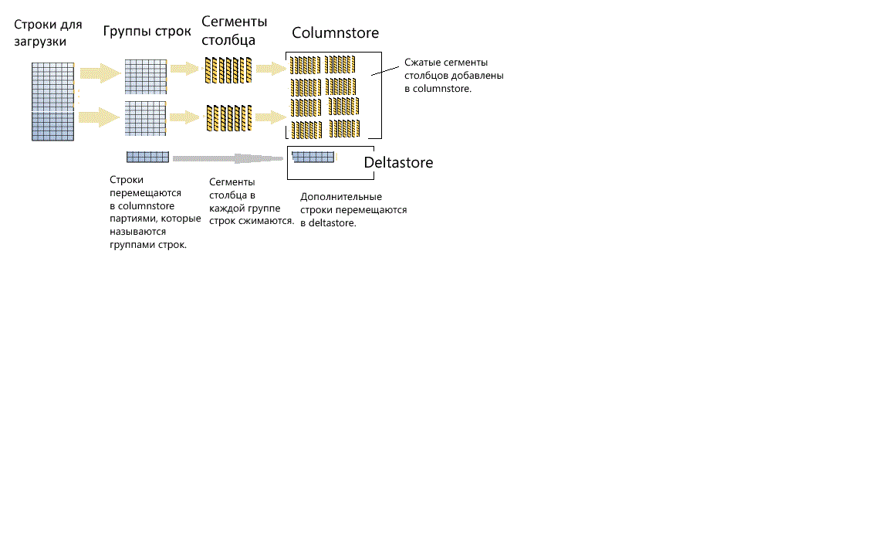

# <a name="columnstore-indexes---data-loading-guidance"></a>Индексы columnstore. Руководство по загрузке данных
[!INCLUDE[appliesto-ss-asdb-asdw-pdw-md](../../includes/appliesto-ss-asdb-asdw-pdw-md.md)]

Рекомендации и параметры для загрузки данных в индексы columnstore с помощью стандартных методов массовой загрузки и тонкой вставки SQL. Загрузка данных в индекс columnstore является неотъемлемой частью любого процесса хранения данных, так как данные перемещаются в индекс при подготовке к анализу.
  
 Незнакомы с индексами columnstore? См. статьи, посвященные [обзору индексов columnstore](../../relational-databases/indexes/columnstore-indexes-overview.md) и [их архитектуре](../../relational-databases/sql-server-index-design-guide.md#columnstore_index).
  
## <a name="what-is-bulk-loading"></a>Что такое массовая загрузка?
*Массовая загрузка* — это тип добавления большого числа строк в хранилище данных. Это самый эффективный подход к перемещению данных в индекс columnstore, так как перемещаются пакеты строк. При массовой загрузке группы строк максимально заполняются, а затем сжимаются непосредственно в columnstore. В deltastore отправляются только те строки, которые по завершении загрузки не собирают даже минимальное число строк (102 400) на группу строк.  

Чтобы выполнить массовую загрузку, вы можете использовать [программу bcp](../../tools/bcp-utility.md), [службы Integration Services](../../integration-services/sql-server-integration-services.md) или выбрать строки из промежуточной таблицы.

  
  
 Как видно на диаграмме, массовая загрузка:  
  
* Не выполняет предварительную сортировку данных. Данные вставляются в группы строк в порядке их получения.
* Если размер пакета > = 102 400, строки вставляются непосредственно в сжатые группы строк. Для обеспечения эффективного массового импорта рекомендуется выбирать размер пакета > = 102 400, так как можно избежать перемещения строк данных в разностные группы строк до того, как в конечном счете фоновый поток, а именно задача переноса кортежей (TM), выполнит перемещение строк в сжатые группы строк.
* Если размер пакета < 102 400 или количество оставшихся строк < 102 400, строки будут загружены в разностные группы строк.

> [!NOTE]
> В таблице rowstore с данными некластеризованного индекса columnstore [!INCLUDE[ssNoVersion](../../includes/ssnoversion-md.md)] всегда вставляет данные в базовую таблицу. Данные никогда не вставляются непосредственно в индекс columnstore.  

Ниже приведены встроенные механизмы оптимизации производительности в операции массовой загрузки.
-   **Параллельные загрузки**. У вас может быть несколько параллельных массовых загрузок (с командой bcp или инструкцией BULK INSERT). Каждая их них загружает отдельный файл данных. В отличие от массовых загрузок rowstore в [!INCLUDE[ssNoVersion](../../includes/ssnoversion-md.md)], `TABLOCK` задавать не нужно, так как каждый поток массового импорта будет загружать данные только в отдельные группы строк (сжатые или разностные) с монопольной блокировкой. В случае применения аргумента `TABLOCK` для таблицы будет принудительно выполнена монопольная блокировка, и импортировать данные в параллельном режиме будет невозможно.  
-   **Минимальное ведение журнала**. При массовой загрузке используется минимальное ведение журнала для данных, которые отправляются непосредственно в сжатые группы строк. Все данные, которые попадают в разностную группу строк, подвергаются полному протоколированию. Сюда входят все пакеты с размером менее 102 400 строк. Однако при выполнении массовой загрузки основная цель для данных — обойти разностную группу строк.  
-   **Оптимизация блокировки**. При загрузке в сжатую группу строк требуется блокировка X для группы строк. Однако при массовой загрузке в разностную группу строк требуется блокировка X для группы строк, но [!INCLUDE[ssNoVersion](../../includes/ssnoversion-md.md)] по-прежнему блокирует СТРАНИЦУ или ЭКСТЕНТ, так как блокировка X группы строк не является частью иерархии блокировки.  
  
Если имеется некластеризованный индекс сбалансированного дерева для индекса columnstore, оптимизация блокировки или ведения журнала для самого индекса невозможна, но оптимизация кластеризованного индекса columnstore, как описано выше, по-прежнему возможна.  
  
## <a name="plan-bulk-load-sizes-to-minimize-delta-rowgroups"></a>Планирование размеров массовых загрузок для уменьшения числа разностных групп строк
Индексы columnstore наиболее эффективны, когда большинство строк не находятся в разностных группах строк, а сжаты в columnstore. Лучше всего изменить размер загрузок, чтобы строки сразу отправлялись в columnstore, обходя deltastore.

В следующих сценариях описано, когда загруженные строки перейдут непосредственно в columnstore, а когда — в deltastore. В примере каждая rowgroup может иметь 102 400-1 048 576 строк на rowgroup. На практике, если не хватает памяти, максимальный размер группы строк может быть меньше 1 048 576 строк.  
  
|Строки для массовой загрузки|Строки, добавленные в сжатую группу строк|Строки, добавленные в разностную группу строк|  
|-----------------------|-------------------------------------------|--------------------------------------|  
|102,000|0|102,000|  
|145,000|145,000<br /><br /> Размер группы строк: 145 000.|0|  
|1,048,577|1 048 576<br /><br /> Размер группы строк: 1 048 576.|1|  
|2,252,152|2,252,152<br /><br /> Размер группы строк: 1 048 576, 1 048 576, 155 000.|0|  
  
 В следующем примере показаны результаты загрузки 1 048 577 строк в таблицу. Результаты показывают наличие одной СЖАТОЙ rowgroup в columnstore (в виде сжатых сегментов столбцов) и 1 строки в deltastore.  
  
```sql  
SELECT object_id, index_id, partition_number, row_group_id, delta_store_hobt_id, 
  state state_desc, total_rows, deleted_rows, size_in_bytes   
FROM sys.dm_db_column_store_row_group_physical_stats  
```  
  
   
  
## <a name="use-a-staging-table-to-improve-performance"></a>Использование промежуточной таблицы для улучшения производительности
Если вы загружаете данные только для промежуточного хранения перед их последующими преобразованиями, загрузка таблицы в таблицу кучи будет происходить значительно быстрее по сравнению с загрузкой данных в кластеризованную таблицу columnstore. Кроме того, загрузка данных во [временную таблицу] также будет происходить значительно быстрее, чем загрузка таблицы в постоянное хранилище.  

 Стандартным вариантом является загрузка данных в промежуточную таблицу, выполнение определенного преобразования и их загрузка в целевую таблицу с помощью следующей команды.  
  
```sql  
INSERT INTO <columnstore index>  
SELECT <list of columns> FROM <Staging Table>  
```  
  
 Эта команда загружает данные в индекс columnstore примерно так же, как и с помощью инструкций BCP или Bulk Insert, но в виде одного пакета. Если количество строк в промежуточной таблице < 102 400, строки загружаются в разностную группу строк; в противном случае строки загружаются непосредственно в сжатую группу строк. Одно из основных ограничений заключалось в том, что эта операция `INSERT` была однопотоковой. Чтобы загрузить данные в параллельном режиме, можно создать несколько промежуточных таблиц или выполнить инструкцию `INSERT`/`SELECT` с неперекрывающимися диапазонами строк из промежуточной таблицы. В [!INCLUDE[ssSQL15](../../includes/sssql15-md.md)] это ограничение отсутствует. Команда, приведенная ниже, загружает данные из промежуточной таблицы в параллельном режиме, но необходимо задать `TABLOCK`.  
  
```sql  
INSERT INTO <columnstore index> WITH (TABLOCK) 
SELECT <list of columns> FROM <Staging Table>  
```  
  
 При загрузке в кластеризованный индекс columnstore из промежуточной таблицы можно выполнять указанные ниже операции оптимизации.
-   **Оптимизация журнала**. При загрузке данных в сжатую группу строк загрузка будет протоколироваться в минимальном объеме. При загрузке данных в разностную группу строк никакого минимального протоколирования выполняться не будет.  
-   **Оптимизация блокировки**. При загрузке в сжатую группу строк требуется блокировка X для группы строк. Однако для разностной группы строк требуется блокировка X для группы строк, но [!INCLUDE[ssNoVersion](../../includes/ssnoversion-md.md)] по-прежнему блокирует СТРАНИЦУ или ЭКСТЕНТ, так как блокировка X группы строк не является частью иерархии блокировки.  
  
 Если у вас есть один или несколько некластеризованных индексов, для самого индекса оптимизировать блокировку или ведение журнала невозможно, но оптимизация кластеризованного индекса columnstore, как описано выше, по-прежнему возможна.  
  
## <a name="what-is-trickle-insert"></a>Что такое тонкая вставка?

*Тонкая вставка* — это способ перемещения отдельных строк в индекс columnstore. Для тонких вставок используется инструкция [INSERT INTO](../../t-sql/statements/insert-transact-sql.md). При их использовании все строки попадают в deltastore. Это эффективно для небольшого числа строк и совсем непрактично для больших загрузок.
  
```sql  
INSERT INTO <table-name> VALUES (<set of values>)  
```  
  
 > [!NOTE]
 > Следует отметить, что параллельные потоки, выполняемые с помощью инструкции INSERT INTO для вставки значений в кластеризованный индекс columnstore, могут вставлять строки в одну и ту же группу строк deltastore.  
  
 Как только в группе окажется 1 048 576 строк, разностная группа строк будет отмечена как закрытая, но она по-прежнему будет доступна для запросов и операций обновления или удаления, хотя новые вставленные строки будут добавляться в существующую или новую группу строк deltastore. Существует фоновый поток, называемый *задачей переноса кортежей (TM)* , который периодически сжимает закрытые разностные группы строк примерно через каждые 5 минут. Для сжатия закрытой разностной группы строк можно явным образом вызвать следующую команду.  
  
```sql  
ALTER INDEX <index-name> on <table-name> REORGANIZE  
```  
  
 Если необходимо принудительно закрыть и сжать разностную группу строк, можно выполнить следующую команду. Выполнение этой команды может потребоваться, если вы загрузили строки и никакие новые строки не нужны. Благодаря явному закрытию и сжатию разностной группы строк можно экономить место в хранилище и повышать производительность аналитических запросов. Эту команду рекомендуется использовать, если вставка новых строк не нужна.  
  
```sql  
ALTER INDEX <index-name> on <table-name> REORGANIZE with (COMPRESS_ALL_ROW_GROUPS = ON)  
```  
  
## <a name="how-loading-into-a-partitioned-table-works"></a>Как работает загрузка в секционированную таблицу  
 Для секционированных данных [!INCLUDE[ssNoVersion](../../includes/ssnoversion-md.md)] сначала назначает каждую строку секции, а затем выполняет операции columnstore для данных в секции. Каждая секция содержит собственные группы строк, а также как минимум одну разностную группу строк.  
  
 ## <a name="next-steps"></a>Следующие шаги
 Дополнительные сведения о загрузке см. в [этой записи блога](http://blogs.msdn.com/b/sqlcat/archive/2015/03/11/data-loading-performance-considerations-on-tables-with-clustered-columnstore-index.aspx).  
