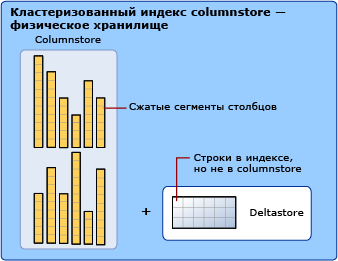

# Индексы Columnstore. Обзор
[!INCLUDE[appliesto-ss-asdb-asdw-pdw-md](../../includes/appliesto-ss-asdb-asdw-pdw-md.md)]

Индексы columnstore — это стандарт хранения и запрашивания больших объемов данных в таблицах фактов. В этом индексе используется хранение данных и обработка запросов по столбцам, что позволяет **практически в 10 раз увеличить производительность запросов** к хранилищу данных по сравнению с традиционным хранилищем, в котором данные хранятся по строкам, и **практически в 10 уменьшить размеры данных** по сравнению с несжатыми данными. Начиная с версии [!INCLUDE[ssSQL15](../../includes/sssql15-md.md)] индексы columnstore позволяют выполнять операционную аналитику, анализируя транзакционную рабочую нагрузку в режиме реального времени.  
  
Дополнительные сведения о связанных сценариях:  
  
-   [Индексы сolumnstore для хранилищ данных](../../relational-databases/indexes/columnstore-indexes-data-warehouse.md)  
-   [Начало работы с Columnstore для получения операционной аналитики в реальном времени](../../relational-databases/indexes/get-started-with-columnstore-for-real-time-operational-analytics.md)  
  
## Что такое индекс columnstore?  
Индекс columnstore — это технология хранения и получения данных, а также управления ими с помощью формата хранения данных в столбцах, называемого *columnstore*.  
  
### Основные термины и понятия  
Следующие основные концепции и понятия связаны с индексами columnstore.  
  
#### columnstore
Columnstore — это данные, логически упорядоченные в виде таблицы, состоящей из строк и столбцов, и физически хранящиеся в формате столбцов.  
  
#### Rowstore
Rowstore — это данные, логически упорядоченные в виде таблицы, состоящей из строк и столбцов, и физически хранящиеся в формате строк. Это стандартный способ хранения реляционных данных таблиц. В [!INCLUDE[ssNoVersion](../../includes/ssnoversion-md.md)] rowstore — это таблица с базовым форматом хранения данных в виде кучи, кластеризованного индекса или таблицы, оптимизированной для памяти.  
  
> [!NOTE]  
> В обсуждениях индексов columnstore для обозначения формата хранения данных используются термины rowstore и columnstore.  
  
#### Rowgroup
Rowgroup — это группа строк, сжимаемых в формате columnstore одновременно. Rowgroup обычно содержит максимальное возможное число строк — 1 048 576 строк.  
  
Чтобы добиться высокой производительности и высокого уровня сжатия, индекс columnstore разделяет таблицы на группы rowgroup, каждая из которых затем сжимается на уровне столбцов. Число строк в группе строк должно быть достаточно большим, чтобы повысить скорость сжатия, и достаточно малым для использования преимуществ использования операций в памяти.    

#### Сегмент столбца
Сегмент столбца — это столбец данных из rowgroup.  
  
-   Каждая rowgroup содержит один сегмент столбца для каждого столбца в таблице.  
-   Каждый сегмент столбца сжимается одновременно и сохраняется на физическом носителе.  
  
  
  
#### Кластеризованный индекс columnstore
Кластеризованный индекс columnstore — это физическое хранилище для всей таблицы.    
  
  
  
Чтобы снизить фрагментацию сегментов столбцов и повысить производительность, индекс columnstore может временно сохранять некоторые данные в кластеризованный индекс, который называется *deltastore*, и использовать для удаленных строк сбалансированное дерево идентификаторов. Операции deltastore обрабатываются в фоновом режиме. Для получения правильных результатов запросов кластеризованные индексы columnstore объединяют результаты запроса от columnstore и deltastore.  
  
#### Разностная группа строк
Разностная группа строк — это кластеризованный индекс, который используется только с индексами columnstore. Она улучшает сжатие и эффективность хранения строк, пока их количество не достигнет предельного значения, а затем переносит строки в индекс columnstore.  

Когда объем разностной группы строк достигает максимального числа строк, она закрывается. Процесс перемещения кортежей выполняет проверку на наличие закрытых групп строк. При обнаружении закрытой группы строк она сжимается и сохраняется в columnstore.  
  
#### Deltastore
Индекс columnstore может содержать более одной разностной группы строк. Все разностные группы строк совокупно называются deltastore.   

При крупной массовой загрузке большинство строк переходят непосредственно в columnstore без промежуточного помещения в deltastore. Некоторых строк в конце массовой загрузки может оказаться слишком мало для соответствия минимальному размеру rowgroup, составляющему 102 400 строк. В результате этого последние строки переходят в deltastore вместо columnstore. Для небольших массовых загрузок с менее 102 400 строк, все строки перемещаются напрямую в deltastore.  
  
#### некластеризованный индекс columnstore
Некластеризованный индекс columnstore и кластеризованный индекс columnstore функционируют по одному принципу. Разница в том, что некластеризованный индекс вторичен и создается на основе таблицы индексов rowstore, а кластеризованный индекс columnstore является первичным хранилищем для всей таблицы.  
  
Некластеризованный индекс содержит копию всех или части строк и столбцов в базовой таблице. Индекс определяется как один или несколько столбцов таблицы и включает дополнительное условие для фильтрации строк.  
  
Некластеризованный индекс columnstore позволяет осуществлять операционную аналитику в реальном времени, когда рабочая нагрузка OLTP выполняется с использованием базового кластеризованного индекса, а аналитика при этом проводится параллельно на основе индекса columnstore. Дополнительные сведения см. в статье [Начало работы с Columnstore для получения операционной аналитики в реальном времени](../../relational-databases/indexes/get-started-with-columnstore-for-real-time-operational-analytics.md).  
  
#### выполнение в пакетном режиме.
Пакетный режим выполнения — это метод обработки запросов, при котором обрабатываются сразу несколько строк. Выполнение в пакетном режиме тесно интегрировано и оптимизировано для взаимодействия с форматом хранения columnstore. Пакетный режим выполнения иногда называется *выполнением на основе векторов* или *векторизированным выполнением*. В запросах к индексам columnstore используется режим пакетного выполнения, что обычно повышает производительность запросов в 2–4 раза. Дополнительные сведения см. в статье [Руководство по архитектуре обработки запросов](../query-processing-architecture-guide.md#execution-modes). 
  
##   Для чего нужен индекс columnstore?  
Индекс columnstore обеспечивает высокую (обычно десятикратную) степень сжатия данных, что позволяет существенно снизить затраты на хранение данных. Кроме того, он на порядок повышает эффективность аналитики по сравнению с индексом сбалансированного дерева. Индексы columnstore — это предпочтительный формат для хранения данных и выполнения аналитики. Начиная с версии [!INCLUDE[ssSQL15](../../includes/sssql15-md.md)], индексы columnstore можно использовать для аналитики рабочей нагрузки по операциям в режиме реального времени.  
  
Почему индексы columnstore такие быстрые.  
  
-   В столбцах хранятся значения из одного и того же домена, которые часто похожи, что позволяет добиться высокой степени сжатия данных. Узкие места в системе, связанные с операциями ввода-вывода, сведены к минимуму или отсутствуют, а объем используемой памяти существенно сокращается.  
  
-   Высокие степени сжатия повышают производительность запросов с помощью малого отпечатка в памяти. В свою очередь, может повышаться производительность запросов, так как [!INCLUDE[ssNoVersion](../../includes/ssnoversion-md.md)] может выполнять больше операций с запросами и данными в памяти.  
  
-   Пакетное выполнение повышает эффективность запросов (обычно в 2–4 раза) благодаря обработке сразу нескольких строк.  
  
-   Часто запросы выбирают только несколько столбцов из таблицы, что сокращает общее число операций ввода-вывода для физического носителя.  
  
## Когда следует использовать индекс columnstore?  
Рекомендации по использованию  
  
-   Используйте кластеризованный индекс columnstore для хранения таблиц фактов и больших таблиц измерений для рабочих нагрузок хранилищ данных. Этот метод повышает эффективность запросов и сжатие данных практически в 10 раз. Дополнительные сведения см. в статье об использовании [индексов columnstore для хранения данных](~/relational-databases/indexes/columnstore-indexes-data-warehouse.md).  
  
-   Используйте некластеризованный индекс columnstore для анализа рабочей нагрузки OLTP в режиме реального времени. Дополнительные сведения см. в статье [Начало работы с Columnstore для получения операционной аналитики в реальном времени](../../relational-databases/indexes/get-started-with-columnstore-for-real-time-operational-analytics.md).  
  
### Как сделать выбор между индексами rowstore и columnstore?  
Индексы rowstore лучше всего работают с запросами, направленными на поиск данных или определенного значения, а также с запросами в небольших диапазонах данных. Используйте индексы rowstore с транзакционными рабочими нагрузками, так как для них чаще требуется поиск по таблицам, а не сканирование таблиц.  
  
Индексы columnstore обеспечивают значительное повышение производительности при выполнении аналитических запросов, которые сканируют большие объемы данных (в частности, большие таблицы). Используйте индексы columnstore с рабочими нагрузками по хранению и аналитике данных (в частности, с таблицами фактов), так как для них чаще требуется полное сканирование таблиц, а не поиск по таблицам.  
  
### Можно ли использовать индексы rowstore и columnstore в одной и той же таблице?  
Да. Начиная с версии [!INCLUDE[ssSQL15](../../includes/sssql15-md.md)] можно создавать обновляемый некластеризованный индекс columnstore в таблице rowstore. В индексе columnstore хранится копия выбранных столбцов, которые сжимаются в среднем в 10 раз и не требуют много дополнительного пространства. Вы сможете выполнять аналитику на основе индекса columnstore и транзакции на основе индекса rowstore одновременно. Columnstore обновляется при каждом изменении данных в таблице rowstore, поэтому оба индекса работают с одними и теми же данными.  
  
Начиная с версии [!INCLUDE[ssSQL15](../../includes/sssql15-md.md)] можно помещать в индекс columnstore один или несколько некластеризованных индексов rowstore и выполнять эффективный поиск в таблицах на основе базового индекса columnstore. Кроме того, появляется доступ к другим возможностям. Например, можно принудительно задать ограничение PRIMARY KEY, применив к таблице rowstore ограничение UNIQUE. Так как неуникальное значение в таблицу rowstore не вставляется, [!INCLUDE[ssNoVersion](../../includes/ssnoversion-md.md)] не может вставить значение в columnstore.  
  
## Метаданные  
Все столбцы в индексе columnstore хранятся в метаданных как включенные столбцы. Индекс columnstore не имеет ключевых столбцов.  

|||
|-|-|  
|[sys.indexes (Transact-SQL)](../../relational-databases/system-catalog-views/sys-indexes-transact-sql.md)|[sys.index_columns (Transact-SQL)](../../relational-databases/system-catalog-views/sys-index-columns-transact-sql.md)|  
|[sys.partitions (Transact-SQL)](../../relational-databases/system-catalog-views/sys-partitions-transact-sql.md)|[sys.internal_partitions (Transact-SQL)](../../relational-databases/system-catalog-views/sys-internal-partitions-transact-sql.md)|  
|[sys.column_store_segments (Transact-SQL)](../../relational-databases/system-catalog-views/sys-column-store-segments-transact-sql.md)|[sys.column_store_dictionaries &#40;Transact-SQL&#41;](../../relational-databases/system-catalog-views/sys-column-store-dictionaries-transact-sql.md)|  
|[sys.column_store_row_groups (Transact-SQL)](../../relational-databases/system-catalog-views/sys-column-store-row-groups-transact-sql.md)|[sys.dm_db_column_store_row_group_operational_stats (Transact-SQL)](../../relational-databases/system-dynamic-management-views/sys-dm-db-column-store-row-group-operational-stats-transact-sql.md)|  
|[sys.dm_db_column_store_row_group_physical_stats (Transact-SQL)](../../relational-databases/system-dynamic-management-views/sys-dm-db-column-store-row-group-physical-stats-transact-sql.md)|[sys.dm_column_store_object_pool (Transact-SQL)](../../relational-databases/system-dynamic-management-views/sys-dm-column-store-object-pool-transact-sql.md)|  
|[sys.dm_db_column_store_row_group_operational_stats (Transact-SQL)](../../relational-databases/system-dynamic-management-views/sys-dm-db-column-store-row-group-operational-stats-transact-sql.md)|[sys.dm_db_index_operational_stats &#40;Transact-SQL&#41;](../../relational-databases/system-dynamic-management-views/sys-dm-db-index-operational-stats-transact-sql.md)|  
|[sys.dm_db_index_physical_stats &#40;Transact-SQL&#41;](../../relational-databases/system-dynamic-management-views/sys-dm-db-index-physical-stats-transact-sql.md)||  
  
## Связанные задачи  
Для всех реляционных таблиц, не заданных как кластеризованный индекс columnstore, в качестве базового формата данных используется индекс rowstore. `CREATE TABLE` создает таблицу rowstore, если не указан параметр `WITH CLUSTERED COLUMNSTORE INDEX`.  
  
С помощью инструкции `CREATE TABLE` можно создать таблицу с индексом columnstore, указав параметр `WITH CLUSTERED COLUMNSTORE INDEX`. Чтобы конвертировать таблицу rowstore в columnstore, используйте инструкцию `CREATE COLUMNSTORE INDEX`.  
  
|Задача|Справочные разделы|Примечания|  
|----------|----------------------|-----------|  
|Создание таблицы как кластеризованного индекса columnstore|[CREATE TABLE (Transact-SQL)](../../t-sql/statements/create-table-transact-sql.md)|Начиная с версии [!INCLUDE[ssSQL15](../../includes/sssql15-md.md)], таблицы можно создавать как кластеризованный индекс columnstore. Для этого не нужно сначала создавать таблицу rowstore, а затем конвертировать ее в columnstore.|  
|Создание таблицы в памяти с индексом columnstore.|[CREATE TABLE (Transact-SQL)](../../t-sql/statements/create-table-transact-sql.md)|Начиная с версии [!INCLUDE[ssSQL15](../../includes/sssql15-md.md)], таблицы, оптимизированные для памяти, можно создавать с индексом columnstore. Индекс columnstore можно добавить и после создания таблицы, используя синтаксис `ALTER TABLE ADD INDEX`.|  
|Преобразование таблицы rowstore в таблицу columnstore|[CREATE COLUMNSTORE INDEX (Transact-SQL)](../../t-sql/statements/create-columnstore-index-transact-sql.md)|Преобразуйте существующую кучу или сбалансированное дерево в columnstore. В примерах показано, как обрабатывать существующие индексы, а также имя индекса, которое нужно использовать в процессе преобразования.|  
|Преобразование таблицы columnstore в rowstore|[CREATE CLUSTERED INDEX &#40;Transact-SQL&#41;](../../t-sql/statements/create-columnstore-index-transact-sql.md#d-convert-a-columnstore-table-to-a-rowstore-table-with-a-clustered-index) или [Преобразование таблицы columnstore обратно в кучу rowstore](../../t-sql/statements/create-columnstore-index-transact-sql.md#e-convert-a-columnstore-table-back-to-a-rowstore-heap) |Обычно это преобразование не требуется, но бывают ситуации, когда оно необходимо. В примерах показано, как преобразовать columnstore в кучу или кластеризованный индекс.|  
|Создание индекса columnstore в таблице rowstore|[CREATE COLUMNSTORE INDEX (Transact-SQL)](../../t-sql/statements/create-columnstore-index-transact-sql.md)|Таблица rowstore может включать один индекс columnstore. Начиная с версии [!INCLUDE[ssSQL15](../../includes/sssql15-md.md)], индекс columnstore может иметь отфильтрованное условие. В примерах показан основной синтаксис.|  
|Создание высокопроизводительных индексов для оперативной аналитики|[Начало работы с Columnstore для получения операционной аналитики в реальном времени](../../relational-databases/indexes/get-started-with-columnstore-for-real-time-operational-analytics.md)|Здесь объясняется, как создать дополнительные индексы columnstore и индексы сбалансированного дерева, чтобы использовать индексы сбалансированного дерева в запросах OLTP, а индексы columnstore — в запросах аналитики.|  
|Создание высокопроизводительных индексов сolumnstore для хранилищ данных|[Индексы сolumnstore для хранилищ данных](~/relational-databases/indexes/columnstore-indexes-data-warehouse.md)|Описывает использование индексов сбалансированного дерева в таблицах columnstore для создания высокопроизводительных запросов к хранилищу данных.|  
|Использование индекса сбалансированного дерева для принудительного применения ограничения PRIMARY KEY в таблице columnstore|[Индексы сolumnstore для хранилищ данных](~/relational-databases/indexes/columnstore-indexes-data-warehouse.md)|Показывает, как объединить индексы сбалансированного дерева и columnstore для принудительного применения ограничений PRIMARY KEY для индекса columnstore.|  
|Удаление индекса columnstore.|[DROP INDEX (Transact-SQL)](../../t-sql/statements/drop-index-transact-sql.md)|Для удаления индекса columnstore используется стандартный синтаксис `DROP INDEX`, который используется в индексах сбалансированного дерева. При удалении кластеризованного индекса columnstore таблица columnstore преобразуется в кучу.|  
|Удаление строки из индекса columnstore.|[DELETE (Transact-SQL)](../../t-sql/statements/delete-transact-sql.md)|Используйте синтаксис [DELETE (Transact-SQL)](../../t-sql/statements/delete-transact-sql.md) для удаления строки.   **Строка columnstore**: [!INCLUDE[ssNoVersion](../../includes/ssnoversion-md.md)] отмечает строку как логически удаленную, но не освобождает физическое хранилище для строки до тех пор, пока индекс не будет перестроен.   **Строка deltastore**: [!INCLUDE[ssNoVersion](../../includes/ssnoversion-md.md)] логически и физически удаляет строку.|  
|Обновление строки в индексе columnstore.|[UPDATE (Transact-SQL)](../../t-sql/queries/update-transact-sql.md)|Используйте синтаксис [UPDATE (Transact-SQL)](../../t-sql/queries/update-transact-sql.md) для обновления строки.   **Строка columnstore**: [!INCLUDE[ssNoVersion](../../includes/ssnoversion-md.md)] отмечает строку как логически удаленную, а затем вставляет обновленную строку в deltastore.   **Строка deltastore**: [!INCLUDE[ssNoVersion](../../includes/ssnoversion-md.md)] обновляет строку в deltastore.|  
|Загрузка данных в индекс columnstore.|[Индексы columnstore. Руководство по загрузке данных](~/relational-databases/indexes/columnstore-indexes-data-loading-guidance.md)||  
|Принудительное перемещение всех строк из deltastore в columnstore|[ALTER INDEX (Transact-SQL)](../../t-sql/statements/alter-index-transact-sql.md) … `REBUILD`   [Реорганизация и перестроение индексов](../../relational-databases/indexes/reorganize-and-rebuild-indexes.md)|Инструкция `ALTER INDEX` с параметром `REBUILD` принудительно перемещает все строки в columnstore.|  
|Дефрагментация индекса columnstore.|[ALTER INDEX (Transact-SQL)](../../t-sql/statements/alter-index-transact-sql.md)|Инструкция `ALTER INDEX ... REORGANIZE` дефрагментирует индексы columnstore в оперативном режиме.|  
|Слияние таблиц с индексами columnstore.|[MERGE (Transact-SQL)](../../t-sql/statements/merge-transact-sql.md)||  
  
## См. также раздел  
 [Индексы columnstore. Руководство по загрузке данных](~/relational-databases/indexes/columnstore-indexes-data-loading-guidance.md)   
 [Новые возможности индексов columnstore](~/relational-databases/indexes/columnstore-indexes-what-s-new.md)   
 [Производительность запросов по индексам columnstore](~/relational-databases/indexes/columnstore-indexes-query-performance.md)   
 [Начало работы с Columnstore для получения операционной аналитики в реальном времени](../../relational-databases/indexes/get-started-with-columnstore-for-real-time-operational-analytics.md)   
 [Индексы columnstore для хранения данных](~/relational-databases/indexes/columnstore-indexes-data-warehouse.md)   
 [Дефрагментация индексов columnstore](~/relational-databases/indexes/columnstore-indexes-defragmentation.md)   
 [Руководство по архитектуре и разработке индексов SQL Server](../../relational-databases/sql-server-index-design-guide.md)   
 [Рекомендации по проектированию индексов columnstore](../../relational-databases/sql-server-index-design-guide.md#columnstore_index)   
  
  
