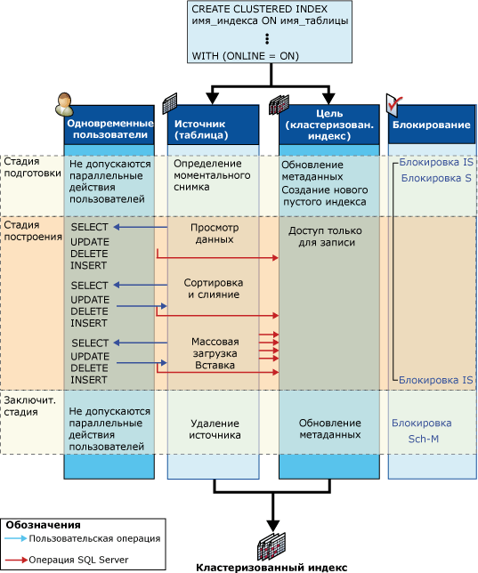

# Об операциях с индексом в сети
[!INCLUDE[tsql-appliesto-ss2016-asdb-xxxx-xxx_md](../../includes/tsql-appliesto-ss2016-asdb-xxxx-xxx-md.md)]

  В этом разделе описываются возникающие во время операции с индексами структуры в сети, а также работа служб, связанных с этими структурами.  
  
## Структуры индексов в сети  
 Для осуществления одновременной работы служб пользователей во время операций языка DDL необходимо во время операции с индексами в сети использовать следующие структуры: индекс источника и существующий индекс, индекс назначения, а для перестроения кучи или удаления кластеризованного индекса — временный индекс сопоставления.  
  
-   **Индексы источника и существующие ранее индексы**  
  
     Источник — это исходная таблица или данные кластеризованного индекса. Существующие ранее индексы — это любые некластеризованные индексы, связанные с исходной структурой. Например, если операция с индексами в сети перестраивает кластеризованный индекс, у которого есть четыре связанных кластеризованных индекса, то источником является существующий кластеризованный индекс, а существующими ранее индексами являются некластеризованные индексы.  
  
     Существующие ранее индексы доступны множеству пользователей для одновременных операций выборки, вставки, обновления или удаления. К ним относятся операции массовой вставки (поддерживаемые, но не рекомендуемые к использованию) и неявного обновления при помощи триггеров и ограничений ссылочной целостности. Все существующие ранее индексы доступны для запросов и операций поиска. Из этого следует, что они могут быть выбраны оптимизатором запросов и в случае необходимости заданы в указаниях индекса.  
  
-   **Цель**  
  
     Назначение или назначения являются новым индексом (или кучей) или набором новых индексов, которые были либо созданы, либо перестроены. Пользовательские операции вставки, обновления и удаления над источником применяются к назначению компонентом [!INCLUDE[ssDEnoversion](../../includes/ssdenoversion-md.md)] во время операции с индексами. Например, если операция с индексами в сети перестраивает кластеризованный индекс, то назначением является перестроенный кластеризованный индекс; компонент [!INCLUDE[ssDE](../../includes/ssde-md.md)] не перестраивает некластеризованные индексы при перестроении кластеризованного.  
  
     При выполнении инструкции SELECT в индексе назначения не производится поиск до подтверждения операции с индексами. Внутри системы индекс является доступным только для записи.  
  
-   **Временный индекс сопоставления**  
  
     Операциям с индексами в сети, создающим, удаляющим или перестраивающим кластеризованный индекс, необходим также временный индекс сопоставления. Этот временный индекс используется одновременно выполняемыми транзакциям для определения того, какие записи должны быть удалены во время перестроения новых индексов при удалении или обновлении строк в базовой таблице. Данный некластеризованный индекс создается на том же этапе, что и новый кластеризованный индекс (или куча) и для него не требуется отдельной операции сортировки. Одновременно выполняемые транзакции поддерживают временный индекс сопоставления во всех операциях вставки, обновления или удаления.  
  
## Работа служб в сети с использованием индексов  
 Во время простой операции с индексами в сети, например во время создания кластеризованного индекса в неиндексированной таблице (куче), источник и назначение проходят три фазы: подготовка, сборка и завершение.  
  
 На следующем рисунке показан процесс создания исходного кластеризованного индекса в сети. Для исходного объекта (кучи) другие индексы не определены. Работа служб со структурами источника и назначения показана для каждой фазы; также показаны одновременные пользовательские операции выборки, вставки, обновления или удаления. Фазы подготовки, сборки, и завершения отображаются вместе с режимами блокировки, используемыми для каждой фазы.  
  
   
  
## Работа служб со структурами источника  
 В следующей таблице приведена работа служб со структурами источника во время каждой фазы операции с индексами, а также соответствующие стратегии блокировки.  
  
|Стадия|Работа служб источника|Блокировки источника|  
|-----------|---------------------|------------------|  
|Подготовка   Очень короткая фаза|Подготовка системных метаданных для создания пустой структуры индекса.   Определяется моментальный снимок таблицы. То есть используется управление версиями строк для обеспечения согласованности считывания на уровне транзакций.   Одновременные пользовательские операции записи на источник блокируются на очень короткий промежуток времени.   Запрещаются все одновременные операции DDL, кроме операции создания множества некластеризованных индексов.|S (совмещаемая) на таблицу*   IS (с намерением совмещаемого доступа)   INDEX_BUILD_INTERNAL_RESOURCE\*\*|  
|Сборка   Главная фаза|Данные просматриваются, сортируются, сливаются и вставляются в назначение во время операций массовой загрузки.   Одновременные пользовательские операции выборки, вставки, обновления и удаления применяются и к существовавшим ранее индексам и к новым создающимся индексам.|IS   INDEX_BUILD_INTERNAL_RESOURCE**|  
|Завершение   Очень короткая фаза|Все незафиксированные транзакции обновления должны быть завершены до начала этой фазы. В зависимости от полученной блокировки все новые пользовательские транзакции записи или чтения блокируются на очень короткий промежуток времени до завершения этой фазы.   Системные метаданные обновляются для замены источника на назначение.   При необходимости источник может быть удален. Например, после перестроения или удаления кластеризованного индекса.|INDEX_BUILD_INTERNAL_RESOURCE**   S на таблицу в случае создания некластеризованного индекса.\*   SCH-M (изменение схемы) в случае удаления любой структуры источника (индекса или таблицы).\*|  
  
 \* Перед установкой блокировки S или SCH-M на таблицу выполняемая операция с индексами будет ждать завершения выполнения всех незафиксированных транзакций обновления.  
  
 ** Блокировка ресурса INDEX_BUILD_INTERNAL_RESOURCE предотвращает одновременное выполнение операций языка описания данных DDL в источнике и существовавших ранее структурах во время выполнения операции с индексами. Например, данная блокировка предотвращает одновременное перестроение двух индексов в одной таблице. Хотя данная блокировка ресурса связана с блокировкой Sch-M, она не предотвращает выполнение инструкций по обработке данных.  
  
 В предыдущей таблице показана одна совмещаемая (S) блокировка, установленная во время фазы сборки операции с индексами в сети, включающей в себя один индекс. При создании или перестроении кластеризованных и некластеризованных индексов в одной операции с индексами в сети (например во время создания исходного кластеризованного индекса в таблице, содержащей один или несколько некластеризованных индексов) во время фазы сборки создаются две краткосрочные совмещаемые (S) блокировки, а затем две долгосрочные блокировки с намерением совмещаемого доступа (IS). Одна блокировка S сначала устанавливается во время создания кластеризованного индекса, а затем при завершении его создания, а вторая краткосрочная блокировка S устанавливается при создании некластеризованных индексов. После создания некластеризованных индексов блокировка S снова сменяется блокировкой IS до начала фазы завершения операции с индексами в сети.  
  
### Работа служб со структурами назначения  
 В следующей таблице приведена работа служб со структурами назначения во время каждой фазы операции с индексами, а также соответствующие стратегии блокировки.  
  
|Стадия|Работа служб назначения|Блокировка назначения|  
|-----------|---------------------|------------------|  
|Подготовка|Создается новый индекс, доступный только для записи.|IS|  
|Сборка|Вставляются данные из источника.   Применяются пользовательские изменения (вставки, обновления, удаления), уже выполненные на источнике.   Это действие прозрачно для пользователя.|IS|  
|Завершение|Обновляются метаданные индекса.   Индекс переводится в состояние чтения/записи.|S   либо   Блокировка SCH-M|  
  
 До завершения операции с индексами назначение не доступно для инструкций SELECT, заданных пользователем.  
  
 После выполнения фаз подготовки и завершения хранящихся в кэше процедур планы запросов и обновлений становятся недействительными. В последующих запросах новый индекс будет использоваться.  
  
 Время жизни заданного в таблице курсора, использующегося в операциях с индексами в сети, ограничено оперативными фазами индекса. На каждой фазе курсоры обновления являются недействительными. Доступные только для чтения курсоры становятся недействительными только после фазы завершения.  
  
## См. также  
 [Выполнение операции с индексами в сети](../../relational-databases/indexes/perform-index-operations-online.md)  
  
 [Руководящие принципы для операций с индексами](../../relational-databases/indexes/guidelines-for-online-index-operations.md)  
  
  

