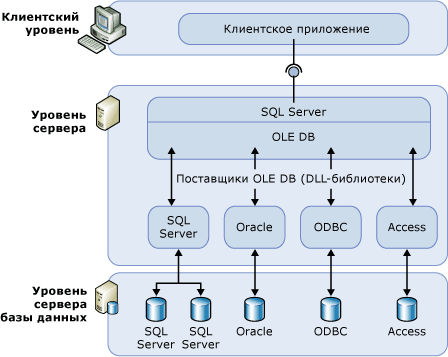

# Связанные серверы (компонент Database Engine)

[!INCLUDE [SQL Server SQL MI](../../includes/applies-to-version/sql-asdbmi.md)]

  Связанные серверы позволяют [!INCLUDE[ssDEnoversion](../../includes/ssdenoversion-md.md)] и [!INCLUDE[ssSDSMIfull](../../includes/sssdsmifull-md.md)] вести чтение данных из удаленных источников данных и выполнять команды на удаленных серверах баз данных (например, источниках данных OLE DB) за пределами экземпляра [!INCLUDE[ssNoVersion](../../includes/ssnoversion-md.md)]. Обычно связанные серверы настроены на включение компонента [!INCLUDE[ssDE](../../includes/ssde-md.md)] для выполнения инструкции [!INCLUDE[tsql](../../includes/tsql-md.md)] , включающей таблицы в другом экземпляре [!INCLUDE[ssNoVersion](../../includes/ssnoversion-md.md)]или другом продукте для работы с базами данных, например Oracle. В качестве связанных серверов можно настроить источники данных OLE DB многих типов, в том числе [!INCLUDE[msCoName](../../includes/msconame-md.md)] Access, Excel и Azure CosmosDB.

> [!NOTE]
> Связанные серверы доступны в [!INCLUDE[ssDEnoversion](../../includes/ssdenoversion-md.md)] и [!INCLUDE[ssSDSMIfull](../../includes/sssdsmifull-md.md)]. Они не включены в отдельные базы данных [!INCLUDE[ssSDSfull](../../includes/sssdsfull-md.md)] и эластичные пулы. Существуют некоторые ограничения для управляемых экземпляров, описание которых можно найти [здесь](https://docs.microsoft.com/azure/sql-database/sql-database-managed-instance-transact-sql-information#linked-servers). 

## Когда использовать связанные серверы?

  Связанные серверы позволяют реализовать распределенные базы данных, которые могут извлекать и обновлять данные в других базах данных. Они являются прекрасным решением в сценариях, где необходимо реализовать сегментирование баз данных без необходимости создания кода пользовательского приложения или прямой загрузки из удаленных источников данных. Концепция связанных серверов имеет следующие преимущества.  
  
-   Возможность доступа к данным за пределами [!INCLUDE[ssNoVersion](../../includes/ssnoversion-md.md)].  
  
-   Возможность осуществлять распределенные запросы, обновления, команды и транзакции на разнородных источниках данных по всему предприятию.  
  
-   Возможность единообразной адресации разных источников данных.  
  
Можно настроить связанный сервер, используя инструкцию [!INCLUDE[ssManStudioFull](../../includes/ssmanstudiofull-md.md)] или [sp_addlinkedserver (Transact-SQL)](../../relational-databases/system-stored-procedures/sp-addlinkedserver-transact-sql.md) . Поставщики OLE DB существенно различаются по типу и количеству необходимых параметров. Например, некоторые поставщики требуют предоставления контекста безопасности для соединения с помощью [sp_addlinkedsrvlogin (Transact-SQL)](../../relational-databases/system-stored-procedures/sp-addlinkedsrvlogin-transact-sql.md). Некоторые поставщики OLE DB разрешают использовать [!INCLUDE[ssNoVersion](../../includes/ssnoversion-md.md)] для обновления данных в источнике данных OLE DB. Другие предоставляют доступ к данным только для чтения. Для информации о каждом поставщике OLE DB обратитесь к документации об этом поставщике OLE DB.  
  
## Компоненты связанных серверов  
 Определение связанного сервера задает следующие объекты.  
  
-   Поставщик OLE DB  
  
-   Источник данных OLE DB  
  
*Поставщиком OLE DB* является динамическая библиотека, осуществляющая управление и взаимодействие с определенными источниками данных. *Источник данных OLE DB* определяет конкретную базу данных, доступ к которой выполняется через интерфейс OLE DB. Хотя источники данных, запросы к которым выполняются с помощью определений связанных серверов, являются обычными базами данных, существуют поставщики OLE DB для разнообразных файлов и форматов файлов. Сюда входят текстовые файлы, данные электронных таблиц и результаты поиска полнотекстового содержимого.  
  
Начиная с [!INCLUDE[sql-server-2019](../../includes/sssqlv15-md.md)], [драйвер Microsoft OLE DB для SQL Server (MSOLEDBSQL)](../../connect/oledb/oledb-driver-for-sql-server.md) (PROGID: MSOLEDBSQL) является поставщиком OLE DB по умолчанию. В более ранних версиях [поставщик OLE DB SQL Server Native Client (SQLNCLI)](../../relational-databases/native-client/sql-server-native-client.md) (PROGID: SQLNCLI11) являлся поставщиком OLE DB по умолчанию.
  
> [!NOTE]  
> [!INCLUDE[ssNoVersion](../../includes/ssnoversion-md.md)] предназначены для работы с поставщиком OLE DB, реализующим необходимые интерфейсы OLE DB. Однако [!INCLUDE[ssNoVersion](../../includes/ssnoversion-md.md)] была протестирована с поставщиком OLE DB по умолчанию.  
  
## Подробности настройки связанных серверов  
 На следующей иллюстрации показаны основы настройки связанных серверов.  
  
   
  
Обычно связанные серверы используются для обработки распределенных запросов. Если клиентское приложение выполняет распределенный запрос через связанный сервер, [!INCLUDE[ssNoVersion](../../includes/ssnoversion-md.md)] проводит синтаксический анализ команды и передает запросы поставщику OLE DB. Запрос на набор строк может быть в форме выполнения запроса к поставщику или в форме открытия базовой таблицы из поставщика.  

> [!NOTE]
> Чтобы источник данных мог вернуть данные при помощи связанного сервера, поставщик OLE DB (динамическая библиотека) для этого источника данных должен присутствовать на том же сервере, что и экземпляр [!INCLUDE[ssNoVersion](../../includes/ssnoversion-md.md)].  
 
> [!IMPORTANT]
> При использовании поставщика OLE DB учетная запись, под которой выполняется служба сервера [!INCLUDE[ssNoVersion](../../includes/ssnoversion-md.md)], должна иметь разрешения на чтение и выполнение для каталога и всех его подкаталогов, в котором установлен поставщик. Сюда входят поставщики, выпущенные корпорацией Майкрософт, и любые сторонние поставщики.

> [!NOTE]
> Связанные серверы поддерживают сквозную проверку подлинности Active Directory при использовании полного делегирования. Начиная с [!INCLUDE[ssSQL17](../../includes/sssql17-md.md)] CU17, также поддерживается сквозная проверка подлинности с ограниченным делегированием. Однако [ограниченное делегирование на основе ресурсов](https://docs.microsoft.com/windows-server/security/kerberos/kerberos-constrained-delegation-overview) не поддерживается.

## Управление поставщиками  
Имеется набор параметров, определяющих, как [!INCLUDE[ssNoVersion](../../includes/ssnoversion-md.md)] загружает и использует поставщики OLE DB, заданные в реестре.  
  
## Управление определениями связанных серверов  
При установке связанного сервера зарегистрируйте параметры соединения и источника данных при помощи [!INCLUDE[ssNoVersion](../../includes/ssnoversion-md.md)]. После регистрации к этому источнику данных можно обращаться по одному логическому имени.  
  
Для управления определениями связанного сервера можно использовать хранимые процедуры и представления каталога.  
  
-   Создайте определение связанного сервера, выполнив процедуру **sp_addlinkedserver**.  
  
-   Просмотрите сведения о связанных серверах, определенных в конкретном экземпляре [!INCLUDE[ssNoVersion](../../includes/ssnoversion-md.md)] , выполнив запрос к представлениям системного каталога **sys.servers** .  
  
-   Удалите определение связанного сервера, выполнив процедуру **sp_dropserver**. Эта хранимая процедура может также использоваться для удаления удаленного сервера.  
  
Определять связанные серверы можно также в среде [!INCLUDE[ssManStudioFull](../../includes/ssmanstudiofull-md.md)]. В обозревателе объектов щелкните правой кнопкой мыши **Объекты сервера**, выберите **Создать**и выберите **Связанный сервер**. Определение связанного сервера можно удалить, щелкнув правой кнопкой мыши имя связанного сервера и выбрав **Удалить**.  
  
 При выполнении распределенного запроса к связанному серверу необходимо указать полное, состоящее из четырех частей имя таблицы для каждого источника данных, к которому выполняется запрос. Это четырехкомпонентное имя должно быть в форме _linked\_server\_name.catalog_ **.** _schema_ **.** _object\_name_.  
  
> [!NOTE]  
> Связанные серверы могут быть определены таким образом, чтобы указывать на сервер, на котором они определены (обратная связь). Серверы с обратной связью наиболее полезны для тестирования приложения, в котором используются распределенные запросы в односерверной сети. Серверы, связанные с помощью петлевого адреса, предназначены для тестирования и не поддерживаются во многих операциях, таких как распределенные транзакции.  
  
## Связанные задачи  
 [Создание связанных серверов &#40;компонент SQL Server Database Engine&#41;](../../relational-databases/linked-servers/create-linked-servers-sql-server-database-engine.md)    
 [sp_addlinkedserver (Transact-SQL)](../../relational-databases/system-stored-procedures/sp-addlinkedserver-transact-sql.md)    
 [sp_addlinkedsrvlogin &#40;Transact-SQL&#41;](../../relational-databases/system-stored-procedures/sp-addlinkedsrvlogin-transact-sql.md)    
 [sp_dropserver (Transact-SQL)](../../relational-databases/system-stored-procedures/sp-dropserver-transact-sql.md)    
  
## См. также  
 [sys.servers (Transact-SQL)](../../relational-databases/system-catalog-views/sys-servers-transact-sql.md)    
 [sp_linkedservers (Transact-SQL)](../../relational-databases/system-stored-procedures/sp-linkedservers-transact-sql.md)  

