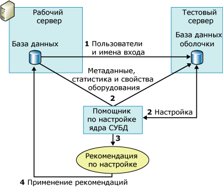

# <a name="reduce-the-production-server-tuning-load"></a>Уменьшение настроечной загрузки рабочего сервера
[!INCLUDE[appliesto-ss-asdb-xxxx-xxx-md](../../includes/appliesto-ss-asdb-xxxx-xxx-md.md)]
  [!INCLUDE[ssDE](../../includes/ssde-md.md)] полагается на оптимизатор запросов, который анализирует рабочую нагрузку и создает рекомендации по настройке. Выполнение этого анализа на рабочем сервере добавляет нагрузки этому серверу и может снизить его производительность на время сеанса настройки. Чтобы уменьшить дополнительную нагрузку сервера во время сеанса настройки, можно использовать тестовый сервер в дополнение к рабочему серверу.  
  
## <a name="how-database-engine-tuning-advisor-uses-a-test-server"></a>Как помощник по настройке ядра СУБД работает с тестовым сервером  
 Традиционным методом является копирование всех данных с рабочего сервера на тестовый, затем производится настройка тестового сервера и реализация рекомендаций на производственном сервере. Этот процесс устраняет влияние на производительность рабочего сервера, но не является оптимальным решением. Например, копирование большого количества данных с рабочего сервера на тестовый может занять много времени и ресурсов. Кроме того, оборудование тестового сервера редко также производительно, как и использующееся на рабочих серверах. Процесс настройки полагается на оптимизатор запросов, а формируемые им рекомендации частично основываются на параметрах оборудования. Если оборудование рабочего и тестового серверов неодинаково, качество рекомендаций помощника по настройке компонента [!INCLUDE[ssDE](../../includes/ssde-md.md)] может снизиться.  
  
 Чтобы избежать этих проблем, помощник по настройке компонента [!INCLUDE[ssDE](../../includes/ssde-md.md)] настраивает базу данных на рабочем сервере, перенося большую часть нагрузки, связанной с настройкой, на тестовый сервер. Это делается с использованием сведений о конфигурации оборудования рабочего сервера и без явного копирования данных с рабочего сервера на тестовый. [!INCLUDE[ssDE](../../includes/ssde-md.md)] не копирует реальные данные с рабочего сервера на тестовый сервер. Он копирует только метаданные и необходимую статистику.  
  
 Следующие шаги в общем виде описывают процесс настройки производственной базы данных на тестовом сервере.  
  
1.  Убедитесь, что пользователь, который хочет работать с тестовым сервером, есть на обоих серверах.  
  
     ПЕРЕД НАЧАЛОМ УБЕДИТЕСЬ, ЧТО ПОЛЬЗОВАТЕЛЬ, КОТОРЫЙ ХОЧЕТ РАБОТАТЬ С ТЕСТОВЫМ СЕРВЕРОМ ДЛЯ НАСТРОЙКИ БАЗЫ ДАННЫХ РАБОЧЕГО СЕРВЕРА, СУЩЕСТВУЕТ НА ОБОИХ СЕРВЕРАХ.Перед началом убедитесь, что пользователь, который хочет работать с тестовым сервером для настройки базы данных рабочего сервера, существует на обоих серверах. Для этого нужно создать пользователя и его имя входа на тестовом сервере. Если вы являетесь членом предопределенной роли сервера **sysadmin** на обоих компьютерах, этот шаг можно пропустить.  
  
2.  Настройте рабочую нагрузку на тестовом сервере.  
  
     Чтобы настроить рабочую нагрузку на тестовом сервере, используйте входной файл XML-данных и программу командной строки **dta** . В этом XML-файле укажите имя тестового сервера во вложенном элементе **TestServer** вместе с другими значениями других вложенных элементов родительского элемента **TuningOptions** .  
  
     Во время процесса настройки помощник по настройке ядра СУБД создает на тестовом сервере базу данных оболочки. Чтобы создать и настроить базу данных, помощник по настройке ядра СУБД отправляет рабочему серверу представленные ниже вызовы.  
  
    1.  [!INCLUDE[ssDE](../../includes/ssde-md.md)] импортирует метаданные производственной базы данных в базу данных оболочки тестового сервера. В эти метаданные входят пустые таблицы, индексы, представления, хранимые процедуры, триггеры и т. д. Таким образом, возможно выполнять запросы рабочей нагрузки к базе данных оболочки тестового сервера.  
  
    2.  [!INCLUDE[ssDE](../../includes/ssde-md.md)] импортирует статистику рабочего сервера, чтобы оптимизатор запросов мог точно оптимизировать запросы на тестовом сервере.  
  
    3.  [!INCLUDE[ssDE](../../includes/ssde-md.md)] импортирует параметры оборудования, указывая число процессоров и доступную оперативную память рабочего сервера, чтобы предоставить оптимизатору запросов сведения, необходимые для формирования планов запросов.  
  
3.  После завершения настройки базы данных оболочки тестового сервера помощник по настройке компонента [!INCLUDE[ssDE](../../includes/ssde-md.md)] сформирует рекомендации по настройке.  
  
4.  Примените рекомендацию, полученную при настройке тестового сервера, на рабочем сервере.  
  
 На следующем рисунке показан сценарий с использованием тестового и рабочего серверов.  
  
   
  
> [!NOTE]  
>  Функция настройки тестового сервера не поддерживается в графическом пользовательском интерфейсе помощника по настройке компонента [!INCLUDE[ssDE](../../includes/ssde-md.md)] .  
  
## <a name="example"></a>Пример  
 Сначала убедитесь, что пользователь, который хочет работать с рабочим сервером, есть на обоих серверах.  
  
 После копирования сведений о пользователе на тестовый сервер можно определить сеанс его настройки во входном XML-файле помощника по настройке компонента [!INCLUDE[ssDE](../../includes/ssde-md.md)] . Следующий входной XML-файл демонстрирует, как указать тестовый сервер для настройки базы данных помощником по настройке компонента [!INCLUDE[ssDE](../../includes/ssde-md.md)] .  
  
 В этом примере база данных `MyDatabaseName` настраивается на сервере `MyServerName`. Скрипт [!INCLUDE[tsql](../../includes/tsql-md.md)] , `MyWorkloadScript.sql`, используется в качестве рабочей нагрузки. Он содержит события, которые будут происходить в базе данных `MyDatabaseName`. Большая часть вызовов оптимизатора запросов этой базы данных, которые будут производиться во время настройки, обрабатываются базой данных оболочки на сервере `MyTestServerName`. База данных оболочки состоит из метаданных и статистики. В результате этого настроечная нагрузка переносится на тестовый сервер. Когда помощник по настройке компонента [!INCLUDE[ssDE](../../includes/ssde-md.md)] формирует рекомендацию по настройке с помощью этого входного XML-файла, он принимает в расчет только индексы (`<FeatureSet>IDX</FeatureSet>`), но не секционирование, и поэтому может не хранить существующие структуры физического проектирования базы данных в объекте `MyDatabaseName`.  
  
```  
<?xml version="1.0" encoding="utf-16" ?>  
<DTAXML xmlns:xsi="http://www.w3.org/2001/XMLSchema-instance" xmlns="http://schemas.microsoft.com/sqlserver/2004/07/dta">  
  <DTAInput>  
    <Server>  
      <Name>MyServerName</Name>  
      <Database>  
        <Name>MyDatabaseName</Name>  
      </Database>  
    </Server>  
    <Workload>  
      <File>MyWorkloadScript.sql</File>  
    </Workload>  
    <TuningOptions>  
      <TestServer>MyTestServerName</TestServer>  
      <FeatureSet>IDX</FeatureSet>  
      <Partitioning>NONE</Partitioning>  
      <KeepExisting>NONE</KeepExisting>  
    </TuningOptions>  
  </DTAInput>  
</DTAXML>  
```  
  
## <a name="see-also"></a>См. также:  
 [Вопросы использования тестовых серверов](../../relational-databases/performance/considerations-for-using-test-servers.md)   
 [Справочник по входным XML-файлам (помощник по настройке ядра СУБД)](../../tools/dta/xml-input-file-reference-database-engine-tuning-advisor.md)  
  
  
