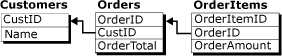
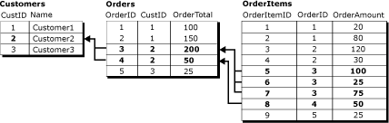
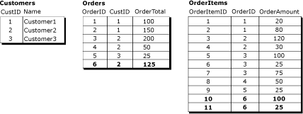
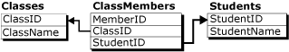

# Группирование изменений в связанных строках с помощью логических записей
    
> [!NOTE]  
>  [!INCLUDE[ssNoteDepFutureAvoid](../../../includes/ssnotedepfutureavoid-md.md)]  
  
 По умолчанию репликация слиянием обрабатывает изменения данных построчно. Во многих случаях это является подходящим способом, но для некоторых приложений важно, чтобы связанные строки обрабатывались как одно целое. Функция логических записей репликации слиянием позволяет определить отношения между связанными строками в разных таблицах, чтобы строки обрабатывались как одно целое.  
  
> [!NOTE]  
>  Функция логических записей может использоваться автономно или совместно с фильтрами соединения. Дополнительные сведения о фильтрах соединения см. в разделе [Join Filters](../../../relational-databases/replication/merge/join-filters.md). Для использования логических записей необходим уровень совместимости публикации, равный по меньшей мере 90RTM.  
  
 Рассмотрим три связанные таблицы.  
  
   
  
 Таблица **Customers** является родительской таблицей в этом отношении, и ее первичным ключевым столбцом является **CustID**. Таблица **Orders** содержит первичный ключевой столбец **OrderID**, имеет ограничение внешнего ключа для столбца **CustID** , который ссылается на столбец **CustID** в таблице **Customers** . Аналогично таблица **OrderItems** содержит первичный ключевой столбец **OrderItemID**, имеет ограничение внешнего ключа для столбца **OrderID** , который ссылается на столбец **OrderID** в таблице **Orders** .  
  
 В этом примере логическая запись состоит из всех строк в таблице **Orders** , которые связаны с единственным значением **CustID** , и всех строк таблицы **OrderItems** , которые им соответствуют в таблице **Orders** . На этой диаграмме показаны все строки в трех таблицах, которые содержатся в логической записи для Customer2.  
  
   
  
 Чтобы определить связь логических записей между статьями, см. раздел [Define a Logical Record Relationship Between Merge Table Articles](../../../relational-databases/replication/publish/define-a-logical-record-relationship-between-merge-table-articles.md).  
  
## Преимущества логических записей  
 Функция логических записей имеет два основных преимущества:  
  
-   Применение изменений данных как единого целого.  
  
-   Обнаружение и разрешение конфликтов одновременно на нескольких строках из нескольких таблиц.  
  
### Применение изменений как одного целого  
 Если обработка слияния прервана, например в случае обрыва подключения, для частично завершенного набора связанных реплицированных изменений выполняется откат при использовании логических записей. Например, рассмотрим случай, когда подписчик добавляет новый заказ с **OrderID** = 6 и двумя новыми строками в таблицу **OrderItems** с **OrderItemID** = 10 и **OrderItemID** = 11 для **OrderID** = 6.  
  
   
  
 Если процесс репликации прерван после завершения строки **Orders** для **OrderID** = 6, но перед завершением строк **OrderItems** 10 и 11 и логические записи не используются, тогда значение **OrderTotal** для **OrderID** = 6 не будет согласовываться с суммой значений **OrderAmount** для строк **OrderItems** . Если используются логические записи, то строка **Orders** для **OrderID** = 6 не фиксируется до тех пор, пока связанные изменения **OrderItems** не будут реплицированы.  
  
 В другом сценарии, если используются логические записи и выполняется запрос таблиц во время применения процессом слияния изменений, пользователь не увидит частично реплицированных изменений до тех пор, пока они все не завершатся. Например, процессом репликации передается строка Orders для **OrderID** = 6, и пользователь запрашивает таблицы до того, как процесс репликации реплицирует строки **OrderItems** , в этом случае значение **OrderTotal** не будет совпадать с суммой значений **OrderAmount** . Если используются логические записи, строка **Orders** не будет видима до тех пор, пока не будут заполнены строки **OrderItems** и транзакция не будет зафиксирована как одно целое.  
  
### Применение обработки конфликтов в нескольких таблицах  
 Рассмотрим случай, когда два подписчика имеют набор данных, упомянутый выше.  
  
-   Пользователь на первом подписчике изменяет **OrderAmount** для **OrderItemID** 5 с 100 на 150 и **OrderTotal** для **OrderID** 3 с 200 на 250.  
  
-   Пользователь на втором подписчике изменяет **OrderAmount** для **OrderItemID** 6 с 25 на 125 и **OrderTotal** для **OrderID** 3 с 200 на 300.  
  
 Если изменения реплицируются без использования логических записей, то разные значения **OrderTotal** приведут к конфликту и только одно из них будет реплицировано. Но неконфликтующие изменения в таблице **OrderItems** будут реплицированы без конфликта, оставляя конечные значения **OrderTotal** в несогласованном состоянии относительно строк **OrderItems** . При использовании логических записей в этом сценарии для изменения **OrderItems** , связанного с проигравшим изменением таблицы **Orders** , также будет выполнен откат, и конечное значение **OrderTotal** будет равно точной сумме строк **OrderItems** .  
  
 Дополнительные сведения о возможностях по определению и разрешению конфликтов при использовании логических записей см. в статье [Распознавание и разрешение конфликтов в логических записях](../../../relational-databases/replication/merge/advanced-merge-replication-conflict-resolving-in-logical-record.md).  
  
## Вопросы использования логических записей  
 Учитывайте следующие аспекты при использовании логических записей.  
  
### Общие рекомендации  
  
-   Рекомендуется, чтобы количество таблиц в логической записи было как можно меньше и не превышало пяти.  
  
-   Логические записи не могут ссылаться на столбцы, имеющие любой из следующих типов данных:  
  
    -   **varchar(max)** и **nvarchar(max)**  
  
    -   **varbinary(max)**  
  
    -   **text** и **ntext**  
  
    -   **image**  
  
    -   **XML**  
  
    -   **UDT**  
  
-   Связи по внешним ключам в опубликованных таблицах не могут определяться с параметром CASCADE. Дополнительные сведения см. в статьях [CREATE TABLE (Transact-SQL)](../../../t-sql/statements/create-table-transact-sql.md) и [ALTER TABLE (Transact-SQL)](../../../t-sql/statements/alter-table-transact-sql.md).  
  
-   Нельзя обновлять любые столбцы, используемые в предложении логических отношений.  
  
-   Пользовательское разрешение конфликтов с обработчиками бизнес-логики или пользовательскими сопоставителями конфликтов не поддерживается для статей, входящих в логическую запись.  
  
-   Если логические записи используются в публикации, содержащей параметризованные фильтры, следует инициализировать каждый подписчик с помощью моментального снимка для его секции. Если подписчик инициализируется с помощью другого метода, произойдет сбой агента слияния. Дополнительные сведения см. в статье [Snapshots for Merge Publications with Parameterized Filters](../../../relational-databases/replication/snapshots-for-merge-publications-with-parameterized-filters.md).  
  
-   Конфликты, затрагивающие логические записи, не отображаются в средстве просмотра конфликтов. Для просмотра сведений о таких конфликтах используются хранимые процедуры репликации. Дополнительные сведения см. в статье [Просмотр сведений о конфликтах для публикаций слиянием (программирование репликации на языке Transact-SQL)](../../../relational-databases/replication/view-conflict-information-for-merge-publications.md).  
  
### Настройки публикации  
  
-   Уровень совместимости публикации должен быть не менее 90RTM. Дополнительные сведения см. в разделе "Уровень совместимости публикации" статьи [Обратная совместимость репликации](../../../relational-databases/replication/replication-backward-compatibility.md).  
  
-   В публикации должен использоваться собственный режим моментального снимка. Этот режим используется по умолчанию, если не выполняется репликация на [!INCLUDE[ssEW](../../../includes/ssew-md.md)], не поддерживающий логические записи.  
  
-   Публикация не может разрешить веб-синхронизацию. Дополнительные сведения о веб-синхронизации см. в разделе [Web Synchronization for Merge Replication](../../../relational-databases/replication/web-synchronization-for-merge-replication.md).  
  
-   Чтобы использовать логические записи в фильтрованной публикации:  
  
    -   должны также использоваться предварительно вычисляемые секции. Требования для предварительно вычисляемых секций также применяются к логическим записям. Дополнительные сведения см. в статье [Оптимизация производительности параметризованного фильтра с помощью предварительно вычисляемых секций](../../../relational-databases/replication/merge/parameterized-filters-optimize-for-precomputed-partitions.md).  
  
    -   Нельзя использовать неперекрывающиеся параметризованные фильтры. Дополнительные сведения см. в подразделе «Установка параметров секции» раздела [Parameterized Row Filters](../../../relational-databases/replication/merge/parameterized-filters-parameterized-row-filters.md).  
  
-   Если в публикации используются фильтры соединения, свойство **join unique key** должно быть установлено в значение **true** для всех фильтров соединения, включенных в отношения логических записей. Дополнительные сведения см. в статье [Join Filters](../../../relational-databases/replication/merge/join-filters.md).  
  
### Связи между таблицами  
  
-   Таблицы, связанные через логические записи, должны иметь связь «первичный-внешний ключ».  
  
-   Параметр NOT FOR REPLICATION не может быть установлен для ограничений внешнего ключа.  
  
-   Дочерняя таблица может иметь только одну родительскую таблицу.  
  
     Например, база данных, отслеживающая классы и студентов, могла бы иметь структуру, похожую на следующую:  
  
       
  
     Нельзя использовать логическую запись для представления трех таблиц в этом отношении, потому что строки в **ClassMembers** не связаны с одиночной строкой первичного ключа. Таблицы **Classes** и **ClassMembers** могут по-прежнему образовывать логическую запись, так же как таблицы **ClassMembers** и **Students**, но не все три таблицы.  
  
-   Публикация не может содержать циклических отношений фильтров соединения.  
  
     Как видно из примера с таблицами **Customers**, **Orders**и **OrderItems**, невозможно было бы использовать логические записи, если таблица **Orders** содержала бы также ограничение внешнего ключа, которое ссылалось на таблицу **OrderItems** .  
  
## Влияние логических записей на производительность  
 Функция логических записей требует затрат производительности. Если логические записи не используются, агент репликации может обработать одновременно все изменения для данной статьи, и так как изменения применяются построчно, требования блокировок и записи транзакций в журнал, необходимые для применения изменений, минимальны.  
  
 Если используются логические записи, агент слияния должен обрабатывать все изменения для каждой логической записи совместно. Это влияет на время, которое требуется агенту слияния для репликации строк. Кроме того, так как агент открывает отдельную транзакцию для каждой логической записи, потребность в блокировках может увеличиться.  
  
## См. также:  
 [Article Options for Merge Replication](../../../relational-databases/replication/merge/article-options-for-merge-replication.md)  
  
  
