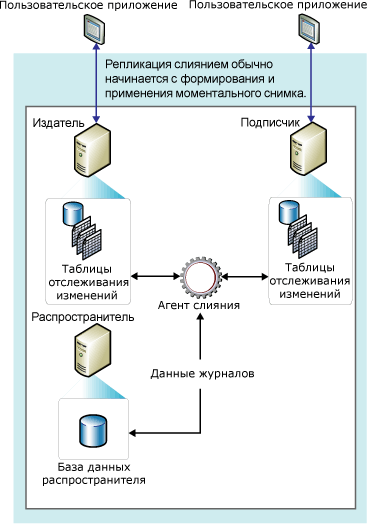

# Репликация слиянием
[!INCLUDE [SQL Server](../../../includes/applies-to-version/sqlserver.md)]
  Репликация слиянием, как и репликация транзакций, как правило, начинается с моментального снимка объектов и данных базы данных публикации. Последующие изменения данных и схемы, произведенные на стороне издателя и подписчиков, отслеживаются при помощи триггеров. Подписчик синхронизируется с издателем при подключении к сети и обменивается с ним всеми строками, которые изменились со времени последней синхронизации издателя и подписчика.  
  
 Как правило, репликация слиянием применяется в средах «сервер-клиент». Репликация слиянием подходит для любой из следующих ситуаций.  
  
-   Несколько подписчиков могут обновлять одни и те же данные в разное время и передавать эти изменения на издатель и на другие подписчики.  
  
-   Подписчикам нужно получить данные, внести изменения в режиме «вне сети» и позднее синхронизировать изменения с издателем и другими подписчиками.  
  
-   Каждому подписчику нужна индивидуальная секция данных.  
  
-   Поскольку возможно возникновение конфликтов, необходимы средства по распознаванию и разрешению конфликтов.  
  
-   Приложению требуется конечное изменение данных, а не доступ к промежуточным состояниям данных. Например, если строка меняется пять раз на подписчике до его синхронизации с издателем, на издателе строка изменится только один раз для отображения конечного изменения данных (то есть, пятого значения).  
  
 Репликация слиянием позволяет различным сайтам работать автономно, и позднее выполнить слияние обновлений в единый результат. Поскольку обновления выполняются на нескольких узлах, одни и те же данные могут быть обновлены издателем и несколькими подписчиками. Поэтому при слиянии обновлений могут возникать конфликты, и репликация слиянием предоставляет несколько способов обработки конфликтов.  
  
 Репликация слиянием реализуется агентом моментальных снимков [!INCLUDE[ssNoVersion](../../../includes/ssnoversion-md.md)] и агентом слияния. Если публикация не отфильтрована или использует статические фильтры, агент слияния создает один моментальный снимок. Если публикация использует параметризованные фильтры, то агент слияния создает моментальный снимок для каждой секции данных. Агент слияния применяет все исходные моментальные снимки на подписчиках. Он также объединяет добавочные изменения данных, которые возникли на издателе или подписчиках после создания исходного моментального снимка, выявляет и разрешает любые конфликты в соответствии с заданными вами правилами.  
  
 Для отслеживания изменений репликация слиянием и репликация транзакций с подписками, обновляемыми посредством очередей, должны быть способны уникально идентифицировать каждую строку в каждой опубликованной таблице. Чтобы этого добиться, при репликации слиянием добавляется столбец **rowguid** в каждую таблицу в том случае, если в них еще нет столбца с типом данных **uniqueidentifier** с набором свойств **ROWGUIDCOL** (в этом случае столбец не используется). Если таблица удалена из публикации, столбец **rowguid** удаляется; если существующий столбец был использован для слежения, столбец не удаляется. Фильтр не должен включать столбец **rowguidcol** , который используется в процессе репликации для идентификации строк. Функция **newid()** формирует значения по умолчанию для столбца **rowguid** , однако заказчики могут предоставить guid для каждой строки, если это необходимо. Однако не следует предоставлять значение 00000000-0000-0000-0000-000000000000.  
  
 В диаграмме ниже показаны компоненты, используемые при репликации слиянием.  
  
   
  
  
