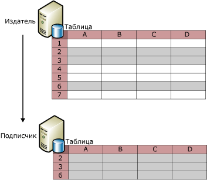
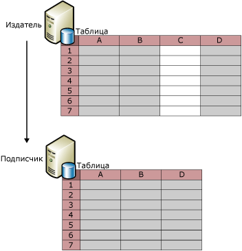
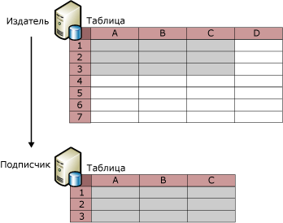

# Фильтрация опубликованных данных
  Фильтрация статей таблиц позволяет создавать секции публикуемых данных. С помощью фильтрации опубликованных данных можно достичь следующих целей:  
  
-   Минимизировать объем данных, передаваемых по сети.  
  
-   Снизить необходимый подписчику объем для хранения.  
  
-   Настраивать публикации и приложения на основе индивидуальных требований подписчиков.  
  
-   Избежать конфликтов или уменьшить их количество, если подписчики обновляют данные, так как различным подписчикам можно отправить различные секции данных (то есть два подписчика не будут обновлять одни и те же значения данных).  
  
-   Избежать передачи конфиденциальных данных. Фильтры строк и фильтры столбцов могут быть использованы для ограничения доступа подписчика к данным. При репликации слиянием может возникать проблема безопасности, если используется параметризованный фильтр, содержащий HOST_NAME(). Дополнительные сведения см. в подразделе «Фильтрация с помощью HOST_NAME()» в [параметризованные фильтры строк](../../../relational-databases/replication/merge/parameterized-row-filters.md).  
  
 Репликация предлагает четыре типа фильтров:  
  
-   Статические фильтры строк, которые доступны со всеми типами репликаций.  
  
     Используя статические фильтры строк, можно выбрать для публикации подмножество строк. Все подписчики на фильтрованную публикацию получают одно и то же подмножество строк фильтрованной таблицы. Дополнительные сведения см. в подразделе «Статические фильтры строк» данного раздела.  
  
-   Фильтры столбцов, доступные со всеми типами репликаций.  
  
     Используя фильтры столбцов, можно выбрать для публикации подмножество столбцов. Дополнительные сведения см. в подразделе «Фильтры столбцов» данного раздела.  
  
-   Параметризованные фильтры строк, доступные только с репликацией слиянием.  
  
     Используя параметризованные фильтры строк, можно выбрать для публикации подмножество строк. В отличие от статических фильтров, которые отправляют одно и то же подмножество строк всем подписчикам, параметризованные фильтры строк используют получаемые от подписчиков значения данных для отправки подписчикам разных подмножеств строк. Дополнительные сведения см. в статье [Parameterized Row Filters](../../../relational-databases/replication/merge/parameterized-row-filters.md).  
  
-   Фильтры соединения, доступные только с репликацией слиянием.  
  
     Используя фильтры соединения, можно расширить фильтр строк с одной публикуемой таблицы на другую. Дополнительные сведения см. в статье [Join Filters](../../../relational-databases/replication/merge/join-filters.md).  
  
## Статические фильтры строк  
 На следующей иллюстрации показана опубликованная таблица, которая отфильтрована так, что в публикацию включаются только строки 2, 3 и 6.  
  
   
  
 Статический строковой фильтр использует предложение WHERE для отбора соответствующих данных для публикации; необходимо указать заключительную часть предложения WHERE. Рассмотрите таблицу **Product** в примере базы данных AdventureWorks, содержащую столбец **ProductLine**. Для публикации только строк с данными о продуктах, относящихся к горным велосипедам, укажите `ProductLine = 'M'`.  
  
 Применение статического фильтра строк приводит к выборке одного набора данных для каждой публикации. В предыдущем примере все подписчики получили бы только строки с данными о продуктах, относящихся к горным велосипедам. Если имеется другой подписчик, которому нужны только строки с данными о продуктах, относящихся к дорожным велосипедам,  
  
-   с помощью репликации моментальных снимков или репликации транзакций можно создать другую публикацию и включить таблицу в обе публикации (в предложении фильтра для статьи в этой публикации укажите `ProductLine = 'R')`.  
  
    > [!NOTE]  
    >  Фильтры строк в публикациях транзакций могут существенно увеличить объем дополнительно выполняемых служебных операций, поскольку предложение фильтра статьи оценивается для каждой строки журнала, записанной для публикуемой таблицы, с целью определения необходимости репликации строки. Необходимо избегать фильтров строк в публикациях транзакций, если каждый узел репликации может поддерживать полную загрузку данных, а общий набор данных достаточно невелик.  
  
-   Вместо создания нескольких публикаций со статическими фильтрами строк используйте с репликацией слиянием параметризованные фильтры строк. Дополнительные сведения см. в статье [Parameterized Row Filters](../../../relational-databases/replication/merge/parameterized-row-filters.md).  
  
 Сведения об определении или изменении статического строкового фильтра см. в разделе [Define and Modify a Static Row Filter](../../../relational-databases/replication/publish/define-and-modify-a-static-row-filter.md).  
  
## Фильтры столбцов  
 На следующей иллюстрации показана публикация, которая отфильтровывает столбец «C».  
  
   
  
 Как показано здесь, можно также применять фильтр строк и фильтр столбцов совместно.  
  
   
  
 После создания публикации можно использовать фильтр столбцов, чтобы удалить столбец из существующей публикации, но сохранить его в таблице у издателя, а также, чтобы включить существующий столбец в публикацию. Для внесения других изменений, например, для добавления нового столбца в таблицу с последующим добавлением этой таблицы в опубликованную статью, используйте репликацию изменения схемы. Дополнительные сведения см. в разделах «Добавление столбцов» и «Удаление столбцов» в разделе [внесение изменений схемы в базах данных публикаций](../../../relational-databases/replication/publish/make-schema-changes-on-publication-databases.md).  
  
 Типы столбцов, перечисленных в следующей таблице, не могут быть отфильтрованы из определенных типов публикаций.  
  
|Тип столбца|Тип публикации и параметры|  
|-----------------|-------------------------------------|  
|Первичный ключевой столбец|Первичные ключевые столбцы требуются во всех таблицах публикации транзакций. Первичные ключи не требуются для таблиц в публикациях слиянием, но если первичный ключевой столбец имеется, то к нему не может быть применен фильтр.|  
|Внешний ключевой столбец|Все публикации создаются с использованием мастера создания публикаций. Внешние ключевые столбцы могут фильтроваться с помощью хранимых процедур Transact-SQL. Дополнительные сведения см. в разделе [Define and Modify a Column Filter](../../../relational-databases/replication/publish/define-and-modify-a-column-filter.md).|  
|Столбец **rowguid**|Публикации слиянием*|  
| **Msrepl_tran_version** столбца|Публикации моментальных снимков или публикации транзакций, разрешающие использование обновляемых подписок|  
|Столбцы, не допускающие значения NULL и не имеющие значений по умолчанию или набора свойств IDENTITY.|Публикации моментальных снимков или публикации транзакций, разрешающие использование обновляемых подписок|  
|Столбцы с уникальными ограничениями или индексами|Публикации моментальных снимков или публикации транзакций, разрешающие использование обновляемых подписок|  
|Все столбцы в публикации слиянием SQL Server 7.0|В публикациях слиянием SQL Server 7.0 к столбцам фильтр применен быть не может.|  
|Отметка времени|Публикации моментальных снимков или публикации транзакций SQL Server 7.0, которые разрешают использование обновляемых подписок|  
  
 \*При публикации таблицы в публикации слиянием и эта таблица уже содержит столбец типа данных **uniqueidentifier** с **ROWGUIDCOL** набор свойств, репликация может использовать этот столбец вместо создания дополнительный столбец с именем **rowguid**. В этом случае должен быть опубликован существующий столбец.  
  
 Чтобы определить или изменить фильтр столбцов, в разделе [определить и изменить фильтр столбца](../../../relational-databases/replication/publish/define-and-modify-a-column-filter.md).  
  
## Вопросы применения фильтров  
 При фильтрации данных учитывайте следующие требования:  
  
-   В публикацию должны быть включены все столбцы, на которые имеются ссылки в фильтрах строк. Иными словами, нельзя использовать фильтр столбцов для исключения столбца, который используется в фильтре строк.  
  
-   Если добавление или изменение фильтра производится после инициализации подписок, то подписки должны быть инициализированы повторно.  
  
-   Максимальное число байтов, разрешенное для столбца, используемого в фильтре, равно 1024 для статьи в публикации слиянием и 8000 для статьи в публикации транзакций.  
  
-   В фильтрах строк или фильтрах соединения не допускаются ссылки на столбцы со следующими типами данных:  
  
    -   **varchar(max) и nvarchar(max)**  
  
    -   **varbinary(max)**  
  
    -   **Text и ntext**  
  
    -   **image**  
  
    -   **XML**  
  
    -   **определяемый пользователем тип**  
  
-   Репликация транзакций позволяет реплицировать индексированное представление либо в виде представления, либо в виде таблицы. Если выполняется репликация представления в виде таблицы, отфильтровать столбцы из таблицы не удастся.  
  
 Фильтры строк не предназначены для работы в нескольких базах данных. [!INCLUDE[ssNoVersion](../../../includes/ssnoversion-md.md)] намеренно ограничивает выполнение **sp_replcmds** (в котором применяются фильтры) владельца базы данных (**dbo**). **dbo** не имеет межбазовых прав доступа. Благодаря добавлению CDC (отслеживания изменений в данных) в [!INCLUDE[ssKatmai](../../../includes/sskatmai-md.md)]  **sp_replcmds** логику для заполнения таблицы, пользователь может вернуться и запроса информации отслеживания изменений. По соображениям безопасности [!INCLUDE[ssNoVersion](../../../includes/ssnoversion-md.md)] ограничивает выполнение этой логики, чтобы злонамеренный **dbo** не highjack этот путь выполнения. Например, злонамеренный **dbo** удалось добавить триггеры в таблицах CDC, которые впоследствии могут сработать в контексте пользователя, вызывающего **sp_replcmds**, в данном случае агента чтения журнала.  Если учетная запись, под которой запущен агент, имеет более высокие права доступа, злонамеренный **dbo** может повысить свой уровень прав.  
  
## См. также:  
 [Публикация данных и объектов базы данных](../../../relational-databases/replication/publish/publish-data-and-database-objects.md)  
  
  