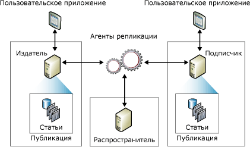

# Обзор модели публикации репликации
[!INCLUDE[appliesto-ss-asdbmi-xxxx-xxx-md](../../../includes/appliesto-ss-asdbmi-xxxx-xxx-md.md)]
  Репликация использует метафору издательского дела, в основе топологии репликации лежат такие компоненты как издатель, распространитель, подписчики, публикации, статьи и подписки. Удобно представить репликацию [!INCLUDE[msCoName](../../../includes/msconame-md.md)] [!INCLUDE[ssNoVersion](../../../includes/ssnoversion-md.md)] с помощью терминологии журнала:  
  
-   Издатель журнала производит одну или несколько публикаций  
  
-   Публикация содержит статьи  
  
-   Издатель или распространяет журнал напрямую, или использует распространитель  
  
-   Подписчики получают публикации, на которые они подписались  
  
 Хотя сравнение с журналом полезно для понимания репликации, следует отметить, что репликация [!INCLUDE[ssNoVersion](../../../includes/ssnoversion-md.md)] включает возможности, которые не представлены в данной метафоре, в частности возможность подписчика выполнять обновления и возможность издателя посылать добавочные изменения в статьи публикации.  
  
 *Топология репликации* определяет отношения между серверами и копиями данных, и проясняет логику, определяющую порядок обмена данными между серверами. Существует несколько процессов репликации (называемых *агентами*), которые отвечают за копирование и перемещение данных между издателем и подписчиками. Следующая иллюстрация представляет собой обзор компонентов и процессов, входящих в репликацию.  
  
   
  
## Издатель  
 Издатель — это экземпляр базы данных, который делает данные доступными в других местах посредством репликации. Издатель может иметь одну или более публикаций, каждая из которых определяет логически связный набор объектов и данных для репликации.  
  
## Распространитель  
 Распространитель — это экземпляр базы данных, который действует как хранилище специальных данных репликации, связанных с одним или несколькими издателями. Каждый издатель связан с одной базой данных (называемой базой данных распространителя), располагающейся на распространителе. База данных распространителя хранит информацию о состоянии репликации, метаданные публикации, и иногда действует как очередь для перемещения данных с издателя на подписчики. Нередко единичный экземпляр сервера базы данных действует одновременно как издатель и как распространитель. Такой сервер базы известен как *локальный распространитель*. Когда издатель и распространитель настроены на разных экземплярах серверов баз данных, распространитель называют *удаленным распространителем*.  
  
## Подписчики  
 Подписчик — это экземпляр базы данных, который получает реплицированные данные. Подписчик может получать данные от нескольких издателей и публикаций. В зависимости от выбранного типа репликации подписчик может также передавать изменения данных издателю или переиздавать эти данные на другие подписчики.  
  
## Статья  
 Статья определяет объект базы данных, включенный в публикацию. Публикация может содержать разные типы статей, включая таблицы, представления, хранимые процедуры и другие объекты. Если таблицы публикуются в виде статей, можно использовать фильтры для ограничения столбцов и строк данных, посылаемых подписчикам.  
  
## Публикация  
 Публикация — это коллекция из одной или нескольких статей, принадлежащих одной базе данных. Группирование нескольких статей в публикацию упрощает указание логически связанного набора объектов и данных базы данных, реплицируемых в виде единого блока.  
  
## Подписка  
 Подписка — это запрос на доставку копии публикации подписчику. Подписка определяет, какая публикация будет получена, где и когда. Существует два типа подписок: по запросу и принудительные. Дополнительные сведения о подписках см. в статье [Подписка на публикации](../../../relational-databases/replication/subscribe-to-publications.md).  
  
## См. также:  
 [Обзор агентов репликации](../../../relational-databases/replication/agents/replication-agents-overview.md)   
 [Types of Replication](../../../relational-databases/replication/types-of-replication.md)   
 [Настройка репликации для групп доступности AlwaysOn (SQL Server)](../../../database-engine/availability-groups/windows/configure-replication-for-always-on-availability-groups-sql-server.md)   
 [Обслуживание базы данных публикации AlwaysOn (SQL Server)](../../../database-engine/availability-groups/windows/maintaining-an-always-on-publication-database-sql-server.md)  
  
  
