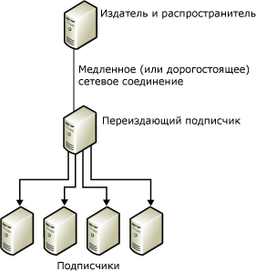
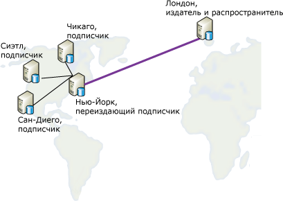

# Повторная публикация данных
  В модели переиздания издатель посылает данные подписчику, который затем переиздает данные для других подписчиков. Эта модель полезна в ситуациях, когда издатель должен отослать данные подписчикам через медленный или дорогостоящий канал передачи данных. Если на другом конце такого канала существует несколько подписчиков, использование переиздающего подписчика позволяет сместить большую часть нагрузки распространения на сторону канала, где находятся подписчики.  
  
 Переиздание данных включает следующие шаги:  
  
1.  Создание публикации на издателе.  
  
2.  Создание подписки на публикацию для переиздающего подписчика.  
  
3.  Инициализация подписки. Подписка должна быть инициализирована до создания публикации на переиздающем подписчике, или репликация завершится ошибкой.  
  
4.  Создание публикации в базе данных подписки на переиздающем подписчике.  
  
5.  Создание подписки на публикацию в переиздающем подписчике для других подписчиков.  
  
6.  Инициализация подписок.  
  
> [!NOTE]  
>  При использовании репликации слиянием в топологии переиздания все переиздающие подписчики должны использовать серверные подписки. Дополнительные сведения о типах подписок см. в статье [Подписка на публикации](../../relational-databases/replication/subscribe-to-publications.md).  
  
 На следующей иллюстрации и издатель, и переиздающий подписчик действуют как свои собственные локальные распространители. Если каждый из них настроен на использование удаленного распространителя, то каждый распространитель должен будет находиться на той же стороне медленного или дорогостоящего канала передачи данных, что и его издатель. Издатели должны быть подключены к удаленным распространителям через надежные высокоскоростные соединения.  
  
   
  
 Любой сервер может выступать как в роли издателя, так и в роли подписчика. Например, рассмотрим следующую диаграмму, на которой публикация таблицы находится в Лондоне и должна распространяться в четыре разных города США: Чикаго, Нью-Йорк, Сан-Диего и Сиэтл. Сервер в Нью-Йорке выбран для подписки на опубликованную таблицу, созданную в Лондоне, т. к. нью-йоркский сайт удовлетворяет следующим условиям.  
  
-   Сетевое соединение с Лондоном относительно надежно.  
  
-   Стоимость связи между Нью-Йорком и Лондоном приемлема.  
  
-   Между Нью-Йорком и сайтами остальных подписчиков в США имеются хорошие линии связи.  
  
       
  
 Репликация поддерживает сценарии переиздания, представленные в следующей таблице.  
  
|Издатель|переиздающий подписчик|Подписчик|  
|---------------|---------------------------|----------------|  
|Публикация транзакций|Подписка на публикацию транзакций или публикация транзакций|Подписка на публикацию транзакций|  
|Публикация транзакций|Транзакционная подписка или публикация слиянием*|Подписка на публикацию слиянием|  
|Публикация слиянием|Подписка на публикацию слиянием или публикация слиянием|Подписка на публикацию слиянием|  
|Публикация слиянием|Подписка на публикацию слиянием или публикация транзакций|Подписка на публикацию транзакций|  
  
 \*Для публикаций слиянием следует установить свойство **@published_in_tran_pub**. По умолчанию репликация транзакций исключает таблицы на подписчике, которые будут обрабатываться как доступные только для чтения. Если репликация слиянием производит изменения данных в какой-либо таблице подписки на публикацию транзакций, то может возникнуть несогласованность данных. Чтобы избежать этой ситуации, рекомендуется, чтобы любые подобные таблицы задавались в публикации слиянием с атрибутом «только для загрузки». Это защищает подписчика на публикацию слиянием от передачи измененных данных в таблицу. Дополнительные сведения см. в статье [Оптимизация производительности репликации слиянием при работе со статьями, доступными только для загрузки](../../relational-databases/replication/merge/optimize-merge-replication-performance-with-download-only-articles.md).  
  
## См. также:  
 [Настройка распространения](../../relational-databases/replication/configure-distribution.md)   
 [Публикация данных и объектов базы данных](../../relational-databases/replication/publish/publish-data-and-database-objects.md)   
 [Подписка на публикации](../../relational-databases/replication/subscribe-to-publications.md)   
 [Инициализация подписки](../../relational-databases/replication/initialize-a-subscription.md)   
 [Синхронизация данных](../../relational-databases/replication/synchronize-data.md)  
  
  
