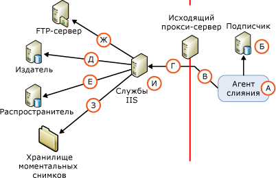

# Архитектура безопасности для веб-синхронизации
[!INCLUDE[appliesto-ss-xxxx-xxxx-xxx-md](../../../includes/appliesto-ss-xxxx-xxxx-xxx-md.md)] [!INCLUDE[msCoName](../../../includes/msconame-md.md)] [!INCLUDE[ssNoVersion](../../../includes/ssnoversion-md.md)] поддерживает детализированную настройку безопасности веб-синхронизации. В этом разделе представлен подробный список всех компонентов, которые можно включать в настройку веб-синхронизации, и сведения о соединениях между компонентами. [!INCLUDE[ssNoteWinAuthentication](../../../includes/ssnotewinauthentication-md.md)]  
  
 На следующем рисунке показаны все возможные соединения, однако некоторые из них могут быть не обязательны в определенной топологии. Например, соединение с сервером FTP требуется, только если моментальный снимок доставляется по протоколу FTP.  
  
   
  
 В следующей таблице представлены компоненты и соединения, показанные на рисунке.  
  
## A. Пользователь Windows, под учетной записью которого выполняется агент слияния  
 Во время синхронизации агент слияния (А) запускается на подписчике. Агент слияния можно запустить на определенном шаге задания агента [!INCLUDE[ssNoVersion](../../../includes/ssnoversion-md.md)] или из изолированного пользовательского приложения. Если агент слияния запускается на шаге задания агента [!INCLUDE[ssNoVersion](../../../includes/ssnoversion-md.md)] , агент слияния выполняется в контексте заданного пользователя Windows. Если пользователь Windows не задан, агент слияния выполняется в контексте учетной записи службы Windows для агента [!INCLUDE[ssNoVersion](../../../includes/ssnoversion-md.md)] .  
  
|Тип учетной записи|Где задана учетная запись|  
|---------------------|------------------------------------|  
|Пользователь Windows|[!INCLUDE[tsql](../../../includes/tsql-md.md)]: параметры **@job_login** и **@job_password** процедуры [sp_addmergepullsubscription_agent](../../../relational-databases/system-stored-procedures/sp-addmergepullsubscription-agent-transact-sql.md).   Объекты RMO: свойства <xref:Microsoft.SqlServer.Replication.IProcessSecurityContext.Login%2A> и <xref:Microsoft.SqlServer.Replication.IProcessSecurityContext.Password%2A> для <xref:Microsoft.SqlServer.Replication.PullSubscription.SynchronizationAgentProcessSecurity%2A>.|  
|Учетная запись службы Windows для агента [!INCLUDE[ssNoVersion](../../../includes/ssnoversion-md.md)]|Диспетчер конфигурации[!INCLUDE[ssNoVersion](../../../includes/ssnoversion-md.md)] |  
|Изолированное приложение|Агент слияния выполняется в контексте пользователя Windows, который выполняет это приложение|  
  
## Б. Соединение с подписчиком  
 Агент слияния соединяется с подписчиком, используя проверку подлинности Windows или проверку подлинности [!INCLUDE[ssNoVersion](../../../includes/ssnoversion-md.md)] . Пользователь Windows или заданное имя входа [!INCLUDE[ssNoVersion](../../../includes/ssnoversion-md.md)] должны быть связаны с пользователем базы данных, который является членом предопределенной роли базы данных **dbowner** в базе данных подписки.  
  
> [!NOTE]  
>  Если агент слияния запускается из задания агента [!INCLUDE[ssNoVersion](../../../includes/ssnoversion-md.md)] , всегда используется проверка подлинности Windows. При запуске агента слияния программным способом также применяется проверка подлинности Windows (кроме тех случаев, когда была явным образом задана проверка подлинности [!INCLUDE[ssNoVersion](../../../includes/ssnoversion-md.md)] ).  
  
|Тип проверки подлинности|Где задана проверка подлинности|  
|----------------------------|-------------------------------------------|  
|Проверка подлинности Windows.|Агент слияния устанавливает соединение в контексте пользователя Windows, заданного для агента слияния (А)|  
|Проверка подлинности[!INCLUDE[ssNoVersion](../../../includes/ssnoversion-md.md)] используется только в том случае, если задано следующее.   — Объекты RMO: значение <xref:Microsoft.SqlServer.Replication.SecurityMode.Standard> для свойства <xref:Microsoft.SqlServer.Replication.MergeSynchronizationAgent.SubscriberSecurityMode%2A>. Командная строка агента слияния: значение **0** для параметра **SubscriberSecurityMode**.|Объекты RMO: <xref:Microsoft.SqlServer.Replication.MergeSynchronizationAgent.SubscriberLogin%2A> и <xref:Microsoft.SqlServer.Replication.MergeSynchronizationAgent.SubscriberPassword%2A>.   Командная строка агента слияния: **-SubscriberLogin** и **-SubscriberLogin**.|  
  
## В. Соединение с исходящим прокси-сервером  
 Пользователь Windows для этого соединения задается только в том случае, если имеется исходящий прокси-сервер, ограничивающий доступ к внутренней сети подписчика.  
  
|Тип проверки подлинности|Где задана проверка подлинности|  
|----------------------------|-------------------------------------------|  
|Проверка подлинности Windows.|RMO: <xref:Microsoft.SqlServer.Replication.MergeSynchronizationAgent.InternetProxyLogin%2A> и <xref:Microsoft.SqlServer.Replication.MergeSynchronizationAgent.InternetProxyPassword%2A> вместе с <xref:Microsoft.SqlServer.Replication.MergeSynchronizationAgent.InternetProxyServer%2A>.   Командная строка агента слияния: **-InternetProxyLogin** и **-InternetProxyPassword** с **-InternetProxyServer**.|  
  
## Г. Соединение со службами IIS  
 После соединения с подписчиком и извлечения всех изменений в базе данных подписки агент слияния делает запрос по протоколу HTTPS к службам [!INCLUDE[msCoName](../../../includes/msconame-md.md)] Internet Information Services (IIS) и загружает изменение данных в виде XML-сообщения. Агент слияния должен иметь разрешения входа для служб IIS.  
  
|Тип проверки подлинности|Где задана проверка подлинности|  
|----------------------------|-------------------------------------------|  
|Используется обычная проверка подлинности, если задано одно из следующих значений:   -   [!INCLUDE[tsql](../../../includes/tsql-md.md)]: значение **0** для параметра **@internet_security_mode** хранимой процедуры [sp_addmergepullsubscription_agent](../../../relational-databases/system-stored-procedures/sp-addmergepullsubscription-agent-transact-sql.md). — Объекты RMO: значение <xref:Microsoft.SqlServer.Replication.SecurityMode.Standard> для свойства <xref:Microsoft.SqlServer.Replication.MergeSynchronizationAgent.InternetSecurityMode%2A>. Командная строка агента слияния: значение **0** для параметра **-InternetSecurityMode**.|[!INCLUDE[tsql](../../../includes/tsql-md.md)]: параметры **@internet_login** и **@internet_password** процедуры [sp_addmergepullsubscription_agent](../../../relational-databases/system-stored-procedures/sp-addmergepullsubscription-agent-transact-sql.md).   Объекты RMO: <xref:Microsoft.SqlServer.Replication.MergeSynchronizationAgent.InternetLogin%2A> и <xref:Microsoft.SqlServer.Replication.MergeSynchronizationAgent.InternetPassword%2A>.   Командная строка агента слияния: **-InternetLogin** и **-InternetPassword**.|  
|Встроенная проверка подлинности1 используется в том случае, если задано одно из следующих значений:   -   [!INCLUDE[tsql](../../../includes/tsql-md.md)]: значение **1** для параметра **@internet_security_mode** хранимой процедуры [sp_addmergepullsubscription_agent](../../../relational-databases/system-stored-procedures/sp-addmergepullsubscription-agent-transact-sql.md). — Объекты RMO: значение <xref:Microsoft.SqlServer.Replication.SecurityMode.Integrated> для свойства <xref:Microsoft.SqlServer.Replication.MergeSynchronizationAgent.InternetSecurityMode%2A>. Командная строка агента слияния: значение **1** для параметра **-InternetSecurityMode**.|Агент слияния устанавливает соединение в контексте пользователя Windows, заданного для агента слияния (А)|  
  
 1 Встроенная проверка подлинности может использоваться только в том случае, если все компьютеры принадлежат к одному домену или к нескольким доменам, имеющим доверительные связи друг с другом.  
  
> [!NOTE]  
>  При использовании встроенной проверки подлинности требуется делегирование. Для соединений от подписчика к серверу IIS рекомендуется использовать обычную проверку подлинности и протокол SSL.  
  
## Д. Соединение с издателем  
 Компоненты средства прослушивания репликации [!INCLUDE[ssNoVersion](../../../includes/ssnoversion-md.md)] и посредника репликации слиянием находятся на сервере IIS. Эти компоненты выполняют следующие действия:  
  
-   Получают HTTPS-запрос, описанный в разделе «Г. Соединение со службами IIS».  
  
-   Выполняют SQL-соединение с базой данных публикации и применяют к ней загруженные изменения.  
  
-   Извлекают загруженные в базу данных изменения и отправляют HTTPS-ответ обратно агенту слияния.  
  
 Посредник репликации слиянием соединяется с издателем, используя или проверку подлинности Windows, или проверку подлинности [!INCLUDE[ssNoVersion](../../../includes/ssnoversion-md.md)] . Пользователь Windows или заданное имя входа [!INCLUDE[ssNoVersion](../../../includes/ssnoversion-md.md)] должны удовлетворять следующим требованиям.  
  
-   Быть в списке доступа к публикации (PAL). Дополнительные сведения см. в статье [Организация безопасности издателя](../../../relational-databases/replication/security/secure-the-publisher.md).  
  
-   Быть связанными с пользователем в базе данных публикации.  
  
|Тип проверки подлинности|Где задана проверка подлинности|  
|----------------------------|-------------------------------------------|  
|Проверка подлинности Windows используется, если задано одно из следующих значений:   -   [!INCLUDE[tsql](../../../includes/tsql-md.md)]: значение **1** для параметра **@publisher_security_mode** хранимой процедуры [sp_addmergepullsubscription_agent](../../../relational-databases/system-stored-procedures/sp-addmergepullsubscription-agent-transact-sql.md). — Объекты RMO: значение <xref:Microsoft.SqlServer.Replication.SecurityMode.Integrated> для свойства <xref:Microsoft.SqlServer.Replication.MergeSynchronizationAgent.PublisherSecurityMode%2A>. Командная строка агента слияния: значение **1** для параметра **-PublisherSecurityMode**.|Агент слияния соединяется с издателем в контексте пользователя Windows, заданного для соединения со службами IIS (Г). Если издатель и службы IIS находятся на разных компьютерах и для соединения используется встроенная проверка подлинности (Г), на сервере IIS необходимо включить делегирование Kerberos. Дополнительные сведения см. в документации по Windows.|  
|Проверка подлинности[!INCLUDE[ssNoVersion](../../../includes/ssnoversion-md.md)] используется, если задано одно из следующих значений:   -   [!INCLUDE[tsql](../../../includes/tsql-md.md)]: значение **0** для параметра **@publisher_security_mode** хранимой процедуры [sp_addmergepullsubscription_agent](../../../relational-databases/system-stored-procedures/sp-addmergepullsubscription-agent-transact-sql.md). — Объекты RMO: значение <xref:Microsoft.SqlServer.Replication.SecurityMode.Standard> для свойства <xref:Microsoft.SqlServer.Replication.MergeSynchronizationAgent.PublisherSecurityMode%2A>. Командная строка агента слияния: значение **0** для параметра **-PublisherSecurityMode**.|[!INCLUDE[tsql](../../../includes/tsql-md.md)]: параметры **@publisher_login** и **@publisher_password** процедуры [sp_addmergepullsubscription_agent](../../../relational-databases/system-stored-procedures/sp-addmergepullsubscription-agent-transact-sql.md).   Объекты RMO: <xref:Microsoft.SqlServer.Replication.MergeSynchronizationAgent.PublisherLogin%2A> и <xref:Microsoft.SqlServer.Replication.MergeSynchronizationAgent.PublisherPassword%2A>.   Командная строка агента слияния: **-PublisherLogin** и **-PublisherPassword**.|  
  
## Е. Соединение с распространителем  
 Посредник репликации слиянием, находящийся на сервере IIS, также соединяется с распространителем. Посредник репликации слиянием соединяется с распространителем, используя или проверку подлинности Windows, или проверку подлинности [!INCLUDE[ssNoVersion](../../../includes/ssnoversion-md.md)] . Пользователь Windows или заданное имя входа [!INCLUDE[ssNoVersion](../../../includes/ssnoversion-md.md)] должны удовлетворять следующим требованиям.  
  
-   Быть в списке доступа к публикации (PAL). Дополнительные сведения см. в статье [Организация безопасности издателя](../../../relational-databases/replication/security/secure-the-publisher.md).  
  
-   Быть связанными с пользователем в базе данных распространителя. Пользователь может иметь учетную запись **Guest** .  
  
 Хранилище моментальных снимков обычно находится на распространителе. Для получения дополнительных сведений о хранилищах моментальных снимков см. подраздел «З. Доступ к хранилищу моментального снимка» ниже в этом разделе.  
  
|Тип проверки подлинности|Где задана проверка подлинности|  
|-------------------------------|-------------------------------------------|  
|Проверка подлинности Windows используется, если задано одно из следующих значений:   -   [!INCLUDE[tsql](../../../includes/tsql-md.md)]: значение **1** для параметра **@distributor_security_mode** хранимой процедуры [sp_addmergepullsubscription_agent](../../../relational-databases/system-stored-procedures/sp-addmergepullsubscription-agent-transact-sql.md). — Объекты RMO: значение <xref:Microsoft.SqlServer.Replication.SecurityMode.Integrated> для свойства <xref:Microsoft.SqlServer.Replication.MergeSynchronizationAgent.DistributorSecurityMode%2A>. Командная строка агента слияния: значение **1** для параметра **-DistributorSecurityMode**.|Агент слияния соединяется с распространителем в контексте пользователя Windows, заданного для соединения со службами IIS (Г). Если распространитель и службы IIS находятся на разных компьютерах и для соединения используется встроенная проверка подлинности (Г), на сервере IIS необходимо включить делегирование Kerberos. Дополнительные сведения см. в документации по Windows.|  
|Проверка подлинности[!INCLUDE[ssNoVersion](../../../includes/ssnoversion-md.md)] используется, если задано одно из следующих значений:   -   [!INCLUDE[tsql](../../../includes/tsql-md.md)]: значение **0** для параметра **@distributor_security_mode** хранимой процедуры [sp_addmergepullsubscription_agent](../../../relational-databases/system-stored-procedures/sp-addmergepullsubscription-agent-transact-sql.md). — Объекты RMO: значение <xref:Microsoft.SqlServer.Replication.SecurityMode.Standard> для свойства <xref:Microsoft.SqlServer.Replication.MergeSynchronizationAgent.DistributorSecurityMode%2A>. Командная строка агента слияния: значение **0** для параметра **-DistributorSecurityMode**.|[!INCLUDE[tsql](../../../includes/tsql-md.md)]: параметры **@distributor_login** и **@distributor_password** процедуры [sp_addmergepullsubscription_agent](../../../relational-databases/system-stored-procedures/sp-addmergepullsubscription-agent-transact-sql.md).   RMO: <xref:Microsoft.SqlServer.Replication.MergeSynchronizationAgent.DistributorLogin%2A> и <xref:Microsoft.SqlServer.Replication.MergeSynchronizationAgent.DistributorPassword%2A>   Командная строка агента слияния: **-DistributorLogin** и **-DistributorPassword**.|  
  
## Ж. Соединение с FTP-сервером  
 Пользователь Windows для этого соединения задается, только если файлы моментального снимка загружаются с FTP-сервера (а не из сетевой папки) на сервер IIS перед тем, как применить этот моментальный снимок к подписчику. Дополнительные сведения см. в статье [Передача моментальных снимков через FTP](../../../relational-databases/replication/transfer-snapshots-through-ftp.md).  
  
|Тип проверки подлинности|Где задана проверка подлинности|  
|----------------------------|-------------------------------------------|  
|Проверка подлинности Windows.|[!INCLUDE[tsql](../../../includes/tsql-md.md)]: параметры **@ftp_login** и **@ftp_password** процедуры [sp_addmergepublication](../../../relational-databases/system-stored-procedures/sp-addmergepublication-transact-sql.md).   Объекты RMO: <xref:Microsoft.SqlServer.Replication.Publication.FtpLogin%2A> и <xref:Microsoft.SqlServer.Replication.Publication.FtpPassword%2A>.|  
  
## З. Доступ к хранилищу моментальных снимков  
 Доступ к хранилищу моментальных снимков осуществляется посредником репликации слиянием, который находится на сервере IIS.  
  
|Тип проверки подлинности|Где задана проверка подлинности|  
|----------------------------|-------------------------------------------|  
|Проверка подлинности Windows.|Агент слияния соединяется с хранилищем моментального снимка в контексте пользователя Windows, заданного для соединения со службами IIS (Г). Если хранилище моментальных снимков и службы IIS находятся на разных компьютерах и для соединения используется встроенная проверка подлинности (Г), на сервере IIS необходимо включить делегирование Kerberos. Дополнительные сведения см. в документации по Windows.|  
  
## И. Учетная запись пула приложений для служб IIS  
 Эта учетная запись используется для запуска процесса W3wp.exe на сервере IIS для [!INCLUDE[winxpsvr](../../../includes/winxpsvr-md.md)] или процесса Dllhost.exe для [!INCLUDE[win2kfamily](../../../includes/win2kfamily-md.md)]. Эти процессы содержат приложения сервера IIS, например средство прослушивания репликации [!INCLUDE[ssNoVersion](../../../includes/ssnoversion-md.md)] и посредник репликации слиянием. Эта учетная запись должна иметь разрешения на чтение и выполнение следующих DLL-библиотек репликации на сервере IIS:  
  
-   Replisapi  
  
-   Replrec  
  
-   Replprov  
  
-   Msgprox  
  
-   Xmlsub  
  
 Эта учетная запись должна быть также членом группы IIS_WPG. Дополнительные сведения см. в разделе "Установка разрешений для средства прослушивания репликации [!INCLUDE[ssNoVersion](../../../includes/ssnoversion-md.md)]" статьи [Настройка служб IIS для веб-синхронизации](../../../relational-databases/replication/configure-iis-for-web-synchronization.md).  
  
|Тип учетной записи|Где задана учетная запись|  
|---------------------|------------------------------------|  
|Нужное разрешение имеют все пользователи Windows.|Диспетчер служб IIS. |  
  
## См. также:  
 [Configure Web Synchronization](../../../relational-databases/replication/configure-web-synchronization.md)   
 [Replication Merge Agent](../../../relational-databases/replication/agents/replication-merge-agent.md)  
  
  
