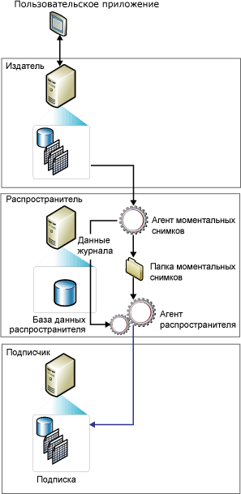

# Репликация моментальных снимков
  Репликация моментальных снимков распространяет данные точно в том виде, в котором они были представлены в определенный момент времени, и не наблюдает за обновлением этих данных. Во время синхронизации формируется моментальный снимок и отсылается подписчикам целиком.  
  
> [!NOTE]  
>  Репликация моментальных снимков может использоваться сама по себе, но процесс создания моментального снимка (который создает копию всех объектов и данных, заданных публикацией) также часто используется для предоставления первоначального набора данных и объектов базы данных для публикации транзакций и публикации слиянием.  
  
 Использование репликации моментальных снимков самой по себе наиболее приемлемо, когда выполняется одно или несколько следующих условий:  
  
-   Данные изменяются редко.  
  
-   Допустимо на определенный период времени иметь копии данных, устаревших по отношению к издателю.  
  
-   Репликация небольших объемов данных.  
  
-   Большой объем изменений производится за короткий период времени.  
  
 Репликация моментальных снимков наиболее приемлема, если изменения данных значительны, но редки. Например, если торговая организация ведет прайс-лист на товары, и цены обновляются в одно и то же время раз или два раза в год, рекомендуется производить репликацию всего моментального снимка данных после их изменений. При наличии определенных типов данных наиболее подходящими могут быть более частые моментальные снимки. Например, если относительно небольшая таблица обновляется на издателе в течение дня, но допустима некоторая задержка, то изменения могут доставляться ночью в виде моментального снимка.  
  
 Репликация моментальных снимков создает более низкую непрерывную нагрузку на издателе, чем репликация транзакций, поскольку добавочные изменения не отслеживаются. Однако если реплицируемый набор данных очень большой, для создания и применения моментального снимка потребуется значительное количество ресурсов. Стоит рассмотреть общий размер набора данных и частоту изменений данных при оценке необходимости использования репликации моментальных снимков.  
  
 **В этом разделе**  
  
 [Принцип работы репликации моментальных снимков](#HowWorks)  
  
 [агент моментальных снимков](#SnapshotAgent)  
  
 [Агенты распространителя и слияния](#DistAgent)  
  
##   Принцип работы репликации моментальных снимков  
 По умолчанию все три типа репликации для инициализации подписчиков используют моментальный снимок. Агент моментальных снимков [!INCLUDE[ssNoVersion](../../includes/ssnoversion-md.md)] всегда создает файлы моментальных снимков, но агент, доставляющий файлы, меняется в зависимости от используемого типа репликации. Репликация моментальных снимков и репликация транзакций используют для доставки этих файлов агент распространителя, в то время как репликация слиянием использует агент слияния [!INCLUDE[ssNoVersion](../../includes/ssnoversion-md.md)] . Агент моментальных снимков выполняется на распространителе. Агент распространителя и агент слияния выполняются на распространителе для принудительных подписок и на подписчиках для подписок по запросу.  
  
 Моментальные снимки могут создаваться и применяться или непосредственно после создания подписки, или в соответствии с расписанием, установленным при создании публикации. Агент моментальных снимков подготавливает файлы моментального снимка, содержащие схему и данные опубликованных таблиц и объектов базы данных, сохраняет эти файлы в папке моментальных снимков для издателя и записывает данные слежения в базу данных распространителя на распространителе. При настройке распространителя указывается папка моментальных снимков по умолчанию, но можно указать и другое расположение публикации вместо или дополнительно к расположению по умолчанию.  
  
 В дополнение к стандартному процессу создания моментального снимка, описанному в этом подразделе, для публикаций слиянием с параметризованными фильтрами используется процесс создания моментального снимка из двух частей.  
  
 На следующей иллюстрации показаны основные компоненты репликации моментальных снимков.  
  
   
  
##   агент моментальных снимков  
 Для репликации слиянием моментальный снимок формируется при каждом запуске агента моментальных снимков. Для репликации транзакций формирование моментального снимка зависит от значения свойства публикации **immediate_sync**. Если значение свойства установлено в TRUE (значение по умолчанию при использовании мастера создания публикаций), моментальный снимок создается при каждом запуске агента моментальных снимков и может быть применен к подписчику в любое время. Если свойство имеет значение FALSE (значение по умолчанию при использовании **sp_addpublication**), моментальный снимок создается только в том случае, если был добавлен новую подписку с момента запуска последнего агента моментальных снимков; Подписчики должны ждать завершения синхронизации агента моментальных снимков.  
  
 Агент моментальных снимков выполняет следующие шаги:  
  
1.  Устанавливает соединение распространителя с издателем, а затем, если это необходимо, блокирует публикуемые таблицы:  
  
    -   Для публикаций слиянием агент моментальных снимков не устанавливает никаких блокировок.  
  
    -   Для публикаций транзакций агент моментальных снимков по умолчанию устанавливает блокировки только на начальной фазе формирования моментального снимка.  
  
    -   Для публикаций моментальных снимков блокировки удерживаются на всем протяжении процесса формирования моментального снимка.  
  
2.  Записывает копию схемы таблиц для каждой статьи в sch-файл. Если публикуются другие объекты базы данных, например индексы, ограничения, хранимые процедуры, представления, пользовательские функции и тому подобное, формируются дополнительные файлы скриптов.  
  
3.  Копирует данные из опубликованной таблицы на издателе и записывает данные в папку моментальных снимков. Моментальный снимок формируется как набор файлов программы массового копирования (BCP).  
  
4.  Для моментальных снимков и публикаций транзакций агент моментальных снимков присоединяет строки к **MSrepl_commands** и **MSrepl_transactions** таблицы в базе данных распространителя. Записи в **MSrepl_commands** представляют собой команды, указывающий местоположение .sch и .bcp файлы, файлы моментальных снимков и ссылки на все сценарии до или после моментального снимка. Записи в **MSrepl_transactions** представляют собой команды, относящиеся к синхронизации подписчика.  
  
     Для публикаций слиянием агент моментальных снимков выполняет дополнительные шаги.  
  
5.  Снимает любые блокировки с опубликованных таблиц.  
  
 Во время формирования моментального снимка нельзя внести изменения в схемы опубликованных таблиц. После того как файлы моментального снимка сформированы, их можно просмотреть в папке моментальных снимков с помощью проводника Windows.  
  
##   Агент распространителя и агент слияния  
 В случае публикаций моментальных снимков, каждый раз, когда для публикации выполняется агент распространителя, он перемещает новый моментальный снимок каждому подписчику, который еще не был синхронизирован, был отмечен для повторной инициализации или включает новые статьи.  
  
 В случае репликации моментальных снимков и репликации транзакций агент распространителя выполняет следующие шаги:  
  
1.  Устанавливает соединение с распространителем.  
  
2.  Проверяет **MSrepl_commands** и **MSrepl_transactions** таблицы в базе данных распространителя на распространителе. Агент считывает местонахождение файлов моментального снимка из первой таблицы и команды синхронизации подписчика из обеих таблиц.  
  
3.  Применяет схему и команды к базе данных подписки.  
  
 В случае отсутствия фильтрации для публикации репликации слиянием агент слияния выполняет следующие шаги:  
  
1.  Устанавливает соединение с издателем.  
  
2.  Анализирует таблицу **sysmergeschemachange** на издателе и определяет, существует ли новый моментальный снимок, который следует применить на подписчике.  
  
3.  Если доступен новый моментальный снимок, агент слияния применяет к базе данных подписки файлы моментального снимка из местоположения, указанного параметром **sysmergeschemachange**.  
  
  