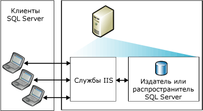
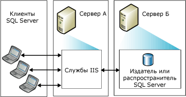
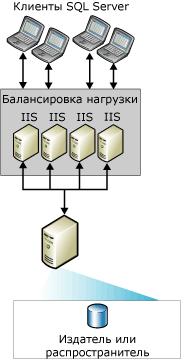
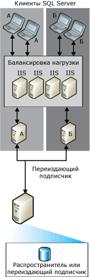

# Топологии для веб-синхронизации
  Существует несколько топологий репликации [!INCLUDE[msCoName](../../includes/msconame-md.md)] [!INCLUDE[ssNoVersion](../../includes/ssnoversion-md.md)] для веб-синхронизации. Наиболее часто используемые способы настройки веб-синхронизации включают в себя следующие.  
  
-   Одиночный сервер  
  
-   Два сервера  
  
-   Несколько системы на основе служб [!INCLUDE[msCoName](../../includes/msconame-md.md)] IIS и переиздание с помощью [!INCLUDE[ssNoVersion](../../includes/ssnoversion-md.md)]  
  
 Сведения о настройке веб-синхронизации см. в разделе [настройки веб-синхронизации](../../relational-databases/replication/configure-web-synchronization.md).  
  
## Одиночный сервер  
 В самой простой топологии, службах IIS, издатель [!INCLUDE[ssNoVersion](../../includes/ssnoversion-md.md)] и распространитель [!INCLUDE[ssNoVersion](../../includes/ssnoversion-md.md)] вместе находятся на одиночном сервере. Подписчики осуществляют синхронизацию, подключаясь к службам IIS на издателе. Издатель может быть защищен брандмауэром.  
  
> [!NOTE]  
>  Данная конфигурация рекомендуется только для сценариев, использующих корпоративные сети. Для других сценариев рекомендуется, чтобы сервер IIS и издатель/распространитель [!INCLUDE[ssNoVersion](../../includes/ssnoversion-md.md)] находились на разных компьютерах.  
  
   
  
## Два сервера  
 Можно установить службы IIS на один сервер и настроить издатель и распространитель [!INCLUDE[ssNoVersion](../../includes/ssnoversion-md.md)] на другом сервере. Сервер, на котором запускаются службы IIS, может быть изолирован от Интернета брандмауэром. Подписчики осуществляют синхронизацию, подключаясь к службам IIS.  
  
   
  
## Несколько систем IIS и переиздание с помощью SQL Server  
 При необходимости поддержки очень большого количества подписчиков, одновременно осуществляющих синхронизацию, можно разделить работу между несколькими компьютерам, на которых выполняются службы IIS.  
  
   
  
 Если требуется дополнительная балансировка нагрузки на компьютере, использующем [!INCLUDE[ssNoVersion](../../includes/ssnoversion-md.md)], можно создать иерархию переиздания на нескольких компьютерах. Издатель верхнего уровня публикует данные на подписчики, которые, в свою очередь, переиздают данные, осуществляя выравнивание нагрузки при обработке запросов от подписчиков.  
  
> [!NOTE]  
>  Подписчики могут синхронизироваться только с конкретным издателем. Например, подписчик на переиздающий подписчик A не может синхронизироваться с переиздающим подписчиком Б, если переиздающий подписчик А недоступен.  
  
   
  
## См. также:  
 [Настройка веб-синхронизации](../../relational-databases/replication/configure-web-synchronization.md)   
 [Веб-синхронизация для репликации слиянием](../../relational-databases/replication/web-synchronization-for-merge-replication.md)  
  
  