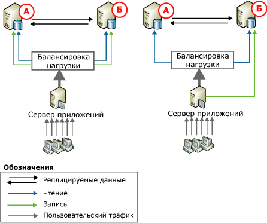
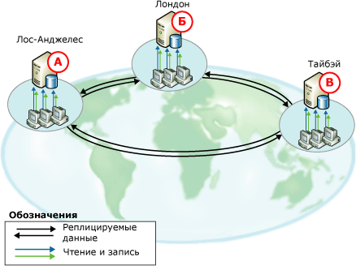
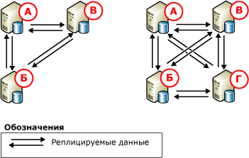

# Одноранговая репликация транзакций
[!INCLUDE[tsql-appliesto-ss2008-xxxx-xxxx-xxx_md](../../../includes/tsql-appliesto-ss2008-xxxx-xxxx-xxx-md.md)]

  — Одноранговая репликация обеспечивает решение масштабирования и высокого уровня доступности, сохраняя копии данных на нескольких экземплярах сервера, также называемая *узлы*. Одноранговая репликация, основанная на репликации транзакций, распространяет согласованные на уровне транзакций изменения почти в реальном времени. Это позволяет приложениям, для которых требуется масштабируемость операций чтения, распределять клиентские операции чтения на несколько узлов. Поскольку данные сохраняются на узлах почти в режиме реального времени, одноранговая репликация обеспечивает избыточность данных, что повышает доступность данных.  
  
 Рассмотрим веб-приложение. В этом случае извлечь выгоду из одноранговой репликации можно следующими способами.  
  
-   Запросы к каталогам и другие операции чтения распределяются на нескольких узлах. Тем самым повышается производительность и сохраняется согласованность.  
  
-   Если один из узлов в системе выходит из строя, уровень приложения может перенаправить операции записи на другой узел. Это позволяет сохранить доступность данных.  
  
-   Если узлу требуется обслуживание или вся система нуждается в обновлении, каждый узел можно перевести в режим «вне сети», а затем опять добавить к системе, не затрагивая доступность приложения.  
  
 Хотя одноранговая репликация позволяет масштабировать операции чтения, производительность операций записи для топологии такая же, как для одного узла. Это объясняется тем, что в конце концов все операции вставки, обновления и удаления распространяются на все узлы. Примененное к данному узлу изменение распознается репликацией, что предотвращает выполнение изменений на узлах более одного раза. Настоятельно рекомендуется выполнять операции записи для каждой строки только на одном узле по следующим причинам.  
  
-   Если строка изменяется на нескольких узлах, это может вызвать конфликт или даже потерю обновления, когда эта строка передается на другие узлы.  
  
-   При репликации изменений всегда существует некоторая задержка. Для приложений, которым требуется немедленно отслеживать последние изменения, равномерное распределение динамической загрузки может оказаться проблематичным.  
  
 Одноранговая репликация содержит возможность включить обнаружение конфликтов во всей одноранговой топологии. Эта возможность помогает избежать проблем, которые вызываются необнаруженными конфликтами, в том числе недопустимым поведением приложения и потерянными обновлениями. При включенном обнаружении конфликтов конфликтующее изменение по умолчанию рассматривается как критическая ошибка, вызывающая сбой агента распространителя. В случае конфликта топология остается в несогласованном состоянии, пока конфликт не будет разрешен вручную, а данные согласованы во всей топологии. Дополнительные сведения см. в разделе [Обнаружение конфликтов в репликации Peer-to-Peer](../../../relational-databases/replication/transactional/conflict-detection-in-peer-to-peer-replication.md).  
  
> [!NOTE]  
>  Чтобы избежать возможной несогласованности данных, убедитесь, что в одноранговой топологии отсутствуют конфликты, даже при включенном обнаружении конфликтов. Чтобы операции записи выполнялись только на одном узле, приложения, получающие доступ к данным и изменяющие их, должны секционировать операции вставки, обновления и удаления. Такое секционирование обеспечивает тот факт, что изменения конкретной строки на одном узле синхронизируются с остальными узлами в топологии, прежде чем эта строка будет изменена другим узлом. Если приложению требуется усложненное обнаружение конфликтов, используйте репликацию слиянием. Дополнительные сведения см. в разделе [репликации слиянием](../../../relational-databases/replication/merge/merge-replication.md) и [Обнаружение и разрешение конфликтов репликации слиянием](../../../relational-databases/replication/merge/detect-and-resolve-merge-replication-conflicts.md).  
  
## Одноранговые топологии  
 Типичные способы использования одноранговой репликации проиллюстрированы следующими сценариями.  
  
### Топология с двумя участвующими базами данных  
   
  
 На обоих приведенных выше рисунках показаны две участвующие базы данных и пользовательский трафик, направленный к базам данных через сервер приложений. Такую конфигурацию можно использовать для различных приложений — от веб-сайтов до приложений рабочих групп. Это позволяет получить следующие преимущества.  
  
-   Улучшенная производительность операции чтения, так как чтение распределено на два сервера.  
  
-   Более высокая доступность при необходимости обслуживания или в случае сбоя одного из узлов.  
  
 На обеих иллюстрациях операция чтения между участвующими базами данных сбалансирована, но обновления обрабатываются разными способами:  
  
-   Слева операции обновления секционируются между двумя серверами. Если база данных содержит каталог продукции, можно, например, создать пользовательское приложение, направляющее обновления продуктов, начинающихся символами с «А» до «М», на узел **A** , а обновления продуктов с «Н» до «Я» — на узел **B** .  
  
-   Справа все обновления направляются на узел **B**. После этого обновления реплицируются на узел **A**. Если **B** находится в автономном режиме (например, для обслуживания), сервер приложений может направлять все операции на **объект**. Когда **B** оперативный, на него можно направлять обновления, и сервер приложений может переместить все обновления обратно **B** или сохранить их передачу на узел **A**.  
  
 Одноранговая репликация поддерживает любой из этих подходов, но основной пример обновления, показанный справа, также часто используется для стандартной репликации транзакций.  
  
### Топологии с тремя или более участвующими базами данных  
   
  
 На предыдущем рисунке показаны три участвующие базы данных, предоставляющие данные для глобальной организации по поддержке программного обеспечения с офисами в Лос-Анджелесе, Лондоне и Тайбэе. Инженеры службы поддержки во всех офисах принимают звонки клиентов, вводят и обновляют сведения о каждом звонке. Часовые пояса трех офисов отличаются на восемь часов, поэтому рабочие часы не перекрываются. Когда закрывается офис в Тайбэе, открывается офис в Лондоне. Если звонок находится в стадии обработки во время закрытия одного офиса, он передается представителю в другой открытый офис.  
  
 В каждом офисе имеется база данных и сервер приложений, которые используются инженерами службы поддержки для ввода и обновления сведений о звонках клиентов. Топология секционируется по времени. Поэтому обновления происходят на узле, открытом для бизнеса в текущее время, а затем передаются в другие участвующие базы данных. Данная топология обеспечивает следующие преимущества:  
  
-   Независимость без изоляции: в каждом офисе можно независимо добавлять, обновлять или удалять данные, при этом также можно использовать данные совместно, так как они реплицируются на все участвующие базы данных.  
  
-   Более высокая доступность в случае сбоя или во время обслуживания одной или нескольких участвующих баз данных.  
  
       
  
 На предыдущем рисунке показано добавление узла в топологию с тремя узлами. В этом сценарии узел можно добавить по следующим причинам.  
  
-   Так как другой офис открыт.  
  
-   Чтобы обеспечить более высокую доступность в целях поддержки обслуживания или повышения отказоустойчивости при сбое диска или других серьезных неисправностях.  
  
 Обратите внимание, что в обеих трех- и четырехузловых топологиях все базы данных публикуют свои данные и подписываются на данные из остальных баз данных. Этим обеспечивается максимальная доступность при проведении обслуживания или в случае сбоя на одном или нескольких узлах. По мере добавления узлов необходимо соблюдать баланс между доступностью и масштабируемостью с одной стороны и производительностью, сложностью развертывания и администрирования с другой стороны.  
  
## Настройка одноранговой репликации  
 Настройка топологии одноранговой репликации очень похожа на настройку серии стандартных публикаций и подписок транзакций. В следующих разделах показан процесс настройки системы из трех узлов, аналогичной конфигурации с одноранговой топологией, которая представлена выше на рисунке слева.  
  
## Вопросы использования одноранговой репликации  
 В этом разделе представлены сведения и рекомендации по использованию одноранговой репликации.  
  
### Общие рекомендации  
  
-   — Одноранговая репликация доступна только в версиях Enterprise [!INCLUDE[ssNoVersion](../../../includes/ssnoversion-md.md)].  
  
-   Все базы данных, участвующие в одноранговой репликации, должны содержать идентичные схемы и данные.  
  
    -   Имена объектов, схемы объектов и публикаций должны быть идентичными.  
  
    -   Публикации для реплицирования должны разрешать изменения схемы. (Это значение **1** свойство публикации **replicate_ddl**, который является значением по умолчанию.) Дополнительные сведения см. в разделе [внесение изменений схемы в базах данных публикаций](../../../relational-databases/replication/publish/make-schema-changes-on-publication-databases.md).  
  
    -   Фильтрация строк и столбцов не поддерживается.  
  
-   Рекомендуется на каждом узле использовать собственную базу данных распространителя. Это исключит возможность образования одной точки сбоя.  
  
-   Таблицы и другие объекты нельзя включать в несколько одноранговых публикаций в отдельной базе данных публикации.  
  
-   Публикация должна быть доступна для одноранговой репликации до создания подписок.  
  
-   Подписки должны быть инициализированы с помощью резервного копирования или параметра **только поддержка репликации** . Дополнительные сведения см. в разделе [инициализировать транзакционной подписки без моментального снимка](../../../relational-databases/replication/initialize-a-transactional-subscription-without-a-snapshot.md).  
  
-   Не рекомендуется использовать столбцы идентификаторов. При использовании идентификаторов необходимо вручную управлять диапазонами, назначенными таблицам, в каждой участвующей базе данных. Для получения дополнительной информации обратитесь к разделу «Назначение диапазонов для ручного управления диапазонами идентификаторов» в [репликации столбцов идентификаторов](../../../relational-databases/replication/publish/replicate-identity-columns.md).  
  
### Функциональные ограничения  
 Одноранговая репликация поддерживает ключевые свойства репликации транзакций, но не поддерживает следующие параметры.  
  
-   Инициация и повторная инициация с помощью моментальных снимков.  
  
-   Фильтрация строк и столбцов.  
  
-   Столбцы отметок времени.  
  
-   Издатели и подписчики, отличные от [!INCLUDE[ssNoVersion](../../../includes/ssnoversion-md.md)].  
  
-   Немедленно обновляемые подписки и подписки, обновляемые посредством очередей.  
  
-   Анонимные подписки.  
  
-   Частичные подписки.  
  
-   Присоединяемые подписки и трансформируемые подписки. (Оба параметра устарели, начиная с версии [!INCLUDE[ssVersion2005](../../../includes/ssversion2005-md.md)]).  
  
-   Общие агенты распространителя.  
  
-   Параметр агента распространителя **- SubscriptionStreams** и параметр агента чтения журнала **- MaxCmdsInTran**.  
  
-   Свойства статьи **@destination_owner** и **@destination_table**.

-   — Одноранговая репликация транзакций не поддерживает создание одностороннего транзакционные подписки на публикацию Peer-to-Peer   
  
 Следующие свойства имеют особые соглашения.  
  
-   Свойство публикации **@allow_initialize_from_backup** должно иметь значение **true**.  
  
-   Свойство статьи **@replicate_ddl** должно иметь значение **true**; **@identityrangemanagementoption** должно иметь значение **вручную**; и **@status** Этот параметр требует **24** имеет значение.  
  
-   Значение свойства статьи **@ins_cmd**, **@del_cmd**, и **@upd_cmd** не может быть присвоено **SQL**.  
  
-   Свойство подписки **@sync_type** должно иметь значение **Нет** или **Автоматическое**.  
  
### Вопросы обслуживания  
 Некоторые действия требуют замораживания системы. Это подразумевает остановку действий в опубликованных таблицах на всех узлах и проверку получения изменений на каждом узле.  
  
||Только одноранговые узлы SQL Server 2005 или сочетание узлов SQL Server 2005 с узлами SQL Server 2008 или более поздней версии.|Только одноранговые узлы SQL Server 2005 или сочетание узлов SQL Server 2005 с узлами SQL Server 2008 или более поздней версии.|Одноранговые узлы SQL 2008 и более поздние версии|Одноранговые узлы SQL 2008 и более поздние версии|  
|-|------------------------------------------------------------------------------------------------------|------------------------------------------------------------------------------------------------------|------------------------------|------------------------------|  
|Добавление узла к топологии|2 узла в полной топологии: замораживание не требуется. Используйте `sync_type = 'initialize with backup'`.|Более 2 узлов: требуется замораживание.|`sync_type = 'replication support only'`: требуется замораживание.|`sync_type = 'initialize with backup'` и `'initialize from lsn'`: замораживание не требуется.|  
  
 Для изменения схемы топологии (добавление или удаление статьи) требуется замораживание. Дополнительные сведения см. в разделе [Администрирование топологии Peer-to-Peer &#40; Программирование репликации Transact-SQL &#41;](../../../relational-databases/replication/administration/administer-a-peer-to-peer-topology-replication-transact-sql-programming.md).  
  
 Для удаления узла из топологии никогда не требуется замораживание.  
  
 Изменение свойства статьи с помощью  [sp_changearticle](../../../relational-databases/system-stored-procedures/sp-changearticle-transact-sql.md) никогда не требуется замораживание. Допустимые изменения (для P2P), `description`, `ins_cmd`, `upd_cmd`, и `del_cmd` Свойства.  
  
 Для изменения схемы статьи (добавление или удаление столбца) никогда не требуется замораживание.  
  
-   Добавление статьи: для добавления статьи в существующую конфигурацию необходимо заморозить систему, выполнить инструкцию CREATE TABLE и загрузить исходные данные на каждом узле в топологии, а также добавить новую статью на каждом узле в топологии.  
  
-   Удаление статьи: если мы хотим добиться согласованного состояния на всех узлах, необходимо заморозить топологию.  
  
 Дополнительные сведения см. в разделе [замораживание топологии репликации &#40; Программирование репликации Transact-SQL &#41;](../../../relational-databases/replication/administration/quiesce-a-replication-topology-replication-transact-sql-programming.md) и [Администрирование топологии Peer-to-Peer &#40; Программирование репликации Transact-SQL &#41;](../../../relational-databases/replication/administration/administer-a-peer-to-peer-topology-replication-transact-sql-programming.md).  
  
-   Если к одноранговой топологии добавлен новый узел, восстановление необходимо выполнять только из резервных копий, созданных после добавления нового узла.  
  
-   Повторно инициализировать подписки в одноранговой топологии нельзя. Если нужно убедиться в том, что узел имеет новую копию данных, восстановите резервную копию на этом узле.  
  
## См. также:  
 [Администрирование топологии Peer-to-Peer &#40; Программирование репликации Transact-SQL и #41;](../../../relational-databases/replication/administration/administer-a-peer-to-peer-topology-replication-transact-sql-programming.md)   
 [Стратегии резервного копирования и восстановления из копии репликации моментальных снимков и репликации транзакций](../../../relational-databases/replication/administration/strategies-for-backing-up-and-restoring-snapshot-and-transactional-replication.md)   
 [Типы публикации для репликации транзакций](../../../relational-databases/replication/transactional/publication-types-for-transactional-replication.md)  
  
  