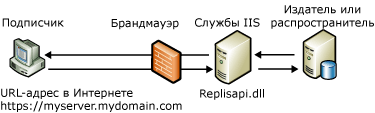

# Веб-синхронизация для репликации слиянием
[!INCLUDE[appliesto-ss-xxxx-xxxx-xxx-md](../../includes/appliesto-ss-xxxx-xxxx-xxx-md.md)]
  Веб-синхронизация для репликации слиянием позволяет производить репликацию данных по протоколу HTTPS и может оказаться полезной в следующих случаях.  
  
-   Синхронизация данных от мобильных пользователей через Интернет.  
  
-   Синхронизация данных между базами данных [!INCLUDE[msCoName](../../includes/msconame-md.md)] [!INCLUDE[ssNoVersion](../../includes/ssnoversion-md.md)] через корпоративный брандмауэр.  
  
 Например, веб-синхронизацию могут использовать коммерческие представители, которым приходится много перемещаться. В компании [!INCLUDE[ssSampleDBCoFull](../../includes/sssampledbcofull-md.md)]работают коммерческие представители, которые посещают различные магазины и поставщиков в пределах обслуживаемых регионов. Во время длительных путешествий представители компании останавливаются в гостиницах и нуждаются в удобном способе передачи данных по продажам и загрузки обновлений по продуктам в конце каждого дня.  
  
 Представители отдела информационных технологий [!INCLUDE[ssSampleDBCoShort](../../includes/sssampledbcoshort-md.md)] настраивают на портативных компьютерах [!INCLUDE[ssNoVersion](../../includes/ssnoversion-md.md)] и включают репликацию слиянием с использованием веб-синхронизации. Каждый из портативных компьютеров имеет в Интернете URL-адрес, указывающий на компоненты репликации, установленные на сервере [!INCLUDE[msCoName](../../includes/msconame-md.md)] IIS. Эти компоненты синхронизируют подписчика с издателем. Теперь каждый торговый представитель может, не пользуясь удаленным коммутируемым соединением, подключиться через любое доступное Интернет-соединение и передать или загрузить необходимые данные. При работе через Интернет-соединение используется протокол SSL, поэтому применение виртуальной частной сети (VPN) не потребуется.  
  
 Сведения о настройке компонентов, необходимых для веб-синхронизации, см. в статьях [Настройка веб-синхронизации](../../relational-databases/replication/configure-web-synchronization.md), [Настройка сервера IIS для веб-синхронизации](../../relational-databases/replication/configure-iis-for-web-synchronization.md) и [Настройка сервера IIS 7 для веб-синхронизации](../../relational-databases/replication/configure-iis-7-for-web-synchronization.md).  
  
> [!NOTE]  
>  Веб-синхронизация рассчитана на работу с портативными компьютерами, карманными и другими клиентскими устройствами. Эта технология не предназначена для передачи больших объемов данных между серверными приложениями.  
  
## Обзор работы веб-синхронизации  
 При использовании веб-синхронизации обновления на подписчике упаковываются и отсылаются в виде XML-сообщений на IIS-сервер по протоколу HTTPS. Компьютер, на котором работает IIS-сервер, посылает команды на издатель в двоичном формате (обычно по протоколу TCP/IP). Обновления на издателе отсылаются на IIS-сервер, а затем упаковываются в XML-сообщения для доставки подписчику.  
  
 На приведенном ниже рисунке показаны некоторые из компонентов, участвующих в веб-синхронизации при репликации слиянием.  
  
   
  
 Веб-синхронизация может использоваться только для подписок по запросу, поэтому на подписчике всегда будет запущен агент слияния. Это может быть стандартный агент слияния, элемент управления ActiveX агента слияния или приложение, которое обеспечивает синхронизацию с помощью объектов RMO. Для указания расположения компьютера с службами IIS служит параметр **–InternetUrl** агента слияния.  
  
 На сервере IIS настроено средство прослушивания репликации [!INCLUDE[ssNoVersion](../../includes/ssnoversion-md.md)] (replisapi.dll), которое отвечает за обработку сообщений, поступающих на сервер от издателя и от подписчиков. Каждый узел в топологии обрабатывает поток XML-данных с помощью посредника репликации слиянием (replrec.dll).  
  
 На всех компьютерах, участвующих в процессе веб-синхронизации, необходимо наличие[!INCLUDE[ssVersion2005](../../includes/ssversion2005-md.md)] или более поздней версии.  
  
### Процесс синхронизации  
 Во время синхронизации выполняются следующие шаги.  
  
1.  На подписчике запускается агент слияния. Агент выполняет следующие действия:  
  
    1.  устанавливает SQL-соединение с базой данных подписки;  
  
    2.  извлекает из базы данных все изменения;  
  
    3.  производит HTTPS-запрос к компьютеру, на котором работает IIS-сервер;  
  
    4.  загружает изменения данных в виде XML-сообщения.  
  
2.  Средство прослушивания репликации [!INCLUDE[ssNoVersion](../../includes/ssnoversion-md.md)] и посредник репликации слиянием, находящиеся на IIS-сервере, выполняют следующие действия:  
  
    1.  обрабатывают HTTPS-запрос;  
  
    2.  устанавливают SQL-соединение с базой данных публикации;  
  
    3.  применяют переданные изменения к базе данных публикации;  
  
    4.  извлекают загруженные изменения для подписчика;  
  
    5.  возвращают HTTPS-ответ на агент слияния.  
  
3.  После получения HTTPS-ответа агент слияния на подписчике применяет загруженные изменения к базе данных подписки.  
  
## См. также:  
 [Configure Web Synchronization](../../relational-databases/replication/configure-web-synchronization.md)   
 [Topologies for Web Synchronization](../../relational-databases/replication/topologies-for-web-synchronization.md)  
  
  
