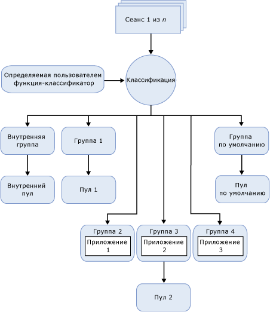

# Регулятор ресурсов
  Регулятор ресурсов [!INCLUDE[ssNoVersion](../../includes/ssnoversion-md.md)] — это компонент, предназначенный для управления рабочей нагрузкой [!INCLUDE[ssNoVersion](../../includes/ssnoversion-md.md)] и использованием системных ресурсов. Регулятор ресурсов позволяет задать ограничения на загрузку ЦП, физических средств ввода-вывода и использование памяти, которые доступны для входящих запросов приложений.  
  
## Преимущества регулятора ресурсов  
 Регулятор ресурсов позволяет управлять рабочими нагрузками и ресурсами [!INCLUDE[ssNoVersion](../../includes/ssnoversion-md.md)] путем задания лимитов на потребление ресурсов входящими запросами. В контексте регулятора ресурсов рабочая нагрузка представляет собой набор запросов приблизительно одинакового размера, которые могут и должны обрабатываться как единая сущность. Это не жесткое требование, но чем однообразнее выглядит шаблон использования ресурсов рабочей нагрузки, тем больше преимуществ можно извлечь из регулятора ресурсов. Ограничения на ресурсы можно перенастроить в режиме реального времени, при этом воздействие на выполняемую рабочую нагрузку остается минимальным.  
  
 В среде, имеющей несколько различных рабочих нагрузок на одном и том же сервере, регулятор ресурсов позволяет различать эти рабочие нагрузки и распределять общие ресурсы по мере запросов в зависимости от установленных ограничений. Эти ресурсы — ЦП, память и физические операции ввода-вывода.  
  
 С помощью регулятора ресурсов можно выполнить следующее.  
  
-   Обеспечить облуживание многих клиентов и изоляцию ресурсов на одиночных экземплярах SQL Server, обслуживающих несколько клиентских рабочих нагрузок. То есть можно разделить доступные ресурсы сервера среди рабочих нагрузок, минимизировав проблемы, которые могут возникнуть при конкуренции рабочих нагрузок за ресурсы.  
  
-   Предоставить прогнозируемую производительность и поддержку соглашений об уровне обслуживания для клиентов рабочих нагрузок в среде с несколькими рабочими нагрузками и несколькими пользователями.  
  
-   Изолировать и ограничивать неконтролируемые запросы и регулировать ресурсы ввода-вывода для таких операций, как DBCC CHECKDB, способных занять всю производительность подсистемы ввода-вывода и негативно повлиять на другие рабочие нагрузки.  
  
-   Добавить детализированное отслеживание ресурсов для возврата платежей за использование ресурсов и предоставлять прогнозируемое выставление счетов потребителям ресурсов сервера.  
  
## Ограничения регулятора ресурсов  
 В данном выпуске регулятора ресурсов имеются следующие ограничения.  
  
-   Управление ресурсами ограничено компонентом [!INCLUDE[ssDEnoversion](../../includes/ssdenoversion-md.md)]. Использование регулятора ресурсов для служб [!INCLUDE[ssASnoversion](../../includes/ssasnoversion-md.md)], [!INCLUDE[ssISnoversion](../../includes/ssisnoversion-md.md)]и [!INCLUDE[ssRSnoversion](../../includes/ssrsnoversion-md.md)]невозможно.  
  
-   Наблюдение за рабочей нагрузкой и управление рабочими нагрузками между экземплярами SQL Server не предусмотрены.  
  
-   Управление рабочими нагрузками OLTP с помощью регулятора ресурсов возможно, но данные типы запросов, как правило, непродолжительные, не всегда находятся в ЦП настолько долго, чтобы к ним можно было применить средства управления пропускной способностью. Это может привести к искажению возвращаемых статистических данных по загрузке ЦП.  
  
-   Возможность администрирования физического ввода-вывода относится только к операциям пользователя, но не к задачам системы. К системным задачам относятся операции записи в журнал транзакций и операции отложенного ввода-вывода модуля отложенной записи. Регулятор ресурсов работает главным образом с пользовательскими операциями чтения, так как большинство операций записи обычно выполняются системными задачами.  
  
-   Нельзя задать пороговые значения ввода-вывода на внутреннем пуле ресурсов.  
  
## Основные понятия ресурсов  
 Приведенные ниже три понятия лежат в основе понимания работы регулятора ресурсов.  
  
-   **Пулы ресурсов.** Пул ресурсов представляет физические ресурсы сервера. Пул можно считать виртуальным экземпляром [!INCLUDE[ssNoVersion](../../includes/ssnoversion-md.md)] внутри экземпляра [!INCLUDE[ssNoVersion](../../includes/ssnoversion-md.md)] . При установке [!INCLUDE[ssNoVersion](../../includes/ssnoversion-md.md)] создается два пула ресурсов (внутренний и по умолчанию). Кроме того, регулятор ресурсов поддерживает определяемые пользователями пулы ресурсов. Дополнительные сведения см. в разделе [Resource Governor Resource Pool](../../relational-databases/resource-governor/resource-governor-resource-pool.md).  
  
-   **Группы рабочей нагрузки.** Группа рабочей нагрузки выступает в качестве контейнера для запросов сеансов, имеющих подобные критерии классификации. Рабочая нагрузка обеспечивает статистический мониторинг сеансов и определяет политики для сеансов. Каждая группа рабочей нагрузки существует в пуле ресурсов. При установке [!INCLUDE[ssNoVersion](../../includes/ssnoversion-md.md)] создается две группы рабочей нагрузки (внутренняя и по умолчанию), которые сопоставляются с соответствующими пулами ресурсов. Кроме того, регулятор ресурсов поддерживает определяемые пользователями группы рабочей нагрузки. Дополнительные сведения см. в разделе [Resource Governor Workload Group](../../relational-databases/resource-governor/resource-governor-workload-group.md).  
  
-   **Классификация.** Процесс классификации назначает входящие сеансы группе рабочей нагрузки с учетом характеристик сеанса. Логику классификации можно адаптировать путем написания определяемой пользователем функции, называемой функцией-классификатором. Кроме того, регулятор ресурсов поддерживает определяемую пользователем функцию-классификатор для реализации правил классификации. Дополнительные сведения см. в разделе [Resource Governor Classifier Function](../../relational-databases/resource-governor/resource-governor-classifier-function.md).  
  
> [!NOTE]  
>  Регулятор ресурсов никак не управляет выделенным административным соединением. Нет необходимости классифицировать запросы выделенного административного соединения, которые выполняются во внутренней группе рабочей нагрузки и пуле ресурсов.  
  
 В контексте регулятора ресурсов можно обрабатывать описанные выше понятия как компоненты. На следующей иллюстрации показаны эти компоненты и отношения между ними в среде компонента Database Engine. С точки зрения обработки упрощенный поток выглядит следующим образом.  
  
-   Имеется входящее соединение с сеансом (сеанс 1 из *n*).  
  
-   Сеанс классифицирован (классификация).  
  
-   Рабочая нагрузка сеанса направляется в группу рабочей нагрузки, например в группу 4.  
  
-   Группа рабочей нагрузки использует пул ресурсов, с которым она связана, например Пул 2.  
  
-   Пул ресурсов предоставляет или ограничивает доступ к ресурсам, которые требуются приложению, например Приложению 3.  
  
   
  
## Задачи регулятора ресурсов  
  
|Описание задачи|Раздел|  
|----------------------|-----------|  
|Описывает, как включить регулятор ресурсов.|[Активация регулятора ресурсов](../../relational-databases/resource-governor/enable-resource-governor.md)|  
|Описывает, как отключить регулятор ресурсов.|[Отключение регулятора ресурсов](../../relational-databases/resource-governor/disable-resource-governor.md)|  
|Описывает, как создать, изменить и удалить пул ресурсов.|[Пул ресурсов регулятора ресурсов](../../relational-databases/resource-governor/resource-governor-resource-pool.md)|  
|Описывает, как создать, изменить, переместить и удалить группу рабочей нагрузки|[Группа рабочей нагрузки регулятора ресурсов](../../relational-databases/resource-governor/resource-governor-workload-group.md)|  
|Описывает, как создать и проверить определяемую пользователем функцию-классификатор.|[Функция-классификатор регулятора ресурсов](../../relational-databases/resource-governor/resource-governor-classifier-function.md)|  
|Описывает, как настроить регулятор ресурсов с использованием шаблона.|[Настройка регулятора ресурсов с помощью шаблона](../../relational-databases/resource-governor/configure-resource-governor-using-a-template.md)|  
|Описывает, как просматривать свойства регулятора ресурсов.|[Просмотр свойств регулятора ресурсов](../../relational-databases/resource-governor/view-resource-governor-properties.md)|  
  
## См. также:  
 [Экземпляры компонента Database Engine (SQL Server)](../../database-engine/configure-windows/database-engine-instances-sql-server.md)  
  
  
