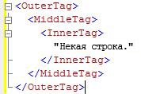
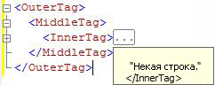

# Структурирование кода
  Функция структурирования в редакторах запросов среды [!INCLUDE[ssManStudioFull](../../includes/ssmanstudiofull-md.md)] позволяет при редактировании запросов выборочно скрывать участки кода. Это делает просмотр кода при редактировании более удобным, особенно когда файл запроса имеет большой размер.  
  
## Общие сведения о функции структурирования  
 По умолчанию при открытии окна редактора запросов весь код является видимым. Участки кода можно свернуть, чтобы скрыть их. Квадрат со знаком «минус» (-) возле вертикальной линии, проходящей вдоль левого края окна редактора, обозначает начало каждого сворачиваемого участка кода. Если щелкнуть значок «минус», то текст участка кода будет заменен полем, содержащим три точки (…), а значок «минус» заменяется значком «плюс» (+). Если щелкнуть значок «плюс», то свернутый код будет отображен, а значок «плюс» заменен значком «минус». Если указатель находится над полем с тремя точками, то отображается всплывающая подсказка, содержащая код свернутого раздела.  
  
## Системные структурные области  
 Каждый редактор в среде [!INCLUDE[ssManStudioFull](../../includes/ssmanstudiofull-md.md)] формирует набор структурных областей, по умолчанию определяемых системой.  
  
 Редакторы кода многомерных выражений и расширений интеллектуального анализа данных создают структурные области для каждой многострочной инструкции. Это единственный уровень структурирования, поддерживаемый этими редакторами.  
  
### Области редактора запросов XMLA служб Analysis Services  
 Редактор запросов XMLA служб [!INCLUDE[ssASnoversion](../../includes/ssasnoversion-md.md)] формирует структурную область для каждого многострочного XML-атрибута. Редактор создает вложенные структурные области для вложенных тегов. Например, редактор XMLA создает три структурные области в следующем документе.  
  
   
  
 Если щелкнуть значок "минус" в строке \<InnerTag>, то будет свернут только InnerTag, как показано на следующей иллюстрации.  
  
   
  
 Когда указатель находится над полем с тремя точками (...), то код в свернутой области отображается во всплывающей подсказке, как показано на следующей иллюстрации.  
  
   
  
 Если щелкнуть значок "минус" в строке \<MiddleTag>, то будут свернуты и MiddleTag, и InnerTag, как показано на следующей иллюстрации.  
  
   
  
 Если щелкнуть значок "минус" в строке \<OuterTag>, то будут свернуты все три строки, как показано на следующей иллюстрации.  
  
   
  
### Области редактора запросов к ядру СУБД  
 Редактор запросов компонента [!INCLUDE[ssDE](../../includes/ssde-md.md)] формирует структурные области для каждого элемента в следующей иерархии.  
  
1.  Пакеты. Первый пакет содержит код от начала файла до первой команды GO либо до конца файла, если он не содержит команд GO. Каждый последующий пакет после первой команды GO охватывает код от соответствующей команды GO до следующей команды GO, либо до конца файла.  
  
2.  Блоки, разделяемые следующими ключевыми словами:  
  
    -   BEGIN — END  
  
    -   BEGIN TRY — END TRY  
  
    -   BEGIN CATCH — END CATCH  
  
3.  Многострочные инструкции.  
  
 Например, редактор запросов компонента [!INCLUDE[ssDE](../../includes/ssde-md.md)] создает три структурные области в следующем запросе.  
  
```  
CREATE PROCEDURE Sales.SampleProc --Outline region 1  
AS  
BEGIN --Outline region 2   
  SELECT GETDATE() AS TimeOfQuery;  
  SELECT * --Outline region 3  
  FROM sys.transmission_queue;  
  SELECT @@VERSION;  
END;  
GO  
```  
  
 Щелкнув значок «минус» в строке `SELECT *` , можно свернуть только инструкцию `SELECT` . Чтобы свернуть весь блок `BEGIN - END` , щелкните значок «минус» в строке `BEGIN` . Чтобы свернуть весь блок `GO` , щелкните значок «минус» в строке `CREATE PROCEDURE` . Свернуть строки `SELECT GETDATE()` или `SELECT @@VERSION` по отдельности нельзя, поскольку они являются однострочными инструкциями и не выделяются в структурные области.  
  
  