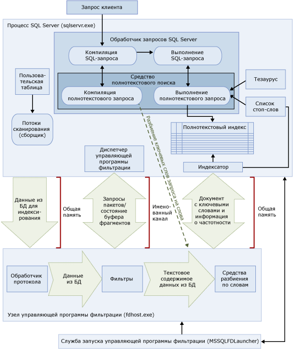

# <a name="full-text-search"></a>Компонент Full-text Search
[!INCLUDE[appliesto-ss-asdb-xxxx-xxx-md](../../includes/appliesto-ss-asdb-xxxx-xxx-md.md)] Полнотекстовый поиск в [!INCLUDE[ssNoVersion](../../includes/ssnoversion-md.md)] и [!INCLUDE[ssSDSFull](../../includes/sssdsfull-md.md)] позволяет пользователям и приложениям выполнять полнотекстовые запросы к символьным данным в таблицах [!INCLUDE[ssNoVersion](../../includes/ssnoversion-md.md)].
  
## <a name="basic-tasks"></a>Основные задачи
В этой статье представлен обзор функции полнотекстового поиска и описываются ее компоненты и архитектура. Если вы хотите немедленно приступить к работе, здесь вы найдете простые примеры задач.
-   [Начало работы с компонентом Full-Text Search](../../relational-databases/search/get-started-with-full-text-search.md)
-   [Создание и управление полнотекстовыми каталогами](../../relational-databases/search/create-and-manage-full-text-catalogs.md)
-   [Создание и управление полнотекстовыми индексами](../../relational-databases/search/create-and-manage-full-text-indexes.md)
-   [Заполнение полнотекстовых индексов](../../relational-databases/search/populate-full-text-indexes.md)
-   [Запросы с полнотекстовым поиском](../../relational-databases/search/query-with-full-text-search.md)

> [!NOTE]
> Full-Text Search is an optional component of the [!INCLUDE[ssNoVersion](../../includes/ssnoversion-md.md)] . Если при установке SQL Server полнотекстовый поиск не был выбран, запустите программу установки SQL Server повторно, чтобы добавить его.

## <a name="overview"></a>Обзор
В полнотекстовый индекс включается один или несколько символьных столбцов таблицы. Эти столбцы могут содержать любой из следующих типов данных: **char**, **varchar**, **nchar**, **nvarchar**, **text**, **ntext**, **image**, **xml**или **varbinary(max)** и **FILESTREAM**. Каждый полнотекстовый индекс индексирует один или несколько столбцов таблицы, а каждому столбцу может соответствовать определенный язык.  
  
 Полнотекстовые запросы выполняют лингвистический поиск в текстовых данных в полнотекстовых индексах путем обработки слов и фраз в соответствии с правилами конкретного языка, например английского или японского. Полнотекстовые запросы могут включать простые слова и фразы или несколько форм слова или фразы. Полнотекстовый запрос возвращает все документы, которые содержат как минимум одно совпадение (известное также как *попадание*). Совпадение возникает в том случае, когда целевой документ содержит все термины, указанные в полнотекстовом запросе, и соответствует всем остальным условиям поиска, например расстояние между совпадающими терминами.    
  
##  <a name="queries"></a> Запросы полнотекстового поиска  
 После добавления столбцов в полнотекстовый индекс, приложения и пользователи смогут выполнять полнотекстовые запросы к тексту из столбцов. Эти запросы могут вести поиск любых приведенных ниже элементов.  
  
-   Одно или несколько конкретных слов или фраз (*простое выражение*)  
  
-   Слова, начинающиеся заданным текстом, или фразы с такими словами (*префиксные выражения*)  
  
-   Словоформы конкретного слова (*производное выражение*)  
  
-   Слова или фразы, находящиеся рядом с другими словами или фразами (*выражения с учетом расположения*)  
  
-   Синонимические формы конкретного слова (*тезаурус*)  
  
-   Слова или фразы со взвешенными значениями (*взвешенное выражение*)  
  
 В полнотекстовых запросах не учитывается регистр букв. Например, поиск значения «Алюминий» или «алюминий» вернет одинаковые результаты.  
  
 Все полнотекстовые запросы используют небольшой набор предикатов [!INCLUDE[tsql](../../includes/tsql-md.md)] (CONTAINS и FREETEXT) и функций (CONTAINSTABLE и FREETEXTTABLE). Однако точная структура полнотекстовых запросов определяется целями поиска данного бизнес-сценария. Например:  
  
-   Электронный бизнес — поиск продукта на веб-сайте:  
  
    ```  
    SELECT product_id   
    FROM products   
    WHERE CONTAINS(product_description, ”Snap Happy 100EZ” OR FORMSOF(THESAURUS,’Snap Happy’) OR ‘100EZ’)   
    AND product_cost < 200 ;  
    ```  
  
-   Сценарий комплектования штата — поиск кандидатов, имеющих опыт работы с [!INCLUDE[ssNoVersion](../../includes/ssnoversion-md.md)]:  
  
    ```  
    SELECT candidate_name,SSN   
    FROM candidates   
    WHERE CONTAINS(candidate_resume,”SQL Server”) AND candidate_division =DBA;  
    ```  
  
 Дополнительные сведения см. в разделе [Запросы с полнотекстовым поиском](../../relational-databases/search/query-with-full-text-search.md).  
  
##  <a name="like"></a> Сравнение предиката LIKE и запросов полнотекстового поиска
 В отличие от полнотекстового поиска предикат [LIKE](../../t-sql/language-elements/like-transact-sql.md) [!INCLUDE[tsql](../../includes/tsql-md.md)] работает только с комбинациями символов. Кроме того, предикат LIKE нельзя использовать в запросах к форматированным двоичным данным. Более того, запрос с предикатом LIKE к большому количеству неструктурированных текстовых данных выполняется гораздо медленнее, чем эквивалентный полнотекстовый запрос к тем же данным. Выполнение запроса LIKE к нескольким миллионам строк текстовых данных может занять несколько минут, в то время как полнотекстовый запрос к тем же данным занимает всего несколько секунд или даже меньше, в зависимости от количества возвращаемых строк.  
  
##  <a name="architecture"></a> Архитектура полнотекстового поиска
 Архитектура полнотекстового поиска состоит из следующих процессов.  
  
-   Процесс [!INCLUDE[ssNoVersion](../../includes/ssnoversion-md.md)] (sqlservr.exe).  
  
-   Процесс узла управляющей программы фильтрации (fdhost.exe).  
  
     По соображениям безопасности фильтры загружаются отдельными процессами, которые называются узлами управляющей программы фильтрации. Процессы fdhost.exe создаются службой запуска FDHOST (MSSQLFDLauncher) и выполняются под учетными данными безопасности учетной записи службы запуска FDHOST. Следовательно, чтобы работало полнотекстовое индексирование и выполнялись полнотекстовые запросы, должна быть запущена служба FDHOST. Сведения о настройке учетной записи службы для этой службы см. в разделе [Настройка учетной записи службы средства запуска управляющей программы полнотекстовой фильтрации](../../relational-databases/search/set-the-service-account-for-the-full-text-filter-daemon-launcher.md).  
  
 Эти два процесса содержат компоненты архитектуры полнотекстового поиска. Эти компоненты и их связи приведены на следующей иллюстрации. Описание компонентов приведено после иллюстрации.  
  
   

###  <a name="sqlprocess"></a> Процесс SQL Server  
 В полнотекстовом поиске используются следующие компоненты процесса [!INCLUDE[ssNoVersion](../../includes/ssnoversion-md.md)] .  
  
-   **Пользовательские таблицы.** В этих таблицах содержатся данные, по которым осуществляется полнотекстовое индексирование.  
  
-   **Средство сбора полнотекстовых данных.** Средство сбора полнотекстовых данных работает с потоками полнотекстового сканирования. Оно отвечает за планирование заполнения полнотекстовых индексов и управление им, а также за наблюдение за полнотекстовыми каталогами.  
  
-   **Файлы тезауруса.** Эти файлы содержат синонимы искомых терминов. Дополнительные сведения см. в разделе [Настройка файлов тезауруса для полнотекстового поиска и управление ими](../../relational-databases/search/configure-and-manage-thesaurus-files-for-full-text-search.md).  
  
-   **Объекты списка стоп-слов.** Объекты списка стоп-слов содержат список часто встречающихся слов, бесполезных при поиске. Дополнительные сведения см. в разделе [Настройка стоп-слов и списков стоп-слов для полнотекстового поиска и управление ими](../../relational-databases/search/configure-and-manage-stopwords-and-stoplists-for-full-text-search.md).  
  
-   **[!INCLUDE[ssNoVersion](../../includes/ssnoversion-md.md)] обработчик запросов.** Обработчик запросов компилирует и выполняет SQL-запросы. Если SQL-запрос включает запрос полнотекстового поиска, то запрос направляется в средство полнотекстового поиска как в процессе компиляции, так и при выполнении. Результат запроса сопоставляется с полнотекстовым индексом.  
  
-   **Средство полнотекстового поиска.** Средство полнотекстового поиска в [!INCLUDE[ssNoVersion](../../includes/ssnoversion-md.md)] полностью интегрировано с обработчиком запросов. Средство полнотекстового поиска компилирует и выполняет полнотекстовые запросы. Как часть выполнения запроса средство полнотекстового поиска может получать входные данные из тезауруса и списка стоп-слов.  

    >[!NOTE]  
    >  В [!INCLUDE[ssKatmai](../../includes/sskatmai-md.md)] и более поздних версиях средство полнотекстового поиска находится в процессе [!INCLUDE[ssNoVersion](../../includes/ssnoversion-md.md)] , а не в отдельной службе. Интеграция средства полнотекстового поиска в ядро СУБД повышает возможности работы с текстом, оптимизацию смешанных запросов и общую производительность.  
 
-   **Модуль записи индекса (индексатор).** Модуль записи индекса строит структуру, используемую для хранения индексированных токенов.  
  
-   **Диспетчер управляющей программы фильтрации.** Диспетчер управляющей программы фильтрации отвечает за наблюдение за состоянием узла управляющей программы фильтрации для полнотекстового поиска.  
  
###  <a name="fdhostprocess"></a> Filter Daemon Host process  
 Узел управляющей программы фильтрации представляет собой процесс, запускаемый средством полнотекстового поиска. Он запускает следующие компоненты полнотекстового поиска, которые отвечают за доступ, фильтрацию и разбиение по словам данных из таблиц, а также разбиение по словам и морфологический поиск во входных данных запроса.  
  
 Существуют следующие компоненты узла управляющей программы фильтрации.  
  
-   **Обработчик протокола.** Этот компонент запрашивает данные из памяти для дальнейшей обработки и обращается к данным из пользовательской таблицы в указанной базе данных. Одной из его задач является сбор данных из столбцов с полнотекстовой индексацией и передача этих данных в узел управляющей программы фильтрации, в котором требуемым образом применяется фильтрация и средство разбиения по словам.  
  
-   **Фильтры.** Для некоторых типов данных требуется фильтрация перед полнотекстовой индексацией данных в документе, в том числе для данных в столбцах **varbinary**, **varbinary(max)**, **image**или **xml** . Фильтр, используемый для данного документа, зависит от типа этого документа. Например, для документов Microsoft Word (DOC), Microsoft Excel (XLS) и XML-документов (XML) используются разные фильтры. Затем фильтр выделяет из документа фрагменты данных, при этом удаляется внедренное форматирование, остается текст и, возможно, сведения о положении текста. Результатом является поток текстовых данных. Дополнительные сведения см. в разделе [Настройка фильтров для поиска и управление ими](../../relational-databases/search/configure-and-manage-filters-for-search.md).  
  
-   **Средства разбиения по словам и парадигматические модули.** Работа средства разбиения по словам зависит от конкретного языка: компонент находит границы слов в соответствии с лексическими правилами данного языка (*разбиение по словам*). Каждое средство разбиения по словам связано с зависящим от языка компонентом парадигматического модуля, который спрягает глаголы и добавляет флексии. Во время индексирования узел управляющей программы фильтрации использует средство разбиения по словам и парадигматический модуль для выполнения лингвистического анализа текстовых данных из указанного столбца таблицы. Язык, связанный со столбцом таблицы в полнотекстовом индексе, определяет, какое средство разбиения по словам и какой парадигматический модуль будут использоваться для индексирования столбца. Дополнительные сведения о парадигматических модулях см. в разделе [Настройка средств разбиения на слова и парадигматические модули для поиска и управление ими](../../relational-databases/search/configure-and-manage-word-breakers-and-stemmers-for-search.md).  
  
##  <a name="processing"></a> Обработка полнотекстового поиска  
 Полнотекстовый поиск работает на базе средства полнотекстового поиска. Средство полнотекстового поиска имеет две роли: поддержка индексирования и поддержка запросов.  
  
###  <a name="indexing"></a> Процесс полнотекстового индексирования  
 При инициации заполнения полнотекстового индекса (который также называют «сканированием») средство полнотекстового поиска помещает большие пакеты данных в память и оповещает управляющую программу полнотекстовой фильтрации. Управляющая программа выполняет фильтрацию и разбиение по словам, а также преобразует конвертированные данные в инвертированный список слов. Затем средство полнотекстового поиска запрашивает конвертированные данные из списка слов, удаляет стоп-слова и сохраняет списки слов в виде пакета в один или несколько инвертированных индексов.  
  
 При индексировании данных, хранящихся в столбце типа **varbinary(max)** или **image** , фильтр, реализующий интерфейс **IFilter** , извлекает текст в соответствии с заданным для этих данных форматом файлов, например [!INCLUDE[msCoName](../../includes/msconame-md.md)] Word. В некоторых случаях для работы компонентов-фильтров необходимо, чтобы данные типов **varbinary(max)**или **image** были записаны в папку filterdata, а не принудительно отправлены в память.  
  
 Одним из этапов обработки собранных текстовых данных является их анализ средством разбиения по словам, которое разделяет текст на отдельные токены, или ключевые слова. Язык, используемый при разметке, задается на уровне столбца или может быть определен компонентом-фильтром по данным типа **varbinary(max)**, **image**или **xml** .  
  
 Для удаления стоп-слов и нормализации токенов перед их сохранением в полнотекстовом индексе или фрагменте индекса может быть проведена дополнительная обработка.  
  
 После завершения операции заполнения инициируется заключительный процесс слияния фрагментов индекса в один главный полнотекстовый индекс. Это повышает производительность запросов за счет использования одного главного индекса вместо нескольких фрагментов индексов и позволяет использовать более точные количественные оценки для ранжирования данных по релевантности.  
  
###  <a name="querying"></a> Обработка полнотекстовых запросов  
 Обработчик запросов передает для обработки полнотекстовые части запроса средству полнотекстового поиска. Средство полнотекстового поиска выполняет разбиение по словам и при необходимости расширения тезауруса, морфологический поиск и обработку стоп-слов (пропускаемых слов). Затем полнотекстовые части запроса представляются в форме операторов SQL, в основном как потоковые функции, возвращающие табличные значения. Во время выполнения запроса эти потоковые функции для получения правильных результатов обращаются к инвертированному индексу. Результаты возвращаются клиенту в этой точке, либо перед возвращением клиенту они подвергаются дополнительной обработке.  

## <a name="full-text-index-architecture"></a>Архитектура полнотекстового индекса
  Данные полнотекстовых индексов используются средством полнотекстового поиска для компиляции полнотекстовых запросов, способных быстро находить таблицу с теми или иными словами или словосочетаниями. В полнотекстовом индексе хранятся данные о значимых для поиска словах и их расположении в одном или нескольких столбцах таблицы базы данных. Полнотекстовый индекс — это специальный тип функционального индекса на основе токенов, создаваемый и используемый средством полнотекстового поиска для [!INCLUDE[ssNoVersion](../../includes/ssnoversion-md.md)]. Процесс создания полнотекстового индекса отличается от создания индексов других типов. Вместо создания сбалансированного дерева на основе значения, хранящегося в конкретной строке, служба полнотекстового поиска создает инвертированную стековую сжатую структуру индекса на основе отдельных токенов индексируемого текста.  Размер полнотекстового индекса ограничен только доступными ресурсами памяти компьютера, на котором запущен экземпляр [!INCLUDE[ssNoVersion](../../includes/ssnoversion-md.md)] .  
  
 Начиная с [!INCLUDE[ssKatmai](../../includes/sskatmai-md.md)]полнотекстовые индексы встроены в ядро СУБД, а не размещены в файловой системе, как в предыдущих версиях [!INCLUDE[ssNoVersion](../../includes/ssnoversion-md.md)]. В новой базе данных полнотекстовый каталог является виртуальным объектом, не принадлежащим ни к одной файловой группе. Он является лишь логическим понятием, связанным с группой полнотекстовых индексов. Однако обратите внимание, что при обновлении базы данных [!INCLUDE[ssVersion2005](../../includes/ssversion2005-md.md)] (любого полнотекстового каталога с файлами данных) создается новая файловая группа. Дополнительные сведения см. в разделе [Обновление полнотекстового поиска](../../relational-databases/search/upgrade-full-text-search.md).  
  
На одну таблицу может приходиться только один полнотекстовый индекс. Чтобы в таблице можно было создать полнотекстовый индекс, она должна содержать один уникальный столбец, значением которого не является NULL. Можно создать полнотекстовый индекс на столбцах типа **char**, **varchar**, **nchar**, **nvarchar**, **text**, **ntext**, **image**, **xml**и **varbinary**, а также для полнотекстового поиска может индексироваться **varbinary(max)** . Для создания полнотекстового индекса на столбце, тип данных которого  **varbinary**, **varbinary(max)**, **image**или **xml** , необходимо указать столбец типов. *Столбец типов* — это столбец таблицы, в каждой строке которого хранятся расширения файлов (DOC, PDF, XLS и т. д.) документа.  

###  <a name="structure"></a> Структура полнотекстового индекса  
 Чтобы понять, как работает средство полнотекстового поиска, необходимо разобраться в структуре полнотекстового индекса. В данном разделе в качестве примера таблицы используется следующий фрагмент таблицы **Document** в [!INCLUDE[ssSampleDBCoShort](../../includes/sssampledbcoshort-md.md)] . В данном фрагменте показываются только два столбца: **DocumentID** и **Title** , а также три строки из таблицы.  
  
 В этом примере подразумевается, что полнотекстовый индекс был создан по столбцу **Title** .  
  
|DocumentID|Title|  
|----------------|-----------|  
|1|Crank Arm and Tire Maintenance|  
|2|Front Reflector Bracket and Reflector Assembly 3|  
|3|Front Reflector Bracket Installation|  
  
 Например, в следующей таблице, в которой приведен фрагмент 1, показано содержимое полнотекстового индекса, созданного по столбцу **Title** таблицы **Document** . Полнотекстовые индексы содержат больше данных, чем представлено в этой таблице. Таблица является логическим представлением полнотекстового индекса, она предоставляется только с целью демонстрации. Строки хранятся в сжатом формате для оптимизации использования диска.  
  
 Обратите внимание, что данные были инвертированы по сравнению с оригинальными документами. Инверсия происходит, поскольку ключевые слова сопоставлены с идентификаторами документов. По этой причине полнотекстовый индекс часто называют инвертированным индексом.  
  
 Обратите также внимание, что ключевое слово «and» было удалено из полнотекстового индекса. Это было сделано, поскольку «and» является стоп-словом. Удаление стоп-слов из полнотекстового индекса может привести к значительной экономии дискового пространства, тем самым увеличивая производительность запросов. Дополнительные сведения о стоп-словах см. в разделе [Настройка и управление стоп-словами и списками стоп-слов для полнотекстового поиска](../../relational-databases/search/configure-and-manage-stopwords-and-stoplists-for-full-text-search.md).  
  
 **Фрагмент 1**  
  
|Ключевое слово|ColId|DocId|Наличие|  
|-------------|-----------|-----------|----------------|  
|Crank|1|1|1|  
|Arm|1|1|2|  
|Tire|1|1|4|  
|Обслуживание|1|1|5|  
|Front|1|2|1|  
|Front|1|3|1|  
|Reflector|1|2|2|  
|Reflector|1|2|5|  
|Reflector|1|3|2|  
|Bracket|1|2|3|  
|Bracket|1|3|3|  
|Сборка|1|2|6|  
|3|1|2|7|  
|Установка|1|3|4|  
  
 Столбец **Keyword** содержит представление одного токена, извлеченного при индексировании. Токены определяются средствами разбиения по словам.  
  
 Столбец **ColId** содержит значение, соответствующее столбцу, по которому выполняется полнотекстовое индексирование.  
  
 Столбец **DocId** содержит значения восьмибайтового целого числа, соответствующего определенному значению полнотекстового ключа в определенной таблице, в которой выполняется полнотекстовое индексирование. Данное поведение необходимо, если полнотекстовый ключ имеет тип данных, отличный от целого. В таких случаях сопоставления между значениями полнотекстового ключа и значениями **DocId** обеспечиваются в отдельной таблице, называемой таблицей сопоставления DocId. Для создания запросов к этим сопоставлениям следует использовать системную хранимую процедуру [sp_fulltext_keymappings](../../relational-databases/system-stored-procedures/sp-fulltext-keymappings-transact-sql.md) . Для удовлетворения условия поиска необходимо соединить значения DocId из приведенной выше таблицы с таблицей сопоставления DocId. Это позволит возвращать строки из запрашиваемой базовой таблицы. Если значение полнотекстового ключа из базовой таблицы имеет целочисленный тип, то само значение служит в качестве значения DocId и дополнительного сопоставления не требуется. Следовательно, использование целочисленных значений полнотекстового ключа может оптимизировать выполнение полнотекстовых запросов.  
  
 Столбец **Occurrence** содержит целочисленное значение. Каждому значению DocId соответствует список значений частотности, которые соответствуют относительным смещениям слов для определенного ключевого слова в документе с этим значением DocId. С помощью значений частотности удобно определять фразовое или близкое совпадение; например, для фраз значения частотности находятся рядом. Кроме того, их удобно использовать при вычислении коэффициента релевантности. Например, они дают возможность подсчитать частоту употребления ключевого слова в документе DocId.   
  
###  <a name="fragments"></a> Фрагменты полнотекстового индекса  
 Логический полнотекстовый индекс обычно разбивается по нескольким внутренним таблицам. Каждая из внутренних таблиц называется фрагментом полнотекстового индекса. Некоторые из данных фрагментов могут содержать более свежие данные. Например, если пользователь обновляет следующую строку с DocId, равным 3, а в таблице выполняется автоматическое отслеживание изменений, то будет создан новый фрагмент.  
  
|DocumentID|Title|  
|----------------|-----------|  
|3|Rear Reflector|  
  
 В следующем примере, в котором показан фрагмент 2, содержатся более новые данные о DocId 3, чем во фрагменте 1. Следовательно, если пользователь запрашивает «задний отражатель», то для DocId 3 будут использованы данные из фрагмента 2. Каждый из фрагментов имеет отметку времени создания, которую можно использовать в запросах с помощью представления каталога [sys.fulltext_index_fragments](../../relational-databases/system-catalog-views/sys-fulltext-index-fragments-transact-sql.md) .  
  
 **Фрагмент 2**  
  
|Ключевое слово|ColId|DocId|Occ|  
|-------------|-----------|-----------|---------|  
|Rear|1|3|1|  
|Reflector|1|3|2|  
  
 Как можно увидеть во фрагменте 2, полнотекстовым запросам необходимо осуществить внутреннее обращение к каждому фрагменту. Более старые записи не учитываются. Следовательно, наличие слишком большого количества полнотекстовых фрагментов индекса в полнотекстовом индексе может привести к существенному уменьшению производительности запросов. Для уменьшения количества фрагментов выполните переорганизацию полнотекстового каталога, используя параметр REORGANIZE инструкции [ALTER FULLTEXT CATALOG](../../t-sql/statements/alter-fulltext-catalog-transact-sql.md)[!INCLUDE[tsql](../../includes/tsql-md.md)] . Данная инструкция выполняет *слияние в единый файл*, объединяя все фрагменты в единый большой фрагмент, и удаляет все устаревшие записи из полнотекстового индекса.  
  
 После выполнения реорганизации в образце индекса будут содержаться следующие строки.  
  
|Ключевое слово|ColId|DocId|Occ|  
|-------------|-----------|-----------|---------|  
|Crank|1|1|1|  
|Arm|1|1|2|  
|Tire|1|1|4|  
|Обслуживание|1|1|5|  
|Front|1|2|1|  
|Rear|1|3|1|  
|Reflector|1|2|2|  
|Reflector|1|2|5|  
|Reflector|1|3|2|  
|Bracket|1|2|3|  
|Сборка|1|2|6|  
|3|1|2|7|  

### <a name="differences-between-full-text-indexes-and-regular-sql-server-indexes"></a>Различия между полнотекстовыми индексами и обычными индексами SQL Server:  
  
|Полнотекстовые индексы|Обычные индексы SQL Server|  
|------------------------|--------------------------------|  
|Для одной таблицы разрешен только один полнотекстовой индекс.|Для одной таблицы разрешено несколько обычных индексов.|  
|Добавление данных к полнотекстовым индексам (*заполнение*) может быть запрошено явно, выполняться по расписанию либо автоматически при добавлении новых данных в базу.|Обновляются автоматически при создании, вставке, обновлении или удалении данных, на которых они созданы.|  
|Группируются в той же базе данных в один или несколько полнотекстовых каталогов.|Не группируются.|  

##  <a name="components"></a> Лингвистические компоненты и поддержка языков в полнотекстовом поиске
 Полнотекстовый поиск поддерживает почти 50 разных языков, в том числе английский, испанский, китайский, японский, арабский, бенгальский и хинди. Полный список поддерживаемых языков полнотекстового поиска см. в разделе [sys.fulltext_languages (Transact-SQL)](../../relational-databases/system-catalog-views/sys-fulltext-languages-transact-sql.md). Каждый из столбцов в полнотекстовом индексе связан с идентификатором локали Microsoft Windows, который соответствует языку, поддерживаемому полнотекстовым поиском. Например, код языка 1033 соответствует языку «Английский (США)», а код 2057 соответствует языку «Английский (Великобритания)». Для каждого поддерживаемого языка полнотекстового поиска [!INCLUDE[ssNoVersion](../../includes/ssnoversion-md.md)] предусмотрены лингвистические компоненты, которые поддерживают индексирование полнотекстовых данных и выполнение запросов к полнотекстовым данным на этом языке.  
  
 Компоненты, связанные с конкретным языком, включают следующие компоненты.  
  
-   **Средства разбиения по словам и парадигматические модули.** Средство разбиения по словам находит границы слов на основании лексических правил данного языка (*разбиение по словам*). Каждое средство разбиения по словам связано с парадигматическим модулем, который спрягает глаголы этого языка и т. п. Дополнительные сведения о парадигматических модулях см. в разделе [Настройка средств разбиения на слова и парадигматические модули для поиска и управление ими](../../relational-databases/search/configure-and-manage-word-breakers-and-stemmers-for-search.md).  
  
-   **Списки стоп-слов.** Предоставляется список стоп-слов с основным набором стоп-слов (называемых также пропускаемыми словами). *Стоп-словом* является слово, которое бесполезно при поиске и пропускается при выполнении полнотекстовых запросов. Примерами стоп-слов для английской локали могут служить слова «a», «and», «is» и «the». Обычно бывает нужно настроить один или несколько файлов тезауруса и списков стоп-слов. Дополнительные сведения см. в разделе [Настройка стоп-слов и списков стоп-слов для полнотекстового поиска и управление ими](../../relational-databases/search/configure-and-manage-stopwords-and-stoplists-for-full-text-search.md).  
  
-   **Файлы тезауруса.** [!INCLUDE[ssNoVersion](../../includes/ssnoversion-md.md)] устанавливает файл тезауруса для каждого полнотекстового языка, а также файл глобального тезауруса. Устанавливаемые файлы тезауруса в основном пустые, но их можно изменять, добавляя туда определения синонимов для конкретного языка или бизнес-сценария. Подготовив тезаурус, ориентированный на пользовательские полнотекстовые данные, можно эффективно расширить область полнотекстовых запросов к этим данным. Дополнительные сведения см. в разделе [Настройка файлов тезауруса для полнотекстового поиска и управление ими](../../relational-databases/search/configure-and-manage-thesaurus-files-for-full-text-search.md).  
  
-   **Фильтры (iFilters).**  Индексирование документа в столбце типа данных **varbinary(max)**, **image**или **xml** требует наличия фильтра для выполнения дополнительной обработки. Фильтр должен соответствовать типу документа (DOC, PDF, XLS, XML и т.д.). Дополнительные сведения см. в разделе [Настройка фильтров для поиска и управление ими](../../relational-databases/search/configure-and-manage-filters-for-search.md).  
  
 Средства разбиения по словам (и парадигматические модули), а также фильтры выполняются в процессе управляющей программы фильтрации (fdhost.exe).  

[!INCLUDE[tsql-appliesto-ss2008-asdb-xxxx-xxx_md](../../includes/tsql-appliesto-ss2008-asdb-xxxx-xxx-md.md)]

