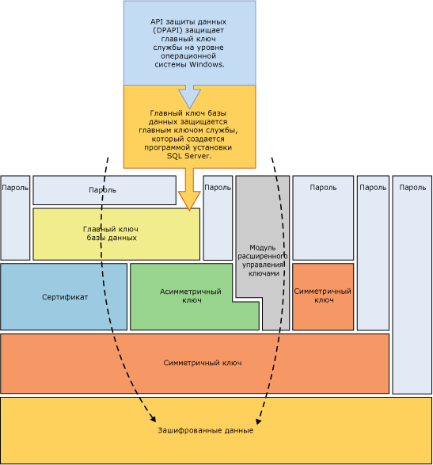
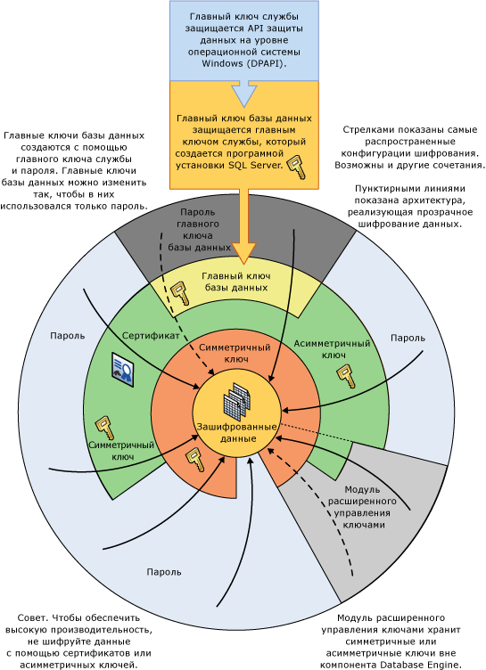

# Иерархия средств шифрования
[!INCLUDE[appliesto-ss-asdb-xxxx-xxx-md](../../../includes/appliesto-ss-asdb-xxxx-xxx-md.md)]
  [!INCLUDE[ssNoVersion](../../../includes/ssnoversion-md.md)] шифрует данные, используя иерархическую структуру средств шифрования и управления ключами. На каждом уровне данные низшего уровня шифруются на основе комбинации сертификатов, асимметричных ключей и симметричных ключей. Асимметричные и симметричные ключи можно хранить вне модуля расширенного управления ключами [!INCLUDE[ssNoVersion](../../../includes/ssnoversion-md.md)] .  
  
 На следующем рисунке показано, что на каждом уровне иерархии средств шифрования шифруются данные более нижнего уровня и отображаются наиболее распространенные конфигурации шифрования. Доступ к началу иерархии, как правило, защищается паролем.  
  
   
  
 Следует учитывать следующие основные понятия.  
  
-   Для лучшей производительности данные следует шифровать с помощью симметричных ключей, а не с помощью сертификатов и асимметричных ключей.  
  
-   Главные ключи базы данных защищены главным ключом службы. Главный ключ службы создается при установке [!INCLUDE[ssNoVersion](../../../includes/ssnoversion-md.md)] и шифруется API-интерфейсом защиты данных Windows (DPAPI).  
  
-   Возможны другие иерархии шифрования с дополнительными уровнями.  
  
-   Модуль расширенного управления ключами хранит симметричные или асимметричные ключи вне SQL Server.  
  
-   Прозрачное шифрование данных (TDE) должно использовать симметричный ключ, который называется ключом шифрования базы данных, защищенный сертификатом, который, в свою очередь защищается главным ключом базы данных master или асимметричным ключом, хранящимся в модуле расширенного управления ключами.  
  
-   Главный ключ службы и все главные ключи базы данных являются симметричными ключами.  
  
 На следующем рисунке показаны те же сведения другим образом.  
  
   
  
 Диаграмма иллюстрирует следующие дополнительные основные понятия.  
  
-   На этом рисунке стрелки указывают стандартные иерархии шифрования.  
  
-   Симметричные и асимметричные ключи в модуле расширенного управления ключами защищают доступ к симметричным и асимметричным ключам, хранящимся в [!INCLUDE[ssNoVersion](../../../includes/ssnoversion-md.md)]. Пунктирная линия, связанная с модулем расширенного управления ключами, указывает, что ключи в модуле расширенного управления ключами могут заменять симметричные и асимметричные ключи, хранящиеся в [!INCLUDE[ssNoVersion](../../../includes/ssnoversion-md.md)].  
  
## Механизмы шифрования  
 [!INCLUDE[ssNoVersion](../../../includes/ssnoversion-md.md)] поддерживает следующие механизмы шифрования:  
  
-   [!INCLUDE[tsql](../../../includes/tsql-md.md)] ;  
  
-   асимметричные ключи;  
  
-   симметричные ключи;  
  
-   Сертификаты  
  
-   прозрачное шифрование данных.  
  
### Функции Transact-SQL  
 Отдельные элементы можно шифровать по мере того, как они вставляются или обновляются, с помощью функций [!INCLUDE[tsql](../../../includes/tsql-md.md)] . Дополнительные сведения см. в статьях [ENCRYPTBYPASSPHRASE (Transact-SQL)](../../../t-sql/functions/encryptbypassphrase-transact-sql.md) и [DECRYPTBYPASSPHRASE (Transact-SQL)](../../../t-sql/functions/decryptbypassphrase-transact-sql.md).  
  
### Сертификаты  
 Сертификат открытого ключа, или просто сертификат, представляет собой подписанную цифровой подписью инструкцию, которая связывает значение открытого ключа с идентификатором пользователя, устройства или службы, имеющей соответствующий закрытый ключ. Сертификаты поставляются и подписываются центром сертификации (certification authority, CA). Сущность, получающая сертификат от центра сертификации, является субъектом этого сертификата. Как правило, сертификаты содержат следующие сведения.  
  
-   Открытый ключ субъекта.  
  
-   Идентификационные данные субъекта, например имя и адрес электронной почты.  
  
-   Срок действия, то есть интервал времени, на протяжении которого сертификат будет считаться действительным.  
  
     Сертификат действителен только в течение указанного в нем периода, который задается в каждом сертификате при помощи дат ( **Valid From** и **Valid To** ), определяющих начало и окончание срока действия. По истечении срока действия сертификата его субъект должен запросить новый сертификат.  
  
-   Идентификационные данные поставщика сертификата.  
  
-   Цифровая подпись поставщика.  
  
     Эта подпись подтверждает действительность связи между открытым ключом и идентификационными данными субъекта. (В процессе создания цифровой подписи данные, вместе с некоторыми секретными данными отправителя, преобразуются в тег, называемый подписью.)  
  
 Главное преимущество сертификатов в том, что они позволяют не хранить на узлах совокупность паролей отдельных субъектов. Вместо этого узел просто устанавливает доверительные отношения с поставщиком сертификата; после этого поставщик может подписать неограниченное количество сертификатов.  
  
 Когда узел (например, защищенный веб-сервер) указывает, что конкретный поставщик сертификата является доверенным корневым центром сертификации, он неявно выражает доверие к политикам, которые поставщик использовал при определении связей для изданных им сертификатов. Таким образом, узел выражает уверенность в том, что поставщик проверил идентификационные данные субъекта сертификата. Узел делает поставщика доверенным корневым центром сертификации, помещая самостоятельно подписанный сертификат поставщика, содержащий открытый ключ поставщика, в хранилище сертификатов доверенного корневого центра сертификации на главном компьютере. Промежуточные или подчиненные центры сертификации являются доверенными только в том случае, если к ним ведет правильный путь от доверенного корневого центра сертификации.  
  
 Поставщик может отозвать сертификат до истечения срока его действия. При этом отменяется связь открытого ключа с идентификационными данными, указанными в сертификате. Каждый поставщик ведет список отозванных сертификатов, который можно использовать для проверки конкретного сертификата.  
  
 Самостоятельно подписанные сертификаты, созданные [!INCLUDE[ssNoVersion](../../../includes/ssnoversion-md.md)] , соответствуют стандарту X.509 и поддерживают поля X.509 v1.  
  
### асимметричные ключи;  
 Асимметричный ключ состоит из закрытого ключа и соответствующего открытого ключа. Каждый из этих ключей позволяет дешифровать данные, зашифрованные другим ключом. На выполнение асимметричных операций шифрования и дешифрования требуется сравнительно много ресурсов, но они обеспечивают более надежную защиту, чем симметричное шифрование. Асимметричный ключ можно использовать для шифрования симметричного ключа перед его сохранением в базе данных.  
  
### симметричные ключи;  
 Симметричный ключ — это ключ, используемый и для шифрования, и для дешифрования данных. Данные при использовании симметричного ключа шифруются и дешифруются быстро, и он вполне подходит для повседневной защиты конфиденциальных данных, хранящихся в базе данных.  
  
### прозрачное шифрование данных.  
 Прозрачное шифрование данных (TDE) является особым случаем шифрования с использованием симметричного ключа. TDE шифрует всю базу данных, используя симметричный ключ, который называется ключом шифрования базы данных. Ключ шифрования базы данных защищен другими ключами или сертификатами, которые, в свою очередь, защищаются главным ключом базы данных или асимметричным ключом, хранящимся в модуле расширенного управления ключами. Дополнительные сведения см. в разделе [Прозрачное шифрование данных (TDE)](../../../relational-databases/security/encryption/transparent-data-encryption.md).  
  
## См. также  
 [Обеспечение безопасности SQL Server](../../../relational-databases/security/securing-sql-server.md)  
  
 [Функции безопасности (Transact-SQL)](../../../t-sql/functions/security-functions-transact-sql.md)  
  
## См. также:  
 [Иерархия разрешений (компонент Database Engine)](../../../relational-databases/security/permissions-hierarchy-database-engine.md)   
 [Защищаемые объекты](../../../relational-databases/security/securables.md)  
  
  
