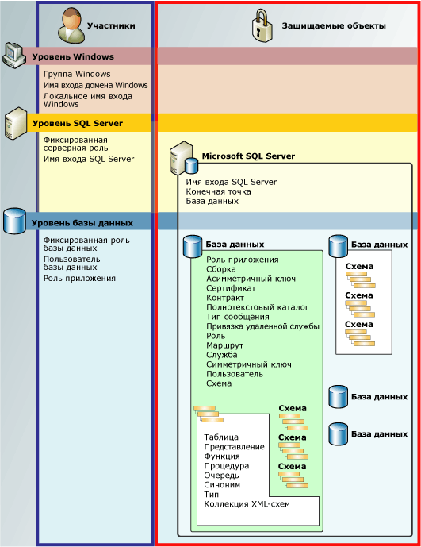

# Иерархия разрешений (компонент Database Engine)
[!INCLUDE[appliesto-ss-asdb-asdw-pdw-md](../../includes/appliesto-ss-asdb-asdw-pdw-md.md)]

  Компонент [!INCLUDE[ssDE](../../includes/ssde-md.md)] управляет иерархической коллекцией сущностей, защита которых производится при помощи разрешений. Эти сущности называются *защищаемыми объектами*. Важнейшими защищаемыми компонентами являются серверы и базы данных, однако отдельные разрешения можно задавать на гораздо более глубоком уровне. [!INCLUDE[ssNoVersion](../../includes/ssnoversion-md.md)] регулирует действия участников на защищаемых объектах, проверяя, что им были предоставлены соответствующие разрешения.  
  
 На следующей иллюстрации показана связь между иерархиями разрешений компонента [!INCLUDE[ssDE](../../includes/ssde-md.md)] .  
  
 Система разрешений работает одинаково во всех версиях [!INCLUDE[ssNoVersion](../../includes/ssnoversion-md.md)], [!INCLUDE[ssSDS](../../includes/sssds-md.md)], [!INCLUDE[ssDW](../../includes/ssdw-md.md)], [!INCLUDE[ssAPS](../../includes/ssaps-md.md)], однако некоторые возможности доступны не во всех версиях. Например нельзя настроить разрешение уровня сервера в продуктах Azure.  
  
   
  
## Диаграмма разрешений SQL Server  
 Схему плакатного размера всех разрешений компонента [!INCLUDE[ssDE](../../includes/ssde-md.md)] в формате PDF см. по ссылке [http://go.microsoft.com/fwlink/?LinkId=229142](http://go.microsoft.com/fwlink/?LinkId=229142).  
  
## Работа с разрешениями  
 Выполнение различных действий с разрешениями осуществляется при помощи обычных запросов [!INCLUDE[tsql](../../includes/tsql-md.md)] : GRANT, DENY и REVOKE. Сведения о разрешениях доступны через представления каталога [sys.server_permissions](../../relational-databases/system-catalog-views/sys-server-permissions-transact-sql.md) и [sys.database_permissions](../../relational-databases/system-catalog-views/sys-database-permissions-transact-sql.md) . Существует также поддержка запроса сведений о разрешениях при помощи встроенных функций.  
  
 Сведения о проектировании системы разрешений см. в статье [Getting Started with Database Engine Permissions](../../relational-databases/security/authentication-access/getting-started-with-database-engine-permissions.md).  
  
## См. также:  
 [Обеспечение безопасности SQL Server](../../relational-databases/security/securing-sql-server.md)   
 [Разрешения (компонент Database Engine)](../../relational-databases/security/permissions-database-engine.md)   
 [Securables](../../relational-databases/security/securables.md)   
 [Участники (компонент Database Engine)](../../relational-databases/security/authentication-access/principals-database-engine.md)   
 [GRANT (Transact-SQL)](../../t-sql/statements/grant-transact-sql.md)   
 [REVOKE (Transact-SQL)](../../t-sql/statements/revoke-transact-sql.md)   
 [DENY (Transact-SQL)](../../t-sql/statements/deny-transact-sql.md)   
 [HAS_PERMS_BY_NAME (Transact-SQL)](../../t-sql/functions/has-perms-by-name-transact-sql.md)   
 [sys.fn_builtin_permissions (Transact-SQL)](../../relational-databases/system-functions/sys-fn-builtin-permissions-transact-sql.md)   
 [sys.server_permissions (Transact-SQL)](../../relational-databases/system-catalog-views/sys-server-permissions-transact-sql.md)   
 [sys.database_permissions (Transact-SQL)](../../relational-databases/system-catalog-views/sys-database-permissions-transact-sql.md)  
  
  

