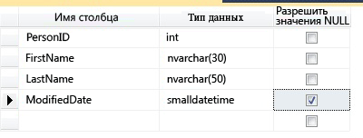
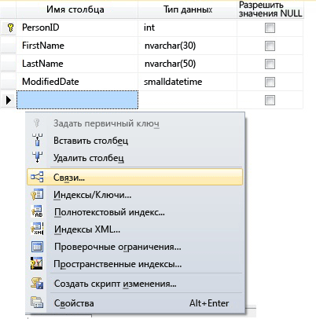
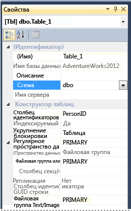

# <a name="create-tables-database-engine"></a>Создание таблиц (компонент Database Engine)
[!INCLUDE[tsql-appliesto-ss2016-all-md](../../includes/tsql-appliesto-ss2016-all-md.md)]

  Предусмотрена возможность создавать таблицы, присваивать им имена и добавлять к существующим базам данных, используя [!INCLUDE[ssManStudioFull](../../includes/ssmanstudiofull-md.md)] или [!INCLUDE[tsql](../../includes/tsql-md.md)].  
  

  
##  <a name="Permissions"></a> Сначала проверьте разрешения!  
Эта задача требует разрешения CREATE TABLE в базе данных и разрешения ALTER на схему, в которой создается таблица.  
  
 Если какие-либо столбцы в инструкции CREATE TABLE определены как принадлежащие к определяемому пользователем типу данных CLR, необходимо быть владельцем данного типа либо иметь разрешение REFERENCES на него.  
  
 Если какие-либо столбцы в инструкции CREATE TABLE имеют связанную коллекцию схем XML, необходимо быть владельцем этого набора схем или иметь разрешение REFERENCES на него.  
  
 
## <a name="using-table-designer"></a>С помощью конструктора таблиц  
  
1.  В SSMS в **обозревателе объектов**подключитесь к экземпляру [!INCLUDE[ssDE](../../includes/ssde-md.md)] , который содержит изменяемую базу данных.  
  
2.  В **обозревателе объектов**разверните узел **Базы данных** , а затем базу данных, в которой будет размещена новая таблица.  
  
3.  В обозревателе объектов щелкните правой кнопкой мыши узел **Таблицы** базы данных и выберите **Создать таблицу**.  
  
4.  Введите имена столбцов, выберите типы данных и определите для каждого столбца, могут ли в нем присутствовать значения NULL, как показано на следующей иллюстрации:  
  
       
  
5.  Вы также можете задать другие свойства столбца, например является ли этот столбец столбцом идентификаторов или вычисляемым столбцом. Для этого щелкните столбец на вкладке свойств столбцов. Дополнительные сведения о свойствах столбцов см. в разделе [Свойства столбца таблицы (среда SQL Server Management Studio)](../../relational-databases/tables/table-column-properties-sql-server-management-studio.md).  
  
6.  Чтобы указать, что столбец является столбцом первичного ключа, щелкните его правой кнопкой мыши и выберите **Задать первичный ключ**. Дополнительные сведения см. в статье [Create Primary Keys](../../relational-databases/tables/create-primary-keys.md).  
  
7.  Чтобы создать связи по внешнему ключу, проверочные ограничения или индексы, щелкните правой кнопкой мыши панель конструктора таблиц и выберите в списке объект, как показано на следующей иллюстрации:  
  
       
  
     Дополнительные сведения об этих объектах см. в разделах [Create Foreign Key Relationships](../../relational-databases/tables/create-foreign-key-relationships.md), [Create Check Constraints](../../relational-databases/tables/create-check-constraints.md) и [Indexes](../../relational-databases/indexes/indexes.md).  
  
8.  По умолчанию таблица содержится в схеме **dbo** . Чтобы указать другую схему для таблицы, щелкните правой кнопкой мыши панель конструктора таблиц и выберите **Свойства** , как показано на следующей иллюстрации. Выберите нужную схему из раскрывающегося списка **Схема** .  
  
       
  
     Дополнительные сведения о схемах см. в разделе [Create a Database Schema](../../relational-databases/security/authentication-access/create-a-database-schema.md).  
  
9. В меню **Файл** выберите команду **Сохранить** *table name*.  
  
10. В диалоговом окне **Выбор имени** введите имя таблицы и нажмите кнопку **OK**.  
  
11. Чтобы просмотреть новую таблицу, в **обозревателе объектов**разверните узел **Таблицы** , а затем нажмите клавишу **F5** , чтобы обновить список объектов. Новая таблица будет отображена в списке таблиц.  
  
##  <a name="TsqlProcedure"></a> Использование Transact-SQL  
  
## <a name="using-query-editor"></a>С помощью редактора запросов  
  
1.  В **обозревателе объектов**подключитесь к экземпляру компонента [!INCLUDE[ssDE](../../includes/ssde-md.md)].  
  
2.  На стандартной панели выберите пункт **Создать запрос**.  
  
3.  Скопируйте следующий пример в окно запроса и нажмите кнопку **Выполнить**.  
  
    ```  
    CREATE TABLE dbo.PurchaseOrderDetail  
    (  
        PurchaseOrderID int NOT NULL  
        ,LineNumber smallint NOT NULL  
        ,ProductID int NULL  
        ,UnitPrice money NULL  
        ,OrderQty smallint NULL  
        ,ReceivedQty float NULL  
        ,RejectedQty float NULL  
        ,DueDate datetime NULL  
    );  
    ```  
  
 Дополнительные сведения см. в разделе [CREATE TABLE (Transact-SQL)](../../t-sql/statements/create-table-transact-sql.md).  
  
  
