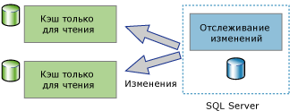
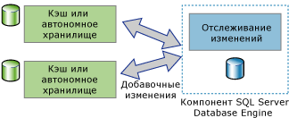

# Об отслеживании изменений (SQL Server)
[!INCLUDE[tsql-appliesto-ss2008-asdb-xxxx-xxx-md](../../includes/tsql-appliesto-ss2008-asdb-xxxx-xxx-md.md)]

  Отслеживание изменений — это простое решение, обеспечивающее эффективный механизм отслеживания изменений для приложений. Обычно, чтобы позволить приложениям направлять запросы об изменениях данных в базе данных и получить доступ к сведениям об изменениях, разработчикам приложений приходится реализовывать специальные механизмы отслеживания изменений. Создание таких механизмов, как правило, трудоемкая работа и часто связана с использованием сочетания триггеров, столбцов **timestamp** , новых таблиц для хранения сведений отслеживания и специальных процессов очистки.  
  
 У различных типов приложений разные требования к уровню детализации необходимых им сведений об изменениях. Отслеживая изменения, приложения могут отвечать на следующие вопросы об изменениях, сделанных в пользовательской таблице.  
  
-   Какие строки изменены в пользовательской таблице?  
  
    -   Требуется только факт изменения строки, но не число изменений строки или значения промежуточных изменений.  
  
    -   Можно получить последние данные непосредственно из отслеживаемой таблицы.  
  
-   Изменилась ли строка?  
  
    -   Факт изменения строки и сведения об изменении должны быть доступны и записаны при внесении изменения в той же транзакции.  
  
> [!NOTE]  
>  Если приложению необходимы данные обо всех произведенных изменениях и все промежуточные значения, следует воспользоваться методом записи данных изменений вместо отслеживания изменений. Дополнительные сведения см. в статье [О системе отслеживания измененных данных (SQL Server)](../../relational-databases/track-changes/about-change-data-capture-sql-server.md).  
  
## Приложения односторонней и двусторонней синхронизации  
 Приложения, которым требуется синхронизировать данные с экземпляром компонента [!INCLUDE[ssDEnoversion](../../includes/ssdenoversion-md.md)] , должны иметь возможность направлять запрос об изменениях. Отслеживание изменений может послужить основой для односторонней и двусторонней синхронизации приложений.  
  
### Приложения односторонней синхронизации  
 Приложения односторонней синхронизации, такие как клиентское или приложение кэширования промежуточного уровня, можно построить с использованием отслеживания изменений. Как показано на следующей иллюстрации, приложение кэширования требует, чтобы данные хранились в компоненте [!INCLUDE[ssDE](../../includes/ssde-md.md)] и кэшировались в других хранилищах. Приложение должно иметь возможность своевременно помещать в кэш любые изменения, внесенные в таблицы базы данных. Изменения в компонент [!INCLUDE[ssDE](../../includes/ssde-md.md)]не передаются.  
  
   
  
### Приложения двусторонней синхронизации  
 С помощью отслеживания изменений можно также построить и приложения двусторонней синхронизации. В этом случае данные в экземпляре компонента [!INCLUDE[ssDE](../../includes/ssde-md.md)] синхронизируется с одним или несколькими хранилищами данных. Данные в этих хранилищах могут быть обновлены, а изменения должны быть синхронизированы с компонентом [!INCLUDE[ssDE](../../includes/ssde-md.md)].  
  
   
  
 Хороший пример приложения двусторонней синхронизации — периодически подключаемое приложение. В приложении такого типа клиентское приложение направляет запрос и обновляет локальное хранилище. Если существует соединение между клиентом и сервером, приложение выполняет синхронизацию с сервером, а измененные данные передаются в обоих направлениях.  
  
 Приложения двусторонней синхронизации должны уметь распознавать конфликты. Конфликт возникнет, если одни и те же данные были изменены в обоих хранилищах в период времени между сеансами синхронизации. Благодаря возможности обнаруживать конфликты приложение может избежать потери изменений.  
  
## Принципы работы отслеживания изменений  
 Чтобы настроить отслеживание изменений, можно использовать инструкции DDL или среду [!INCLUDE[ssManStudioFull](../../includes/ssmanstudiofull-md.md)]. Дополнительные сведения см. в статье [Включение и отключение отслеживания изменений (SQL Server)](../../relational-databases/track-changes/enable-and-disable-change-tracking-sql-server.md). Чтобы разрешить отслеживание изменений, необходимо включить эту функцию сначала на уровне базы данных, а затем для всех таблиц базы данных, изменения в которых необходимо отслеживать. Вносить какие-либо изменения в определение таблицы необязательно, триггеры не создаются.  
  
 После настройки отслеживания изменений для таблицы любая DML-инструкция, затрагивающая строку в таблице, вызовет запись данных отслеживания изменений об измененной строке. При помощи [функций отслеживания изменений](../../relational-databases/system-functions/change-tracking-functions-transact-sql.md)можно запросить, какие строки были изменены, и получить сведения об этих изменениях.  
  
 Из отслеживаемой таблицы вместе со сведениями об изменениях записываются лишь данные о значениях в первичном ключевом столбце. Эти значения идентифицируют измененные строки. Приложение может произвести соединение исходной таблицы с отслеживаемой таблицей по значениям первичного ключевого столбца, чтобы извлечь для этих строк новые значения данных.  
  
 Сведения об изменении, внесенном в каждую строку, могут быть получены с помощью отслеживания изменений. Например, тип операции DML, который вызвал изменение (вставку, обновление или удаление), или столбцы, измененные в ходе операции обновления. 
 
## Очистка отслеживания изменений
Сведения об отслеживании изменений для всех таблиц (с включенной функцией отслеживания изменений) хранятся в хранилище строк в памяти. Данные отслеживания изменений, связанные с каждой таблицей, включенной для отслеживания изменений, записываются на каждой контрольной точке из хранилища строк в памяти в соответствующую внутреннюю таблицу на диске. Во время контрольной точки хранилище строк в памяти удаляется после перемещения строк в таблицы на диске.

Каждая таблица, включенная для отслеживания изменений, содержит внутреннюю таблицу на диске, которая используется функциями отслеживания изменений для определения версии изменения и строк, измененных после определенной версии. При каждой активации потока **автоматической очистки** проверяются все пользовательские базы данных на экземпляре SQL Server для определения баз данных с поддержкой отслеживания изменений. На основе параметра срока хранения базы данных каждая внутренняя таблица на диске удаляется из устаревших записей.

Хранимая процедура входит в пакеты обновления [!INCLUDE[ssSQL14](../../includes/sssql14-md.md)] и [!INCLUDE[ssSQL15](../../includes/sssql15-md.md)] для выполнения очистки внутренних таблиц отслеживания изменений вручную. Дополнительные сведения о хранимой процедуре см. в [статье базы знаний 173157](https://support.microsoft.com/help/3173157/adds-a-stored-procedure-for-the-manual-cleanup-of-the-change-tracking-side-table-in-sql-server-2014-sp2-or-2016-sp1). 
  
## См. также:  
 [Включение и отключение отслеживания изменений (SQL Server)](../../relational-databases/track-changes/enable-and-disable-change-tracking-sql-server.md)   
 [Работа с отслеживанием изменений (SQL Server)](../../relational-databases/track-changes/work-with-change-tracking-sql-server.md)   
 [Управление отслеживанием изменений (SQL Server)](../../relational-databases/track-changes/manage-change-tracking-sql-server.md)   
 [Отслеживание измененных данных (SQL Server)](../../relational-databases/track-changes/track-data-changes-sql-server.md)  
  
  
