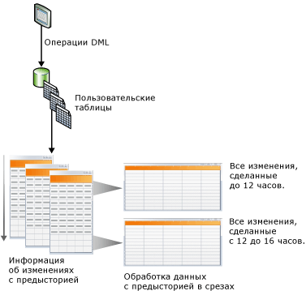
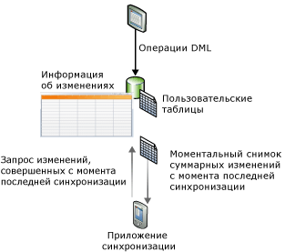

# Отслеживание измененных данных (SQL Server)
[!INCLUDE[tsql-appliesto-ss2008-asdb-xxxx-xxx-md](../../includes/tsql-appliesto-ss2008-asdb-xxxx-xxx-md.md)]
  [!INCLUDE[ssCurrent](../../includes/sscurrent-md.md)] предоставляет две функции отслеживания изменений в базе данных: [система отслеживания измененных данных](#Capture) и [отслеживание изменений](#Tracking). Эти функции позволяют приложениям обнаруживать изменения DML (операции вставки, обновления и удаления), произведенные в пользовательских таблицах базы данных. Отслеживание измененных данных и отслеживание изменений можно включить для одной и той же базы данных без каких-либо дополнительных действий. Список выпусков [!INCLUDE[ssNoVersion](../../includes/ssnoversion-md.md)] , поддерживающих отслеживание измененных данных и отслеживание изменений, см. в разделе [Возможности, поддерживаемые различными выпусками SQL Server 2016](~/sql-server/editions-and-supported-features-for-sql-server-2016.md). Отслеживание изменений поддерживается [!INCLUDE[ssSDS_md](../../includes/sssds-md.md)].
  
## Преимущества использования отслеживания измененных данных или отслеживания изменений  
 Возможность выполнять запросы к измененным данным в базе данных — важное условие для эффективной работы некоторых приложений. Обычно для определения изменений данных разработчикам приложений приходилось реализовывать в своих приложениях специальный метод отслеживания, использующий сочетание триггеров, столбцов отметок времени и дополнительных таблиц. Создание таких приложений обычно связано с большими трудозатратами, требует обновлений схемы и часто вызывает серьезное снижение производительности.  
  
 Использование функций отслеживания измененных данных или отслеживания изменений в приложениях для отслеживания изменений в базах данных, вместо разработки специализированного решения, имеет следующие преимущества.  
  
-   Сокращение времени проектирования. Поскольку функции реализованы в [!INCLUDE[ssCurrent](../../includes/sscurrent-md.md)], не нужно разрабатывать собственное решение.  
  
-   Изменения схемы не нужны. Не требуется добавлять столбцы, триггеры или создавать дополнительные таблицы, в которых будут отслеживаться удаленные строки или храниться информация об отслеживании изменений, если столбцы невозможно добавить в пользовательские таблицы.  
  
-   Имеется встроенный механизм очистки. Очистка для отслеживания изменений выполняется автоматически в режиме в сети. Специальная очистка для данных, хранимых в побочной таблице, не требуется.  
  
-   Для получения сведений об изменениях предоставляются функции.  
  
-   Накладные затраты при операциях DML невелики. Синхронному отслеживанию изменений всегда сопутствуют некоторые затраты. Однако отслеживание изменений может помочь снизить затраты. Затраты часто оказываются меньше, чем при использовании альтернативных решений, особенно решений с использованием триггеров.  
  
-   Отслеживание изменений основано на зафиксированных транзакциях. Порядок изменений основан на времени фиксации транзакции. Это позволяет получить надежные результаты при наличии долго выполняемых и перекрывающихся транзакций. Пользовательские решения, в которых используются значения **timestamp** , должны проектироваться специально для обработки таких ситуаций.  
  
-   Доступны стандартные средства, которые вы можете использовать для настройки и управления. [!INCLUDE[ssCurrent](../../includes/sscurrent-md.md)] предоставляет стандартные инструкции DDL, среду [!INCLUDE[ssManStudioFull](../../includes/ssmanstudiofull-md.md)], представления каталогов и разрешения безопасности.  
  
## Отличие возможностей системы отслеживания измененных данных и системы отслеживания изменений  
 В следующей таблице приводится список отличий возможностей для системы отслеживания измененных данных и системы отслеживания изменений. Система отслеживания измененных данных задействует асинхронный механизм отслеживания изменений в журнале транзакций, поэтому изменения доступны после выполнения операции DML. В системе отслеживания изменений задействуется синхронное отслеживание изменений параллельно с операциями DML, поэтому данные изменений доступны немедленно.  
  
|Компонент|система отслеживания измененных данных|отслеживание изменений|  
|-------------|-------------------------|---------------------|  
|**Отслеживаемые изменения**|||  
|DML-изменения|Да|Да|  
|**Отслеживаемые данные**|||  
|Данные журнала|Да|нет|  
|Изменение столбца|Да|Да|  
|Тип DML|Да|Да|  
  
##   Change Data Capture  
 Система отслеживания измененных данных регистрирует в журнале данные об изменении пользовательских таблиц, отслеживая как сам факт DML-изменений, так и фактически измененные данные. Изменения отслеживаются с помощью асинхронного процесса, который считывает журнал транзакций и слабо влияет на систему.  
  
 Как показано на следующем рисунке, изменения в пользовательской таблице записываются в соответствующих таблицах изменений. Эти таблицы изменений обеспечивают журнальное представление изменений, распределенных во времени. Функции [отслеживания измененных данных](../../relational-databases/system-functions/change-data-capture-functions-transact-sql.md), предоставляемые [!INCLUDE[ssNoVersion](../../includes/ssnoversion-md.md)], обеспечивают простую систематическую обработку данных об изменениях.  
  
   
  
### Модель безопасности  
 В этом разделе описана модель безопасности системы отслеживания измененных данных.  
  
 **Конфигурация и администрирование**  
 Чтобы включить или отключить систему отслеживания измененных данных в базе данных, пользователь, вызывающий процедуры [sys.sp_cdc_enable_db (Transact-SQL)](../../relational-databases/system-stored-procedures/sys-sp-cdc-enable-db-transact-sql.md) или [sys.sp_cdc_disable_db (Transact-SQL)](../../relational-databases/system-stored-procedures/sys-sp-cdc-disable-db-transact-sql.md), должен быть членом предопределенной роли сервера **sysadmin**. Для включения или отключения системы отслеживания измененных данных на уровне таблиц пользователь, вызывающий процедуры [sys.sp_cdc_enable_table (Transact-SQL)](../../relational-databases/system-stored-procedures/sys-sp-cdc-enable-table-transact-sql.md) и [sys.sp_cdc_disable_table (Transact-SQL)](../../relational-databases/system-stored-procedures/sys-sp-cdc-disable-table-transact-sql.md), должен быть членом предопределенной роли сервера sysadmin или членом роли базы данных **database db_owner**.  
  
 Использование хранимых процедур для администрирования заданий отслеживания измененных данных ограничено членами серверной роли **sysadmin** и членами роли **database db_owner** .  
  
 **Перечисление изменений и запросы метаданных**  
 Чтобы получить доступ к информации об изменениях, связанной с экземпляром отслеживания, пользователю должен быть предоставлен доступ с правом выборки всех отслеживаемых столбцов в соответствующей исходной таблице. Кроме того, если при создании экземпляра отслеживания задана шлюзовая роль, вызывающий также должен быть членом указанной шлюзовой роли. Другие общие функции системы отслеживания измененных данных для доступа к метаданным имеются в распоряжении пользователей через роль public, хотя доступ к возвращенным метаданным обычно регулируется доступом с правом выборки к базовым исходным таблицам, а также членством во всех определенных шлюзовых ролях.  
  
 **DDL-операции в исходных таблицах с включенной системой отслеживания измененных данных**  
 Если в таблице включена система отслеживания измененных данных, операции DDL могут применяться только членом предопределенной роли сервера **sysadmin**, членом роли **database role db_owner**или **database role db_ddladmin**. Для пользователей, которым явно предоставлены права на выполнение DDL-операций в такой таблице, выводится сообщение об ошибке 22914, если они пытаются выполнить такие операции.  
  
### Вопросы типов данных в системе отслеживания измененных данных  
 Система отслеживания измененных данных поддерживает все базовые типы столбцов. В следующей таблице описывается поведение и ограничения нескольких типов столбцов.  
  
|Тип столбца|Изменения, отслеживаемые в таблицах изменений|Ограничения|  
|--------------------|---------------------------------------|-----------------|  
|Разреженные столбцы|Да|Не поддерживает отслеживание изменений при использовании набора столбцов.|  
|Вычисляемые столбцы|нет|Изменения в вычисляемых столбцах не отслеживаются. Столбец появится в таблице изменений с подходящим типом, но в нем будет содержаться значение NULL.|  
|XML|Да|Изменения в индивидуальных XML-элементах не отслеживаются.|  
|timestamp|Да|Тип данных в таблице изменений будет преобразован в двоичный.|  
|Типы данных BLOB|Да|Предыдущий снимок столбца BLOB будет сохранен только при изменении самого столбца.|  
  
### Система отслеживания измененных данных и другие функции SQL Server  
 В данном разделе описывается взаимодействие следующих функций с системой отслеживания измененных данных.  
  
-   Зеркальное отображение базы данных  
  
-   Репликация транзакций  
  
-   Восстановление или присоединение базы данных  
  
#### Зеркальное отображение базы данных  
 Для базы данных, активированной для отслеживания измененных данных, можно установить зеркальное отображение. Чтобы обеспечить автоматическое выполнение отслеживания и очистки на зеркальном сервере, выполните следующие шаги.  
  
1.  Убедитесь, что на зеркальном сервере запущен агент [!INCLUDE[ssNoVersion](../../includes/ssnoversion-md.md)] .  
  
2.  Создайте задание отслеживания и задание очистки на зеркальном сервере после того, как был выполнен переход с основного сервера на зеркальный. Для создания заданий используйте хранимую процедуру [sys.sp_cdc_add_job (Transact-SQL)](../../relational-databases/system-stored-procedures/sys-sp-cdc-add-job-transact-sql.md).  
  
 Дополнительные сведения о зеркальном отображении базы данных см. в разделе [Зеркальное отображение базы данных (SQL Server)](../../database-engine/database-mirroring/database-mirroring-sql-server.md).  
  
#### репликация транзакций  
 Система отслеживания измененных данных и репликация транзакций могут сосуществовать в одной базе данных, но если обе эти функции были включены, то заполнение таблиц изменений будет выполняться другим способом. Для считывания изменений из журнала транзакций система отслеживания измененных данных и репликация транзакций всегда используют одну и ту же процедуру [sp_replcmds](../../relational-databases/system-stored-procedures/sp-replcmds-transact-sql.md). Если система отслеживания измененных данных включена отдельно, то процедуру [!INCLUDE[ssNoVersion](../../includes/ssnoversion-md.md)] sp_replcmds **вызывает задание агента**. Если в базе данных включены обе эти функции, процедуру **sp_replcmds**вызывает агент чтения журнала. Агент заполняет как таблицы изменений, так и таблицы базы данных распространителя. Дополнительные сведения см. в статье [Replication Log Reader Agent](../../relational-databases/replication/agents/replication-log-reader-agent.md).  
  
 Рассмотрим случай, когда для базы данных [!INCLUDE[ssSampleDBobject](../../includes/sssampledbobject-md.md)] была включена система отслеживания измененных данных и две таблицы были включены для отслеживания. Для заполнения таблиц изменений задание отслеживания вызывает процедуру **sp_replcmds**. База данных активируется для репликации транзакций, после этого создается публикация. Для базы данных создается агент чтения журнала, задание отслеживания удаляется. Агент чтения журнала продолжает просматривать журнал, начиная с последнего регистрационного номера транзакции, зафиксированного в таблице изменений. Это обеспечивает согласованность данных в таблицах изменений. Если в данной базе данных будет отключена репликация транзакций, то агент чтения журнала будет удален, а задание отслеживания будет создано повторно.  
  
> [!NOTE]  
>  Если для системы отслеживания измененных данных и репликации транзакций используется агент чтения журнала, то в базу данных распространителя в первую очередь записываются реплицированные изменения. Затем в таблицы изменений записываются отслеженные изменения. Обе операции фиксируются одновременно. Если при записи в базу данных распространителя возникла задержка, то перед появлением изменений в таблицах изменений пройдет такое же время.  
  
#### Восстановление или прикрепление базы данных, активированной для системы отслеживания измененных данных  
 [!INCLUDE[ssNoVersion](../../includes/ssnoversion-md.md)] используется следующая логика.  
  
-   Если база данных восстанавливается на том же сервере с таким же именем базы данных, то система отслеживания измененных данных останется активированной.  
  
-   Если база данных восстанавливается на другом сервере, то по умолчанию система отслеживания измененных данных будет отключена, а все связанные метаданные будут удалены.  
  
     Для сохранения системы отслеживания измененных данных в активированном состоянии при восстановлении базы данных следует использовать параметр **KEEP_CDC** . Дополнительные сведения об этом параметре см. в разделе [RESTORE](../../t-sql/statements/restore-statements-transact-sql.md).  
  
-   Если база данных отсоединяется и присоединяется к тому же или другому серверу, то система отслеживания измененных данных остается активированной.  
  
-   Если база данных присоединяется или восстанавливается с параметром **KEEP_CDC** в любом выпуске, отличном от Enterprise, то эта операция будет заблокирована, так как для системы отслеживания измененных данных требуется выпуск [!INCLUDE[ssNoVersion](../../includes/ssnoversion-md.md)] Enterprise. Отображается сообщение об ошибке 932.  
  
     `SQL Server cannot load database '%.*ls' because change data capture is enabled. The currently installed edition of SQL Server does not support change data capture. Either disable change data capture in the database by using a supported edition of SQL Server, or upgrade the instance to one that supports change data capture.`  
  
 Системную хранимую процедуру [sys.sp_cdc_disable_db](../../relational-databases/system-stored-procedures/sys-sp-cdc-disable-db-transact-sql.md) можно использовать для отключения отслеживания измененных данных в восстановленной или присоединенной базе данных.  
  
##   Change Tracking  
 Система отслеживания изменений отслеживает факт изменения строк таблицы, но не отслеживает изменившиеся данные. Это позволяет приложениям определять изменившиеся строки, получая последние данные изменений непосредственно из пользовательских таблиц. Поэтому журнал системы отслеживания изменений более ограничен по сравнению с системой отслеживания измененных данных. Однако приложениям, которые не нуждаются в данных предыстории, требуется меньше пространства хранения, поскольку не отслеживаются измененные данные. Для отслеживания изменений используется синхронное средство отслеживания. Оно было разработано, чтобы снизить до минимума объем служебных данных для операций DML.  
  
 На следующем рисунке показан сценарий синхронизации, при котором оптимальным является отслеживание изменений. В этом сценарии приложению требуются следующие данные: все строки таблицы, измененные с момента последней синхронизации, и только текущие данные строк. Поскольку для отслеживания изменений используется синхронный механизм, приложение может выполнить двустороннюю синхронизацию и уверенно определить возможные конфликты.  
  
   
  
### Отслеживание изменений и службы Sync Services для ADO.NET  
 [!INCLUDE[sql_sync_long](../../includes/sql-sync-long-md.md)] обеспечивает синхронизацию между базами данных, предоставляя интуитивно понятный и гибкий интерфейс API, с помощью которого можно разрабатывать приложения для работы вне сети или совместной работы. [!INCLUDE[sql_sync_long](../../includes/sql-sync-long-md.md)] предоставляет интерфейс API для синхронизации изменений, но фактически не отслеживает изменения в серверной или одноранговой базе данных. Можно создать нестандартную систему отслеживания изменений, однако обычно это сопряжено со значительным усложнением среды и повышенными затратами ресурсов. Чтобы отслеживать изменения на сервере или в одноранговой базе данных, рекомендуется использовать входящую в [!INCLUDE[ssCurrent](../../includes/sscurrent-md.md)] систему отслеживания изменений, поскольку она легко настраивается и обладает высокой производительностью.  
  
 Дополнительные сведения об отслеживании изменений и [!INCLUDE[sql_sync_long](../../includes/sql-sync-long-md.md)]см. по следующим ссылкам.  
  
-   [Об отслеживании изменений (SQL Server)](../../relational-databases/track-changes/about-change-tracking-sql-server.md)  
  
     Содержит описание отслеживания изменений данных, общие сведения о механизме отслеживания изменений и описывает взаимодействие отслеживания изменений с другими функциями компонента [!INCLUDE[ssDEnoversion](../../includes/ssdenoversion-md.md)] .  
  
-   [Центр разработки Microsoft Sync Framework](https://go.microsoft.com/fwlink/?LinkId=108054)  
  
     Содержит полную документацию по [!INCLUDE[ssSyncFrameLong](../../includes/sssyncframelong-md.md)] и [!INCLUDE[sql_sync_short](../../includes/sql-sync-short-md.md)]. В документации по [!INCLUDE[sql_sync_short](../../includes/sql-sync-short-md.md)]раздел "Как использовать отслеживание изменений SQL Server" содержит подробные сведения и примеры программного кода.  
  
## Связанные задачи (обязательно)  
  
|||  
|-|-|  
|**Задача**|**Раздел**|  
|Содержит общие сведения о системе отслеживания измененных данных.|[Об отслеживании измененных данных (SQL Server)](../../relational-databases/track-changes/about-change-data-capture-sql-server.md)|  
|Описывает, как включать и отключать отслеживание измененных данных для базы данных или таблицы.|[Включение и отключение отслеживания измененных данных (SQL Server)](../../relational-databases/track-changes/enable-and-disable-change-data-capture-sql-server.md)|  
|Описывает, как управлять мониторингом измененных данных и контролировать его.|[Администрирование и наблюдение за отслеживанием измененных данных (SQL Server)](../../relational-databases/track-changes/administer-and-monitor-change-data-capture-sql-server.md)|  
|Описывает способы работы с информацией об изменениях, доступные потребителям отслеживания информации об изменениях. В этом разделе описываются проверка границ номеров LSN, функции запросов и сценарии функций запросов.|[Работа с информацией об изменениях (SQL Server)](../../relational-databases/track-changes/work-with-change-data-sql-server.md)|  
|Содержит общие сведения об отслеживании изменений.|[Об отслеживании изменений (SQL Server)](../../relational-databases/track-changes/about-change-tracking-sql-server.md)|  
|Описывает, как включать и отключать отслеживание изменений для базы данных или таблицы.|[Включение и отключение отслеживания изменений (SQL Server)](../../relational-databases/track-changes/enable-and-disable-change-tracking-sql-server.md)|  
|Описывает, как управлять отслеживанием изменений, настраивать безопасность и определять влияние использования отслеживания изменений на производительность и требуемый объем хранилища.|[Управление отслеживанием изменений (SQL Server)](../../relational-databases/track-changes/manage-change-tracking-sql-server.md)|  
|Описывает, как приложения, использующие отслеживание изменений, могут получать отслеженные изменения, применять эти изменения к другому хранилищу данных и обновлять базу данных-источник. В этом разделе также описывается роль, которую отслеживание изменений играет при отработке отказа, когда необходимо восстановить базу данных из резервной копии.|[Работа с отслеживанием изменений (SQL Server)](../../relational-databases/track-changes/work-with-change-tracking-sql-server.md)|  
  
## См. также:  
 [Функции системы отслеживания измененных данных (Transact-SQL)](../../relational-databases/system-functions/change-data-capture-functions-transact-sql.md)   
 [Функции отслеживания изменений (Transact-SQL)](../../relational-databases/system-functions/change-tracking-functions-transact-sql.md)   
 [Хранимые процедуры системы отслеживания измененных данных (Transact-SQL)](../../relational-databases/system-stored-procedures/change-data-capture-stored-procedures-transact-sql.md)   
 [Таблицы системы отслеживания измененных данных (Transact-SQL)](../../relational-databases/system-tables/change-data-capture-tables-transact-sql.md)   
 [Динамические административные представления, связанные с системой отслеживания измененных данных (Transact-SQL)](https://msdn.microsoft.com/library/2a771d7d-693a-4f56-9227-02cd00e0e200)  
  
  

