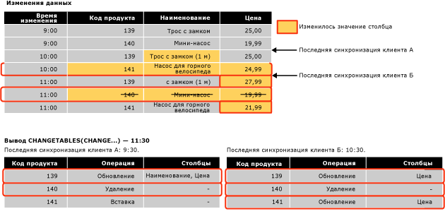

# <a name="work-with-change-tracking-sql-server"></a>Работа с отслеживанием изменений (SQL Server)
[!INCLUDE[tsql-appliesto-ss2008-asdb-xxxx-xxx-md](../../includes/tsql-appliesto-ss2008-asdb-xxxx-xxx-md.md)]

  Приложения, в которых используется отслеживание изменений, должны иметь возможность получать отслеженные изменения, применять эти изменения к другому хранилищу данных и обновлять базу данных-источник. В этом разделе описаны способы выполнения этих задач и роль отслеживания изменений в случае отработки отказа и необходимостью восстановить базу данных из резервной копии.  
  
##  <a name="Obtain"></a> Получение изменений с помощью функций отслеживания изменений  
 Описывает, как использовать функции отслеживания изменений, чтобы получить изменения и сведения об изменениях, произведенных в базе данных.  
  
### <a name="about-the-change-tracking-functions"></a>Сведения о функциях отслеживания изменений  
 Чтобы получить изменения из базы данных и сведения об этих изменениях, приложения могут использовать следующие функции.  
  
 Функция CHANGETABLE(CHANGES ...)  
 Эта функция, возвращающая набор строк, используется в запросе данных отслеживания изменений. Функция запрашивает данные, хранящиеся во внутренних таблицах отслеживания изменений. Она возвращает результирующий набор, содержащий первичные ключи измененных строк, а также другие сведения: операцию, число обновленных столбцов и версии строк.  
  
 Функция CHANGETABLE(CHANGES ...) получает в качестве аргумента последнюю версию синхронизации. Версию, установленную при последней синхронизации, можно получить из переменной `@last_synchronization_version` . Семантика последней версии синхронизации выглядит следующим образом.  
  
-   Вызывающий клиент получает сведения обо всех изменениях, происшедших до момента последней синхронизированной версии включительно.  
  
-   Функция CHANGETABLE(CHANGES ...) поэтому возвращает сведения обо всех изменениях, произошедших после последней версии синхронизации.  
  
     Ниже показано, как функция CHANGETABLE(CHANGES ...) используется для получения изменений.  
  
       
  
 Функция CHANGE_TRACKING_CURRENT_VERSION()  
 Используется для получения текущей версии, которая будет применяться при следующем запросе изменений. Эта версия представляет версию последней зафиксированной транзакции.  
  
 Функция CHANGE_TRACKING_MIN_VALID_VERSION()  
 Используется для получения минимальной допустимой версии, имеющейся у клиента, при которой он еще сможет получать достоверные результаты из функции CHANGETABLE(). Клиент должен сравнить последнюю версию синхронизации со значением, возвращенным этой функцией. Если номер последней версии синхронизации меньше, чем возвращает эта функция, то он не сможет получить достоверные результаты из функции CHANGETABLE() и должен повторно инициализировать данные.  
  
### <a name="obtaining-initial-data"></a>Получение первоначальных данных  
 Прежде чем приложение в первый раз получит изменения, оно должно выполнить запрос для получения первоначальных данных и версии синхронизации. Приложение должно получить соответствующие данные напрямую из таблицы, а затем вызвать функцию CHANGE_TRACKING_CURRENT_VERSION() для получения первоначальной версии. Эта версия передается функции CHANGETABLE(CHANGES ...) при первом получении изменений.  
  
 В следующем примере показано получение первоначальной версии синхронизации и первоначального набора данных.  
  
```sql  
    -- Obtain the current synchronization version. This will be used next time that changes are obtained.  
    SET @synchronization_version = CHANGE_TRACKING_CURRENT_VERSION();  
  
    -- Obtain initial data set.  
    SELECT  
        P.ProductID, P.Name, P.ListPrice  
    FROM  
        SalesLT.Product AS P  
```  
  
### <a name="using-the-change-tracking-functions-to-obtain-changes"></a>Использование функций отслеживания изменений для получения изменений  
 Чтобы получить измененные строки таблицы и сведения об этих изменениях, используется функция CHANGETABLE(CHANGES...). Например, следующий запрос получает изменения в таблице `SalesLT.Product` .  
  
```sql  
SELECT  
    CT.ProductID, CT.SYS_CHANGE_OPERATION,  
    CT.SYS_CHANGE_COLUMNS, CT.SYS_CHANGE_CONTEXT  
FROM  
    CHANGETABLE(CHANGES SalesLT.Product, @last_synchronization_version) AS CT  
  
```  
  
 Как правило, клиенту нужно получить последние данные строки, а не просто первичные ключи. Поэтому приложение соединяет результаты запроса функции CHANGETABLE(CHANGES ...) с данными в пользовательской таблице. Например, следующий запрос соединяется с таблицей `SalesLT.Product` , чтобы получить значения столбцов `Name` и `ListPrice` . Обратите внимание на использование `OUTER JOIN`. Это требуется, чтобы убедиться, что возвращаются сведения об изменениях в строках, удаленных из пользовательской таблицы.  
  
```sql  
SELECT  
    CT.ProductID, P.Name, P.ListPrice,  
    CT.SYS_CHANGE_OPERATION, CT.SYS_CHANGE_COLUMNS,  
    CT.SYS_CHANGE_CONTEXT  
FROM  
    SalesLT.Product AS P  
RIGHT OUTER JOIN  
    CHANGETABLE(CHANGES SalesLT.Product, @last_synchronization_version) AS CT  
ON  
    P.ProductID = CT.ProductID  
```  
  
 Чтобы получить версию, которая будет использоваться в следующем перечислении изменений, используется функция CHANGE_TRACKING_CURRENT_VERSION(), как показано в следующем примере.  
  
```sql  
SET @synchronization_version = CHANGE_TRACKING_CURRENT_VERSION()  
```  
  
 Когда приложение получает изменения, оно должно использовать как функцию CHANGETABLE(CHANGES...), так и CHANGE_TRACKING_CURRENT_VERSION(), как показано в следующем примере.  
  
```sql  
-- Obtain the current synchronization version. This will be used the next time CHANGETABLE(CHANGES...) is called.  
SET @synchronization_version = CHANGE_TRACKING_CURRENT_VERSION();  
  
-- Obtain incremental changes by using the synchronization version obtained the last time the data was synchronized.  
SELECT  
    CT.ProductID, P.Name, P.ListPrice,  
    CT.SYS_CHANGE_OPERATION, CT.SYS_CHANGE_COLUMNS,  
    CT.SYS_CHANGE_CONTEXT  
FROM  
    SalesLT.Product AS P  
RIGHT OUTER JOIN  
    CHANGETABLE(CHANGES SalesLT.Product, @last_synchronization_version) AS CT  
ON  
    P.ProductID = CT.ProductID  
```  
  
### <a name="version-numbers"></a>Номера версий  
 База данных, для которой включено отслеживание изменений, содержит счетчик версий, который увеличивается при каждом изменении отслеживаемых таблиц. Каждой изменяемой строке присваивается собственный номер версии. Когда в приложение отправляется запрос изменений, вызывается функция, возвращающая номер версии. Эта функция возвращает сведения обо всех изменениях, которые были сделаны после этой версии. В некотором роде версия отслеживания изменений напоминает тип данных **rowversion** .  
  
### <a name="validating-the-last-synchronized-version"></a>Проверка последней синхронизированной версии  
 Сведения об изменениях хранятся ограниченное время. Длительность этого времени управляется параметром CHANGE_RETENTION, который указывается в инструкции ALTER DATABASE.  
  
 Имейте в виду, что время, заданное параметром CHANGE_RETENTION, определяет, как  часто все приложения должны запрашивать изменения в базе данных. Если значение параметра *last_synchronization_version* в приложении старше минимально допустимой версии синхронизации для таблицы, это приложение не сможет выполнить достоверное перечисление изменений. Это объясняется тем, что некоторые данные изменений могли быть очищены. Прежде чем приложение получит изменения с помощью функции CHANGETABLE(CHANGES ...), оно должно проверить значение параметра *last_synchronization_version* , которое нужно передать функции CHANGETABLE(CHANGES ...). Если значение параметра *last_synchronization_version* недопустимо, приложение должно повторно инициализировать все данные.  
  
 В следующем примере показано, как проверять достоверность значения `last_synchronization_version` для каждой таблицы.  
  
```sql  
-- Check individual table.  
IF (@last_synchronization_version < CHANGE_TRACKING_MIN_VALID_VERSION(  
                                   OBJECT_ID('SalesLT.Product')))  
BEGIN  
  -- Handle invalid version and do not enumerate changes.  
  -- Client must be reinitialized.  
END  
```  
  
 Как показано в следующем примере, достоверность значения `last_synchronization_version` можно проверить для всех таблиц в базе данных.  
  
```sql  
-- Check all tables with change tracking enabled  
IF EXISTS (  
  SELECT COUNT(*) FROM sys.change_tracking_tables  
  WHERE min_valid_version > @last_synchronization_version )  
BEGIN  
  -- Handle invalid version & do not enumerate changes  
  -- Client must be reinitialized  
END  
```  
  
### <a name="using-column-tracking"></a>Использование отслеживания столбцов  
 Отслеживание столбцов позволяет приложениям получать изменившиеся данные не всей строки, а только одного столбца. Например, рассмотрим ситуацию, когда в таблице имеются один или два больших, но редко изменяющихся столбца и другие столбцы, значения которых часто меняются. Не применяя отслеживание столбцов, приложение может только определить изменение строки и синхронизировать все данные, включая данные больших столбцов. Но с помощью отслеживания столбцов приложение может определить, в каких столбцах изменились значения, и синхронизировать только изменившиеся данные.  
  
 Сведения об отслеживании столбцов отображаются в столбце SYS_CHANGE_COLUMNS, который возвращается функцией CHANGETABLE(CHANGES ...).  
  
 Отслеживание столбцов может применяться таким образом, чтобы для всех неизменившихся столбцов возвращалось значение NULL. Если значение NULL недопустимо для того или иного столбца, можно возвратить отдельный столбец, который укажет, изменялись ли данные этого столбца.  
  
 В следующем примере столбец `CT_ThumbnailPhoto` будет иметь значение `NULL` , если он не был изменен. Этот столбец может также принимать значение `NULL` , потому что он был изменен на `NULL` , поэтому приложение может использовать столбец `CT_ThumbNailPhoto_Changed` , чтобы определить, происходили ли изменения.  
  
```sql  
DECLARE @PhotoColumnId int = COLUMNPROPERTY(  
    OBJECT_ID('SalesLT.Product'),'ThumbNailPhoto', 'ColumnId')  
  
SELECT  
    CT.ProductID, P.Name, P.ListPrice, -- Always obtain values.  
    CASE  
           WHEN CHANGE_TRACKING_IS_COLUMN_IN_MASK(  
                     @PhotoColumnId, CT.SYS_CHANGE_COLUMNS) = 1  
            THEN ThumbNailPhoto  
            ELSE NULL  
      END AS CT_ThumbNailPhoto,  
      CHANGE_TRACKING_IS_COLUMN_IN_MASK(  
                     @PhotoColumnId, CT.SYS_CHANGE_COLUMNS) AS  
                                   CT_ThumbNailPhoto_Changed,  
     CT.SYS_CHANGE_OPERATION, CT.SYS_CHANGE_COLUMNS,  
     CT.SYS_CHANGE_CONTEXT  
FROM  
     SalesLT.Product AS P  
INNER JOIN  
     CHANGETABLE(CHANGES SalesLT.Product, @last_synchronization_version) AS CT  
ON  
     P.ProductID = CT.ProductID AND  
     CT.SYS_CHANGE_OPERATION = 'U'  
```  
  
### <a name="obtaining-consistent-and-correct-results"></a>Получение согласованных и правильных результатов  
 Для получения измененных данных для таблицы требуется несколько шагов. Имейте в виду, что, если не удастся решить некоторые проблемы, будут возвращены несогласованные или неверные результаты.  
  
 Например, чтобы получить изменения в таблицах Sales и SalesOrders, приложение должно выполнить следующие действия.  
  
1.  Проверить последнюю синхронизированную версию с помощью функции CHANGE_TRACKING_MIN_VALID_VERSION().  
  
2.  Получить версию, которая будет использована для получения изменений в следующий раз, с помощью функции CHANGE_TRACKING_CURRENT_VERSION().  
  
3.  Получите изменения для таблицы Sales с помощью функции CHANGETABLE(CHANGES ...).  
  
4.  Получите изменения для таблицы SalesOrders с помощью функции CHANGETABLE(CHANGES ...).  

 В базе данных выполняются следующие два процесса, которые могут повлиять на результаты, возвращаемые на предыдущих шагах.  
  
-   Процесс очистки выполняется в фоновом режиме и удаляет данные отслеживания изменений старше указанного срока хранения.  
  
     Процесс очистки является отдельным фоновым процессом и руководствуется сроком хранения, заданным при настройке отслеживания изменений в базе данных. Проблема заключается в том, что он может выполняться в промежуток между проверкой последней версии синхронизации и вызовом функции CHANGETABLE(CHANGES...). Последняя достоверная версия синхронизации может оказаться ошибочной ко времени получения изменений. Поэтому функция может возвратить неверные результаты.  
  
-   В таблицах Sales и SalesOrders постоянно выполняются операции DML, например следующие.  
  
    -   В таблицах могут происходить изменения после того, как с помощью функции CHANGE_TRACKING_CURRENT_VERSION() была получена последняя версия синхронизации. Следовательно, функция может вернуть больше изменений, чем ожидалось.  
  
    -   Между вызовами функций для получения изменений из таблицы Sales и из таблицы SalesOrders могут быть зафиксированы транзакции. Следовательно, результаты для таблицы SalesOrder могут содержать внешние ключи, не имеющиеся в таблице Sales.  
  
 Для преодоления приведенных выше проблем рекомендуется применять изоляцию моментального снимка. Это позволит обеспечить согласованность сведений об изменениях и избежать соперничества при выполнении задач фоновой очистки. Если не применять транзакции моментального снимка, разработка приложения, использующего отслеживание изменений, может потребовать значительно больше усилий.  
  
#### <a name="using-snapshot-isolation"></a>Использование изоляции моментального снимка  
 Отслеживание изменений было разработано для слаженной работы вместе с изоляцией моментального снимка. В базе данных необходимо активировать изоляцию моментального снимка. Все шаги, необходимые для получения изменений, должны включаться в транзакцию моментального снимка. Этим обеспечивается то, что все изменения данных, выполненные во время получения изменений, не будут видны запросам внутри транзакции моментального снимка.  
  
 Чтобы получить данные в транзакции моментального снимка, выполните следующие действия.  
  
1.  Установите уровень изоляции транзакции на уровень моментальных снимков и запустите транзакцию.  
  
2.  Проверьте последнюю версию синхронизации с помощью функции CHANGE_TRACKING_MIN_VALID_VERSION().  
  
3.  Получите версию, которая будет использоваться в следующий раз, с помощью функции CHANGE_TRACKING_CURRENT_VERSION().  
  
4.  Получите изменения для таблицы Sales с помощью функции CHANGETABLE(CHANGES ...).  
  
5.  Получите изменения для таблицы SalesOrders с помощью функции CHANGETABLE(CHANGES ...).  
  
6.  Зафиксируйте транзакцию.  
  
 Необходимо помнить, что все действия для получения изменений находятся внутри транзакции моментальных снимков.  
  
-   Если очистка происходит после проверки последней версии синхронизации, результаты функции CHANGETABLE(CHANGES ...) будут, тем не менее, достоверными, так как операция удаления, выполняемая процессом очистки, не будет видна внутри транзакции.  
  
-   Все изменения в таблице Sales или SalesOrders после получения версии следующей синхронизации не будут видны в транзакции, поэтому вызовы функции CHANGETABLE(CHANGES ...) никогда не будут возвращать изменения с версией более поздней, чем возвращенные функцией CHANGE_TRACKING_CURRENT_VERSION(). Сохранится также согласованность между таблицами Sales и SalesOrders, поскольку транзакции, зафиксированные между вызовами функции CHANGETABLE(CHANGES ...), будут невидимы.  
  
 В следующем примере показано включение изоляции моментального снимка в базе данных.  
  
```sql  
-- The database must be configured to enable snapshot isolation.  
ALTER DATABASE AdventureWorksLT  
    SET ALLOW_SNAPSHOT_ISOLATION ON;  
```  
  
 Транзакция моментального снимка используется следующим образом.  
  
```sql  
SET TRANSACTION ISOLATION LEVEL SNAPSHOT;  
BEGIN TRAN  
  -- Verify that version of the previous synchronization is valid.  
  -- Obtain the version to use next time.  
  -- Obtain changes.  
COMMIT TRAN  
```  
  
 Дополнительные сведения о транзакциях моментальных снимков см. в разделе [SET TRANSACTION ISOLATION LEVEL (Transact-SQL)](../../t-sql/statements/set-transaction-isolation-level-transact-sql.md).  
  
#### <a name="cleanup-and-snapshot-isolation"></a>Очистка и изоляция моментальных снимков   
Включение изоляции моментальных снимков и отслеживания изменений в той же базе данных или в двух разных базах данных одного экземпляра может привести к тому, что процесс очистки оставит строки с истекшим сроком в sys.syscommittab, когда в базе данных с изоляцией моментального снимка будет открытая транзакция. Это может произойти, поскольку процесс очистки с отслеживанием изменений учитывает нижнюю конечную точку в масштабе всего экземпляра (которая является безопасной версией очистки) при выполнении очистки. Это делается для того, чтобы процесс автоматической очистки отслеживания изменений не удалял строки, которые могут потребоваться для открытой транзакции в базе данных, для которой включена изоляция моментальных снимков. Обеспечьте как можно более короткие изоляцию моментального снимка read committed и транзакции изоляции моментального снимка, чтобы обеспечить своевременную очистку устаревших строк из sys.syscommittab. 


#### <a name="alternatives-to-using-snapshot-isolation"></a>Альтернативы для изоляции моментального снимка  
 Существуют альтернативы использованию изоляции моментального снимка, но они требуют больше усилий, чтобы обеспечить требования всех приложений. Чтобы убедиться в достоверности параметра *last_synchronization_version* , а также в том, что данные не удаляются процессом очистки до получения изменений, выполните следующие действия.  
  
1.  Проверьте параметр *last_synchronization_version* после вызовов функции CHANGETABLE().  
  
2.  Проверяйте параметр *last_synchronization_version* в составе каждого запроса, чтобы получить изменения с помощью функции CHANGETABLE().  
  
 Изменения могут происходить после получения версии синхронизации для следующего перечисления. Для обхода этой ситуации существует два способа. Используемый вариант зависит от приложения и обработки побочных эффектов каждого подхода.  
  
-   Пропускайте изменения с версиями больше, чем новая версия синхронизации.  
  
     Побочный эффект этого подхода заключается в том, что новая или обновленная строка будет пропущена, если она была создана или обновлена перед версией новой синхронизации, а затем обновлена после нее. Если имеется новая строка, может возникнуть нарушение ссылочной целостности, если в другой таблице была создана строка, которая ссылалась на  пропущенную строку. Если существует обновленная строка, она будет пропущена и не синхронизирована до следующего раза.  
  
-   Включайте все изменения, даже с версиями больше, чем версия новой синхронизации.  
  
     Строки с версиями больше, чем версия новой синхронизации, будут опять получены во время следующей синхронизации. Приложение должно предполагать такую ситуацию и обрабатывать ее.  
  
 Кроме двух предыдущих вариантов можно разработать подход, сочетающий обе возможности в зависимости от операции. Например, приложение может пропустить более новые изменения, чем версия следующей синхронизации, в том что касается создания или удаления, но не игнорировать обновления.  
  
> [!NOTE]  
>  Выбор оптимального подхода для приложения, работающего с отслеживанием изменений, или любого пользовательского средства отслеживания изменений требует тщательного анализа. Поэтому намного проще использовать изоляцию моментального снимка.  
  
##  <a name="Handles"></a> Как система отслеживания изменений обрабатывает изменения в базе данных  
 Некоторые приложения, использующие отслеживание изменений, выполняют двустороннюю синхронизацию с другими хранилищами данных. Это означает, что изменения в базе данных [!INCLUDE[ssNoVersion](../../includes/ssnoversion-md.md)] обновляются в другом хранилище данных, а изменения в другом хранилище данных обновляются в базе данных [!INCLUDE[ssNoVersion](../../includes/ssnoversion-md.md)] .  
  
 Если приложение обновляет локальную базу данных изменениями, сделанными в другом хранилище данных, оно должно выполнить следующие операции.  
  
-   Проверить наличие конфликтов.  
  
     Конфликт возникает, когда одни и те же данные одновременно изменяются в обоих хранилищах данных. Приложение должно иметь возможность проверить наличие конфликта и получить достаточно информации для его разрешения.  
  
-   Сохранить контекстные сведения приложения.  
  
     Приложение хранит данные, с которыми связана информация отслеживания изменений. Эта информация должна быть доступна вместе с другими данными отслеживания изменений, если изменения были получены из локальной базы данных. Типичный пример таких контекстных сведений – идентификатор хранилища данных, которое было источником изменений.  
  
 Для выполнения вышеуказанных операций приложение синхронизации может использовать следующие функции:  
  
-   CHANGETABLE(VERSION...)  
  
     Когда приложение выполняет изменения, оно может использовать эту функцию для проверки конфликтов. Функция получает последние данные отслеживания изменений в заданной строке в таблицу отслеживания изменений. Эти данные содержат версию последней измененной строки. Это позволяет приложению определить, изменилась ли строка с момента последней синхронизации приложения.  
  
-   WITH CHANGE_TRACKING_CONTEXT  
  
     Приложение может использовать это предложение для хранения контекстных данных.  
  
### <a name="checking-for-conflicts"></a>Проверка наличия конфликтов  
 В сценарии двусторонней синхронизации клиентское приложение должно определить, обновлялась ли строка с момента получения приложением последних изменений.  
  
 В следующем примере показано использование функции CHANGETABLE(VERSION ...) для проверки конфликтов самым эффективным способом — без отдельного запроса. В примере `CHANGETABLE(VERSION ...)` определяет `SYS_CHANGE_VERSION` для строки, заданной аргументом `@product id`. `CHANGETABLE(CHANGES ...)` может получить те же сведения, но это будет менее эффективным. Если значение `SYS_CHANGE_VERSION` для строки больше, чем значение `@last_sync_version`, существует конфликт. Если возникает конфликт, эта строка не будет обновляться. Проверка `ISNULL()` необходима, поскольку для строки может не иметься информации об изменениях. Информации об изменениях не будет, если строка не была обновлена со времени включения отслеживания изменений или времени очистки информации об изменениях.  
  
```sql  
-- Assumption: @last_sync_version has been validated.  
  
UPDATE  
    SalesLT.Product  
SET  
    ListPrice = @new_listprice  
FROM  
    SalesLT.Product AS P  
WHERE  
    ProductID = @product_id AND  
    @last_sync_version >= ISNULL (  
        SELECT CT.SYS_CHANGE_VERSION  
        FROM CHANGETABLE(VERSION SalesLT.Product,  
                        (ProductID), (P.ProductID)) AS CT),  
        0)  
```  
  
 Следующий код проверяет обновленное число строк и может предоставить более подробные сведения о конфликте.  
  
```sql  
-- If the change cannot be made, find out more information.  
IF (@@ROWCOUNT = 0)  
BEGIN  
    -- Obtain the complete change information for the row.  
    SELECT  
        CT.SYS_CHANGE_VERSION, CT.SYS_CHANGE_CREATION_VERSION,  
        CT.SYS_CHANGE_OPERATION, CT.SYS_CHANGE_COLUMNS  
    FROM  
        CHANGETABLE(CHANGES SalesLT.Product, @last_sync_version) AS CT  
    WHERE  
        CT.ProductID = @product_id;  
  
    -- Check CT.SYS_CHANGE_VERSION to verify that it really was a conflict.  
    -- Check CT.SYS_CHANGE_OPERATION to determine the type of conflict:  
    -- update-update or update-delete.  
    -- The row that is specified by @product_id might no longer exist   
    -- if it has been deleted.  
END  
```  
  
### <a name="setting-context-information"></a>Установка контекстных данных  
 С помощью предложения WITH CHANGE_TRACKING_CONTEXT приложение может хранить контекстные данные вместе с информацией об изменениях. Затем эти данные можно получить в столбце SYS_CHANGE_CONTEXT, который возвращает функция CHANGETABLE(CHANGES ...).  
  
 Контекстные данные обычно используются для определения источника изменений. Если источник изменений можно определить, эти данные могут использоваться хранилищем данных, чтобы не получать изменения при повторной синхронизации.  
  
```sql  
  -- Try to update the row and check for a conflict.  
  WITH CHANGE_TRACKING_CONTEXT (@source_id)  
  UPDATE  
     SalesLT.Product  
  SET  
      ListPrice = @new_listprice  
  FROM  
      SalesLT.Product AS P  
  WHERE  
     ProductID = @product_id AND  
     @last_sync_version >= ISNULL (  
         (SELECT CT.SYS_CHANGE_VERSION FROM CHANGETABLE(VERSION SalesLT.Product,  
         (ProductID), (P.ProductID)) AS CT),  
         0)  
```  
  
### <a name="ensuring-consistent-and-correct-results"></a>Обеспечение согласованных и правильных результатов  
 Приложение должно учитывать процесс очистки при проверке значения параметра @last_sync_version. Это объясняется тем, что данные могли быть удалены после вызова функции CHANGE_TRACKING_MIN_VALID_VERSION(), но перед тем, как было выполнено обновление.  
  
> [!IMPORTANT]  
>  Рекомендуется использовать изоляцию моментального снимка и выполнять изменения в транзакции моментального снимка.  
  
```sql  
-- Prerequisite is to ensure ALLOW_SNAPSHOT_ISOLATION is ON for the database.  
  
SET TRANSACTION ISOLATION LEVEL SNAPSHOT;  
BEGIN TRAN  
    -- Verify that last_sync_version is valid.  
    IF (@last_sync_version <  
CHANGE_TRACKING_MIN_VALID_VERSION(OBJECT_ID('SalesLT.Product')))  
    BEGIN  
       RAISERROR (N'Last_sync_version too old', 16, -1);  
    END  
    ELSE  
    BEGIN  
        -- Try to update the row.  
        -- Check @@ROWCOUNT and check for a conflict.  
    END  
COMMIT TRAN  
```  
  
> [!NOTE]  
>  Существует вероятность того, что обновляемая в рамках транзакции моментальных снимков строка уже была обновлена в другой транзакции после начала транзакции моментальных снимков. В этом случае произойдет конфликт обновления при изоляции моментальных снимков, который вызовет прекращение транзакции. В этом случае повторите попытку обновления. В дальнейшем это приведет к обнаружению конфликта отслеживания изменений и ни одна из строк обновлена не будет.  
  
##  <a name="DataRestore"></a> Изменение отслеживания и восстановление данных  
 Приложения, для которых необходима синхронизация, должны учитывать возможность восстановления базы данных, для которой включено отслеживание изменений, в предыдущее состояние. Речь идет о восстановлении базы данных из резервной копии при отработке отказа на асинхронную зеркальную базу данных или сбое при доставке журналов. Эту проблему иллюстрирует следующий сценарий.  
  
1.  Для таблицы Т1 включено отслеживание изменений. Минимальный действительный номер версии равен 50.  
  
2.  Клиентское приложение синхронизирует данные версии 100 и получает все данные отслеживания изменений, произведенных с версии 50 до версии 100.  
  
3.  После версии 100 в таблицу Т1 были внесены дополнительные изменения.  
  
4.  После создания версии 120 произошел сбой, и участник базы данных восстанавливает базу с потерей части данных. После завершения восстановления таблица содержит данные до версии 70, а минимальная синхронизированная версия по-прежнему равна 50.  
  
     Это означает, что синхронизированное хранилище данных содержит данные, которых уже нет в первичном хранилище.  
  
5.  Таблица Т1 обновлялась многократно. Текущий номер версии для нее — 130.  
  
6.  Клиентское приложение синхронизируется вновь и получает номер последней синхронизации 100. Проверка этого номера клиентом происходит успешно, так как 100 больше 50.  
  
     Клиент получает изменения между версиями 100 и 130. В этот момент времени клиент не знает, что изменения между версиями 70 и 100 уже не те, что были прежде. Данные клиента и сервера не синхронизированы.  
  
 Обратите внимание, что если бы база данных была восстановлена на момент времени после версии 100, то проблем с синхронизацией не возникло бы. Клиент и сервер должны правильно синхронизировать данные во время следующего интервала синхронизации.  
  
 Отслеживание изменений не помогает в случае необходимости восстановления утраченных данных по журналу. Однако существует две возможности обнаружения проблем синхронизации такого рода.  
  
-   Сохраните идентификатор версии базы данных на сервере и обновляйте это значение при каждом восстановлении данных или их потере, вызванной любыми другими причинами. Этот идентификатор должно хранить и проверять во время синхронизации данных каждое клиентское приложение. При потере данных идентификаторы не совпадут, что заставит клиента произвести повторную инициализацию. Недостатком такого подхода является то, что клиент может проводить повторную инициализацию, которая окажется ненужной в случае, если потеря данных не пересекала границу последней синхронизации.  
  
-   Когда клиент делает запрос об изменениях, сохраните номер последней версии синхронизации каждого клиента сервера. При возникновении проблем с данными номера последней синхронизированной версии не совпадут. Это будет означать, что необходима повторная инициализация.  
  
## <a name="see-also"></a>См. также:  
 [Отслеживание измененных данных (SQL Server)](../../relational-databases/track-changes/track-data-changes-sql-server.md)   
 [Об отслеживании изменений (SQL Server)](../../relational-databases/track-changes/about-change-tracking-sql-server.md)   
 [Управление отслеживанием изменений (SQL Server)](../../relational-databases/track-changes/manage-change-tracking-sql-server.md)   
 [Включение и отключение отслеживания изменений (SQL Server)](../../relational-databases/track-changes/enable-and-disable-change-tracking-sql-server.md)   
 [CHANGETABLE (Transact-SQL)](../../relational-databases/system-functions/changetable-transact-sql.md)   
 [CHANGE_TRACKING_MIN_VALID_VERSION (Transact-SQL)](../../relational-databases/system-functions/change-tracking-min-valid-version-transact-sql.md)   
 [CHANGE_TRACKING_CURRENT_VERSION (Transact-SQL)](../../relational-databases/system-functions/change-tracking-current-version-transact-sql.md)   
 [WITH CHANGE_TRACKING_CONTEXT (Transact-SQL)](../../relational-databases/system-functions/with-change-tracking-context-transact-sql.md)  
  
  
