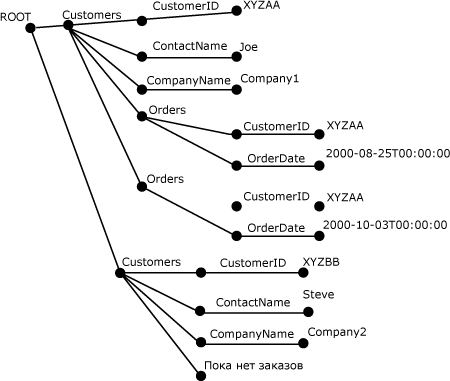

# <a name="openxml-sql-server"></a>Инструкция OPENXML (SQL Server)
[!INCLUDE[tsql-appliesto-ss2008-xxxx-xxxx-xxx-md](../../includes/tsql-appliesto-ss2008-xxxx-xxxx-xxx-md.md)]
  Ключевое слово OPENXML языка [!INCLUDE[tsql](../../includes/tsql-md.md)] предоставляет набор строк по XML-документам в памяти, подобный таблице или представлению. OPENXML позволяет получить доступ к XML-данным так, как если бы это был реляционный набор строк. Это делается при помощи представления внутреннего отображения XML-документа в виде набора строк. Записи в наборе строк могут храниться в таблицах базы данных.  
  
 OPENXML может использоваться в инструкциях SELECT и SELECT INTO в любых позициях, где в качестве источника могут присутствовать поставщики наборов строк, представления или функция OPENROWSET. Дополнительные сведения о синтаксисе инструкции OPENXML см. в разделе [OPENXML (Transact-SQL)](../../t-sql/functions/openxml-transact-sql.md).  
  
 Чтобы писать запросы к XML-документу с использованием OPENXML, необходимо сначала вызвать хранимую процедуру **sp_xml_preparedocument**. Таким образом производится синтаксический анализ XML-документа и возвращается дескриптор для проанализированного документа, готового к использованию. Проанализированный документ является представлением дерева объектной модели документа (DOM) различных узлов в XML-документе. Дескриптор документа передается OPENXML. Затем инструкция OPENXML выдает представление документа в виде набора строк, основываясь на переданных ей аргументах.  
  
> [!NOTE]  
>  Хранимая процедура**sp_xml_preparedocument** использует обновленную под SQL версию средства синтаксического анализа MSXML, Msxmlsql.dll. Эта версия средства синтаксического анализа MSXML разработана для поддержки [!INCLUDE[ssNoVersion](../../includes/ssnoversion-md.md)] и остается обратно совместимой с версией MSXML 2.6.  
  
 Внутреннее представление XML-документа должно быть удалено из памяти посредством вызова системной хранимой процедуры **sp_xml_removedocument** для освобождения памяти.  
  
 На следующей иллюстрации показан этот процесс.  
  
   
  
 Обратите внимание на то, что для понимания OPENXML необходимо иметь общее представление о запросах XPath и XML. Дополнительные сведения о поддержке XPath в SQL Server см. в разделе [Использование запросов XPath в SQLXML 4.0](../../relational-databases/sqlxml-annotated-xsd-schemas-xpath-queries/using-xpath-queries-in-sqlxml-4-0.md).  
  
> [!NOTE]  
>  OpenXML позволяет параметризовать шаблоны XPath столбцов и строк как переменные. Такая параметризация может привести к включению выражений XPath, если разработчик допускает демонстрацию параметризации внешним пользователям (например, если аргументы предоставляются через вызываемую извне хранимую процедуру). Чтобы избежать подобных потенциально опасных ситуаций, рекомендуется никогда не допускать демонстрации аргументов XPath внешним вызывающим программам.  
  
## <a name="example"></a>Пример  
 В следующем примере показано применение процедуры `OPENXML` в инструкции `INSERT` и инструкции `SELECT` . Образец XML-документа содержит элементы `<Customers>` и `<Orders>` .  
  
 Сначала вызывается хранимая процедура `sp_xml_preparedocument` для проведения синтаксического анализа XML-документа. Проанализированный документ является древовидным представлением узлов (элементов, атрибутов, текста и комментариев) в XML-документе. `OPENXML` ссылается на этот проанализированный XML-документ и выдает представление всех частей этого XML-документа в виде набора строк. Инструкция `INSERT` , использующая функцию `OPENXML` , может вставлять данные из такого набора строк в таблицу базы данных. Можно вызывать функцию `OPENXML` несколько раз, получая и обрабатывая представление в виде набора строк различных частей XML-документа. Например, их можно вставить в различные таблицы. Данный процесс также называют разделение XML-данных по таблицам.  
  
 В следующем примере XML-документ разрезается таким образом, что элементы `<Customers>` сохраняются в таблице `Customers` , а элементы `<Orders>` сохраняются в таблице `Orders` с помощью двух инструкций `INSERT` . Этот пример также демонстрирует инструкцию `SELECT` , использующую функцию `OPENXML` , которая получает элементы `CustomerID` и `OrderDate` из XML-документа. Последним шагом обработки является повторный вызов процедуры `sp_xml_removedocument`. Это позволяет освободить память, выделенную для внутреннего древовидного представления XML, создаваемого в фазе синтаксического анализа.  
  
```  
-- Create tables for later population using OPENXML.  
CREATE TABLE Customers (CustomerID varchar(20) primary key,  
                ContactName varchar(20),   
                CompanyName varchar(20));  
GO  
CREATE TABLE Orders( CustomerID varchar(20), OrderDate datetime;)  
GO  
DECLARE @docHandle int;  
DECLARE @xmlDocument nvarchar(max); -- or xml type  
SET @xmlDocument = N'<ROOT>  
<Customers CustomerID="XYZAA" ContactName="Joe" CompanyName="Company1">  
<Orders CustomerID="XYZAA" OrderDate="2000-08-25T00:00:00"/>  
<Orders CustomerID="XYZAA" OrderDate="2000-10-03T00:00:00"/>  
</Customers>  
<Customers CustomerID="XYZBB" ContactName="Steve"  
CompanyName="Company2">No Orders yet!  
</Customers>  
</ROOT>';  
EXEC sp_xml_preparedocument @docHandle OUTPUT, @xmlDocument;  
-- Use OPENXML to provide rowset consisting of customer data.  
INSERT Customers   
SELECT *   
FROM OPENXML(@docHandle, N'/ROOT/Customers')   
  WITH Customers;  
-- Use OPENXML to provide rowset consisting of order data.  
INSERT Orders   
SELECT *   
FROM OPENXML(@docHandle, N'//Orders')   
  WITH Orders;  
-- Using OPENXML in a SELECT statement.  
SELECT * FROM OPENXML(@docHandle, N'/ROOT/Customers/Orders') WITH (CustomerID nchar(5) '../@CustomerID', OrderDate datetime);  
-- Remove the internal representation of the XML document.  
EXEC sp_xml_removedocument @docHandle;   
```  
  
 На следующем рисунке показано XML-дерево, полученное в результате анализа предыдущего XML-документа и созданное с помощью хранимой процедуры sp_xml_preparedocument.  
  
   
  
## <a name="openxml-parameters"></a>Параметры OPENXML  
 К числу аргументов OPENXML относятся:  
  
-   дескриптор XML-документа (*idoc*);  
  
-   выражение XPath для идентификации узлов, которые должны быть сопоставлены со строками (*rowpattern*);  
  
-   описание набора строк, который должен быть создан;  
  
-   сопоставление столбцов набора строк и узлов XML;  
  
### <a name="xml-document-handle-idoc"></a>Обработка XML-документа (idoc)  
 Дескриптор документа возвращается хранимой процедурой **sp_xml_preparedocument** .  
  
### <a name="xpath-expression-to-identify-the-nodes-to-be-processed-rowpattern"></a>Выражение XPath для распознавания узлов, подлежащих обработке (rowpattern)  
 Выражение XPath, указанное аргументом *rowpattern* , распознает набор узлов в XML-документе. Каждый узел, распознанный *rowpattern* , соотносится с отдельной строкой в наборе строк, созданном OPENXML.  
  
 Узлами, распознанными выражением XPath, могут быть любые узлы XML в XML-документе. Если *rowpattern* распознает набор элементов в XML-документе, в наборе строк выделяется по одной строке для каждого распознанного узла. Например, если *rowpattern* приводит к атрибуту, создается строка для каждого узла атрибута, выбранного *rowpattern*.  
  
### <a name="description-of-the-rowset-to-be-generated"></a>Описание набора строк, который должен быть сформирован  
 Схема набора строк используется OPENXML для создания результирующего набора строк. Можно использовать нижеследующие параметры при указании схемы набора строк.  
  
#### <a name="using-the-edge-table-format"></a>Использование формата краевой таблицы  
 Для указания схемы набора строк следует использовать формат краевой таблицы. Не используйте предложение WITH.  
  
 При этом OPENXML возвращает набор строк в формате краевой таблицы. Ее так называют потому, что каждый край проанализированного XML-документа сопоставляется со строкой в наборе строк.  
  
 Краевые таблицы представляют внутри отдельной таблицы подробную структуру XML-документа. Структура включает в себя имена элементов и атрибутов, иерархию документа, пространства имен и инструкции по обработке. Формат краевой таблицы позволяет получать дополнительные сведения, не отображаемые в метасвойствах. Дополнительные сведения о метасвойствах см. в разделе [Specify Metaproperties in OPENXML](../../relational-databases/xml/specify-metaproperties-in-openxml.md).  
  
 Дополнительные сведения, предоставляемые краевой таблицей, позволяют сохранять и запрашивать тип данных элемента и атрибута, тип узла, а также сохранять и запрашивать сведения о структуре XML-документа. С учетом этих дополнительных сведений может стать возможным построение собственной системы управления XML-документами.  
  
 Используя краевую таблицу, можно писать хранимые процедуры, которые рассматривают XML-документы как входные данные большого двоичного объекта (BLOB), создают краевую таблицу, а затем извлекают и анализируют документ на более детальном уровне. Этот детальный уровень может включать в себя выявление иерархии документа, имен элементов и атрибутов, пространств имен и инструкций по обработке.  
  
 Краевая таблица также может служить форматом хранения для XML-документов, если сопоставление с другими реляционными форматами нелогично, и поле ntext не обеспечивает достаточными структурными данными.  
  
 В ситуациях, когда возможно использование синтаксического анализатора XML для исследования XML-документа, можно вместо этого применить краевую таблицу, чтобы получить те же сведения.  
  
 В следующей таблице описывается структура краевой таблицы.  
  
|Имя столбца|Тип данных|Описание|  
|-----------------|---------------|-----------------|  
|**идентификатор**|**bigint**|Уникальный идентификатор узла документов.<br /><br /> Корневой элемент имеет значение идентификатора, равное 0. Отрицательные значения идентификаторов зарезервированы.|  
|**parentid**|**bigint**|Идентифицирует родителя узла. Родительский узел, определенный этим идентификатором, необязательно является родительским элементом. Однако это зависит от типа узла, родительский узел которого определен этим идентификатором. Например, если узел является текстовым, его родительский узел может быть узлом атрибута.<br /><br /> Если узел находится на верхнем уровне XML-документа, то его столбец **ParentID** принимает значение NULL.|  
|**node type**|**int**|Определяет тип узла и является целым числом, соответствующим нумерации типов узла объектной модели XML (DOM).<br /><br /> Ниже приведены значения, которые могут быть представлены в этом столбце для указания типа узла.<br /><br /> **1** = Узел элемента<br /><br /> **2** = Узел атрибута<br /><br /> **3** = Узел текста<br /><br /> **4** = Узел раздела CDATA<br /><br /> **5** = Узел ссылки на сущность<br /><br /> **6** = Узел сущности<br /><br /> **7** = Узел инструкции по обработке<br /><br /> **8** = Узел комментария<br /><br /> **9** = Узел документа<br /><br /> **10** = Узел типа документа<br /><br /> **11** = Узел фрагмента документа<br /><br /> **12** = Узел нотации<br /><br /> Дополнительные сведения см. в разделе «Свойство nodeType» в пакете Microsoft XML (MSXML) SDK.|  
|**localname**|**nvarchar(max)**|Задает локальное имя элемента или атрибута. Принимает значение NULL, если у объекта DOM нет имени.|  
|**prefix**|**nvarchar(max)**|Префикс пространства имен для имени узла.|  
|**namespaceuri**|**nvarchar(max)**|URI пространства имен для имени узла. Если значение равно NULL, пространство имен отсутствует.|  
|**datatype**|**nvarchar(max)**|Действительный тип данных строки элемента или атрибута; в ином случае имеет значение NULL. Тип данных вычисляется на основе встроенного DTD или встроенной схемы|  
|**prev**|**bigint**|Идентификатор XML предыдущего элемента этого же уровня. Принимает значение NULL, если нет прямого предыдущего одноуровневого элемента.|  
|**text**|**ntext**|Содержит значение атрибута или содержимое элемента в виде текста. Либо принимает значение NULL, если для записи в краевой таблице не требуется значение.|  
  
#### <a name="using-the-with-clause-to-specify-an-existing-table"></a>Использование предложения WITH для указания существующей таблицы  
 Можно использовать предложение WITH, чтобы указать имя существующей таблицы. Чтобы сделать это, просто укажите имя существующей таблицы, схема которой может быть использована OPENXML для создания набора строк.  
  
#### <a name="using-the-with-clause-to-specify-a-schema"></a>Использование предложения WITH для указания схемы  
 Можно использовать предложение WITH, чтобы указать полную схему. При указании схемы набора строк указываются имена столбцов, их типы данных и их сопоставление с XML-документом.  
  
 Можно указать шаблон столбца, применив аргумент ColPattern в SchemaDeclaration. Указанный шаблон столбца используется для сопоставления столбца набора строк с узлом XML, определенным rowpattern, а также используется для определения типа сопоставления.  
  
 Если аргумент ColPattern не указан для столбца, столбец набора строк сопоставляется с узлом XML с тем же именем, основываясь на сопоставлении, указанном посредством аргумента *flags* . Однако если аргумент ColPattern задан как часть указания схемы в предложении WITH, он переопределяет сопоставление, указанное аргументом *flags* .  
  
### <a name="mapping-between-the-rowset-columns-and-the-xml-nodes"></a>сопоставление столбцов набора строк и узлов XML;  
 В инструкции OPENXML можно при необходимости указать тип сопоставления, например атрибутивное или элементное, между столбцами набора строк и узлами XML, определенными посредством *rowpattern*. Эти данные используются в преобразовании между узлами XML и столбцами набора строк.  
  
 Сопоставление может быть указано двумя способами, в том числе и обоими сразу:  
  
-   Используя аргумент *flags*   
  
     Указание сопоставления посредством аргумента *flags* предполагает соответствие имен, в котором узлы XML сопоставляются с соответствующими столбцами набора строк, имеющими то же имя.  
  
-   Используя аргумент *ColPattern*   
  
     *ColPattern*, выражение XPath, указывается как часть *SchemaDeclaration* в предложении WITH. Сопоставлением, указанным в *ColPattern* , перекрывается сопоставление, указанное аргументом *flags* .  
  
     *ColPattern* можно использовать для указания типа сопоставления, такого как атрибутивный или элементный, который переопределяет или расширяет сопоставление по умолчанию, указанное аргументом *flags*.  
  
     *ColPattern* указывается в следующих ситуациях:  
  
    -   Имя столбца в наборе строк отличается от имени атрибута или элемента, с которым оно сопоставлено. В этом случае *ColPattern* используется для определения имени элемента или атрибута в формате XML, с которым сопоставлен столбец набора строк.  
  
    -   Необходимо сопоставить атрибут метасвойства со столбцом. В этом случае *ColPattern* используется для определения метасвойства, с которым сопоставлен столбец набора строк. Дополнительные сведения о том, как использовать метасвойства, см. в разделе [Определение метасвойств в инструкции OPENXML](../../relational-databases/xml/specify-metaproperties-in-openxml.md).  
  
 Оба аргумента: и *flags* , и *ColPattern* , являются необязательными. Если сопоставление не указано, предполагается использование атрибутивного сопоставления, которое является значением по умолчанию для параметра *flags* .  
  
#### <a name="attribute-centric-mapping"></a>атрибутивное сопоставление  
 При присвоении параметру *flags* в OPENXML значения 1 (XML_ATTRIBUTES) указывается **атрибутивное** сопоставление. Если аргумент *flags* содержит XML_ ATTRIBUTES, демонстрируемый набор строк предоставляет или потребляет строки, где каждый элемент XML представлен в виде строки. XML-атрибуты сопоставляются с атрибутами, определенными в SchemaDeclaration или предоставленными Tablename в предложении WITH, на основе соответствия имен. Соответствие имен означает, что атрибуты XML, имеющие определенное имя, хранятся в столбце набора строк с тем же именем.  
  
 Если имя столбца отличается от имени атрибута, с которым оно сопоставлено, должен быть указан аргумент *ColPattern* .  
  
 Если XML-атрибут имеет квалификатор пространства имен, имя столбца в наборе строк должно также иметь квалификатор.  
  
#### <a name="element-centric-mapping"></a>Сопоставление, ориентированное на элементы  
 При присвоении параметру *flags* в OPENXML значения 2 (XML_ELEMENTS) указывается **элементное** сопоставление. Оно подобно **атрибутивному** сопоставлению, за исключением следующих отличий:  
  
-   Соответствие имен в примере сопоставления: при сопоставлении столбца с элементом XML с тем же именем выбираются простые подэлементы, если не указан шаблон на уровне столбца. В процессе получения, если подэлемент является составным, поскольку содержит дополнительные подэлементы, столбцу присваивается значение NULL. При этом значения атрибутов подэлементов пропускаются.  
  
-   В случае с несколькими подэлементами, имеющими одно и то же имя, возвращается первый узел.  
  
## <a name="see-also"></a>См. также:  
 [sp_xml_preparedocument (Transact-SQL)](../../relational-databases/system-stored-procedures/sp-xml-preparedocument-transact-sql.md)   
 [sp_xml_removedocument (Transact-SQL)](../../relational-databases/system-stored-procedures/sp-xml-removedocument-transact-sql.md)   
 [OPENXML (Transact-SQL)](../../t-sql/functions/openxml-transact-sql.md)   
 [Данные XML (SQL Server)](../../relational-databases/xml/xml-data-sql-server.md)  
  
  
