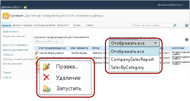
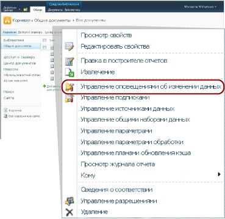

# Диспетчер предупреждений данных для пользователей SharePoint

[!INCLUDE [ssrs-appliesto](../includes/ssrs-appliesto.md)] [!INCLUDE [ssrs-appliesto-2016](../includes/ssrs-appliesto-2016.md)] [!INCLUDE [ssrs-appliesto-not-2017](../includes/ssrs-appliesto-not-2017.md)] [!INCLUDE[ssrs-appliesto-sharepoint-2013-2016i](../includes/ssrs-appliesto-sharepoint-2013-2016.md)] [!INCLUDE [ssrs-appliesto-not-pbirs](../includes/ssrs-appliesto-not-pbirs.md)]

[!INCLUDE [ssrs-previous-versions](../includes/ssrs-previous-versions.md)]

[!INCLUDE[ssRSnoversion](../includes/ssrsnoversion-md.md)] предоставляется диспетчер предупреждений об изменении данных для SharePoint, позволяющий информационным работникам управлять предупреждениями об изменении данных. Они могут просматривать сведения о созданных ими предупреждениях, удалять предупреждения, открывать определения предупреждений для изменения, а также запускать предупреждения по запросу. Они могут просматривать предупреждения для одного или всех отчетов. На следующем рисунке показаны функции, доступные информационным работникам в диспетчере предупреждений об изменении данных.

  

> [!NOTE]
> Интеграция служб Reporting Services с SharePoint больше не доступна после выхода SQL Server 2016.

Если на сайте SharePoint включены предупреждения об изменении данных, создаются две страницы SharePoint, MyDataAlerts.aspx и SiteDataAlerts.aspx и добавляются к сайту SharePoint. Страница MyDataAlerts.aspx является диспетчером предупреждений об изменении данных для информационных работников SharePoint. Информационные работники могут открывать диспетчер предупреждений об изменении данных из контекстного меню отчетов, в которых они создали предупреждения.  

 Диспетчер предупреждений об изменении данных можно также открыть непосредственно с помощью URL-адреса. Синтаксис этого URL-адреса является следующим:  
  
 `https://<site name>/_layouts/ReportServer/MyDataAlerts.aspx`  
  
> [!NOTE]  
>  Администратор должен предоставить вам разрешения на использование функций предупреждений служб [!INCLUDE[ssRSnoversion](../includes/ssrsnoversion-md.md)] . Дополнительные сведения о требуемых разрешениях см. в разделе [Предупреждения об изменении данных в службах Reporting Services](../reporting-services/reporting-services-data-alerts.md).  
  
##   Просмотр сведений о предупреждениях об изменении данных  
 Вы можете просматривать список предупреждений об изменении данных, созданных вами в конструкторе предупреждений об изменении данных. Чтобы открыть диспетчер предупреждений об изменении данных, щелкните правой кнопкой мыши отчет, опубликованный в библиотеке SharePoint. На следующем рисунке показан пункт **Управление предупреждениями об изменении данных** контекстного меню отчетов.  
  
   
  
 Диспетчер предупреждений об изменении данных включает таблицу, содержащую имя предупреждения, имя отчета, ваше имя в качестве имени пользователя, создавшего определение предупреждения, сколько раз предупреждение было отправлено, время последней отправки предупреждения, время последнего изменения определения предупреждения и состояние последнего предупреждения. Если предупредительное сообщение не удалось создать или отправить, в столбце состояния будут содержаться сведения об ошибке, которые помогают устранить проблемы с предупреждением. Дополнительные сведения см. в разделе [Управление предупреждениями данных в диспетчере предупреждений данных](../reporting-services/manage-my-data-alerts-in-data-alert-manager.md).  
  
 В следующей таблице показаны образцы данных из таблицы в диспетчере предупреждений об изменении данных. Если возникла ошибка, то сообщение об ошибке и идентификатор записи в журнале (идентификатор GUID) включается в поле **Состояние** в таблице.  
  
|Имя предупреждения|Имя отчета|Автор|Отправленные предупреждения|Последний запуск|Изменено|Состояние|  
|----------------|-----------------|----------------|-----------------|--------------|-------------------|------------|  
|SalesQTR|SalesByTerritoryAndQTR|Лорен Джонсон|4|6/12/2011|6/1/2011|Последнее предупреждение выполнено успешно; предупреждение было отправлено.|  
|UnitsSold|ProductsSalesByQTR|Лорен Джонсон|2|7/1/2011|6/28/2011|Последнее предупреждение выполнено успешно, но данные остались без изменения и предупреждение не было отправлено.|  
|TopPromotion|PromotionTracking|Лорен Джонсон|0||5/23/2011|Предупреждение создано.|  
  
  
##   Удаление предупреждений об изменении данных  
 Удалить определения предупреждений можно из диспетчера предупреждений об изменении данных. Если вы информационный работник, то вы можете удалять определения предупреждений, которые вы сами создали. Определения предупреждений, созданные другими пользователями, удалять нельзя. Дополнительные сведения см. в разделе [Управление предупреждениями данных в диспетчере предупреждений данных](../reporting-services/manage-my-data-alerts-in-data-alert-manager.md).  
  
 Если определение предупреждения удаляется, оно удаляется навсегда. Если вам необходимо приостановить отправку предупреждающих сообщений, можно изменить шаблон повторения или дату запуска или остановки в определении отчета. Дополнительные сведения см. в разделе [Изменение предупреждения в конструкторе предупреждений](../reporting-services/edit-a-data-alert-in-alert-designer.md).  
  
  
##   Редактирование предупреждений об изменении данных  
 Если вы информационный работник, вы можете открывать определения предупреждений для редактирования в диспетчере предупреждений об изменении данных. Вы можете редактировать те определения предупреждений, которые были созданы вами, но не те, которые были созданы другими пользователями. Если щелкнуть правой кнопкой мыши по определению отчета и выбрать пункт **Изменить** , откроется конструктор предупреждений об изменении данных, в котором будет отображено определение отчета. Дополнительные сведения см. в разделах [Конструктор предупреждений данных](../reporting-services/data-alert-designer.md) и [Изменение предупреждения в конструкторе предупреждений](../reporting-services/edit-a-data-alert-in-alert-designer.md).  
  
  
##   Запуск предупреждений об изменении данных  
 Диспетчер предупреждений об изменении данных содержит сведения о последнем времени обработки определения предупреждения в службе предупреждений, а также о том, сколько раз предупреждающее сообщение было отправлено. Может существовать необходимость запустить и отправить предупреждающее сообщения немедленно, а не дожидаться наступления назначенного времени. Предупреждение можно запустить в диспетчере предупреждений об изменении данных. Тогда расписание предупреждений будет перезаписано и обработка определения отчета начнется в пределах от одной до пяти минут, в зависимости от времени, необходимого для запуска отчета и загрузки сервера отчетов в момент запуска предупреждения. Однако, если отправка сообщений была настроена на отправку только при изменении результатов, а изменения не произошло, сообщения не будут созданы или отправлены. Дополнительные сведения см. в разделе [Управление предупреждениями данных в диспетчере предупреждений данных](../reporting-services/manage-my-data-alerts-in-data-alert-manager.md).  
  
> [!NOTE]  
>  После выбора пункта **Пуск**  и до изменения значения в столбце **Состояние** , что демонстрирует начало обработки, пройдет несколько секунд. Если пункт **Пуск**  был выбран несколько раз, предупреждение будет запущено несколько раз. При этом будут расходоваться ресурсы и может упасть производительность сервера отчетов. Чтобы просмотреть обновленные сведения об отчете, нажмите кнопку обновления в веб-браузере и проверьте обновления состояний, а также другие сведения об отчете.  
  
  
##   Связанные задачи  
 В этом разделе перечислены процедуры, которые показывают, как управлять своими предупреждениями и изменять свои определения предупреждений.  
  
-   [Управление предупреждениями данных в диспетчере предупреждений данных](../reporting-services/manage-my-data-alerts-in-data-alert-manager.md)  
  
-   [Изменение предупреждения в конструкторе предупреждений](../reporting-services/edit-a-data-alert-in-alert-designer.md)  

## См. также:

[Конструктор предупреждений об изменении данных](../reporting-services/data-alert-designer.md)   
[Создание предупреждения данных в конструкторе предупреждений данных](../reporting-services/create-a-data-alert-in-data-alert-designer.md)   
[Предупреждения об изменении данных в службах Reporting Services](../reporting-services/reporting-services-data-alerts.md)  

Остались вопросы? [Посетите форум служб Reporting Services](https://go.microsoft.com/fwlink/?LinkId=620231).
