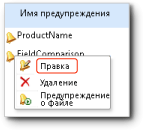

# изменить предупреждение в конструкторе предупреждений

[!INCLUDE[ssrs-appliesto-sql2016-xpreview](../includes/ssrs-appliesto-sql2016-xpreview.md)][!INCLUDE[ssrs-appliesto-sharepoint-2013-2016i](../includes/ssrs-appliesto-sharepoint-2013-2016.md)]

Если вы хотите изменить определение предупреждения об изменении данных, его следует открыть в диспетчере предупреждений об изменении данных. Изменить определение предупреждения может только пользователь, который его создал. Дополнительные сведения об открытии диспетчера предупреждений данных см. в разделе [Управление предупреждениями данных в диспетчере предупреждений данных](../reporting-services/manage-my-data-alerts-in-data-alert-manager.md).

> [!NOTE]
> Интеграция служб Reporting Services с SharePoint больше не доступны после SQL Server 2016.

 На следующем рисунке показано контекстное меню предупреждения об изменении данных в диспетчере предупреждений об изменении данных.  
  
   
  
 Следующая процедура включает в себя шаги по открытию определения предупреждения для изменения в конструкторе предупреждений об изменении данных из диспетчера предупреждений об изменении данных.  
  
### Редактирование определения предупреждения об изменении данных в конструкторе предупреждений об изменении данных.  
  
1.  Щелкните правой кнопкой мыши определение предупреждения об изменении данных, которое требуется изменить в диспетчере предупреждений об изменении данных, и выберите команду **Изменить**.  
  
     Определение предупреждения откроется в конструкторе предупреждений об изменении данных.  
  
2.  Обновите правила, параметры расписания и параметры электронной почты. Дополнительные сведения см. в разделах [Конструктор предупреждений данных](../reporting-services/data-alert-designer.md) и [Создание предупреждения данных в конструкторе предупреждений данных](../reporting-services/create-a-data-alert-in-data-alert-designer.md).  
  
    > [!NOTE]  
    >  Выбрать другой веб-канал данных нельзя. Чтобы использовать другой веб-канал данных, следует создать новое определение предупреждения об изменении данных.  
  
3.  Нажмите кнопку **Сохранить**.  
  
    > [!NOTE]  
    >  Если отчет был изменен и изменились веб-каналы данных, созданные на основе отчета, то определение предупреждения может стать недопустимым. Это происходит, когда столбец, на который ссылается определение предупреждения в своих правилах, удаляется из отчета или меняет тип данных, или если отчет удаляется или перемещается. Недопустимое определение предупреждения можно открыть, но нельзя повторно сохранить до тех пор, пока оно не станет допустимым для текущей версии веб-канала данных отчета, на котором оно основано. Дополнительные сведения о создании веб-каналов данных на основе отчетов см. в разделе [Формирование веб-каналов данных из отчетов (построитель отчетов и службы SSRS)](../reporting-services/report-builder/generating-data-feeds-from-reports-report-builder-and-ssrs.md).  

## См. также:

[Диспетчер предупреждений данных для оповещения администраторов](../reporting-services/data-alert-manager-for-alerting-administrators.md)   
[Предупреждения об изменении данных в службах Reporting Services](../reporting-services/reporting-services-data-alerts.md)  

Дополнительные вопросы? [Попробуйте задать вопрос на форуме служб Reporting Services](http://go.microsoft.com/fwlink/?LinkId=620231)
