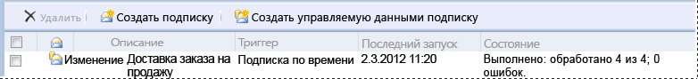

# Lesson 3: Defining a Data-Driven Subscription
На этом занятии учебника по [!INCLUDE[ssRSnoversion_md](../includes/ssrsnoversion-md.md)] будут использоваться страницы управляемой данными подписки на веб-порталах [!INCLUDE[ssRSnoversion](../includes/ssrsnoversion-md.md)] для подключения к источнику данных подписки, построен запрос, получающий данные для этой подписки, а также сопоставлен результирующий набор с отчетом и параметрами доставки.  
  
> [!NOTE]  
> Перед началом работы убедитесь в том, что служба **агента [!INCLUDE[ssNoVersion](../includes/ssnoversion-md.md)]** запущена. Если она не запущена, подписку сохранить не удастся.  Одним из методов проверки является открытие [диспетчера конфигурации SQL Server](../relational-databases/sql-server-configuration-manager.md).
В этом занятии предполагается, что занятия 1 и 2 пройдены и источник данных отчета использует сохраненные учетные данные.  Дополнительные сведения см. в разделе [Занятие 2. Изменение свойств источника данных отчета](../reporting-services/lesson-2-modifying-the-report-data-source-properties.md).  
  
## <a name="bkmk_startwizard"></a>Запуск мастера управляемой данными подписки  
  
1.  На веб-портале [!INCLUDE[ssRSnoversion_md](../includes/ssrsnoversion-md.md)] щелкните **Домашняя страница** и перейдите к папке, содержащей отчет **Sales Orders**.  
  
2.  В контекстном меню  отчета выберите пункт **Управление**, а затем в области слева щелкните **Подписки**.  
  
3.  Щелкните **Создать подписку**. Если указанная кнопка не видна, это означает отсутствие разрешений диспетчера содержимого. 
  
## Определение подписки  
1.  В качестве описания введите **Sales Order delivery** (Доставка заказа на продажу).
## Тип
1.  Щелкните **Управляемая данными подписка**.  
## Расписание
1. В разделе расписания щелкните **Расписание отчета**.
2. Щелкните **Изменить расписание**.
3.  В окне **Подробности расписания**нажмите кнопку **Однократно**.  
4.  Укажите время начала через несколько минут после текущего момента.  
5.  Нажмите кнопку **Применить**.
## Назначение  
1.  В разделе "Назначение" выберите **Общая папка Windows** в качестве способа доставки.  

## Набор данных
1. Щелкните **Изменить набор данных**.
2. Выберите **Пользовательский источник данных**.
3. Выберите **Microsoft SQL Server** в качестве типа **подключения** к источнику данных.
4. В поле "Строка подключения" введите следующую строку: *Подписчики* — это база данных, созданная на занятии 1. 
  
    ```  
    data source=localhost; initial catalog=Subscribers
    ```
    
 ## Учетные данные
 1. Выберите **С использованием этих учетных данных**.
 2. Выберите **Пароль и имя пользователя Windows**.
 3.  В полях **Имя пользователя** и **Пароль**введите доменное имя пользователя и пароль. При указании значения **Имя пользователя**необходимо включать как домен, так и учетную запись пользователя.
     > [!NOTE]  
    > Учетные данные, используемые для подключения к источникам данных подписчика, не передаются обратно в среду [!INCLUDE[ssManStudio](../includes/ssmanstudio-md.md)]. При последующем изменении параметров подписки потребуется ввести пароль для подключения к источнику данных.
## Запрос      
1.  Введите следующий запрос в поле запроса:  
  
    ```  
    Select * from OrderInfo  
    ```  
  
2.  Задайте время ожидания 30 секунд.  
  
3.  Нажмите кнопку **Проверить запрос**, а затем кнопку **Применить**.
## Параметры доставки
Заполните следующие значения:

Параметр  |Источник значения  | Значение или поле  
---------|---------|---------
**Имя файла**     |Получение значения из набора данных | Порядок     
**Путь**     | Ввод значения  | В поле "Значение" введите имя общедоступной папки, для которой имеется разрешение на запись (например, `\\mycomputer\public\myreports`). 
**Формат отображения** | Получение значения из набора данных | Формат
**Режим записи**| Ввод значения| Автоувеличение    
**Расширение файла** |Ввод значения |True
**Имя пользователя** | Ввод значения | Введите учетную запись пользователя домена. Введите учетную запись в формате: \<домен>\\\<учетная_запись>. Учетная запись пользователя должна обладать разрешениями для настроенного пути. 
**Пароль** | Ввод значения | Введите пароль

## Параметры отчета
 1. В поле **OrderNumber** выберите **Получить значение из набора данных**. В поле «Значение параметра» выберите **Order**. 
 2. Щелкните **Создать подписку**.
   
## Следующие шаги  
При выполнении подписки в указанную общую папку будут доставлены четыре файла отчетов, по одному для каждого заказа из источника данных *Подписчики* . Каждая доставка должна содержать уникальные данные (данные должны различаться в зависимости от заказа), иметь свой формат подготовки и формат файла. Можно открыть любой отчет из общей папки, чтобы убедиться, что каждая версия настроена в соответствии с указанными параметрами подписки.  
  
  
  
Страница подписки на веб-портале будет содержать **дату последнего запуска** и **состояние** подписки. 
**Примечание**. Для вывода обновленной информации необходимо обновить страницу после запуска подписки.  
    
  
  
Этот шаг завершает учебник "Определение управляемой данными подписки".   
  
## См. также:  
[Подписки и доставка (службы Reporting Services)](../reporting-services/subscriptions/subscriptions-and-delivery-reporting-services.md)  
[Подписки, управляемые данными](../reporting-services/subscriptions/data-driven-subscriptions.md)  
[Создание, изменение и удаление управляемых данными подписок](../reporting-services/subscriptions/create-modify-and-delete-data-driven-subscriptions.md)  
[Использование внешнего источника данных подписчика (управляемая данными подписка)](../reporting-services/subscriptions/use-an-external-data-source-for-subscriber-data-data-driven-subscription.md)  
  
  
  
