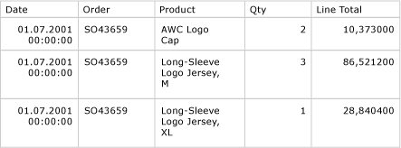

# Занятие&#160;4. Добавление таблицы в отчет (службы Reporting Services)
После определения набора данных вы можете приступать к конструированию отчета. Макет отчета создается путем перетаскивания в область конструктора областей данных, текстовых полей, изображений и других элементов, которые необходимо включить в отчет.  
  
Элементы, содержащие повторяющиеся строки данных из базовых наборов данных, называются *областями данных*. Простые отчеты имеют только одну область данных, но можно добавить больше, например, если требуется добавить диаграмму в табличный отчет. После добавления области данных можно добавлять в нее поля.  
  
### Добавление табличной области данных и полей в макет отчета  
  
1.  В окне **Панель элементов** щелкните элемент **Таблица**, а затем щелкните область конструктора и выполните перетаскивание мышью. В конструкторе отчетов будет отображена табличная область данных с тремя столбцами, расположенными по центру области конструктора. Окно **Панель элементов** может выглядеть как вкладка в левой стороне области **Данные отчета**. Чтобы открыть окно **Панель элементов**, наведите указатель на вкладку **Панель элементов**. Если окно **Панель элементов** не отображается, в меню **Вид** выберите пункт **Панель элементов**.
  
      
  
  Таблицу можно также добавить в отчет из области конструктора.  Щелкните правой кнопкой мыши рабочую область конструирования, выберите команду **Вставить** и щелкните пункт **Таблица**.
2.  В области **Данные отчета** разверните набор данных **AdventureWorksDataset**, чтобы отобразить поля.  
  
3.  Перетащите поле *Date* с панели **Данные отчета** в первый столбец таблицы.  
  
    После такого перетаскивания происходят два действия. Во-первых, в ячейке данных отображается в квадратных скобках имя поля, называемое *выражением поля*: `[Date]`. Во-вторых, заголовок столбца автоматически добавляется в строку заголовка непосредственно над выражением поля. По умолчанию заголовком столбца становится имя поля. Текст строки заголовка можно выделить и ввести новое имя.  
  
4.  Перетащите поле *Order* с панели **Данные отчета** во второй столбец таблицы.  
  
5.  Перетащите поле *Product* с панели **Данные отчета** в третий столбец таблицы.  
  
6.  Перетаскивайте поле «Qty» в правый край третьего столбца, пока не возникнет вертикальный курсор и на указателе мыши не появится знак «плюс» [+]. После отпускания кнопки мыши для `[Qty]` создается четвертый столбец.  
  
  
7.  Добавьте поле «LineTotal» тем же способом, создав пятый столбец. Заголовок столбца «Линейный итог». Конструктор отчетов автоматически создает понятное имя для столбца, разбивая LineTotal на два слова.  
  
  
На приведенной ниже диаграмме показана табличная область данных с заполненными полями "Дата", "Заказ", "Продукт", "Количество" и "Линейный итог".  
  
  
## Просмотр отчета  
Предварительный просмотр отчета позволяет просматривать подготовленный отчет без его предварительной публикации на сервере отчетов. Во время разработки потребуется часто просматривать отчет. При просмотре отчета также выполняется проверка конструкции и подключений к данным, что позволяет исправить ошибки и проблемы перед публикацией отчета на сервере отчетов.  
  
#### Предварительный просмотр отчета  
  
-   Перейдите на вкладку **Предварительный просмотр** . Отчет будет выполнен в конструкторе отчетов и отображен в представлении предварительного просмотра.
  
  
    Следующая диаграмма показывает часть отчета в представлении предварительного просмотра.  
  
      
  
    Обратите внимание, что валюта (в столбце Line Total) имеет шесть знаков после запятой, а дата содержит отметку времени. Данное форматирование будет исправлено в следующем занятии.  
  
> [!NOTE]  
> Чтобы сохранить отчет, в меню **Файл** выберите команду **Сохранить все** .  
  
## Следующие шаги  
Табличная область данных успешно добавлена в отчет, поля добавлены в область данных и отчет просмотрен. Далее форматируются заголовки столбцов и значения даты и валюты. См. [Занятие 5. Форматирование отчета (Reporting Services)](../reporting-services/lesson-5-formatting-a-report-reporting-services.md).  
  
## См. также:  
[Таблицы (построитель отчетов и службы SSRS)](../reporting-services/report-design/tables-report-builder-and-ssrs.md)  
[Коллекция полей набора данных (построитель отчетов и службы SSRS)](../reporting-services/report-data/dataset-fields-collection-report-builder-and-ssrs.md)  