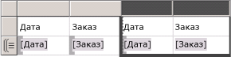
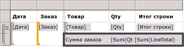
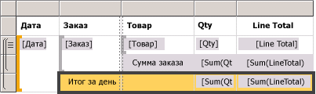
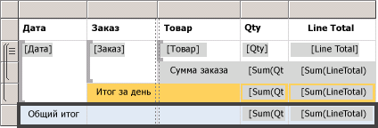
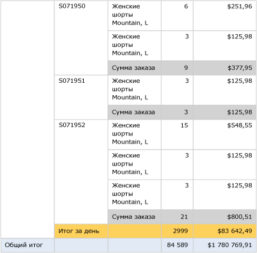

# Lesson 6: Adding Grouping and Totals (Reporting Services)
На этом занятии вы добавите группирование и итоги к отчету [!INCLUDE[ssRSnoversion](../includes/ssrsnoversion-md.md)] для организации и суммирования данных.  
  
  
## Группирование данных в отчете  
  
1.  Перейдите на вкладку **Макет** .  
  
2.  Если панель **Группы строк** не отображается, щелкните правой кнопкой область конструктора, выберите пункт **Вид** , а затем щелкните **Группирование**.  
  
3.  Из области **Данные отчета** перетащите поле **Date** на панель **Группы строк** . Поместите это поле над строкой **(Сведения)**.
  
    Обратите внимание на то, что теперь на маркере строк отображается квадратная скобка, указывающая на наличие группы. Теперь в таблице имеются два столбца «Дата», по одному с двух сторон от вертикальной пунктирной линии.  
  
      
  
4.  Из области **Данные отчета** перетащите поле **Order** на панель **Группы строк** . Поместите это поле под обозначением "Дата" и над обозначением **(Сведения)**.

   
  
    Note that the row handle now has two brackets in it , to show two groups. The table now has two **Order** columns, too.  
  
5.  Удалите исходные столбцы **Дата** и **Заказ** **справа** от двойной линии. Это приведет к удалению соответствующих отдельных значений записи, чтобы отображалось только значение группы. Выберите маркеры двух столбцов, щелкните правой кнопкой мыши и выберите пункт **Удалить столбцы**.  
  
      
  
6.  Чтобы отформатировать новый столбец дат, щелкните правой кнопкой мыши ячейку с выражением для поля `[Date]` , а затем выберите пункт **Свойства текстового поля**.  
  
7.  Щелкните **Число**, а затем в поле **Категория** выберите **Дата**.  
  
8.  В поле **Тип** введите **31 января 2000 года**.  
  
9.  [!INCLUDE[clickOK](../includes/clickok-md.md)].  
  
10.  Откройте вкладку **Просмотр** для просмотра отчета. Он должен выглядеть примерно так, как на следующей иллюстрации:  
     
  
## Добавление итогов к отчету  
  
1.  Переключитесь в режим конструктора.  
  
2.  Щелкните правой кнопкой мыши ячейку области данных, которая содержит поле `[LineTotal]`, и выберите пункт **Добавить итог**.  
  
    Это приведет к добавлению строки с суммарной стоимостью в долларах для каждого заказа.  
  
3.  Щелкните правой кнопкой мыши ячейку, которая содержит поле `[Qty]`, и выберите пункт **Добавить итог**.  
  
    Это приведет к добавлению суммы количеств по каждому заказу в строку итогов.  
  
4.  В пустой ячейке слева от поля `Sum[Qty]`введите метку**Итог заказа**.  
  
5.  К строке итогов можно добавить цвет фона. Выберите две ячейки суммы и ячейку метки.  
  
6.  В меню **Формат** щелкните элемент **Цвет фона**, а затем щелкните элемент **Светло-серый**и нажмите кнопку **ОК**.  
  
      
  
## Добавление ежедневного итога к отчету  
  
1.  Щелкните правой кнопкой мыши ячейку **Заказ** , наведите указатель на пункт **Добавить итог**и выберите пункт **После**.  
  
    Будет добавлена новая строка, содержащая суммы значений количества и стоимости в долларах за каждый день, а также метка**Итог**в конец столбца "Заказ".  
  
2.  Введите слово **Ежедневный** перед словом **Итог** в той же ячейке, чтобы в ней находилась надпись **Ежедневный итог**.  
  
3.  Выберите ячейку **Ежедневный итог** , две ячейки **Сумма** и пустую ячейку между ними.  
  
4.  В меню **Формат** щелкните элемент **Цвет фона**, а затем щелкните элемент **Оранжевый**и нажмите кнопку **ОК**.  
  
      
  
## Добавление общего итога к отчету  
  
1.  Щелкните правой кнопкой мыши ячейку "Дата", наведите указатель на пункт **Добавить итог**и выберите пункт **После**.  
  
    Это приводит к добавлению новой строки, содержащей суммы значений количества и стоимости в долларах для всего отчета, а также метки **Итог** в столбце **Дата** .  
  
2.  Введите слово **Общий** перед словом **Итог** в той же ячейке, чтобы в ней появилась надпись **Общий итог**.  
  
3.  Выберите ячейку **Общий итог** , две ячейки **Сумма** и пустые ячейки между ними.  
  
4.  В меню **Формат** щелкните элемент **Цвет фона**, а затем щелкните элемент **Светло-синий**и нажмите кнопку **ОК**.  
  
      
  
5.  Нажмите кнопку **Предварительный просмотр**.  
  
    Последняя страница должна выглядеть примерно так, как на рисунке ниже. На панели инструментов нажмите кнопку "Последняя страница". .   
  
      
  
## Публикация отчета на сервере отчетов (не обязательно)  
  
1.  Необязательным шагом является публикация готового отчета на сервере отчетов, работающем в собственном режиме, с тем чтобы его можно было просматривать из диспетчера отчетов.  
  
2.  Откройте меню **Проект** и выберите пункт **Свойства учебника...**.  
  
3.  В поле **TargetServerURL** введите имя сервера отчетов, например:   
- `http:/<servername>/reportserver`  
   
- `http://localhost/reportserver` работает, если отчет создается на сервере отчетов.  
  
  
4. Обратите внимание на то, что TargetReportFolder — это имя проекта, используемое в учебнике.  Это имя папки, в которой отчет будет развернут в следующих шагах.  
5. Нажмите кнопку **ОК**.  
  
6.  В меню **Сборка** выберите пункт **Развернуть учебник**.  
  
    Если в окне вывода появится сообщение примерно следующего содержания, это означает, что развертывание прошло успешно.  
  
    > ------ Сборка начата: проект: учебник, Конфигурация: отладка ------  
    > Пропускается "Sales Orders.rdl". Элемент имеет актуальную версию.  
    > Построение завершено — 0 ошибок, 0 предупреждений  
    > ------ Развертывание начато: проект: учебник, Конфигурация: отладка ------  
    > Развертывание в http://[имя сервера]/reportserver  
    > Развертывание отчета "/tutorial/Sales Orders".  
    > Развертывание завершено -- 0 ошибок, 0 предупреждений  
    > ========== Сборка: успешно и без изменений: 1, с ошибками: 0, пропущено: 0 ==========  
    > ========== Развертывание: успешно: 1, с ошибками: 0, пропущено: 0 ==========  
  
    Если же откроется сообщение об ошибке примерно следующего содержания, удостоверьтесь в наличии разрешений на сервер отчетов, а также запустите среду [!INCLUDE[ssBIDevStudio](../includes/ssbidevstudio-md.md)] с правами администратора.  
  
    > "Предоставленные пользователю "XXXXXXXX\\[имя пользователя]" разрешения недостаточны для выполнения данной операции"  
  
7.  Перейдите на веб-портал с правами администратора. Например, щелкните значок Internet Explorer правой кнопкой мыши и выберите пункт **Запуск от имени администратора**.  
  
    Перейдите по URL-адресу веб-портала [!INCLUDE[ssRSnoversion_md](../includes/ssrsnoversion-md.md)] .   
    **Примечание** . URL-адресом *портала* является "Reports", но URL-адресом *сервера* отчетов не является "Reportserver".  Например:   
    - `http://<server name>/reports`.  
     - `http://localhost/reports` работает, если отчет создается на сервере отчетов.  
  
8.  Перейдите в папку, которая содержит отчет. Имя по умолчанию — *tutorial*, то есть имя проекта или имя, которые вы ввели в поле TargetReportFolder в свойствах проекта.   
Щелкните имя отчета **Заказы на продажу** , чтобы отобразить этот отчет в браузере.  
  
      
 
** Успешно завершил создание простого табличного отчета tutorial.* *  
  
## См. также:  
[Фильтрация, группирование и сортировка данных (построитель отчетов и службы SSRS)](../reporting-services/report-design/filter-group-and-sort-data-report-builder-and-ssrs.md)  
  
  
  

