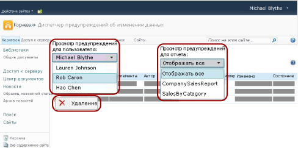

# Управление всеми предупреждениями данных на сайте SharePoint в диспетчере предупреждений данных

[!INCLUDE[ssrs-appliesto-sql2016-xpreview](../includes/ssrs-appliesto-sql2016-xpreview.md)][!INCLUDE[ssrs-appliesto-sharepoint-2013-2016i](../includes/ssrs-appliesto-sharepoint-2013-2016.md)]

Администраторы предупреждений SharePoint могут просматривать списки предупреждений об изменении данных, созданных любыми пользователями сайта, и сведения об этих предупреждениях. Администраторы системы предупреждений могут также удалять предупреждения. На следующем рисунке показаны функции, предоставляемые администраторам предупреждений в диспетчере предупреждений об изменении данных.

 

> [!NOTE]
> Интеграция служб Reporting Services с SharePoint больше не доступны после SQL Server 2016.

## Просмотр списка предупреждений, созданных пользователем сайта  
  
1.  Перейдите на сайт SharePoint, на котором сохранены определения предупреждений об изменении данных.  
  
2.  На домашней странице выберите **Действия сайта**.  
  
3.  Прокрутите список до конца и щелкните **Параметры сайта**.  
  
4.  В разделе служб **Reporting Services**щелкните **Управление предупреждениями об изменении данных**.  
  
5.  Щелкните стрелку вниз рядом со списком **Просмотр предупреждений для пользователя** и выберите пользователя, чьи предупреждения требуется просмотреть.  
  
6.  Щелкните стрелку вниз рядом со списком **Просмотр предупреждений для отчета** и выберите конкретные предупреждения или нажмите кнопку **Показать все** , чтобы получить список всех предупреждений, созданных выбранным пользователем.  
  
     В таблице перечисляются имя предупреждения, имя отчета, имя пользователя, создавшего предупреждение об изменении данных, сколько раз предупреждение об изменении данных было отправлено, время, когда в последний раз было изменено определение предупреждения об изменении данных, а также состояние предупреждения об изменении данных. Если предупреждение об изменении данных не удалось создать или отправить, в столбце состояния содержатся сведения об ошибке, которые помогают устранить проблему.  
  
## Удаление определения предупреждения  
  
-   Щелкните правой кнопкой мыши предупреждение об изменении данных, которое необходимо удалить, и выберите пункт **Удалить**.  
  
    > [!NOTE]  
    >  После того как предупреждение будет удалено, дальнейшая отправка предупреждающих сообщений прекращается. Тем не менее при запросе к базе данных предупреждений может оказаться, что определение предупреждения все еще существует. Служба предупреждений выполняет очистку по расписанию и окончательно удаляет определение предупреждения при следующей очистке. Значение интервала очистки по умолчанию составляет 20 минут. Этот и другие интервалы выполнения очистки являются настраиваемыми. Дополнительные сведения см. в статье [Предупреждения об изменении данных в службах Reporting Services](../reporting-services/reporting-services-data-alerts.md).  

## См. также

[Диспетчер предупреждений данных для оповещения администраторов](../reporting-services/data-alert-manager-for-alerting-administrators.md)   
[Предупреждения об изменении данных в службах Reporting Services](../reporting-services/reporting-services-data-alerts.md)  

Дополнительные вопросы? [Попробуйте задать вопрос на форуме служб Reporting Services](http://go.microsoft.com/fwlink/?LinkId=620231)
