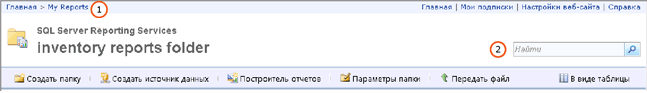

# Поиск и просмотр отчетов на веб-портале (построитель отчетов и службы SSRS)
  Диспетчер отчетов — это веб-инструмент, включающее в себя функции просмотра отчетов и управления ими. Он устанавливается как часть сервера отчетов. Чтобы открыть диспетчер отчетов, введите в окне браузера его URL-адрес. Дополнительные сведения о требованиях к браузеру см. в разделе [Поддержка браузера для служб Reporting Services и Power View](../../reporting-services/browser-support-for-reporting-services-and-power-view.md). Для получения дополнительных сведений о настройке URL-адреса диспетчера отчетов на сервере отчетов свяжитесь с системным администратором. Дополнительные сведения см. в разделе [Настройка диспетчера отчетов (собственный режим)](../../reporting-services/report-server/configure-report-manager-native-mode.md).  
  
 Разрешения, устанавливаемые системным администратором на сервере отчетов, определяют, что вам видно при использовании диспетчера отчетов. Разрешения предоставляются с помощью назначения ролей. Чтобы пользователь мог находить и просматривать отчеты, его назначение ролей должно включать задачу «Просмотр отчетов». Чтобы найти отчет на сервере отчетов, выполните его поиск по имени или описанию либо просмотрите папки сервера отчетов. Предусмотрена возможность проводить поиск или просмотр только применительно к отчетам, которые были опубликованы или переданы на сервер отчетов. Дополнительные сведения о поиске отчета см. в разделе [Поиск отчетов и других элементов (построитель отчетов и службы SSRS)](../../reporting-services/report-builder/searching-for-reports-and-other-items-report-builder-and-ssrs.md).  
  
> [!NOTE]  
>  [!INCLUDE[ssRBRDDup](../../includes/ssrbrddup-md.md)]  
  
## Переход по иерархии папок в диспетчере отчетов  
 Для просмотра отчетов, которые необходимо выполнить, можно использовать домашнюю страницу, которая автоматически открывается при запуске диспетчера отчетов и при открытии любой папки в иерархии папок. На домашней странице отображаются только элементы, просмотр которых разрешен. Путь к папке отображается в виде строки ссылок в верхней части домашней страницы. Имена папок упорядочены в списке, начиная с корневой папки. При открытии каждой дополнительной папки ее имя добавляется в список пути к папке, расположенный в верхней части страницы. **(1)** на приведенном ниже изображении. При открытии отчета его имя также добавляется в список пути к папке.  
  
   
Лента диспетчера отчетов  
  
 Используйте следующие методики для переходов по иерархии папок.  
  
-   Для просмотра содержимого папки щелкните имя папки на домашней странице. Открывается страница папки, отображающая ее содержимое.  
  
-   Для просмотра иерархии папок вниз откройте папку, вложенную в текущую папку. Папки содержат отчеты, ресурсы, общие элементы источника данных и другие папки. Если щелкнуть значок папки, открывается папка, отображающая содержимое иерархии на один уровень вниз.  
  
-   Для просмотра иерархии папок вверх щелкните в строке ссылок в верхней части страницы имя папки, содержимое которой нужно просмотреть. **(1)** на приведенном выше изображении.  
  
## Открытие отчета  
 После того, как отчет найден, щелкните имя отчета, чтобы его открыть. Отчет отображается в формате HTML на странице «Содержимое» в диспетчере отчетов. Отчеты всегда кэшируются сеансами браузера; поэтому после открытия отчета обычно можно вернуться к нему, нажав кнопку **Назад** . Это верно, даже если для запуска отчета потребовалось ввести имя пользователя и пароль. Нельзя закрыть готовый для просмотра отчет, не закрыв браузер.  
  
 Не все отчеты, видимые в иерархии папок, доступны сразу. Для некоторых отчетов могут потребоваться имя пользователя и пароль, чтобы определить, имеете ли вы доступ к источнику данных для отчета. Дополнительные сведения об открытии отчетов в диспетчере отчетов см. в разделе [открыть и закрыть отчет &#40; Диспетчер отчетов &#41; ](../../reporting-services/reports/open-and-close-a-report-report-manager.md).  
  
 Также можно перейти к отчету и открыть его с сервера отчетов непосредственно из построителя отчетов. Дополнительные сведения см. в разделе [Поиск отчетов и других элементов (построитель отчетов и службы SSRS)](../../reporting-services/report-builder/searching-for-reports-and-other-items-report-builder-and-ssrs.md).  
  
## Поиск элементов  
  
-   Для поиска элементов в диспетчере отчетов введите строку поиска в текстовом поле **Поиск** вверху страницы. **(2)** на приведенном выше изображении. Поиски начинаются с высшего узла иерархии папок и затем следуют через каждую ветку. Если отсутствует разрешение на доступ к определенной ветке, то эта ветка пропускается. Это относится к папкам «Мои отчеты», принадлежащим другим пользователям и другим папкам, которые обычно не доступны. Только отчеты и элементы, на которые есть разрешение просмотра, включаются в результаты поиска.  
  
-   Чтобы найти элемент по имени или описанию, укажите весь текст или часть текста, с которым нужно совпадение. В строке поиска регистр букв не учитывается. Нельзя использовать операторы поиска, такие как символы плюс (+) или минус (-), для требования или исключения критерия поиска.  
  
-   Для поиска определенного текста в отчете используется панель инструментов, расположенная в верхней части отчета.  
  
## См. также  
 [Поиск отчетов и других элементов (построитель отчетов и службы SSRS)](../../reporting-services/report-builder/searching-for-reports-and-other-items-report-builder-and-ssrs.md)   
 [Поиск, просмотр и управление отчетами &#40; Построитель отчетов и службы SSRS &#41;](../../reporting-services/report-builder/finding-viewing-and-managing-reports-report-builder-and-ssrs.md)  
  
  
