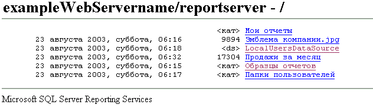

# Поиск и просмотр отчетов с помощью браузера (построитель отчетов и службы SSRS)
  Для просмотра отчета при непосредственном соединении с сервером отчетов можно использовать любой поддерживаемый веб-браузер. Каждому отчету на сервере отчетов соответствует URL-адрес. Предусмотрена возможность ввести веб-адрес отчета, чтобы открыть его в окне браузера независимо от веб-приложения. Отчет открывается в формате HTML и включает панель инструментов отчета, с помощью которых можно переходить по страницам или выполнять поиск значений данных в отчете. Можно задать параметры в URL-адресе, чтобы скрыть панель инструментов, или выбрать выходной формат отчета.  
  
 Если отчет открывается с помощью его веб-адреса, то имеется возможность просматривать отчет, а не управлять отчетом. Возможность доступа к страницам свойств элемента или к страницам определения подписки отсутствует. Для выполнения этих задач необходимо использовать диспетчер отчетов или сайт SharePoint.  
  
 Если веб-адрес отчета неизвестен, то можно открыть веб-адрес сервера отчетов, а затем перейти по иерархии папок сервера отчетов, чтобы выбрать для просмотра требуемый отчет. В приведенной ниже диаграмме показана иерархия папок в том виде, в котором она отображается в окне браузера.  
  
   
Папки в браузере  
  
> [!NOTE]  
>  При обращении к отчету с карманного устройства для открытия отчета нужно использовать браузер. Диспетчер отчетов не поддерживает карманные устройства.  
  
 См. сведения об используемых типах браузеров в руководстве по [включению поддержки браузера для Reporting Services и Power View](../../reporting-services/browser-support-for-reporting-services-and-power-view.md).  
  
> [!NOTE]  
>  [!INCLUDE[ssRBRDDup](../../includes/ssrbrddup-md.md)]  
  
## Переход по папкам сервера отчетов в веб-браузере  
 Для перемещения по папкам сервера отчетов и выполнения отчетов можно использовать веб-браузер. Отчеты и элементы отображаются в виде ссылок в иерархии папок. Чтобы выполнить отчет, открыть ресурс или папку или просмотреть содержимое общего источника данных, можно перейти по ссылке. Перемещение по иерархии папок полезно, если URL-адрес отчета не известен. Можно указать виртуальный каталог сервера отчетов, чтобы открыть соединение браузера в корневом узле иерархии папок, а затем переходить по ссылкам папок, чтобы перемещаться по иерархии.  
  
 При доступе к виртуальному каталогу сервера отчетов можно увидеть только те папки, отчеты и переданные элементы, к которым имеется доступ. Пользовательский интерфейс отображает только иерархию папок и основные сведения, такие как дата создания или изменения, размер файла и тип отдельных элементов.  
  
-   Ссылка без каких-либо других признаков относится к отчету или модели.  
  
-   Тег \<ds> является признаком общего источника данных.  
  
-   Тег \<dir> является признаком папки.  
  
-   Расширение файла указывает на ресурс. Расширение файла определяет тип MIME ресурса. Например, расширение JPG указывает на изображение в формате JPEG.  
  
## Ввод URL-адреса отчета  
 [!INCLUDE[ssRSnoversion](../../includes/ssrsnoversion-md.md)] поддерживают доступ с помощью URL-адреса к конкретным элементам на сервере отчетов. URL-адрес должен включать полный путь к отчету и команды подготовки отчета к просмотру. Если отчет имеет параметры, для открытия отчета необходимо также задать все необходимые значения. Если URL-адрес отчета содержит пробелы, значения параметров или сведения о модуле подготовки отчетов, нужно включить в URL-адрес закодированные символы; в противном случае результаты могут оказаться непредвиденными. В следующем примере показан URL-адрес отчета, включающий закодированные пробелы в разделе пути, параметры и сведения о модуле подготовки отчетов:  
  
 `https://<Webservername>/reportserver?/<reportfolder>/employee+sales+summary&ReportYear=2004&ReportMonth=06&EmpID=24&rs:Command=Render&rs:Format=HTML4.0`  
  
 Максимальная длина URL-адреса в Internet Explorer составляет 2083 символа. Дополнительные сведения см. в разделе [Максимальная длина URL-адреса в Internet Explorer](https://support.microsoft.com/kb/208427).  
  
 Дополнительные сведения о доступе к отчету с помощью URL-адреса, включая сведения о структуре этого URL, см. в статье [Доступ по URL-адресу](../../reporting-services/url-access-ssrs.md).  
  
  
